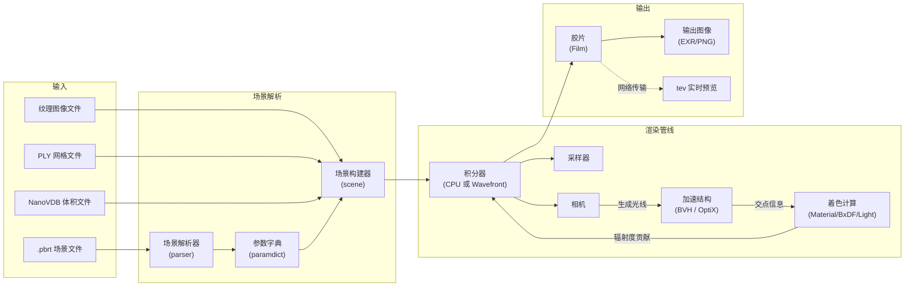

# PBRT-v4 项目总览

## 1. 概述

**pbrt-v4** 是《*Physically Based Rendering: From Theory to Implementation*》（基于物理的渲染：从理论到实现）第四版所对应的渲染系统。它是一个研究级别的光线追踪渲染器，全面支持基于物理的光谱渲染、体积散射、GPU 加速以及多种先进的光照采样技术。

相较于 pbrt-v3，v4 版本带来了以下重大改进：

- **光谱渲染** -- 所有渲染计算均使用点采样光谱进行，RGB 色彩仅用于场景描述和最终图像输出
- **现代化体积散射** -- 基于 null-scattering 路径积分的全新 `VolPathIntegrator`
- **GPU 渲染支持** -- 通过 CUDA 和 OptiX 在 NVIDIA GPU 上运行，性能大幅优于 CPU
- **新型 BxDF 和材质** -- 更贴近物理散射过程的材质模型，包括测量 BRDF 和分层材质
- **光源采样改进** -- 支持多光源 BVH 采样、三角形/四边形立体角采样等
- **物理单位渲染** -- 支持绝对物理单位和真实相机建模

项目使用 C++17 标准编写，支持 Linux、macOS 和 Windows 平台。构建系统基于 CMake（最低版本 3.12）。

## 2. 目录结构

```
pbrt/
├── CMakeLists.txt          # 顶层 CMake 构建脚本
├── README.md               # 项目英文说明
├── THIRD_PARTY.md          # 第三方库致谢说明
├── LICENSE.txt             # 许可证文件
├── cmake/                  # CMake 模块和辅助脚本
├── docs/                   # 项目文档（本目录）
├── images/                 # README 引用的图片资源
└── src/
    ├── pbrt/               # 渲染器核心源代码
    │   ├── base/           # 抽象基类接口定义
    │   ├── cmd/            # 命令行可执行程序入口
    │   ├── cpu/            # CPU 渲染路径（积分器、图元、加速结构）
    │   ├── gpu/            # GPU 渲染路径（CUDA/OptiX）
    │   │   └── optix/      # OptiX 光线追踪后端
    │   ├── util/           # 通用工具库（数学、内存、并行、采样等）
    │   └── wavefront/      # Wavefront 路径追踪管线
    └── ext/                # 第三方依赖库（git submodules）
```

### 核心源文件说明

| 文件 | 用途 |
|------|------|
| `bsdf.cpp/h` | 双向散射分布函数（BSDF）封装 |
| `bssrdf.cpp/h` | 双向表面下散射反射分布函数（BSSRDF） |
| `bxdfs.cpp/h` | 各种 BxDF 实现（漫反射、镜面反射、微面模型等） |
| `cameras.cpp/h` | 相机模型（透视、正交、真实镜头、球面等） |
| `film.cpp/h` | 胶片/成像平面模型（像素滤波、色彩空间转换） |
| `filters.cpp/h` | 像素重建滤波器（Box、Gaussian、Mitchell 等） |
| `interaction.cpp/h` | 光线与表面/介质的交互点描述 |
| `lights.cpp/h` | 各种光源实现（点光源、面光源、环境光等） |
| `lightsamplers.cpp/h` | 光源采样策略（均匀采样、BVH 采样） |
| `materials.cpp/h` | 材质系统（漫反射、电介质、导体、分层材质等） |
| `media.cpp/h` | 参与介质（均匀介质、网格密度介质等） |
| `options.cpp/h` | 全局渲染选项 |
| `paramdict.cpp/h` | 参数字典（场景文件参数解析） |
| `parser.cpp/h` | 场景文件解析器 |
| `pbrt.cpp/h` | 渲染系统核心 API |
| `ray.cpp/h` | 光线定义 |
| `samplers.cpp/h` | 采样器实现（独立采样、分层、Sobol、PMJ02BN 等） |
| `scene.cpp/h` | 场景构建与管理 |
| `shapes.cpp/h` | 几何形状（球体、三角网格、曲线、双线性面片等） |
| `textures.cpp/h` | 纹理系统（常量、图像、棋盘格、噪声等） |

### 命令行工具（`src/pbrt/cmd/`）

| 工具 | 用途 |
|------|------|
| `pbrt` | 主渲染器可执行程序 |
| `imgtool` | 图像处理工具（HDR 转换、降噪、FLIP 比较等） |
| `plytool` | PLY 网格文件工具 |
| `pspec` | 功率谱分析工具 |
| `nanovdb2pbrt` | NanoVDB 体积数据转 pbrt 格式工具 |
| `cyhair2pbrt` | CyHair 毛发数据转 pbrt 格式工具 |
| `soac` | SOA（Structure of Arrays）代码生成器 |
| `rgb2spec_opt` | RGB 到光谱转换表生成器 |
| `pbrt_test` | 单元测试可执行程序 |

## 3. 架构图

```mermaid
graph TB
    subgraph 命令行工具
        PBRT_EXE[pbrt 主渲染器]
        IMGTOOL[imgtool 图像工具]
        PLYTOOL[plytool 网格工具]
        PSPEC[pspec 功率谱分析]
        NV2PBRT[nanovdb2pbrt]
        CYHAIR[cyhair2pbrt]
    end

    subgraph pbrt_lib 核心库
        subgraph 场景描述层
            PARSER[parser 场景解析器]
            SCENE[scene 场景构建]
            PARAMDICT[paramdict 参数字典]
        end

        subgraph 渲染核心层
            BSDF[bsdf 散射分布函数]
            BXDFS[bxdfs BxDF 实现集]
            BSSRDF[bssrdf 次表面散射]
            CAMERAS[cameras 相机模型]
            FILM[film 成像平面]
            FILTERS[filters 像素滤波器]
            LIGHTS[lights 光源]
            LIGHTSAMPLERS[lightsamplers 光源采样]
            MATERIALS[materials 材质系统]
            MEDIA[media 参与介质]
            SHAPES[shapes 几何形状]
            TEXTURES[textures 纹理系统]
            SAMPLERS[samplers 采样器]
            INTERACTION[interaction 交互点]
        end

        subgraph base 抽象接口层
            BASE_IFACE[base/ 接口头文件<br/>camera, light, material,<br/>shape, texture, film...]
        end

        subgraph CPU 渲染路径
            CPU_INT[cpu/integrators 积分器<br/>路径追踪/BDPT/MLT等]
            CPU_AGG[cpu/aggregates 加速结构<br/>BVH]
            CPU_PRIM[cpu/primitive 图元]
            CPU_RENDER[cpu/render 渲染入口]
        end

        subgraph GPU 渲染路径
            GPU_MEM[gpu/memory GPU 内存管理]
            GPU_UTIL[gpu/util GPU 工具函数]
            OPTIX_AGG[gpu/optix/aggregate OptiX 加速结构]
            OPTIX_DENOISE[gpu/optix/denoiser OptiX 降噪]
            OPTIX_CU[gpu/optix/optix.cu 核心着色器]
        end

        subgraph Wavefront 管线
            WF_INT[wavefront/integrator]
            WF_AGG[wavefront/aggregate]
            WF_CAM[wavefront/camera]
            WF_FILM[wavefront/film]
            WF_MEDIA[wavefront/media]
            WF_SURF[wavefront/surfscatter]
            WF_SUB[wavefront/subsurface]
        end

        subgraph util 工具库
            MATH[math 数学运算]
            SAMPLING[sampling 采样函数]
            SPECTRUM[spectrum 光谱处理]
            COLOR[color/colorspace 颜色空间]
            TRANSFORM[transform 变换矩阵]
            PARALLEL[parallel 并行框架]
            MEMORY[memory 内存管理]
            IMAGE[image 图像读写]
            VECMATH[vecmath 向量数学]
            LOWDISC[lowdiscrepancy 低差异序列]
        end
    end

    subgraph 第三方依赖
        OPENEXR[OpenEXR HDR 图像]
        PTEX[Ptex 纹理]
        ZLIB[zlib 压缩]
        NANOVDB[NanoVDB 体积数据]
        GLFW_DEP[GLFW 窗口管理]
        STB[stb 图像读写]
    end

    PBRT_EXE --> PARSER
    PBRT_EXE --> CPU_RENDER
    PBRT_EXE --> WF_INT
    IMGTOOL --> IMAGE
    IMGTOOL --> OPTIX_DENOISE

    PARSER --> SCENE
    SCENE --> MATERIALS
    SCENE --> LIGHTS
    SCENE --> SHAPES

    CPU_INT --> BSDF
    CPU_INT --> LIGHTS
    CPU_INT --> SAMPLERS
    CPU_INT --> MEDIA
    CPU_AGG --> SHAPES

    WF_INT --> GPU_MEM
    WF_INT --> OPTIX_AGG
    WF_AGG --> OPTIX_AGG

    BASE_IFACE -.-> CAMERAS
    BASE_IFACE -.-> LIGHTS
    BASE_IFACE -.-> MATERIALS
    BASE_IFACE -.-> SHAPES
    BASE_IFACE -.-> TEXTURES

    IMAGE --> OPENEXR
    IMAGE --> STB
    SHAPES --> PTEX
    IMAGE --> ZLIB
    MEDIA --> NANOVDB
    CPU_RENDER --> GLFW_DEP
```



## 4. 核心类与接口

### 抽象接口层（`base/`）

`base/` 目录中定义了渲染系统的核心抽象接口，采用 tagged pointer 模式实现多态：

| 接口 | 说明 |
|------|------|
| `CameraHandle` | 相机接口 -- 生成光线 |
| `LightHandle` | 光源接口 -- 发射辐射度 |
| `MaterialHandle` | 材质接口 -- 创建 BxDF |
| `ShapeHandle` | 几何形状接口 -- 光线求交 |
| `TextureHandle` | 纹理接口 -- 计算纹理值 |
| `MediumHandle` | 参与介质接口 -- 体积散射 |
| `SamplerHandle` | 采样器接口 -- 生成采样点 |
| `FilmHandle` | 胶片接口 -- 累积像素值 |
| `FilterHandle` | 滤波器接口 -- 像素重建 |
| `LightSamplerHandle` | 光源采样器接口 -- 选择光源 |

### CPU 渲染路径

CPU 路径提供以下积分器：

- `SimplePathIntegrator` -- 简单路径追踪
- `PathIntegrator` -- 标准路径追踪（带直接光照采样）
- `SimpleVolPathIntegrator` -- 简单体积路径追踪
- `VolPathIntegrator` -- 完整体积路径追踪
- `RandomWalkIntegrator` -- 随机游走积分器
- `SPPMIntegrator` -- 随机渐进光子映射
- `BDPTIntegrator` -- 双向路径追踪
- `MLTIntegrator` -- 梅特罗波利斯光传输

### GPU/Wavefront 渲染路径

GPU 路径采用 wavefront 架构，将渲染管线分解为多个内核阶段：
1. 生成相机光线
2. 光线-场景求交
3. 表面散射计算
4. 次表面散射
5. 介质散射
6. 胶片更新

## 5. 依赖关系

### 构建依赖

| 依赖 | 最低版本 | 说明 |
|------|----------|------|
| CMake | 3.12 | 构建系统 |
| C++17 编译器 | -- | GCC 9+, Clang 9+, MSVC 2019+ |
| OpenGL | -- | 交互式显示 |
| Threads | -- | 多线程支持 |

### 可选依赖

| 依赖 | 说明 |
|------|------|
| CUDA 11.0+ | GPU 渲染支持 |
| OptiX 7.1+ | GPU 光线追踪后端 |
| NVML | GPU 性能监控 |

### 第三方库（通过 git submodule 管理）

详见 [第三方依赖文档](src/ext/README.md)

## 6. 数据流



### 渲染流程概述

1. **场景解析阶段**：`parser` 读取 `.pbrt` 场景描述文件，通过 `paramdict` 解析参数，由 `scene` 模块构建完整的场景数据结构（几何体、材质、光源、相机等）。

2. **预处理阶段**：构建加速结构（BVH），初始化光源采样数据结构，加载纹理和体积数据。

3. **渲染阶段**：
   - **CPU 路径**：积分器逐像素生成采样点，发射相机光线，通过 BVH 进行光线求交，在交点处计算材质散射和光源贡献，递归追踪散射光线。
   - **GPU 路径**：Wavefront 管线将上述过程分解为多个 CUDA kernel 阶段，批量处理大量光线以充分利用 GPU 并行性。OptiX 用于高效的光线-场景求交。

4. **成像阶段**：像素辐射度累积到胶片上，经过滤波和色彩空间转换后输出为图像文件。可选通过网络将进度发送到 `tev` 进行实时预览。

## 构建说明

### 获取源码

```bash
git clone --recursive https://github.com/mmp/pbrt-v4.git
```

若已克隆但未拉取子模块：

```bash
git submodule update --init --recursive
```

### 构建（Release 模式，默认）

```bash
mkdir build && cd build
cmake ..
make -j$(nproc)
```

### 构建选项

| CMake 选项 | 默认值 | 说明 |
|------------|--------|------|
| `CMAKE_BUILD_TYPE` | Release | 构建类型 |
| `PBRT_FLOAT_AS_DOUBLE` | OFF | 使用 64 位浮点数 |
| `PBRT_BUILD_NATIVE_EXECUTABLE` | ON | 针对本机 CPU 架构优化 |
| `PBRT_DBG_LOGGING` | OFF | 启用详细调试日志 |
| `PBRT_OPTIX_PATH` | -- | OptiX SDK 路径 |
| `PBRT_GPU_SHADER_MODEL` | 自动检测 | GPU 着色器模型（如 sm_80） |
| `PBRT_USE_PREGENERATED_RGB_TO_SPECTRUM_TABLES` | OFF | 使用预生成的 RGB-光谱转换表 |

### GPU 构建

```bash
cmake .. -DPBRT_OPTIX_PATH=/path/to/optix
make -j$(nproc)
```

运行时启用 GPU：

```bash
./pbrt --gpu scene.pbrt
```
