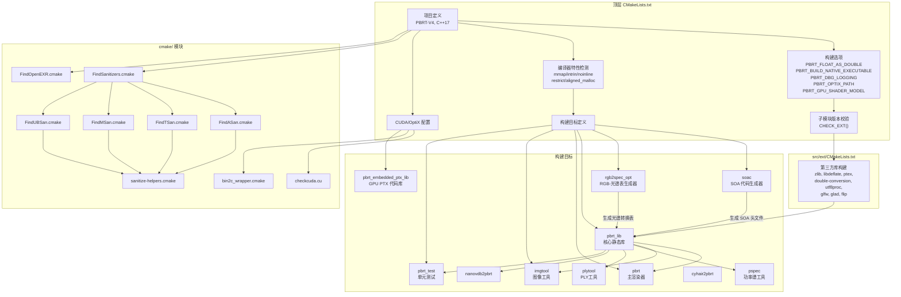
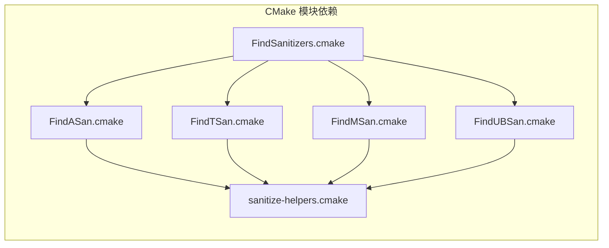
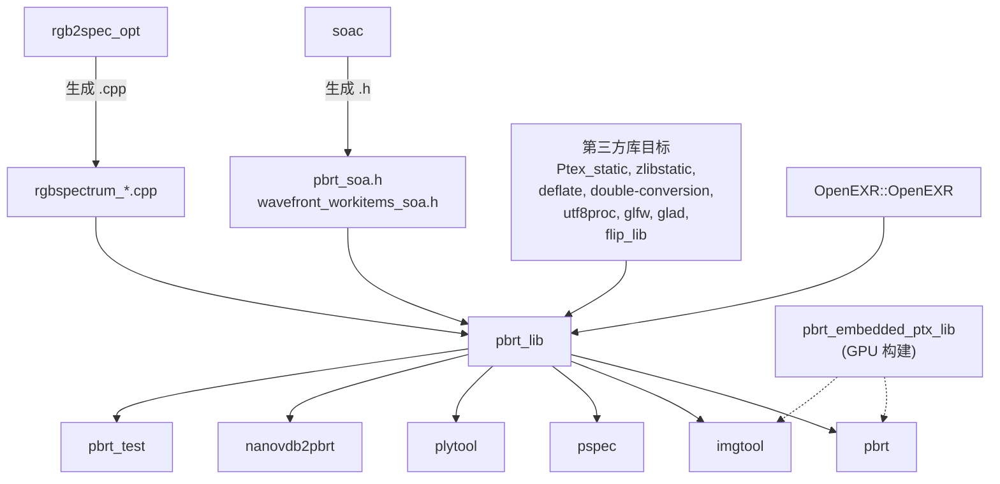
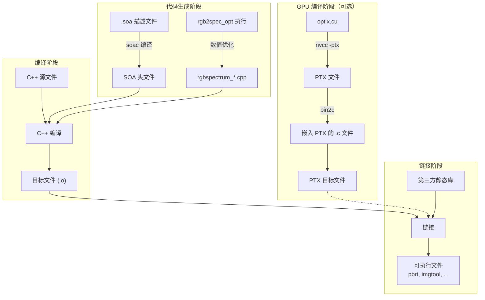

# CMake 构建系统文档

## 1. 概述

pbrt-v4 使用 CMake（最低版本 3.12）作为构建系统。构建配置分布在顶层 `CMakeLists.txt`、`src/ext/CMakeLists.txt` 以及 `cmake/` 目录下的辅助模块中。构建系统负责以下核心任务：

- 检测和配置 C++17 编译器
- 管理第三方依赖库（git submodules）的版本校验与构建
- 检测 CUDA/OptiX 支持并配置 GPU 构建路径
- 编译器特性检测（内存对齐、mmap、restrict 等）
- 代码消毒器（Sanitizer）集成
- 自定义代码生成（SOA 头文件、RGB-光谱转换表、PTX 嵌入）

## 2. 文件列表

### `cmake/` 目录

| 文件 | 用途 |
|------|------|
| `FindSanitizers.cmake` | Sanitizer 查找模块入口，统一调度 ASan/TSan/MSan/UBSan |
| `FindASan.cmake` | AddressSanitizer 检测与配置 |
| `FindTSan.cmake` | ThreadSanitizer 检测与配置 |
| `FindMSan.cmake` | MemorySanitizer 检测与配置 |
| `FindUBSan.cmake` | UndefinedBehaviorSanitizer 检测与配置 |
| `sanitize-helpers.cmake` | Sanitizer 通用辅助函数库 |
| `FindOpenEXR.cmake` | OpenEXR 库查找模块（支持 1.x/2.x/3.x 多版本） |
| `bin2c_wrapper.cmake` | CUDA PTX 代码嵌入 C 文件的包装脚本 |
| `checkcuda.cu` | CUDA 计算能力检测程序 |
| `asan-wrapper` | AddressSanitizer 运行时包装脚本 |

### 主要 CMakeLists.txt 文件

| 文件 | 用途 |
|------|------|
| `CMakeLists.txt`（顶层） | 项目主构建脚本，定义所有目标和配置 |
| `src/ext/CMakeLists.txt` | 第三方依赖库的构建配置 |

## 3. 架构图



## 4. 核心类与接口

### 4.1 顶层 CMakeLists.txt 详解

#### 项目配置

```cmake
cmake_minimum_required(VERSION 3.12)
project(PBRT-V4 LANGUAGES CXX C)
set(CMAKE_CXX_STANDARD 17)
```

项目要求 C++17 标准，默认构建类型为 Release。

#### 构建选项一览

| 选项 | 类型 | 默认值 | 说明 |
|------|------|--------|------|
| `PBRT_FLOAT_AS_DOUBLE` | BOOL | OFF | 使用 64 位浮点代替默认的 32 位 |
| `PBRT_BUILD_NATIVE_EXECUTABLE` | BOOL | ON | 启用 `-march=native` 优化 |
| `PBRT_DBG_LOGGING` | BOOL | OFF | 启用详细调试日志输出 |
| `PBRT_NVTX` | BOOL | OFF | 插入 NVTX 标注（用于 NVIDIA 性能分析） |
| `PBRT_NVML` | BOOL | OFF | 使用 NVML 进行 GPU 性能测量 |
| `PBRT_USE_PREGENERATED_RGB_TO_SPECTRUM_TABLES` | BOOL | OFF | 跳过 rgb2spec_opt 构建步骤 |
| `PBRT_OPTIX_PATH` | PATH | -- | OptiX SDK 安装路径 |
| `PBRT_GPU_SHADER_MODEL` | STRING | 自动检测 | GPU 计算能力（如 sm_80） |

#### 子模块版本校验

`CHECK_EXT()` 函数用于验证所有 git submodule 是否处于预期的提交版本。校验的子模块包括：

- OpenEXR, OpenVDB/NanoVDB, Ptex
- double-conversion, filesystem, glfw
- libdeflate, lodepng, qoi, stb
- utf8proc, zlib

#### 编译器特性检测

构建过程中会自动检测以下系统特性：

| 检测项 | 对应宏定义 | 说明 |
|--------|-----------|------|
| `mmap` 支持 | `PBRT_HAVE_MMAP` | 内存映射文件 I/O |
| `intrin.h` | `PBRT_HAS_INTRIN_H` | MSVC 内部函数头文件 |
| `__attribute__((noinline))` | `PBRT_NOINLINE` | 禁止内联属性 |
| `__restrict__` | `PBRT_RESTRICT` | 指针别名优化提示 |
| `_aligned_malloc` / `posix_memalign` | `PBRT_HAVE__ALIGNED_MALLOC` / `PBRT_HAVE_POSIX_MEMALIGN` | 对齐内存分配 |
| `int64_t` 类型独立性 | `PBRT_INT64_IS_OWN_TYPE` | int64_t 是否是独立类型 |

#### CUDA/OptiX 构建流程

当检测到 CUDA 11.0+ 且设置了 `PBRT_OPTIX_PATH` 时，启用 GPU 构建：

1. 检测 GPU 计算能力（通过 `checkcuda.cu` 或手动设置 `PBRT_GPU_SHADER_MODEL`）
2. 将渲染核心源文件标记为 CUDA 编译
3. 使用 `cuda_compile_and_embed` 宏将 OptiX PTX 着色器嵌入到 C 代码中
4. 生成 `pbrt_embedded_ptx_lib` 静态库

#### 自定义代码生成

**SOA 头文件生成**：`soac` 工具从 `.soa` 描述文件生成 Structure-of-Arrays 数据布局头文件：
- `pbrt.soa` --> `pbrt_soa.h`
- `wavefront/workitems.soa` --> `wavefront_workitems_soa.h`

**RGB 到光谱转换表**：`rgb2spec_opt` 工具生成多种色彩空间的 RGB-光谱转换系数：
- `rgbspectrum_srgb.cpp`（sRGB）
- `rgbspectrum_dci_p3.cpp`（DCI-P3）
- `rgbspectrum_rec2020.cpp`（Rec. 2020）
- `rgbspectrum_aces.cpp`（ACES 2065-1）

### 4.2 Sanitizer 模块详解

Sanitizer 框架采用模块化设计，支持四种代码消毒器：

| 模块 | 功能 | 编译器标志 |
|------|------|-----------|
| `FindASan.cmake` | 地址消毒器 -- 检测缓冲区溢出、释放后使用等 | `-fsanitize=address` |
| `FindTSan.cmake` | 线程消毒器 -- 检测数据竞争（仅 Linux 64位） | `-fsanitize=thread` |
| `FindMSan.cmake` | 内存消毒器 -- 检测未初始化内存读取（仅 Linux 64位） | `-fsanitize=memory` |
| `FindUBSan.cmake` | 未定义行为消毒器 -- 检测未定义行为 | `-fsanitize=undefined` |

启用方式：

```bash
cmake .. -DSANITIZE_ADDRESS=ON
cmake .. -DSANITIZE_THREAD=ON
cmake .. -DSANITIZE_UNDEFINED=ON
```

注意：ASan 与 TSan/MSan 互不兼容，不能同时启用。

`sanitize-helpers.cmake` 提供了核心辅助函数：
- `sanitizer_lang_of_source()` -- 识别源文件编程语言
- `sanitizer_target_compilers()` -- 获取目标使用的编译器
- `sanitizer_check_compiler_flags()` -- 测试编译器是否支持消毒器标志
- `saitizer_add_flags()` -- 为目标添加消毒器编译/链接标志

### 4.3 FindOpenEXR.cmake 详解

该模块支持查找 OpenEXR 的三种版本：

1. **OpenEXR 3.x**：通过 CMake CONFIG 模式查找 `Imath::Imath` 和 `OpenEXR::OpenEXR` 目标
2. **OpenEXR 2.4-2.5**：通过 CONFIG 模式查找 `IlmBase::Imath` 和 `OpenEXR::IlmImf` 目标
3. **OpenEXR 2.x 旧版本**：回退到手动路径搜索模式，查找头文件和库文件

若系统中未安装 OpenEXR，构建系统会自动从 `src/ext/openexr` 子模块编译。

### 4.4 bin2c_wrapper.cmake

该脚本是 CUDA PTX 代码嵌入流程的关键环节。它调用 CUDA SDK 的 `bin2c` 工具，将编译好的 PTX 文件转换为包含 PTX 代码字符串常量的 C 源文件，使 PTX 着色器代码可以在运行时被直接加载。

### 4.5 checkcuda.cu

一个小型 CUDA 程序，用于在构建阶段自动检测系统 GPU 的计算能力（Compute Capability）。输出格式为 `sm_XY`（如 `sm_86`），用于设置正确的 CUDA 编译目标架构。最低要求为 Compute Capability 5.2。

## 5. 依赖关系

### 构建系统内部依赖



### 构建目标依赖链



## 6. 数据流

### 构建流程数据流



### 平台特定处理

| 平台 | 定义的宏 | 特殊处理 |
|------|---------|---------|
| Windows | `PBRT_IS_WINDOWS`, `NOMINMAX` | MSVC 警告抑制、dbghelp/wsock 链接 |
| macOS | `PBRT_IS_OSX` | 抑制 deprecated 警告 |
| Linux | `PBRT_IS_LINUX` | `-rdynamic` 用于回溯符号、`--no-as-needed` 用于 profiler |
