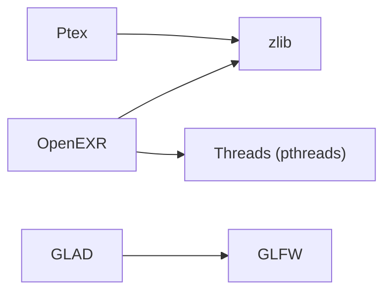
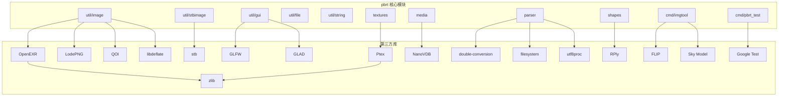
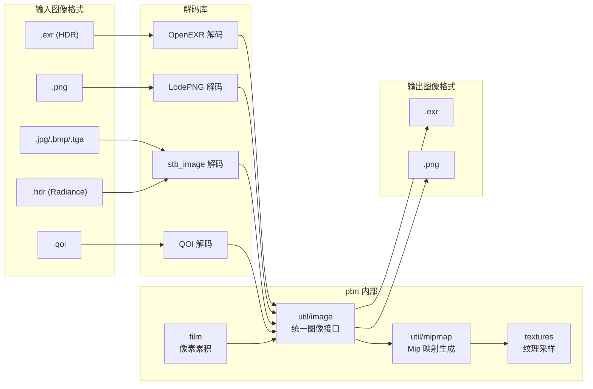
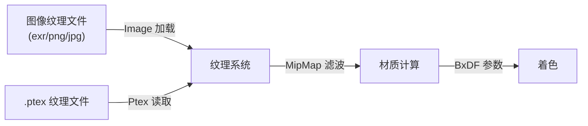

# 第三方依赖库文档

## 1. 概述

pbrt-v4 依赖多个第三方库来实现图像读写、数据压缩、纹理处理、体积数据访问、窗口管理等功能。这些依赖通过 git submodule 机制管理，源代码位于 `src/ext/` 目录下。顶层 `CMakeLists.txt` 中的 `CHECK_EXT()` 函数会在配置时校验每个子模块是否处于预期的 git 提交版本。

`src/ext/CMakeLists.txt` 负责配置和构建所有第三方依赖，并将其头文件路径和库目标导出给主项目使用。

## 2. 文件列表

### 目录结构

| 目录 | 库名称 | 构建方式 | 说明 |
|------|--------|----------|------|
| `openexr/` | OpenEXR | add_subdirectory（备选） | HDR 图像格式库 |
| `openvdb/` | NanoVDB | 头文件引入 | 稀疏体积数据结构 |
| `ptex/` | Ptex | add_subdirectory | Per-face 纹理映射库 |
| `double-conversion/` | double-conversion | add_subdirectory | 浮点数-字符串双向转换 |
| `filesystem/` | filesystem | 头文件引入 | 轻量级文件系统操作库 |
| `glfw/` | GLFW | add_subdirectory | 跨平台窗口/输入管理 |
| `glad/` | GLAD | add_subdirectory | OpenGL 函数加载器 |
| `libdeflate/` | libdeflate | add_subdirectory | 高性能 DEFLATE 压缩/解压 |
| `lodepng/` | LodePNG | 源文件直接编译 | PNG 图像编解码器 |
| `qoi/` | QOI | 头文件引入 | Quite OK Image 格式编解码 |
| `stb/` | stb | 头文件引入 | 单头文件图像读写库 |
| `utf8proc/` | utf8proc | add_subdirectory | Unicode/UTF-8 处理库 |
| `zlib/` | zlib | find_package / add_subdirectory | 通用数据压缩库 |
| `flip/` | FLIP | 源文件直接编译 | 图像差异感知比较工具 |
| `rply/` | RPly | 源文件直接编译 | PLY 文件读写库 |
| `gtest/` | Google Test | 源文件直接编译 | 单元测试框架 |
| `skymodel/` | Hosek-Wilkie Sky Model | 源文件直接编译 | 物理天空光照模型 |

### 构建配置文件

| 文件 | 用途 |
|------|------|
| `src/ext/CMakeLists.txt` | 第三方依赖库的统一构建入口 |

## 3. 架构图

```mermaid
graph TB
    subgraph "图像 I/O 相关"
        OPENEXR3["OpenEXR<br/>HDR 图像格式<br/>(.exr)"]
        LODEPNG["LodePNG<br/>PNG 编解码<br/>(.png)"]
        STB3["stb<br/>多格式图像读写<br/>(jpg, bmp, tga, hdr...)"]
        QOI3["QOI<br/>Quite OK Image<br/>(.qoi)"]
    end

    subgraph "压缩相关"
        ZLIB3["zlib<br/>通用数据压缩<br/>(DEFLATE)"]
        LIBDEFLATE3["libdeflate<br/>高性能 DEFLATE<br/>压缩/解压"]
    end

    subgraph "纹理与体积数据"
        PTEX3["Ptex<br/>Per-face 纹理映射"]
        NANOVDB3["NanoVDB<br/>稀疏体积数据<br/>(OpenVDB 轻量版)"]
    end

    subgraph "图形界面"
        GLFW3["GLFW<br/>窗口/输入管理"]
        GLAD3["GLAD<br/>OpenGL 加载器"]
    end

    subgraph "通用工具"
        DOUBLE_CONV["double-conversion<br/>浮点数-字符串转换"]
        FILESYSTEM3["filesystem<br/>文件系统操作"]
        UTF8PROC3["utf8proc<br/>Unicode 处理"]
    end

    subgraph "渲染辅助"
        SKYMODEL3["Hosek-Wilkie<br/>天空模型"]
        FLIP3["FLIP<br/>图像质量比较"]
        RPLY3["RPly<br/>PLY 文件读写"]
    end

    subgraph "测试"
        GTEST3["Google Test<br/>单元测试框架"]
    end

    subgraph "pbrt 核心模块"
        IMG["image 图像模块"]
        TEX["textures 纹理模块"]
        MED["media 介质模块"]
        GUI["gui 交互显示"]
        PARSE["parser 场景解析"]
        SHAPES2["shapes 几何形状"]
        IMGTOOL4["imgtool 图像工具"]
        TEST4["pbrt_test 测试"]
    end

    OPENEXR3 --> IMG
    LODEPNG --> IMG
    STB3 --> IMG
    QOI3 --> IMG
    ZLIB3 --> OPENEXR3
    ZLIB3 --> PTEX3
    LIBDEFLATE3 --> IMG
    PTEX3 --> TEX
    NANOVDB3 --> MED
    GLFW3 --> GUI
    GLAD3 --> GUI
    DOUBLE_CONV --> PARSE
    FILESYSTEM3 --> PARSE
    UTF8PROC3 --> PARSE
    SKYMODEL3 --> IMGTOOL4
    FLIP3 --> IMGTOOL4
    RPLY3 --> SHAPES2
    GTEST3 --> TEST4
```

## 4. 核心类与接口

### 4.1 OpenEXR

- **用途**：读写 HDR（高动态范围）图像文件（`.exr` 格式）
- **版本**：3.1.1+（项目中包含源码可自行编译）
- **引入方式**：优先通过 `find_package(OpenEXR)` 查找系统安装版本，若未找到则从子模块源码编译
- **导出目标**：`OpenEXR::OpenEXR`, `OpenEXR::Iex`, `OpenEXR::IlmThread`
- **在 pbrt 中的使用**：`util/image.cpp` 中用于 EXR 图像的读取与输出，支持多通道（GBuffer）数据存储

### 4.2 NanoVDB (OpenVDB)

- **用途**：提供对稀疏体积数据（如烟雾、火焰密度场）的高效访问
- **版本**：OpenVDB 项目的 NanoVDB 子组件
- **引入方式**：仅头文件引入，无需编译
- **导出变量**：`NANOVDB_INCLUDE` 指向 `openvdb/nanovdb` 目录
- **在 pbrt 中的使用**：`media.cpp` 中用于加载和访问 NanoVDB 格式的体积密度数据

### 4.3 Ptex

- **用途**：Per-face 纹理映射库，支持不需要显式 UV 参数化的纹理映射方案
- **引入方式**：通过 `add_subdirectory` 构建为静态库 `Ptex_static`
- **依赖**：依赖 zlib
- **在 pbrt 中的使用**：`textures.cpp` 中用于读取和采样 Ptex 格式纹理

### 4.4 double-conversion

- **用途**：Google 开发的高精度浮点数与字符串双向转换库
- **引入方式**：通过 `add_subdirectory` 构建
- **在 pbrt 中的使用**：场景文件解析中的数值转换

### 4.5 filesystem

- **用途**：Wenzel Jakob 开发的轻量级跨平台文件系统操作库（C++17 std::filesystem 的简易替代）
- **引入方式**：仅头文件引入
- **在 pbrt 中的使用**：文件路径操作、目录遍历等

### 4.6 GLFW

- **用途**：跨平台的窗口创建、OpenGL 上下文管理、键盘/鼠标输入处理
- **引入方式**：通过 `add_subdirectory` 构建为静态库
- **构建配置**：禁用文档、测试和示例构建
- **在 pbrt 中的使用**：`util/gui.cpp` 中用于交互式渲染预览窗口

### 4.7 GLAD

- **用途**：OpenGL 函数指针加载器，运行时动态加载 OpenGL 扩展
- **引入方式**：通过 `add_subdirectory` 构建
- **在 pbrt 中的使用**：与 GLFW 配合实现 OpenGL 渲染上下文

### 4.8 libdeflate

- **用途**：高性能的 DEFLATE/zlib/gzip 压缩和解压库，在特定场景下比 zlib 更快
- **引入方式**：通过 `add_subdirectory` 构建
- **导出目标**：`deflate::deflate`
- **在 pbrt 中的使用**：图像文件压缩处理

### 4.9 zlib

- **用途**：广泛使用的通用数据压缩库（DEFLATE 算法）
- **引入方式**：优先通过 `find_package(ZLIB)` 查找系统版本，若未找到则从子模块编译
- **在 pbrt 中的使用**：OpenEXR 和 Ptex 的压缩数据处理依赖

### 4.10 LodePNG

- **用途**：纯 C/C++ 实现的 PNG 图像编解码器，无外部依赖
- **引入方式**：源文件 `lodepng.cpp` 直接编译进 `pbrt_lib`
- **在 pbrt 中的使用**：PNG 格式图像的读取和写入

### 4.11 stb

- **用途**：Sean Barrett 开发的单头文件公共域库集合，主要使用 `stb_image.h`（图像读取）和 `stb_image_write.h`（图像写入）
- **引入方式**：仅头文件引入
- **在 pbrt 中的使用**：`util/stbimage.cpp` 中用于读写 JPEG、BMP、TGA、HDR 等格式

### 4.12 QOI

- **用途**：Quite OK Image 格式编解码，一种简单高效的无损图像压缩格式
- **引入方式**：仅头文件引入
- **在 pbrt 中的使用**：QOI 格式图像的读写支持

### 4.13 utf8proc

- **用途**：轻量级 Unicode 文本处理库，提供 UTF-8 编码的规范化、大小写转换等功能
- **引入方式**：通过 `add_subdirectory` 构建
- **在 pbrt 中的使用**：场景文件中 Unicode 文本的正确处理

### 4.14 FLIP

- **用途**：NVIDIA 开发的图像差异感知比较工具，基于人类视觉系统模型评估图像质量
- **引入方式**：源文件 `flip.cpp` 编译为静态库 `flip_lib`
- **在 pbrt 中的使用**：`imgtool` 工具中用于渲染结果的图像质量比较

### 4.15 RPly

- **用途**：ANSI C 编写的 PLY（Polygon File Format）文件读写库
- **引入方式**：源文件 `rply.cpp` 直接编译进 `pbrt_lib`
- **在 pbrt 中的使用**：加载 PLY 格式的三角网格数据

### 4.16 Hosek-Wilkie Sky Model

- **用途**：基于物理的天空光照模型，可生成逼真的日间天空光谱
- **引入方式**：`ArHosekSkyModel.c` 编译为静态库 `sky_lib`
- **在 pbrt 中的使用**：`imgtool` 工具中用于生成天空环境光照

### 4.17 Google Test

- **用途**：Google 开发的 C++ 单元测试框架
- **引入方式**：`gtest-all.cc` 直接编译进 `pbrt_lib`
- **在 pbrt 中的使用**：`pbrt_test` 可执行程序使用，覆盖全面的渲染算法正确性测试

## 5. 依赖关系

### 第三方库之间的依赖

### 第三方库被 pbrt 模块引用关系

## 6. 数据流

### 图像 I/O 数据流

### 体积数据流

### 纹理数据流

