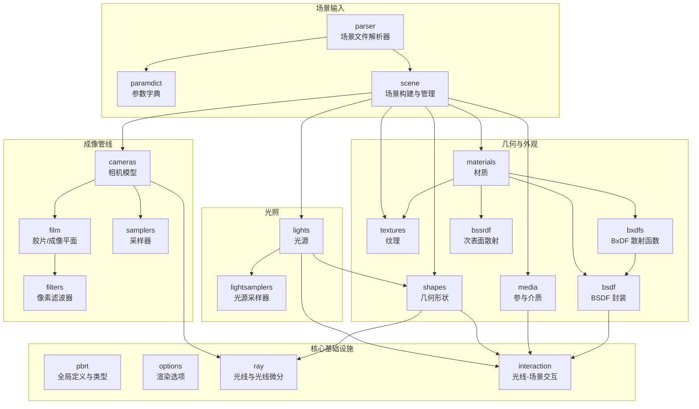
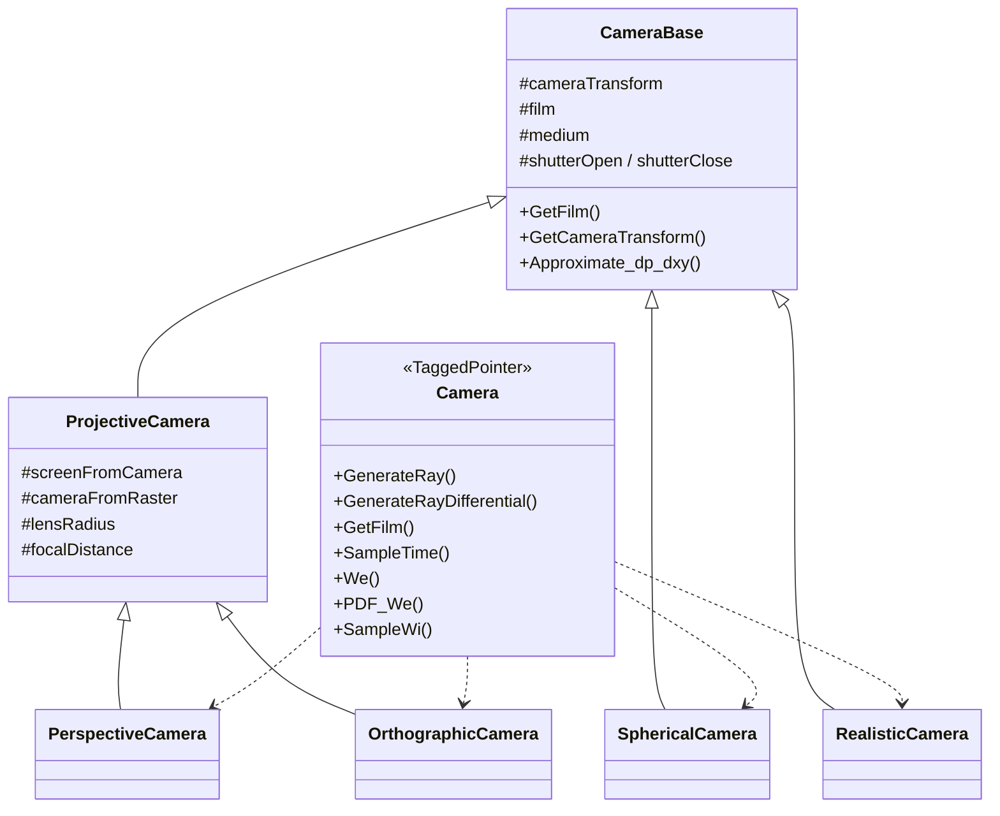
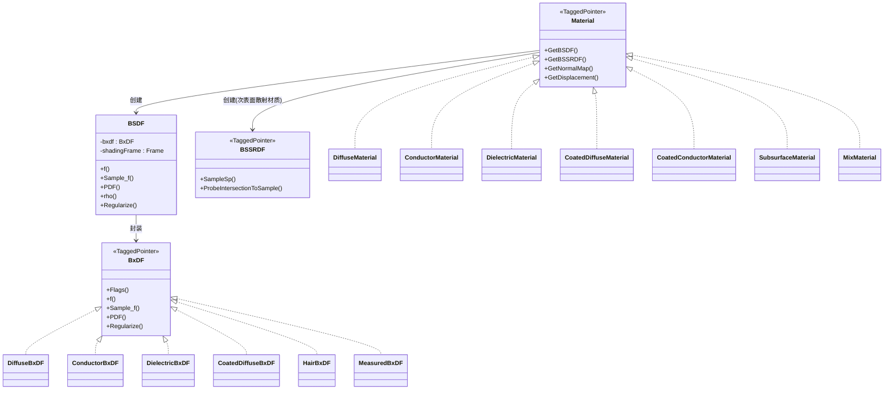
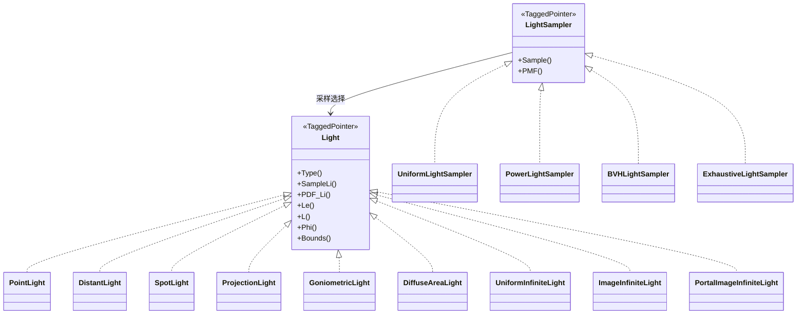
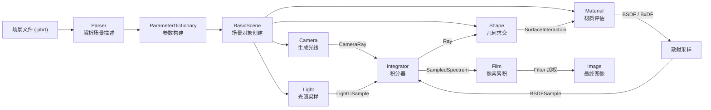
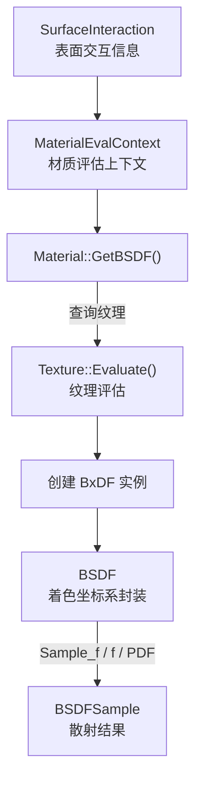
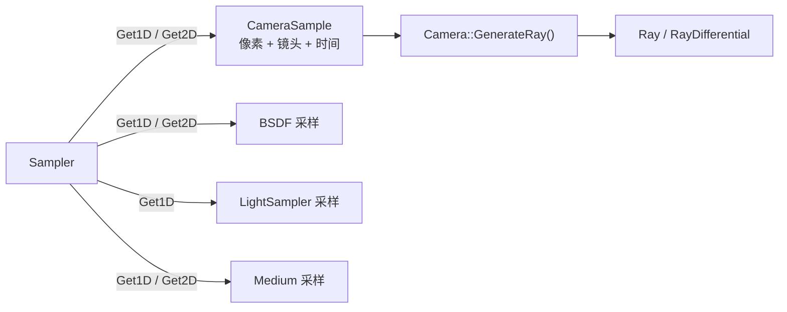

# PBRT-v4 核心渲染模块 (`src/pbrt/`)

## 概述

`src/pbrt/` 目录是 PBRT-v4 物理渲染引擎的核心模块，包含了所有渲染管线中的关键组件的具体实现。该模块围绕光线追踪的物理原理构建，涵盖相机模型、光源、材质、形状、纹理、采样器、滤波器、胶片（成像平面）、BSDF/BxDF 散射模型、参与介质、场景解析等功能领域。所有具体实现均派生自 `base/` 目录中定义的抽象接口（TaggedPointer 多态分派机制），并支持 CPU 和 GPU 双路径执行（通过 `PBRT_CPU_GPU` 宏标注）。

---

## 文件列表

### 核心基础设施

| 文件 | 用途说明 |
|------|----------|
| `pbrt.h` / `pbrt.cpp` | 全局类型定义（`Float`、向量/点/法线类型别名）、前向声明、宏定义（`PBRT_CPU_GPU`、`PBRT_GPU`）、内存分配器（`Allocator`）、引擎初始化/清理函数 `InitPBRT()` / `CleanupPBRT()` |
| `options.h` / `options.cpp` | 渲染选项（`PBRTOptions`、`BasicPBRTOptions`），包括线程数、日志级别、GPU 设备、像素采样数、裁剪窗口等全局配置 |
| `ray.h` / `ray.cpp` | 光线类（`Ray`）和光线微分类（`RayDifferential`）的定义，以及光线偏移辅助函数（`OffsetRayOrigin`、`SpawnRay`） |
| `interaction.h` / `interaction.cpp` | 光线-场景交互记录，包括通用交互（`Interaction`）、表面交互（`SurfaceInteraction`）和介质交互（`MediumInteraction`） |

### 场景解析与参数

| 文件 | 用途说明 |
|------|----------|
| `parser.h` / `parser.cpp` | PBRT 场景文件语法解析器，定义 `ParserTarget` 接口，处理场景描述中的变换、相机、光源、形状、材质等指令 |
| `paramdict.h` / `paramdict.cpp` | 参数字典（`ParameterDictionary`、`TextureParameterDictionary`），用于解析和存储场景文件中的参数（浮点、整数、字符串、光谱等类型） |
| `scene.h` / `scene.cpp` | 场景构建与管理（`SceneEntity`、`BasicScene`），协调各组件创建，连接解析器输出与渲染管线 |

### 相机系统

| 文件 | 用途说明 |
|------|----------|
| `cameras.h` / `cameras.cpp` | 所有相机的具体实现：`PerspectiveCamera`（透视）、`OrthographicCamera`（正交）、`SphericalCamera`（球面/全景）、`RealisticCamera`（真实透镜系统）。同时定义 `CameraBase`（公共基类）、`ProjectiveCamera`（投影相机基类）、`CameraTransform`（相机变换）等辅助类 |

### 光源系统

| 文件 | 用途说明 |
|------|----------|
| `lights.h` / `lights.cpp` | 所有光源的具体实现：`PointLight`（点光源）、`DistantLight`（远光源）、`SpotLight`（聚光灯）、`ProjectionLight`（投影光源）、`GoniometricLight`（光度光源）、`DiffuseAreaLight`（漫反射面光源）、`UniformInfiniteLight`（均匀无限光源）、`ImageInfiniteLight`（图像环境光）、`PortalImageInfiniteLight`（带入射门的环境光）。同时定义光源采样辅助结构（`LightLiSample`、`LightLeSample`、`LightBounds`） |
| `lightsamplers.h` / `lightsamplers.cpp` | 光源采样策略的具体实现：`UniformLightSampler`（均匀采样）、`PowerLightSampler`（按功率采样）、`BVHLightSampler`（BVH 加速采样）、`ExhaustiveLightSampler`（穷举采样） |

### 材质系统

| 文件 | 用途说明 |
|------|----------|
| `materials.h` / `materials.cpp` | 所有材质的具体实现：`DiffuseMaterial`（漫反射）、`ConductorMaterial`（导体）、`DielectricMaterial`（电介质）、`ThinDielectricMaterial`（薄电介质）、`CoatedDiffuseMaterial`（涂层漫反射）、`CoatedConductorMaterial`（涂层导体）、`DiffuseTransmissionMaterial`（漫透射）、`HairMaterial`（毛发）、`MeasuredMaterial`（实测材质）、`SubsurfaceMaterial`（次表面散射）、`MixMaterial`（混合材质）。同时定义 `MaterialEvalContext`、`NormalBumpEvalContext` 等评估上下文 |

### 散射模型 (BSDF/BxDF)

| 文件 | 用途说明 |
|------|----------|
| `bsdf.h` / `bsdf.cpp` | `BSDF` 类定义，封装 BxDF 并处理局部着色坐标系与渲染坐标系之间的变换，提供 `f()`、`Sample_f()`、`PDF()`、`rho()` 等核心散射接口 |
| `bxdfs.h` / `bxdfs.cpp` | 所有 BxDF 的具体实现：`DiffuseBxDF`（Lambertian 漫反射）、`DiffuseTransmissionBxDF`（漫透射）、`ConductorBxDF`（导体反射）、`DielectricBxDF`（电介质反射/折射）、`ThinDielectricBxDF`（薄电介质）、`CoatedDiffuseBxDF`（涂层漫反射）、`CoatedConductorBxDF`（涂层导体）、`HairBxDF`（毛发散射）、`MeasuredBxDF`（实测散射）、`NormalizedFresnelBxDF`（归一化菲涅尔） |
| `bssrdf.h` / `bssrdf.cpp` | 次表面散射模型（`TabulatedBSSRDF`），实现 BSSRDF 接口，处理光线在半透明介质中的扩散传输 |

### 形状系统

| 文件 | 用途说明 |
|------|----------|
| `shapes.h` / `shapes.cpp` | 所有几何形状的具体实现：`Sphere`（球体）、`Cylinder`（圆柱）、`Disk`（圆盘）、`Triangle`（三角形）、`BilinearPatch`（双线性面片）、`Curve`（曲线）。同时定义 `ShapeSample`、`ShapeSampleContext`、`ShapeIntersection` 等辅助结构 |

### 纹理系统

| 文件 | 用途说明 |
|------|----------|
| `textures.h` / `textures.cpp` | 所有纹理的具体实现，分为两大类：**浮点纹理**（`FloatConstantTexture`、`FloatImageTexture`、`FloatCheckerboardTexture`、`FloatDotsTexture`、`FBmTexture`、`WindyTexture`、`WrinkledTexture`、`FloatMixTexture`、`FloatScaledTexture`、`FloatBilerpTexture`、`FloatPtexTexture` 等）和**光谱纹理**（`SpectrumConstantTexture`、`SpectrumImageTexture`、`SpectrumCheckerboardTexture`、`MarbleTexture`、`SpectrumMixTexture`、`SpectrumScaledTexture`、`SpectrumPtexTexture` 等），同时定义纹理坐标映射（`TextureMapping2D`、`TextureMapping3D`）和评估上下文 |

### 采样器系统

| 文件 | 用途说明 |
|------|----------|
| `samplers.h` / `samplers.cpp` | 所有采样器的具体实现：`HaltonSampler`（Halton 低差异序列）、`SobolSampler`（Sobol 序列）、`ZSobolSampler`（随机化 Sobol）、`PaddedSobolSampler`（填充 Sobol）、`PMJ02BNSampler`（渐进多抖动）、`StratifiedSampler`（分层采样）、`IndependentSampler`（独立随机采样）、`MLTSampler`（Metropolis 变异采样）、`DebugMLTSampler`（调试用 MLT 采样器） |

### 滤波器系统

| 文件 | 用途说明 |
|------|----------|
| `filters.h` / `filters.cpp` | 所有像素重建滤波器的具体实现：`BoxFilter`（盒式滤波）、`GaussianFilter`（高斯滤波）、`MitchellFilter`（Mitchell-Netravali 滤波）、`LanczosSincFilter`（Lanczos Sinc 滤波）、`TriangleFilter`（三角滤波）。同时定义 `FilterSampler` 用于滤波器重要性采样 |

### 胶片（成像平面）

| 文件 | 用途说明 |
|------|----------|
| `film.h` / `film.cpp` | 所有胶片的具体实现：`RGBFilm`（RGB 胶片）、`GBufferFilm`（G-Buffer 胶片，输出几何/法线/材质等辅助通道）、`SpectralFilm`（光谱胶片）。同时定义 `PixelSensor`（像素传感器，模拟真实相机的光谱响应和 XYZ 色彩空间转换） |

### 参与介质

| 文件 | 用途说明 |
|------|----------|
| `media.h` / `media.cpp` | 所有参与介质的具体实现：`HomogeneousMedium`（均匀介质）、`GridMedium`（网格体积介质）、`RGBGridMedium`（RGB 网格介质）、`CloudMedium`（云介质）、`NanoVDBMedium`（基于 NanoVDB 的体积介质）。同时定义 `HGPhaseFunction`（Henyey-Greenstein 相位函数）和射线主值迭代器（`HomogeneousMajorantIterator`、`DDAMajorantIterator`） |

### 测试文件

| 文件 | 用途说明 |
|------|----------|
| `bsdfs_test.cpp` | BSDF/BxDF 散射模型的单元测试 |
| `filters_test.cpp` | 像素滤波器的单元测试 |
| `lights_test.cpp` | 光源系统的单元测试 |
| `lightsamplers_test.cpp` | 光源采样器的单元测试 |
| `media_test.cpp` | 参与介质的单元测试 |
| `parser_test.cpp` | 场景解析器的单元测试 |
| `samplers_test.cpp` | 采样器的单元测试 |
| `shapes_test.cpp` | 几何形状的单元测试 |

---

## 架构图

### 模块总体架构

### 相机类层次结构

### 材质-散射模型关系

### 光源采样架构

---

## 核心类与接口

### BSDF (`bsdf.h`)

`BSDF` 是渲染管线中最核心的散射接口封装，负责将 BxDF 的局部坐标系散射计算映射到渲染世界坐标系：

- **`f(wo, wi)`** - 计算给定入射/出射方向的散射函数值
- **`Sample_f(wo, u, u2)`** - 重要性采样入射方向并返回 `BSDFSample`（包含散射值、方向、概率密度、标志位）
- **`PDF(wo, wi)`** - 计算给定方向对的概率密度
- **`rho()`** - 计算半球-半球反射率
- **`Regularize()`** - 正则化散射分布（用于路径引导等技术）

### CameraBase / ProjectiveCamera (`cameras.h`)

所有相机的公共基类提供相机变换、时间采样、光线微分近似等公共功能。`ProjectiveCamera` 在此基础上增加了投影变换（raster-screen-camera 空间转换）和景深参数（`lensRadius`、`focalDistance`）。

### Interaction / SurfaceInteraction (`interaction.h`)

记录光线与场景交点信息的核心数据结构。`SurfaceInteraction` 包含交点位置、法线、UV 坐标、微分几何量、材质引用、光源引用等完整的着色上下文信息。

### PixelSensor (`film.h`)

模拟真实相机传感器的光谱响应特性，将物理辐射量转换为 RGB/XYZ 色彩值。支持自定义光谱响应曲线和色彩空间转换矩阵。

---

## 依赖关系

### 本模块依赖

| 依赖模块 | 说明 |
|----------|------|
| `src/pbrt/base/` | 所有抽象接口（TaggedPointer 基类） |
| `src/pbrt/util/` | 工具库（向量数学、光谱、图像、采样、内存管理、并行、容器、变换等） |
| `src/pbrt/cpu/` | CPU 渲染管线特有的基础设施（如 `Primitive`） |
| NanoVDB | 体积数据格式支持（`media.h` 中使用） |

### 被以下模块依赖

| 模块 | 说明 |
|------|------|
| `src/pbrt/cpu/` | CPU 积分器（路径追踪、BDPT、MLT 等）直接使用本模块的各组件 |
| `src/pbrt/wavefront/` | Wavefront 路径追踪（GPU）使用本模块的各组件 |
| `src/pbrt/gpu/` | GPU 渲染后端依赖本模块的类型和接口 |
| `cmd/pbrt.cpp` | 命令行入口调用场景解析和渲染管线 |

---

## 数据流

### 渲染主数据流

### 材质评估数据流

### 采样器数据流

