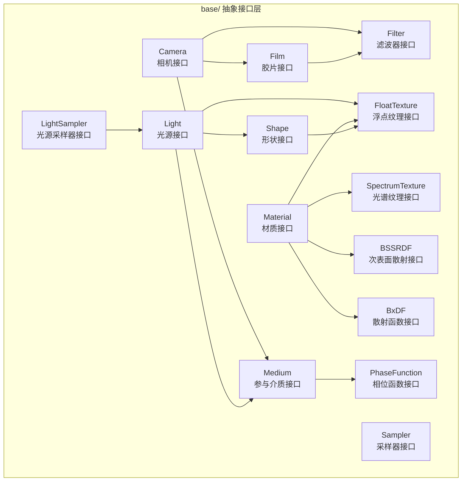
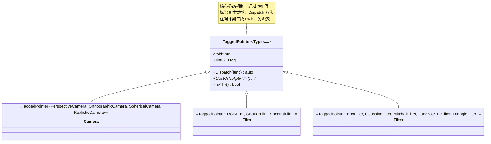
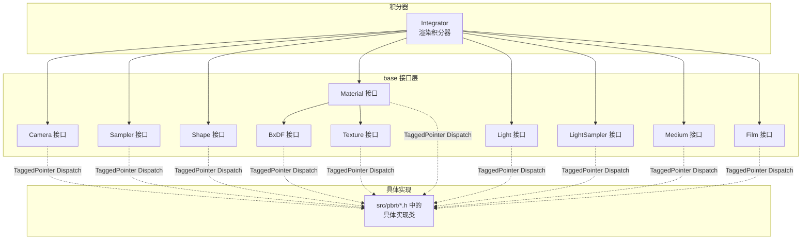
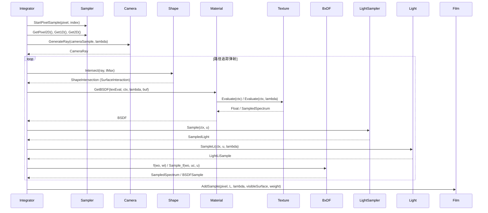

# PBRT-v4 基础接口模块 (`src/pbrt/base/`)

## 概述

`src/pbrt/base/` 目录定义了 PBRT-v4 渲染引擎中所有核心组件的抽象接口。PBRT-v4 采用 **TaggedPointer 多态分派** 机制替代传统的虚函数继承，每个接口类通过 `TaggedPointer<Impl1, Impl2, ...>` 模板列出所有可能的具体实现类型，在编译期生成分派表，从而在 CPU 和 GPU（CUDA）上都能高效运行。

这些接口是整个渲染管线的契约层：积分器通过这些接口与具体实现交互，无需感知底层具体类型。每个接口类都提供静态工厂方法 `Create()`，根据场景文件中的类型名称字符串创建对应的具体实现。

---

## 文件列表

| 文件 | 接口类 | 用途说明 |
|------|--------|----------|
| `camera.h` | `Camera` | 相机接口 -- 从像素坐标生成光线，支持双向光传输的 `We()`/`SampleWi()` |
| `film.h` | `Film` | 胶片接口 -- 管理像素数据，累积采样结果，输出最终图像 |
| `filter.h` | `Filter` | 像素重建滤波器接口 -- 定义采样点对像素的贡献权重函数 |
| `light.h` | `Light` | 光源接口 -- 光照采样、辐射功率查询、面光源/无限光源的特殊方法 |
| `lightsampler.h` | `LightSampler` | 光源采样器接口 -- 根据场景上下文选择最优光源进行采样 |
| `material.h` | `Material` | 材质接口 -- 根据表面交互上下文生成 BSDF/BSSRDF |
| `medium.h` | `Medium`, `PhaseFunction`, `RayMajorantIterator` | 参与介质接口 -- 体积散射/吸收属性查询、相位函数、射线主值迭代 |
| `sampler.h` | `Sampler` | 采样器接口 -- 为渲染过程提供准随机/随机数序列 |
| `shape.h` | `Shape` | 几何形状接口 -- 光线求交、面积计算、表面采样 |
| `texture.h` | `FloatTexture`, `SpectrumTexture` | 纹理接口 -- 根据纹理评估上下文返回浮点值或光谱值 |
| `bxdf.h` | `BxDF` | 双向散射分布函数接口 -- 局部坐标系下的散射函数评估与采样 |
| `bssrdf.h` | `BSSRDF` | 双向次表面散射分布函数接口 -- 次表面散射的探针采样 |

---

## 架构图

### 接口总览与关系



### TaggedPointer 多态分派机制



### 完整接口继承与实现图

```mermaid
classDiagram
    class Camera {
        +GenerateRay(CameraSample, SampledWavelengths) CameraRay
        +GenerateRayDifferential() CameraRayDifferential
        +GetFilm() Film
        +SampleTime(Float) Float
        +We(Ray, SampledWavelengths) SampledSpectrum
        +PDF_We(Ray, Float*, Float*)
        +SampleWi(Interaction, Point2f, SampledWavelengths) CameraWiSample
        +Approximate_dp_dxy()
        +Create()$ Camera
    }
    Camera <|.. PerspectiveCamera
    Camera <|.. OrthographicCamera
    Camera <|.. SphericalCamera
    Camera <|.. RealisticCamera

    class Film {
        +AddSample(Point2i, SampledSpectrum, SampledWavelengths, VisibleSurface*, Float)
        +AddSplat(Point2f, SampledSpectrum, SampledWavelengths)
        +SampleBounds() Bounds2f
        +SampleWavelengths(Float) SampledWavelengths
        +FullResolution() Point2i
        +PixelBounds() Bounds2i
        +WriteImage(ImageMetadata, Float)
        +GetFilter() Filter
        +GetPixelSensor() PixelSensor*
        +Create()$ Film
    }
    Film <|.. RGBFilm
    Film <|.. GBufferFilm
    Film <|.. SpectralFilm

    class Filter {
        +Radius() Vector2f
        +Evaluate(Point2f) Float
        +Integral() Float
        +Sample(Point2f) FilterSample
        +Create()$ Filter
    }
    Filter <|.. BoxFilter
    Filter <|.. GaussianFilter
    Filter <|.. MitchellFilter
    Filter <|.. LanczosSincFilter
    Filter <|.. TriangleFilter

    class Light {
        +Type() LightType
        +SampleLi(LightSampleContext, Point2f, SampledWavelengths) LightLiSample
        +PDF_Li(LightSampleContext, Vector3f) Float
        +L(Point3f, Normal3f, Point2f, Vector3f, SampledWavelengths) SampledSpectrum
        +Le(Ray, SampledWavelengths) SampledSpectrum
        +Phi(SampledWavelengths) SampledSpectrum
        +Preprocess(Bounds3f)
        +Bounds() LightBounds
        +SampleLe() LightLeSample
        +PDF_Le()
        +Create()$ Light
        +CreateArea()$ Light
    }
    Light <|.. PointLight
    Light <|.. DistantLight
    Light <|.. SpotLight
    Light <|.. ProjectionLight
    Light <|.. GoniometricLight
    Light <|.. DiffuseAreaLight
    Light <|.. UniformInfiniteLight
    Light <|.. ImageInfiniteLight
    Light <|.. PortalImageInfiniteLight

    class LightSampler {
        +Sample(LightSampleContext, Float) SampledLight
        +PMF(LightSampleContext, Light) Float
        +Sample(Float) SampledLight
        +PMF(Light) Float
        +Create()$ LightSampler
    }
    LightSampler <|.. UniformLightSampler
    LightSampler <|.. PowerLightSampler
    LightSampler <|.. ExhaustiveLightSampler
    LightSampler <|.. BVHLightSampler

    class Material {
        +GetBSDF(TextureEvaluator, MaterialEvalContext, SampledWavelengths, ScratchBuffer) BSDF
        +GetBSSRDF(TextureEvaluator, MaterialEvalContext, SampledWavelengths, ScratchBuffer) BSSRDF
        +CanEvaluateTextures(TextureEvaluator) bool
        +GetNormalMap() Image*
        +GetDisplacement() FloatTexture
        +HasSubsurfaceScattering() bool
        +Create()$ Material
    }
    Material <|.. DiffuseMaterial
    Material <|.. ConductorMaterial
    Material <|.. DielectricMaterial
    Material <|.. ThinDielectricMaterial
    Material <|.. CoatedDiffuseMaterial
    Material <|.. CoatedConductorMaterial
    Material <|.. DiffuseTransmissionMaterial
    Material <|.. HairMaterial
    Material <|.. MeasuredMaterial
    Material <|.. SubsurfaceMaterial
    Material <|.. MixMaterial

    class Medium {
        +IsEmissive() bool
        +SamplePoint(Point3f, SampledWavelengths) MediumProperties
        +SampleRay(Ray, Float, SampledWavelengths, ScratchBuffer) RayMajorantIterator
        +Create()$ Medium
    }
    Medium <|.. HomogeneousMedium
    Medium <|.. GridMedium
    Medium <|.. RGBGridMedium
    Medium <|.. CloudMedium
    Medium <|.. NanoVDBMedium

    class PhaseFunction {
        +p(Vector3f, Vector3f) Float
        +Sample_p(Vector3f, Point2f) PhaseFunctionSample
        +PDF(Vector3f, Vector3f) Float
    }
    PhaseFunction <|.. HGPhaseFunction

    class Sampler {
        +SamplesPerPixel() int
        +StartPixelSample(Point2i, int, int)
        +Get1D() Float
        +Get2D() Point2f
        +GetPixel2D() Point2f
        +Clone(Allocator) Sampler
        +Create()$ Sampler
    }
    Sampler <|.. HaltonSampler
    Sampler <|.. SobolSampler
    Sampler <|.. ZSobolSampler
    Sampler <|.. PaddedSobolSampler
    Sampler <|.. PMJ02BNSampler
    Sampler <|.. StratifiedSampler
    Sampler <|.. IndependentSampler
    Sampler <|.. MLTSampler
    Sampler <|.. DebugMLTSampler

    class Shape {
        +Bounds() Bounds3f
        +NormalBounds() DirectionCone
        +Intersect(Ray, Float) ShapeIntersection
        +IntersectP(Ray, Float) bool
        +Area() Float
        +Sample(Point2f) ShapeSample
        +PDF(Interaction) Float
        +Sample(ShapeSampleContext, Point2f) ShapeSample
        +PDF(ShapeSampleContext, Vector3f) Float
        +Create()$ vector~Shape~
    }
    Shape <|.. Sphere
    Shape <|.. Cylinder
    Shape <|.. Disk
    Shape <|.. Triangle
    Shape <|.. BilinearPatch
    Shape <|.. Curve

    class FloatTexture {
        +Evaluate(TextureEvalContext) Float
        +Create()$ FloatTexture
    }
    class SpectrumTexture {
        +Evaluate(TextureEvalContext, SampledWavelengths) SampledSpectrum
        +Create()$ SpectrumTexture
    }
    FloatTexture <|.. FloatConstantTexture
    FloatTexture <|.. FloatImageTexture
    FloatTexture <|.. FloatCheckerboardTexture
    FloatTexture <|.. FBmTexture
    FloatTexture <|.. WindyTexture
    FloatTexture <|.. WrinkledTexture
    SpectrumTexture <|.. SpectrumConstantTexture
    SpectrumTexture <|.. SpectrumImageTexture
    SpectrumTexture <|.. MarbleTexture

    class BxDF {
        +Flags() BxDFFlags
        +f(Vector3f, Vector3f, TransportMode) SampledSpectrum
        +Sample_f(Vector3f, Float, Point2f, TransportMode, BxDFReflTransFlags) BSDFSample
        +PDF(Vector3f, Vector3f, TransportMode, BxDFReflTransFlags) Float
        +rho() SampledSpectrum
        +Regularize()
    }
    BxDF <|.. DiffuseBxDF
    BxDF <|.. DiffuseTransmissionBxDF
    BxDF <|.. ConductorBxDF
    BxDF <|.. DielectricBxDF
    BxDF <|.. ThinDielectricBxDF
    BxDF <|.. CoatedDiffuseBxDF
    BxDF <|.. CoatedConductorBxDF
    BxDF <|.. HairBxDF
    BxDF <|.. MeasuredBxDF
    BxDF <|.. NormalizedFresnelBxDF

    class BSSRDF {
        +SampleSp(Float, Point2f) BSSRDFProbeSegment
        +ProbeIntersectionToSample(SubsurfaceInteraction, ScratchBuffer) BSSRDFSample
    }
    BSSRDF <|.. TabulatedBSSRDF
```



---

## 核心类与接口

### Camera (`camera.h`)

相机接口定义了从像素坐标到世界空间光线的映射，是渲染管线的起点。

| 方法 | 说明 |
|------|------|
| `GenerateRay(CameraSample, SampledWavelengths&)` | 根据像素采样点生成一条世界空间光线 |
| `GenerateRayDifferential(...)` | 生成带有微分信息的光线（用于纹理抗锯齿） |
| `GetFilm()` | 获取关联的胶片对象 |
| `SampleTime(Float u)` | 在快门时间范围内采样时刻 |
| `We(Ray, SampledWavelengths&)` | 评估相机的重要性函数（双向方法使用） |
| `PDF_We(Ray, Float*, Float*)` | 相机重要性函数的 PDF |
| `SampleWi(Interaction, Point2f, SampledWavelengths)` | 从交互点采样到相机的方向（双向方法使用） |
| `Approximate_dp_dxy(...)` | 近似计算交点处的位置微分 |

**具体实现类**：`PerspectiveCamera`、`OrthographicCamera`、`SphericalCamera`、`RealisticCamera`

### Film (`film.h`)

胶片接口管理渲染图像的像素数据存储与输出。

| 方法 | 说明 |
|------|------|
| `AddSample(...)` | 将一次采样的辐射量贡献累积到指定像素 |
| `AddSplat(...)` | 将 splat 贡献（如双向方法的光子）累积到指定位置 |
| `SampleBounds()` | 返回需要采样的像素范围（考虑滤波器半径） |
| `SampleWavelengths(Float)` | 采样波长（光谱渲染） |
| `FullResolution()` | 图像完整分辨率 |
| `WriteImage(...)` | 将累积数据写出为图像文件 |
| `GetFilter()` | 获取关联的像素滤波器 |
| `GetPixelSensor()` | 获取像素传感器（光谱响应特性） |

**具体实现类**：`RGBFilm`、`GBufferFilm`、`SpectralFilm`

### Filter (`filter.h`)

像素重建滤波器定义了采样点对像素最终值的贡献权重函数。

| 方法 | 说明 |
|------|------|
| `Radius()` | 滤波器在 x、y 方向的半径 |
| `Evaluate(Point2f)` | 评估滤波器在给定偏移处的权重值 |
| `Integral()` | 滤波器在整个支持域上的积分 |
| `Sample(Point2f)` | 对滤波器进行重要性采样 |

**具体实现类**：`BoxFilter`、`GaussianFilter`、`MitchellFilter`、`LanczosSincFilter`、`TriangleFilter`

### Light (`light.h`)

光源接口是光照计算的核心，通过 `LightType` 枚举区分不同类型的光源（`DeltaPosition` 点光源、`DeltaDirection` 方向光源、`Area` 面光源、`Infinite` 无限光源）。

| 方法 | 说明 |
|------|------|
| `Type()` | 返回光源类型（delta 位置/delta 方向/面/无限） |
| `SampleLi(ctx, u, lambda)` | 从给定表面点采样入射辐射 |
| `PDF_Li(ctx, wi)` | 入射辐射采样的概率密度 |
| `L(p, n, uv, w, lambda)` | 面光源在指定方向的辐射亮度 |
| `Le(ray, lambda)` | 无限光源沿射线方向的辐射亮度 |
| `Phi(lambda)` | 光源总辐射功率 |
| `Bounds()` | 光源的空间包围信息 |
| `SampleLe(...)` | 采样光源发射的光线（正向路径追踪） |
| `PDF_Le(...)` | 发射光线的概率密度 |
| `Preprocess(sceneBounds)` | 预处理（如无限光源需要场景包围盒信息） |

**具体实现类**：`PointLight`、`DistantLight`、`SpotLight`、`ProjectionLight`、`GoniometricLight`、`DiffuseAreaLight`、`UniformInfiniteLight`、`ImageInfiniteLight`、`PortalImageInfiniteLight`

### LightSampler (`lightsampler.h`)

光源采样器根据场景上下文（如交点位置、法线）智能选择要采样的光源，提高多光源场景的渲染效率。

| 方法 | 说明 |
|------|------|
| `Sample(LightSampleContext, Float)` | 根据表面上下文采样一个光源 |
| `PMF(LightSampleContext, Light)` | 给定光源被选中的概率 |
| `Sample(Float)` | 不考虑上下文的简单采样（如体积散射） |
| `PMF(Light)` | 不考虑上下文的概率 |

**辅助结构**：`SampledLight` -- 包含选中的 `Light` 和其概率 `p`。

**具体实现类**：`UniformLightSampler`、`PowerLightSampler`、`ExhaustiveLightSampler`、`BVHLightSampler`

### Material (`material.h`)

材质接口根据表面交互信息和纹理参数创建散射模型（BSDF 或 BSSRDF）。

| 方法 | 说明 |
|------|------|
| `GetBSDF(texEval, ctx, lambda, buf)` | 创建并返回表面 BSDF |
| `GetBSSRDF(texEval, ctx, lambda, buf)` | 创建并返回 BSSRDF（仅次表面散射材质） |
| `CanEvaluateTextures(texEval)` | 检查当前纹理评估器是否能处理材质使用的纹理 |
| `GetNormalMap()` | 获取法线贴图 |
| `GetDisplacement()` | 获取位移纹理 |
| `HasSubsurfaceScattering()` | 是否包含次表面散射效果 |

**具体实现类**：`DiffuseMaterial`、`ConductorMaterial`、`DielectricMaterial`、`ThinDielectricMaterial`、`CoatedDiffuseMaterial`、`CoatedConductorMaterial`、`DiffuseTransmissionMaterial`、`HairMaterial`、`MeasuredMaterial`、`SubsurfaceMaterial`、`MixMaterial`

### Medium (`medium.h`)

参与介质接口描述光线在体积中传播时的散射和吸收特性。该文件还定义了 `PhaseFunction`（相位函数）和 `RayMajorantIterator`（射线主值迭代器）两个辅助接口。

| 类/方法 | 说明 |
|---------|------|
| `Medium::IsEmissive()` | 介质是否具有自发光 |
| `Medium::SamplePoint(p, lambda)` | 查询空间中一点的介质属性（`sigma_a`、`sigma_s`、相位函数、发射辐射） |
| `Medium::SampleRay(ray, tMax, lambda, buf)` | 沿射线采样主值段序列 |
| `PhaseFunction::p(wo, wi)` | 评估相位函数值 |
| `PhaseFunction::Sample_p(wo, u)` | 采样相位函数散射方向 |
| `RayMajorantIterator::Next()` | 获取下一个射线主值段 |
| `MediumInterface` | 内外介质对，用于判断介质边界穿越 |

**Medium 具体实现**：`HomogeneousMedium`、`GridMedium`、`RGBGridMedium`、`CloudMedium`、`NanoVDBMedium`

**PhaseFunction 具体实现**：`HGPhaseFunction`（Henyey-Greenstein 相位函数）

**RayMajorantIterator 具体实现**：`HomogeneousMajorantIterator`、`DDAMajorantIterator`

### Sampler (`sampler.h`)

采样器为蒙特卡洛积分提供（准）随机数序列，其质量直接影响渲染收敛速度。

| 方法 | 说明 |
|------|------|
| `SamplesPerPixel()` | 每像素采样数 |
| `StartPixelSample(p, sampleIndex, dimension)` | 开始新像素/新样本的采样 |
| `Get1D()` | 获取一维随机数 |
| `Get2D()` | 获取二维随机数 |
| `GetPixel2D()` | 获取像素滤波偏移二维随机数 |
| `Clone(Allocator)` | 克隆采样器（多线程渲染时每个线程需要独立实例） |

**辅助结构**：`CameraSample` -- 包含 `pFilm`（像素坐标）、`pLens`（镜头坐标）、`time`（时间）、`filterWeight`（滤波权重）。

**具体实现类**：`HaltonSampler`、`SobolSampler`、`ZSobolSampler`、`PaddedSobolSampler`、`PMJ02BNSampler`、`StratifiedSampler`、`IndependentSampler`、`MLTSampler`、`DebugMLTSampler`

### Shape (`shape.h`)

几何形状接口定义了光线-几何体求交和表面采样的通用协议。

| 方法 | 说明 |
|------|------|
| `Bounds()` | 对象空间轴对齐包围盒 |
| `NormalBounds()` | 法线方向包围锥 |
| `Intersect(ray, tMax)` | 计算光线-形状交点（返回 `ShapeIntersection`） |
| `IntersectP(ray, tMax)` | 快速阴影测试（仅判断是否相交） |
| `Area()` | 表面面积 |
| `Sample(Point2f)` | 在表面均匀采样一个点 |
| `PDF(Interaction)` | 均匀面积采样的概率密度 |
| `Sample(ShapeSampleContext, Point2f)` | 给定参考点的重要性采样 |
| `PDF(ShapeSampleContext, Vector3f)` | 参考点方向采样的概率密度 |

**具体实现类**：`Sphere`、`Cylinder`、`Disk`、`Triangle`、`BilinearPatch`、`Curve`

### FloatTexture / SpectrumTexture (`texture.h`)

纹理接口将空间变化的属性映射为标量或光谱值，是材质参数化的核心机制。PBRT-v4 将纹理分为两种类型：

| 接口 | 方法 | 说明 |
|------|------|------|
| `FloatTexture` | `Evaluate(TextureEvalContext)` | 返回浮点值（用于粗糙度、位移、透明度等标量属性） |
| `SpectrumTexture` | `Evaluate(TextureEvalContext, SampledWavelengths)` | 返回光谱采样值（用于反照率、发射光谱等颜色属性） |

**FloatTexture 具体实现**：`FloatConstantTexture`、`FloatImageTexture`、`GPUFloatImageTexture`、`FloatBilerpTexture`、`FloatCheckerboardTexture`、`FloatDotsTexture`、`FBmTexture`、`WindyTexture`、`WrinkledTexture`、`FloatMixTexture`、`FloatDirectionMixTexture`、`FloatScaledTexture`、`FloatPtexTexture`、`GPUFloatPtexTexture`

**SpectrumTexture 具体实现**：`SpectrumConstantTexture`、`RGBConstantTexture`、`RGBReflectanceConstantTexture`、`SpectrumImageTexture`、`GPUSpectrumImageTexture`、`SpectrumBilerpTexture`、`SpectrumCheckerboardTexture`、`MarbleTexture`、`SpectrumMixTexture`、`SpectrumDirectionMixTexture`、`SpectrumDotsTexture`、`SpectrumScaledTexture`、`SpectrumPtexTexture`、`GPUSpectrumPtexTexture`

### BxDF (`bxdf.h`)

BxDF 是局部着色坐标系下的双向散射分布函数接口，通过 `BxDFFlags` 枚举标记散射特性（漫反射/光泽/镜面反射/透射的组合）。

| 方法 | 说明 |
|------|------|
| `Flags()` | 返回散射特性标志（反射/透射/漫反射/光泽/镜面） |
| `f(wo, wi, mode)` | 评估散射函数值 |
| `Sample_f(wo, uc, u, mode, sampleFlags)` | 重要性采样入射方向 |
| `PDF(wo, wi, mode, sampleFlags)` | 概率密度函数 |
| `rho(...)` | 半球-方向/半球-半球反射率 |
| `Regularize()` | 正则化散射分布（将 delta 或近 delta 分布展宽） |

**辅助定义**：
- `BxDFFlags` -- 散射类型标志（`Diffuse`、`Glossy`、`Specular`、`Reflection`、`Transmission` 及组合）
- `BxDFReflTransFlags` -- 反射/透射过滤标志
- `TransportMode` -- 传输模式（`Radiance` 正向 / `Importance` 反向）
- `BSDFSample` -- 散射采样结果（散射值、方向、PDF、标志、折射率）

**具体实现类**：`DiffuseBxDF`、`DiffuseTransmissionBxDF`、`ConductorBxDF`、`DielectricBxDF`、`ThinDielectricBxDF`、`CoatedDiffuseBxDF`、`CoatedConductorBxDF`、`HairBxDF`、`MeasuredBxDF`、`NormalizedFresnelBxDF`

### BSSRDF (`bssrdf.h`)

BSSRDF 接口处理光线在半透明物体内部的次表面散射效果。

| 方法 | 说明 |
|------|------|
| `SampleSp(u1, u2)` | 采样次表面散射探针段 |
| `ProbeIntersectionToSample(si, buf)` | 将探针交点转换为完整的 BSSRDF 采样 |

**具体实现类**：`TabulatedBSSRDF`（基于预计算表格的高效实现）

---

## 依赖关系

### 本模块依赖

| 依赖 | 说明 |
|------|------|
| `src/pbrt/pbrt.h` | 全局类型定义（`Float`、向量/点类型别名） |
| `src/pbrt/util/taggedptr.h` | `TaggedPointer` 模板 -- 所有接口类的多态基础设施 |
| `src/pbrt/util/vecmath.h` | 向量数学类型（`Point2f`、`Point3f`、`Vector3f`、`Normal3f`、`Bounds3f` 等） |
| `src/pbrt/util/spectrum.h` | 光谱类型（`SampledSpectrum`、`SampledWavelengths`） |
| `src/pbrt/util/pstd.h` | 平台抽象标准库（`pstd::optional`、`pstd::span`、`pstd::vector`） |
| `src/pbrt/util/transform.h` | 变换类型（`Transform`） |
| `src/pbrt/util/rng.h` | 随机数生成器 |

### 模块内部依赖

```
camera.h --> film.h, filter.h
film.h --> filter.h
light.h --> medium.h, shape.h, texture.h
material.h --> bssrdf.h, texture.h
shape.h --> texture.h
medium.h (自包含，定义了 PhaseFunction、RayMajorantIterator、MediumInterface)
```

### 被以下模块依赖

| 模块 | 说明 |
|------|------|
| `src/pbrt/*.h` | 核心模块中所有具体实现文件都 `#include` 对应的 base 接口头文件 |
| `src/pbrt/cpu/integrator.h` | CPU 积分器通过 base 接口调用各组件 |
| `src/pbrt/wavefront/` | Wavefront 渲染管线通过 base 接口实现 GPU 路径追踪 |
| `src/pbrt/scene.h` | 场景管理使用 base 接口类型存储和传递组件引用 |

---

## 数据流

### 接口层在渲染管线中的角色



### 单次采样的接口调用链


