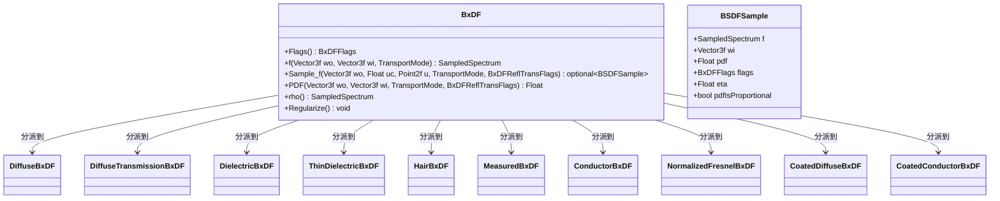

# bxdf.h

## 1. 概述

`bxdf.h` 定义了 pbrt-v4 渲染器中 **BxDF（双向散射分布函数）** 的基类接口。BxDF 是描述光线在表面上如何散射的核心数学抽象，统一涵盖了：

- **BRDF（双向反射分布函数）**：描述光线从表面同侧反射的分布
- **BTDF（双向透射分布函数）**：描述光线穿透表面到另一侧的分布
- **BSDF（双向散射分布函数）**：BRDF + BTDF 的总称

在 pbrt 渲染管线中，BxDF 处于材质系统的最底层。一个 `Material` 在着色点创建 `BSDF` 对象，`BSDF` 内部持有一个 `BxDF`，并负责世界坐标系与局部着色坐标系之间的转换。积分器（Integrator）通过 `BSDF` 的接口来评估散射函数值、采样入射方向、查询概率密度，从而完成光传输方程的蒙特卡洛求解。

该文件不仅定义了 `BxDF` 基类接口，还定义了相关的枚举标志（`BxDFFlags`、`BxDFReflTransFlags`）、传输模式（`TransportMode`）以及采样结果结构体（`BSDFSample`），构成了 pbrt-v4 表面散射模型的类型基础。

## 2. 核心枚举与类型

### 2.1 `BxDFReflTransFlags`

```cpp
enum class BxDFReflTransFlags {
    Unset        = 0,
    Reflection   = 1 << 0,
    Transmission = 1 << 1,
    All          = Reflection | Transmission
};
```

用于在采样时**筛选散射类型**的标志。调用 `Sample_f()` 或 `PDF()` 时，调用方可以通过该标志指定只关心反射、只关心透射、或两者都考虑。例如，在路径追踪中分别处理反射和透射光路时，可以用此标志进行过滤。

### 2.2 `BxDFFlags`

```cpp
enum BxDFFlags {
    Unset = 0,
    Reflection   = 1 << 0,
    Transmission = 1 << 1,
    Diffuse      = 1 << 2,
    Glossy       = 1 << 3,
    Specular     = 1 << 4,
    // 复合标志
    DiffuseReflection    = Diffuse  | Reflection,
    DiffuseTransmission  = Diffuse  | Transmission,
    GlossyReflection     = Glossy   | Reflection,
    GlossyTransmission   = Glossy   | Transmission,
    SpecularReflection   = Specular | Reflection,
    SpecularTransmission = Specular | Transmission,
    All = Diffuse | Glossy | Specular | Reflection | Transmission
};
```

描述一个 BxDF 具有哪些散射属性。标志沿两个正交维度组合：

| | Reflection（反射） | Transmission（透射） |
|---|---|---|
| **Diffuse（漫射）** | `DiffuseReflection` | `DiffuseTransmission` |
| **Glossy（光泽）** | `GlossyReflection` | `GlossyTransmission` |
| **Specular（镜面）** | `SpecularReflection` | `SpecularTransmission` |

- **Diffuse**：散射方向分布广泛，辐射在半球上近似均匀分布（如 Lambertian 模型）
- **Glossy**：散射集中在某个方向附近但有一定展宽（如微表面模型的粗糙金属/电介质）
- **Specular**：散射方向为精确的 delta 分布（如理想镜面反射、理想折射）

积分器依赖这些标志做出关键决策：例如，对 Specular BxDF 不能使用直接光照采样（MIS 中 delta 分布的 PDF 无法评估），对 Diffuse BxDF 可以使用更简单的采样策略。

### 2.3 `TransportMode`

```cpp
enum class TransportMode { Radiance, Importance };
```

标识光传输的方向：

- **`Radiance`**：从相机出发追踪光路（标准路径追踪）。此时 `wo` 是朝向相机的方向，`wi` 是朝向光源的方向。
- **`Importance`**：从光源出发追踪光路（光线追踪、双向路径追踪的光子路径）。此时方向语义互换。

这一区分对大多数 BxDF 没有影响，但在涉及**非对称散射**的场景中至关重要——具体来说是折射。当光线穿过折射率不同的介质界面时，由于立体角的压缩/扩展，`radiance` 模式和 `importance` 模式下的 BTDF 值需要乘以不同的校正因子（`eta^2`）。`TransportMode` 让 BxDF 实现能正确处理这种非对称性。

`operator!` 被重载用于在两种模式之间切换：`!TransportMode::Radiance == TransportMode::Importance`。

### 2.4 `BSDFSample`

```cpp
struct BSDFSample {
    SampledSpectrum f;
    Vector3f wi;
    Float pdf = 0;
    BxDFFlags flags;
    Float eta = 1;
    bool pdfIsProportional = false;
};
```

`Sample_f()` 的返回值结构体，封装了一次散射采样的全部结果。各字段含义：

| 字段 | 类型 | 含义 |
|---|---|---|
| `f` | `SampledSpectrum` | 采样方向上的 BxDF 值 f(ωo, ωi)。对于 Specular BxDF，这里包含了完整的 f/pdf 比值所需的 f 分量。 |
| `wi` | `Vector3f` | 采样得到的入射方向（局部坐标系下）。在 `BSDF` 包装层中，会被转换回世界坐标系。 |
| `pdf` | `Float` | 采样方向 `wi` 对应的概率密度值（关于立体角的 PDF）。对于 Specular BxDF，此值为 1（因为 delta 分布的采样概率为 1，但实际意义上 PDF 是无穷大——这里的约定是让 f/pdf 的比值正确）。 |
| `flags` | `BxDFFlags` | 本次采样实际产生的散射类型标志。一个 BxDF 可能同时支持反射和透射（如 `DielectricBxDF`），此字段标明本次采样的结果是反射还是透射、是 Specular 还是 Glossy 等。 |
| `eta` | `Float` | 折射率比。仅在透射事件中有意义，表示入射侧与出射侧的相对折射率。纯反射时为 1。 |
| `pdfIsProportional` | `bool` | 标记 `pdf` 字段是否仅与真实 PDF 成正比而非精确值。默认为 `false`。设为 `true` 时表示 `pdf` 不是精确的概率密度——这出现在 `LayeredBxDF`（涂层 BxDF）中，因为层间多次散射的精确 PDF 难以解析计算，只能给出一个正比于真实 PDF 的值。积分器看到此标志后，会调用 `PDF()` 获取更精确的估计。 |

`BSDFSample` 还提供便捷的查询方法：`IsReflection()`、`IsTransmission()`、`IsDiffuse()`、`IsGlossy()`、`IsSpecular()`，均委托给对应的全局辅助函数。

### 2.5 辅助判断函数

```cpp
bool IsReflective(BxDFFlags f);    // 是否包含 Reflection 位
bool IsTransmissive(BxDFFlags f);  // 是否包含 Transmission 位
bool IsDiffuse(BxDFFlags f);       // 是否包含 Diffuse 位
bool IsGlossy(BxDFFlags f);        // 是否包含 Glossy 位
bool IsSpecular(BxDFFlags f);      // 是否包含 Specular 位
bool IsNonSpecular(BxDFFlags f);   // 是否包含 Diffuse 或 Glossy 位
```

这些内联函数对 `BxDFFlags` 进行位检测，用于积分器中的条件分支。`IsNonSpecular()` 等价于 `IsDiffuse(f) || IsGlossy(f)`，它在判断是否可以进行 MIS（多重重要性采样）直接光照采样时特别有用——只有非镜面 BxDF 才能计算有限的 PDF 值。

## 3. BxDF 接口详解

BxDF 的所有接口都工作在**局部着色坐标系**中：法线方向为 +z 轴，`wo` 和 `wi` 均为从表面出发的方向（即都指向远离表面的方向）。这种约定简化了 BxDF 实现中的几何计算——`cos θ` 直接等于向量的 z 分量。

世界坐标系与局部坐标系的转换由 `BSDF` 包装类（`src/pbrt/bsdf.h`）负责。

### 3.1 `Flags() -> BxDFFlags`

```cpp
BxDFFlags Flags() const;
```

**作用**：声明该 BxDF 支持哪些散射类型。

**返回值**：一个 `BxDFFlags` 位掩码，标明该 BxDF 能够产生的所有散射类型组合。例如，`DiffuseBxDF` 返回 `DiffuseReflection`，`DielectricBxDF` 可能返回 `GlossyReflection | GlossyTransmission | SpecularReflection | SpecularTransmission`（取决于粗糙度是否为零）。

**调用时机**：积分器在进行散射采样之前调用此方法，用于：

1. **过滤**：检查 BxDF 是否支持所需类型。例如，`BSDF::Sample_f()` 在采样前会检查 `bxdf.Flags() & sampleFlags`，如果不匹配则直接返回空。
2. **分支**：根据是否为 Specular 来决定是否执行直接光照采样、是否计算 MIS 权重等。
3. **优化**：如果标志为 `Unset`（某些 BxDF 在反射率为零时返回），可以跳过所有计算。

**注意**：`Flags()` 返回的是该 BxDF **可能**产生的散射类型，不代表每次采样都会产生所有类型。例如 `DielectricBxDF` 同时标记了反射和透射，但单次 `Sample_f()` 调用只会产生其中一种。

### 3.2 `f(wo, wi, mode) -> SampledSpectrum`

```cpp
SampledSpectrum f(Vector3f wo, Vector3f wi, TransportMode mode) const;
```

**物理含义**：评估给定方向对 (ωo, ωi) 处的 BxDF 值 f(ωo, ωi)。

在渲染方程中，从方向 ωi 到达表面并沿 ωo 离开的散射辐射度贡献为：

$$L_o(\omega_o) = \int f(\omega_o, \omega_i) \cdot L_i(\omega_i) \cdot |\cos\theta_i| \, d\omega_i$$

`f()` 返回的就是被积函数中的 f(ωo, ωi) 项。

**参数**：

| 参数 | 含义 |
|---|---|
| `wo` | 出射方向（局部坐标系）。在 Radiance 模式下指向相机/观察者。 |
| `wi` | 入射方向（局部坐标系）。在 Radiance 模式下指向光源。 |
| `mode` | 传输模式。影响折射型 BxDF 的非对称校正。 |

**返回值**：`SampledSpectrum` 类型的 BxDF 值。单位为 sr⁻¹（每球面度的逆）。对于完全不散射的方向对（例如漫反射 BxDF 中 wo 和 wi 不在同一半球），返回零光谱。

**Delta 分布的特殊行为**：对于理想镜面反射/折射（Specular BxDF），`f()` **始终返回零**。这是因为 delta 分布在连续测度下的"值"为零（delta 函数只在被积分时才有意义）。Specular BxDF 的实际散射贡献完全通过 `Sample_f()` 返回——在 `Sample_f()` 中，`f` 字段和 `pdf` 字段的比值 `f/pdf` 给出了正确的蒙特卡洛估计量。

**示例**——`DiffuseBxDF::f()` 的实现：

```cpp
SampledSpectrum f(Vector3f wo, Vector3f wi, TransportMode mode) const {
    if (!SameHemisphere(wo, wi))
        return SampledSpectrum(0.f);
    return R * InvPi;  // Lambertian: f = R / π
}
```

### 3.3 `Sample_f(wo, uc, u, mode, sampleFlags) -> optional<BSDFSample>`

```cpp
pstd::optional<BSDFSample> Sample_f(
    Vector3f wo, Float uc, Point2f u,
    TransportMode mode = TransportMode::Radiance,
    BxDFReflTransFlags sampleFlags = BxDFReflTransFlags::All) const;
```

**物理含义**：对 BxDF 进行**重要性采样**，根据出射方向 `wo` 和随机数生成一个入射方向 `wi`，同时返回该方向上的 BxDF 值和 PDF。

这是蒙特卡洛光传输的核心操作。积分器需要估计散射积分，而 `Sample_f()` 提供了一种高效的方式——按照与 BxDF 形状近似的分布采样方向，减少方差。

**参数**：

| 参数 | 含义 |
|---|---|
| `wo` | 出射方向（局部坐标系）。 |
| `uc` | 一维均匀随机数 ∈ [0,1)。用于**离散选择**，例如 `DielectricBxDF` 用它按菲涅尔系数的比例选择反射或透射；`DiffuseTransmissionBxDF` 用它按反射率和透射率的比例选择散射类型。 |
| `u` | 二维均匀随机数 ∈ [0,1)²。用于**连续方向采样**，例如将均匀分布映射到余弦加权半球分布或 GGX 微表面分布。 |
| `mode` | 传输模式。 |
| `sampleFlags` | 采样类型筛选。例如传入 `BxDFReflTransFlags::Reflection` 则只采样反射方向。 |

**返回值**：`pstd::optional<BSDFSample>`。返回空（`nullopt`）表示采样失败——可能因为 `sampleFlags` 过滤掉了所有散射类型，或因为几何条件不允许散射。成功时返回的 `BSDFSample` 各字段含义见 [2.4 节](#24-bsdfsample)。

**与 `f()` 和 `PDF()` 的一致性约束**：

对于非 Specular BxDF，`Sample_f()` 返回的 `f` 和 `pdf` 必须与单独调用 `f(wo, wi, mode)` 和 `PDF(wo, wi, mode, sampleFlags)` 的结果一致。也就是说，以下两种方式计算的蒙特卡洛估计量应该相同：

```
// 方式 1：使用 Sample_f 的返回值
estimator = bs.f * AbsCosTheta(bs.wi) / bs.pdf;

// 方式 2：分别调用
estimator = f(wo, bs.wi, mode) * AbsCosTheta(bs.wi) / PDF(wo, bs.wi, mode);
```

对于 Specular BxDF，`f()` 返回 0 且 `PDF()` 返回 0（见各自的说明），只能通过 `Sample_f()` 获取有效的散射贡献。

**`pdfIsProportional` 标志**：当 `BSDFSample::pdfIsProportional == true` 时，表示返回的 `pdf` 仅与真实 PDF 成正比。这发生在 `LayeredBxDF`（`CoatedDiffuseBxDF` / `CoatedConductorBxDF`）中——涂层 BxDF 通过随机游走模拟层间散射，其采样 PDF 无法解析求得，只能给出正比值。积分器检测到此标志后，会额外调用 `PDF()` 来获取（通过蒙特卡洛估计的）更精确的 PDF 值，以便正确计算 MIS 权重。

### 3.4 `PDF(wo, wi, mode, sampleFlags) -> Float`

```cpp
Float PDF(Vector3f wo, Vector3f wi, TransportMode mode,
          BxDFReflTransFlags sampleFlags = BxDFReflTransFlags::All) const;
```

**物理含义**：计算给定方向对 (ωo, ωi) 的**采样概率密度函数**值。

PDF 表示如果调用 `Sample_f(wo, ...)` 进行采样，生成方向 `wi` 的概率密度（关于立体角的测度）。它在**多重重要性采样（MIS）** 中至关重要——当一个方向 `wi` 由其他采样策略（如光源采样）生成时，积分器需要知道 BxDF 采样策略对该方向的 PDF 来计算 MIS 权重。

**参数**：与 `f()` 相同的方向对，加上 `sampleFlags` 过滤。

**返回值**：`Float` 类型的概率密度值，单位为 sr⁻¹。如果 `sampleFlags` 过滤掉了该散射类型或方向对不合法，返回 0。

**与 `Sample_f()` 的一致性**：`PDF()` 必须返回与 `Sample_f()` 所用的采样分布一致的概率密度。即如果 `Sample_f()` 用余弦加权半球采样，那么 `PDF()` 对同一 `wi` 也必须返回余弦加权半球分布的 PDF。

**Delta 分布返回 0**：对于 Specular BxDF，`PDF()` 返回 0。原因是 delta 分布的概率密度在连续测度下不可表示为有限值（从 PDF 的定义来说，delta 分布集中在一个零测集的点上，其"密度"为无穷大）。这在实践中不会造成问题：

- 当积分器的方向恰好来自 BxDF 自身的采样（`Sample_f`），Specular 采样的 `pdf` 字段设为 1，`f/pdf` 的比值直接给出正确贡献；
- 当积分器的方向来自其他策略（如光源采样），delta 分布的概率为 0（连续分布采样恰好命中 delta 方向的概率为零），所以 PDF 返回 0 是正确的。

### 3.5 `rho()` — 半球反射率

BxDF 提供了两个重载版本的 `rho()`，分别计算不同形式的半球反射率：

#### 3.5.1 Hemispherical-Directional Reflectance ρ_hd(ωo)

```cpp
SampledSpectrum rho(Vector3f wo,
                    pstd::span<const Float> uc,
                    pstd::span<const Point2f> u2) const;
```

计算**半球-方向反射率** ρ_hd(ωo)：给定一个出射方向 ωo，积分所有入射方向上的散射贡献：

$$\rho_{hd}(\omega_o) = \int_{H^2} f(\omega_o, \omega_i) \, |\cos\theta_i| \, d\omega_i$$

**蒙特卡洛实现**（`src/pbrt/bxdfs.cpp:1131-1143`）：

```cpp
SampledSpectrum r(0.);
for (size_t i = 0; i < uc.size(); ++i) {
    pstd::optional<BSDFSample> bs = Sample_f(wo, uc[i], u2[i]);
    if (bs && bs->pdf > 0)
        r += bs->f * AbsCosTheta(bs->wi) / bs->pdf;
}
return r / uc.size();
```

通过调用 `Sample_f()` 进行重要性采样，累积 `f * |cos θ_i| / pdf` 并取平均。采样数量由传入的随机数数组长度决定。

#### 3.5.2 Hemispherical-Hemispherical Reflectance ρ_hh

```cpp
SampledSpectrum rho(pstd::span<const Point2f> u1,
                    pstd::span<const Float> uc,
                    pstd::span<const Point2f> u2) const;
```

计算**半球-半球反射率** ρ_hh：对所有入射和出射方向的二重积分：

$$\rho_{hh} = \frac{1}{\pi} \int_{H^2} \int_{H^2} f(\omega_o, \omega_i) \, |\cos\theta_i| \, |\cos\theta_o| \, d\omega_i \, d\omega_o$$

实现方式是对 ωo 进行均匀半球采样（使用 `u1`），然后对每个 ωo 调用 `Sample_f()` 采样 ωi，最后求平均。

**用途**：

- **间接照明近似**：某些积分器使用 ρ_hh 作为表面间反射率的快速估计
- **能量守恒检验**：物理正确的 BxDF 应满足 ρ_hd(ωo) ≤ 1（对所有 ωo）和 ρ_hh ≤ 1；数值验证时可使用此接口
- **调试**：可以快速检查一个 BxDF 的整体反射/透射强度是否合理

### 3.6 `Regularize()`

```cpp
void Regularize();
```

**作用**：将 BxDF 中的近 delta 分布（接近理想镜面的极窄波瓣）**平滑为有限宽度的波瓣**。

**应用场景**：在路径追踪中，当一条光路经过多次接近镜面的反射后，可能恰好命中一个小光源，产生极高的亮度值（"萤火虫"噪点）。`Regularize()` 通过将这些极窄的散射波瓣拓宽，降低了极端光路的贡献，用少量的偏差（bias）换取显著的方差降低。

积分器在进入间接光照弹射时调用 `Regularize()`——通常是在光路的第二次及后续弹射中，对当前着色点的 BxDF 进行正则化。

**各实现类的具体行为**：

| 实现类 | Regularize 行为 |
|---|---|
| `DiffuseBxDF` | 无操作（漫反射本身已经是宽分布） |
| `DiffuseTransmissionBxDF` | 无操作 |
| `DielectricBxDF` | 调用 `TrowbridgeReitzDistribution::Regularize()` — 将粗糙度参数 α 在 α < 0.3 时提升为 `clamp(2α, 0.1, 0.3)` |
| `ThinDielectricBxDF` | 无操作（TODO：源码中标记为待实现） |
| `ConductorBxDF` | 同 `DielectricBxDF`，对微表面分布进行正则化 |
| `CoatedDiffuseBxDF` | 递归正则化顶层（`top`）和底层（`bottom`）BxDF |
| `CoatedConductorBxDF` | 递归正则化顶层和底层 BxDF |
| `HairBxDF` | 无操作 |
| `MeasuredBxDF` | 无操作 |
| `NormalizedFresnelBxDF` | 无操作 |

### 3.7 `ToString() -> string`

```cpp
std::string ToString() const;
```

**作用**：返回 BxDF 的字符串表示，包含具体类型名称和内部参数。通过 `DispatchCPU` 分派到各具体类的 `ToString()` 实现。仅在 CPU 端可用，主要用于调试输出和日志。

## 4. TaggedPointer 多态分派机制

`BxDF` 继承自 `TaggedPointer<DiffuseTransmissionBxDF, DiffuseBxDF, CoatedDiffuseBxDF, ...>`。这是 pbrt-v4 中用来替代传统虚函数的多态实现方式：

```cpp
class BxDF
    : public TaggedPointer<DiffuseTransmissionBxDF, DiffuseBxDF,
                           CoatedDiffuseBxDF, CoatedConductorBxDF,
                           DielectricBxDF, ThinDielectricBxDF,
                           HairBxDF, MeasuredBxDF, ConductorBxDF,
                           NormalizedFresnelBxDF> {
```

`TaggedPointer` 在内部存储一个指针和一个类型标签（tag）。当调用 `BxDF::f()` 等接口时，通过 `Dispatch()` 方法根据标签将调用分派到对应的具体类型：

```cpp
// src/pbrt/bxdfs.h:1134-1137
inline SampledSpectrum BxDF::f(Vector3f wo, Vector3f wi,
                                TransportMode mode) const {
    auto f = [&](auto ptr) -> SampledSpectrum {
        return ptr->f(wo, wi, mode);
    };
    return Dispatch(f);
}
```

`Dispatch` 内部通过 `switch` 语句（或编译器优化后的跳转表）根据类型标签调用对应实现，将传统的虚函数调用转换为**类型安全的静态分派**。相比虚函数，这种设计：

- 避免了虚表指针的间接跳转开销
- 对 GPU 更友好（GPU 不支持虚函数）
- 所有具体类型在编译期已知，有利于内联优化

## 5. 具体实现类

| 实现类 | 物理模型 |
|---|---|
| `DiffuseBxDF` | Lambertian 漫反射：f = R/π，各方向均匀散射 |
| `DiffuseTransmissionBxDF` | 漫反射 + 漫透射，分别具有反射率 R 和透射率 T |
| `DielectricBxDF` | 电介质（如玻璃、水）：基于 Trowbridge-Reitz 微表面模型的反射与折射 |
| `ThinDielectricBxDF` | 薄电介质面片：将前后两个折射界面合并为单层近似 |
| `HairBxDF` | 毛发散射模型（Marschner/d'Eon）：沿纤维方向的多波瓣散射 |
| `MeasuredBxDF` | 基于实测数据的 BxDF：从测量的 BRDF 数据库中查表插值 |
| `ConductorBxDF` | 导体（如金属）：基于 Trowbridge-Reitz 微表面模型，使用复数折射率的菲涅尔方程 |
| `NormalizedFresnelBxDF` | 归一化菲涅尔 BxDF：用于次表面散射（BSSRDF）中的边界项 |
| `CoatedDiffuseBxDF` | 涂层漫反射：电介质涂层下的 Lambertian 基底，使用 `LayeredBxDF` 模拟层间多次散射 |
| `CoatedConductorBxDF` | 涂层导体：电介质涂层下的金属基底，同样使用 `LayeredBxDF` |

## 6. 架构图



## 7. 依赖关系

- **依赖**：
  - `pbrt/pbrt.h` — 全局类型定义与宏
  - `pbrt/util/pstd.h` — `pstd::optional`、`pstd::span` 等工具类型
  - `pbrt/util/spectrum.h` — `SampledSpectrum` 光谱采样类型
  - `pbrt/util/taggedptr.h` — `TaggedPointer` 多态分派基础设施
  - `pbrt/util/vecmath.h` — 向量数学类型（`Vector3f`、`Point2f` 等）

- **被依赖**：
  - `src/pbrt/bxdfs.h` — BxDF 的各种具体实现
  - `src/pbrt/bsdf.h` — BSDF 包装层（世界坐标系 ↔ 局部坐标系转换）
  - `src/pbrt/film.h` — 胶片模块
  - `src/pbrt/wavefront/integrator.h` — 波前积分器
  - `src/pbrt/wavefront/surfscatter.cpp` — 波前渲染的表面散射计算
