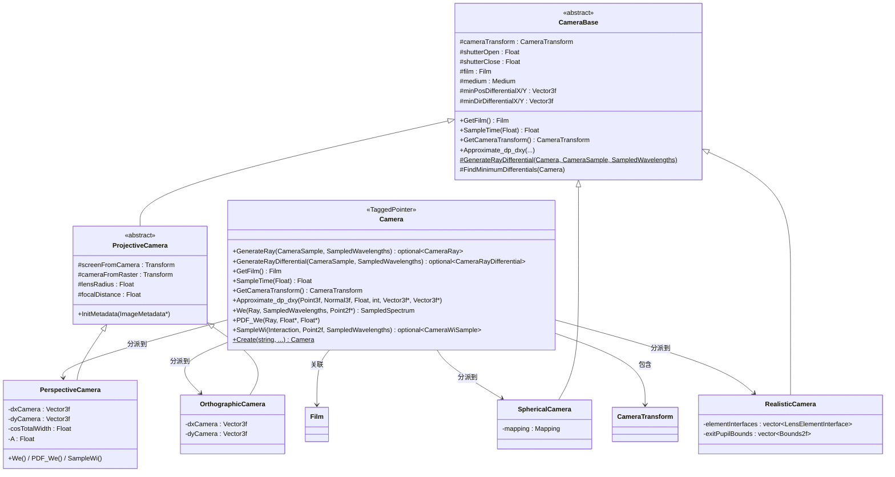

# camera.h — 相机接口

## 概述

`camera.h` 定义了 pbrt-v4 渲染器的 **Camera** 接口。Camera 是渲染管线的起点：积分器通过它将图像平面上的采样点转换为世界空间中的光线，然后沿光线追踪场景。

该文件使用 `TaggedPointer` 多态机制，在 CPU 和 GPU 上实现高效的动态分派，避免了传统虚函数的开销。Camera 本身不包含任何实现逻辑，所有方法通过 `Dispatch` 转发到四种具体相机类型。

## 坐标系统

理解相机接口需要先明确 pbrt 中的三个坐标空间：

| 空间 | 含义 |
|------|------|
| **World space** | 场景的全局坐标系，几何体和光源在此空间中定义 |
| **Render space** | 渲染坐标系，积分器在此空间中进行光线追踪和着色计算 |
| **Camera space** | 相机局部坐标系，相机位于原点，朝 +z 方向观察 |

`CameraTransform` 封装了这三个空间之间的变换关系：

- **renderFromCamera**（`AnimatedTransform`）— 从 Camera space 到 Render space 的变换，支持运动模糊（随时间插值）
- **worldFromRender**（`Transform`）— 从 Render space 到 World space 的静态变换

Render space 的选择由全局 `Options->renderingSpace` 控制，有三种模式：

| 模式 | worldFromRender 的值 | 说明 |
|------|---------------------|------|
| `Camera` | 快门中间时刻的 worldFromCamera | Render space = 快门中点的 Camera space |
| `CameraWorld` | 仅平移到相机位置 | Render space 轴向对齐 World space，原点在相机处 |
| `World` | 单位矩阵 | Render space = World space |

### CameraTransform 主要方法

```cpp
// 点/向量/法线/光线的空间转换（支持时间参数以处理运动模糊）
Point3f  RenderFromCamera(Point3f p, Float time);
Point3f  CameraFromRender(Point3f p, Float time);
Vector3f RenderFromCamera(Vector3f v, Float time);
Vector3f CameraFromRender(Vector3f v, Float time);
Normal3f RenderFromCamera(Normal3f n, Float time);
Normal3f CameraFromRender(Normal3f n, Float time);
Ray      RenderFromCamera(const Ray &r);
RayDifferential RenderFromCamera(const RayDifferential &r);

// 获取变换矩阵
Point3f   RenderFromWorld(Point3f p);
Transform RenderFromWorld();
Transform CameraFromRender(Float time);
Transform CameraFromWorld(Float time);

// 内部变换访问
const AnimatedTransform &RenderFromCamera();
const Transform &WorldFromRender();
bool CameraFromRenderHasScale();
```

## Camera 类（TaggedPointer 接口）

```cpp
class Camera : public TaggedPointer<PerspectiveCamera, OrthographicCamera,
                                    SphericalCamera, RealisticCamera>;
```

Camera 是一个 `TaggedPointer`，可以指向四种具体相机类型中的任何一种。所有方法通过 `Dispatch` 机制转发到具体实现。

### 光线生成

#### GenerateRay

```cpp
pstd::optional<CameraRay> GenerateRay(CameraSample sample,
                                      SampledWavelengths &lambda) const;
```

根据采样参数生成一条相机光线。这是相机最核心的方法。

| 参数 | 说明 |
|------|------|
| `sample` | `CameraSample`，包含像素位置、镜头采样点、时间等 |
| `lambda` | 采样的波长集合（光谱渲染使用） |
| **返回** | `optional<CameraRay>`：成功时返回包含光线和权重的结构体；若采样点无效（如落在球面相机的无效区域）则返回空 |

该方法在 `cameras.h` 中内联实现，通过 `Dispatch` 转发。

#### GenerateRayDifferential

```cpp
pstd::optional<CameraRayDifferential> GenerateRayDifferential(
    CameraSample sample, SampledWavelengths &lambda) const;
```

生成带有微分信息的光线，用于纹理抗锯齿（mipmap 级别选择）。

| 参数 | 说明 |
|------|------|
| `sample` | 同 `GenerateRay` |
| `lambda` | 同 `GenerateRay` |
| **返回** | `optional<CameraRayDifferential>`：包含主光线及其 x/y 方向各偏移一个像素的辅助光线 |

`PerspectiveCamera` 和 `OrthographicCamera` 提供了精确的解析实现；`SphericalCamera` 和 `RealisticCamera` 使用 `CameraBase::GenerateRayDifferential` 的默认实现——通过有限差分（偏移 ±0.05 像素）近似计算微分光线。

### 属性访问

#### GetFilm

```cpp
Film GetFilm() const;
```

返回关联的 `Film`（胶片）对象。用于获取图像分辨率、采样边界等信息。

#### GetCameraTransform

```cpp
const CameraTransform &GetCameraTransform() const;
```

返回相机的 `CameraTransform` 引用，用于在 Camera/Render/World 空间之间进行变换。

#### SampleTime

```cpp
Float SampleTime(Float u) const;
```

将 `[0, 1)` 均匀随机数 `u` 映射到快门时间区间 `[shutterOpen, shutterClose]`（线性插值），用于运动模糊。

#### InitMetadata

```cpp
void InitMetadata(ImageMetadata *metadata) const;
```

将相机变换矩阵（cameraFromWorld）写入图像元数据。`ProjectiveCamera` 还会额外写入 NDCFromWorld 矩阵。仅在 CPU 上调用（`DispatchCPU`）。

### 纹理抗锯齿

#### Approximate_dp_dxy

```cpp
void Approximate_dp_dxy(Point3f p, Normal3f n, Float time,
                        int samplesPerPixel,
                        Vector3f *dpdx, Vector3f *dpdy) const;
```

在表面交点处近似计算 dp/dx 和 dp/dy（表面位置对屏幕坐标的偏导数），用于纹理过滤。

| 参数 | 说明 |
|------|------|
| `p` | 表面交点位置（Render space） |
| `n` | 表面法线（Render space） |
| `time` | 光线时间 |
| `samplesPerPixel` | 每像素采样数，用于缩放微分（高采样数 → 更小的微分） |
| `*dpdx` | 输出：表面位置沿屏幕 x 方向的变化量 |
| `*dpdy` | 输出：表面位置沿屏幕 y 方向的变化量 |

实现位于 `CameraBase`，利用预计算的最小微分（`minPosDifferentialX/Y`、`minDirDifferentialX/Y`）进行快速近似。由于所有具体相机都继承自 `CameraBase`，该方法通过 `AllInheritFrom` 检查可以直接转换指针调用，避免 `Dispatch` 开销。

#### Approximate_dp_dxy 原理与计算流程

##### 背景：为什么需要这个函数

纹理过滤（mipmap 级别选择）需要知道屏幕空间中一个像素对应物体表面多大的面积，即表面位置对屏幕坐标的偏导数 $\partial p / \partial x$ 和 $\partial p / \partial y$。理想情况下，这些微分由 `RayDifferential` 在光线传播过程中逐步维护——主光线附带两条偏移光线（x 和 y 方向各一条），通过它们与物体表面的交点差来精确计算偏导数。

然而在某些场景下这一机制不可用：

- **Wavefront 积分器**中，光线弹射后不再携带微分信息（GPU 内存有限，不存储额外的偏移光线）。
- **间接光照路径**中，经过多次反射/折射后微分信息会逐渐失真或丢失。
- **光线从非相机端发射**（如双向方法中的光源子路径）时，根本没有屏幕空间微分可言。

`Approximate_dp_dxy` 的作用就是在微分信息缺失时，利用相机预计算的最小微分来近似恢复 $\partial p / \partial x$ 和 $\partial p / \partial y$，使纹理过滤仍能正常工作。

##### 预计算：FindMinimumDifferentials

在相机构造时调用 `FindMinimumDifferentials`（`cameras.cpp:154-200`），沿图像对角线均匀采样 **512 个点**：

```cpp
int n = 512;
for (int i = 0; i < n; ++i) {
    sample.pFilm.x = Float(i) / (n - 1) * film.FullResolution().x;
    sample.pFilm.y = Float(i) / (n - 1) * film.FullResolution().y;
    // ...
}
```

对每个采样点生成 `RayDifferential`，然后提取两类微分：

**位置微分**（camera space）：

```cpp
Vector3f dox = CameraFromRender(ray.rxOrigin - ray.o, ray.time);
Vector3f doy = CameraFromRender(ray.ryOrigin - ray.o, ray.time);
```

偏移光线原点与主光线原点之差，变换到 camera space。取所有采样中**模长最小**的值存入 `minPosDifferentialX/Y`。

**方向微分**（局部坐标系）：

```cpp
Frame f = Frame::FromZ(ray.d);        // 以主光线方向为 z 轴建立局部坐标系
Vector3f df  = f.ToLocal(ray.d);      // → (0, 0, 1)
Vector3f dxf = Normalize(f.ToLocal(ray.rxDirection));
Vector3f dyf = Normalize(f.ToLocal(ray.ryDirection));
minDirDifferentialX = dxf - df;       // 取模长最小的
minDirDifferentialY = dyf - df;
```

方向微分在以主光线方向为 z 轴的局部坐标系中表示。这样做的好处是：不同位置的主光线方向各异，但将方向差转换到以主方向为 z 的坐标系后，微分值变得可比较、可复用。

**为什么取最小值？** 这是一种保守估计策略。较小的微分对应更精细的纹理采样：
- 如果高估微分 → 纹理过滤选择更高的 mipmap 级别 → 图像过度模糊
- 如果低估微分 → 可能出现一点混叠，但视觉上影响较小
- 取最小值确保纹理过滤不会过度模糊，在"模糊"与"混叠"之间倾向于后者（更可接受）

##### 逐步计算流程

以下对照源码 `cameras.h:155-183` 逐步解析。

**Step 1 — 变换到 Camera space**

```cpp
Point3f pCamera = CameraFromRender(p, time);
```

将 render space 中的交点 `p` 变换到 camera space。在 camera space 中，相机位于原点，主要观察方向沿 +z 轴。

**Step 2 — 构建 DownZ 旋转**

```cpp
Transform DownZFromCamera =
    RotateFromTo(Normalize(Vector3f(pCamera)), Vector3f(0, 0, 1));
```

构建一个旋转变换，将从原点指向 `pCamera` 的方向旋转对齐到 +z 轴。这个变换的意义是：

- 预计算的方向微分是在"以主光线方向为 z 轴"的坐标系中表示的
- 从原点到 `pCamera` 的方向就是（近似的）主光线方向
- 通过 `DownZFromCamera` 旋转，当前光线的方向变为 $(0, 0, 1)$，与预计算微分的坐标系对齐

**Step 3 — 变换交点和法线到 DownZ 坐标系**

```cpp
Point3f pDownZ = DownZFromCamera(pCamera);
Normal3f nDownZ = DownZFromCamera(CameraFromRender(n, time));
```

- `pDownZ`：由于 `pCamera` 的方向已被旋转到 z 轴，变换后 `pDownZ = (0, 0, |pCamera|)`，x 和 y 分量为 0
- `nDownZ`：表面法线也需要变换到同一坐标系，用于后续建立切平面

**Step 4 — 建立切平面方程**

```cpp
Float d = nDownZ.z * pDownZ.z;
```

切平面方程为 $\mathbf{n} \cdot \mathbf{x} = d$，其中 $d = \mathbf{n} \cdot \mathbf{p}$。

由于 `pDownZ.x ≈ 0`、`pDownZ.y ≈ 0`，点积简化为：

$$d = n_x \cdot 0 + n_y \cdot 0 + n_z \cdot p_z = n_z \cdot p_z$$

即 `nDownZ.z * pDownZ.z`。这个平面代表了交点处的表面切平面。

**Step 5 — 构造近似微分光线**

```cpp
Ray xRay(Point3f(0,0,0) + minPosDifferentialX,
         Vector3f(0,0,1) + minDirDifferentialX);
Ray yRay(Point3f(0,0,0) + minPosDifferentialY,
         Vector3f(0,0,1) + minDirDifferentialY);
```

在 DownZ 坐标系中，主光线从原点 $(0,0,0)$ 沿 $(0,0,1)$ 方向发出。微分光线在主光线基础上加上预计算的最小偏移：

- `xRay` 的原点偏移了 `minPosDifferentialX`，方向偏移了 `minDirDifferentialX`
- `yRay` 的原点偏移了 `minPosDifferentialY`，方向偏移了 `minDirDifferentialY`

这正是预计算微分可以直接使用的原因——Step 2 的旋转确保了坐标系对齐。

**Step 6 — 光线-平面求交**

```cpp
Float tx = -(Dot(nDownZ, Vector3f(xRay.o)) - d) / Dot(nDownZ, xRay.d);
Point3f px = xRay(tx);
Float ty = -(Dot(nDownZ, Vector3f(yRay.o)) - d) / Dot(nDownZ, yRay.d);
Point3f py = yRay(ty);
```

标准的光线-平面求交公式。对于光线 $\mathbf{o} + t\mathbf{d}$ 与平面 $\mathbf{n} \cdot \mathbf{x} = d$：

$$t = \frac{d - \mathbf{n} \cdot \mathbf{o}}{\mathbf{n} \cdot \mathbf{d}} = -\frac{\mathbf{n} \cdot \mathbf{o} - d}{\mathbf{n} \cdot \mathbf{d}}$$

`px` 和 `py` 就是微分光线与切平面的交点。

**Step 7 — 计算微分并变换回 Render space**

```cpp
*dpdx = sppScale *
    RenderFromCamera(DownZFromCamera.ApplyInverse(px - pDownZ), time);
*dpdy = sppScale *
    RenderFromCamera(DownZFromCamera.ApplyInverse(py - pDownZ), time);
```

计算流程：

1. `px - pDownZ`：微分光线交点与主光线交点之差（DownZ 空间中的位置偏移）
2. `DownZFromCamera.ApplyInverse(...)`：逆旋转变回 camera space
3. `RenderFromCamera(...)`：变换到 render space
4. 乘以 `sppScale` 缩放

**Step 8 — spp 缩放**

```cpp
Float sppScale =
    GetOptions().disablePixelJitter
        ? 1
        : std::max<Float>(.125, 1 / std::sqrt((Float)samplesPerPixel));
```

当使用多采样抗锯齿时，每个样本覆盖的像素面积更小，纹理微分需要相应缩小：

- **缩放因子** $= 1 / \sqrt{\text{spp}}$：spp 个样本均匀覆盖一个像素，每个样本的"有效像素宽度"按 $\sqrt{\text{spp}}$ 缩小
- **下限 0.125**：防止极高采样数（如 spp = 1024）时微分过小，导致纹理过度锐利、出现混叠
- **disablePixelJitter**：如果禁用了像素抖动，样本都打在像素中心，缩放因子固定为 1

##### 整体流程概览

```
输入: p (render space), n (render space), time, samplesPerPixel
 │
 ▼
[Step 1] p ──CameraFromRender──→ pCamera
 │
 ▼
[Step 2] 构建 DownZFromCamera 旋转（将 pCamera 方向对齐到 +z）
 │
 ▼
[Step 3] pCamera ──DownZ──→ pDownZ = (0, 0, |pCamera|)
         n       ──DownZ──→ nDownZ
 │
 ▼
[Step 4] 切平面: dot(nDownZ, x) = nDownZ.z * pDownZ.z
 │
 ▼
[Step 5] 构造微分光线 xRay, yRay（主光线 + 预计算偏移）
 │
 ▼
[Step 6] xRay, yRay 与切平面求交 → px, py
 │
 ▼
[Step 7] (px - pDownZ) ──DownZ⁻¹──→ camera space ──RenderFromCamera──→ render space
         (py - pDownZ) ──DownZ⁻¹──→ camera space ──RenderFromCamera──→ render space
 │
 ▼
[Step 8] × sppScale = max(0.125, 1/√spp)
 │
 ▼
输出: dpdx, dpdy (render space)
```

### 双向渲染接口

以下三个方法用于双向路径追踪（BDPT）等算法，将相机建模为一个"发射辐射度"的光源。目前 **仅 `PerspectiveCamera` 实现了这些方法**，其余三种相机调用时会触发 `LOG_FATAL`。

#### We

```cpp
SampledSpectrum We(const Ray &ray, SampledWavelengths &lambda,
                   Point2f *pRasterOut = nullptr) const;
```

计算相机沿给定光线方向的发射重要度（importance emission），类似于光源的 `Le()`。

| 参数 | 说明 |
|------|------|
| `ray` | 从相机发出的光线（Render space） |
| `lambda` | 采样波长 |
| `*pRasterOut` | 可选输出：光线对应的光栅（像素）坐标 |
| **返回** | 该方向的重要度值。对 `PerspectiveCamera`，值为 `1 / (A * lensArea * cos^4(theta))`，其中 A 是 z=1 平面上的图像面积 |

若光线方向超出相机视野（`cosTheta <= cosTotalWidth`）或对应的光栅坐标超出采样边界，返回零。

#### PDF_We

```cpp
void PDF_We(const Ray &ray, Float *pdfPos, Float *pdfDir) const;
```

计算相机发射光线的概率密度函数，分解为位置和方向两个分量。

| 参数 | 说明 |
|------|------|
| `ray` | 从相机发出的光线（Render space） |
| `*pdfPos` | 输出：位置 PDF（= `1 / lensArea`） |
| `*pdfDir` | 输出：方向 PDF（= `1 / (A * cos^3(theta))`） |

#### SampleWi

```cpp
pstd::optional<CameraWiSample> SampleWi(const Interaction &ref, Point2f u,
                                        SampledWavelengths &lambda) const;
```

从场景中某个交互点朝相机采样一个入射方向。在双向渲染中，光线子路径需要连接到相机，此方法提供该连接的采样策略。

| 参数 | 说明 |
|------|------|
| `ref` | 场景中的交互点 |
| `u` | `[0,1)^2` 二维均匀随机数，用于在镜头上均匀采样 |
| `lambda` | 采样波长 |
| **返回** | `optional<CameraWiSample>`：包含重要度 Wi、入射方向 wi、PDF、光栅坐标、参考点和镜头交互点 |

### 工厂方法

#### Create

```cpp
static Camera Create(const std::string &name,
                     const ParameterDictionary &parameters,
                     Medium medium,
                     const CameraTransform &cameraTransform,
                     Film film,
                     const FileLoc *loc,
                     Allocator alloc);
```

根据名称字符串创建具体相机实例。支持的名称：`"perspective"`、`"orthographic"`、`"realistic"`、`"spherical"`。

## 辅助结构体

### CameraSample

定义于 `base/sampler.h`。采样器生成的相机采样参数，传给 `GenerateRay`。

```cpp
struct CameraSample {
    Point2f pFilm;        // 胶片（图像）平面上的采样位置，单位为像素
    Point2f pLens;        // 镜头上的采样位置，[0,1)^2，用于景深效果
    Float time = 0;       // 时间采样值，[0,1)，经 SampleTime() 映射到快门区间
    Float filterWeight = 1; // 重建滤波器在此采样点的权重
};
```

### CameraRay

相机生成的光线及其光谱权重。

```cpp
struct CameraRay {
    Ray ray;                                // 光线（Render space）
    SampledSpectrum weight = SampledSpectrum(1); // 光谱权重（通常为 1，RealisticCamera 中可能不同）
};
```

### CameraRayDifferential

带微分信息的相机光线及其光谱权重。

```cpp
struct CameraRayDifferential {
    RayDifferential ray;                    // 带微分的光线（包含 rxOrigin/rxDirection/ryOrigin/ryDirection）
    SampledSpectrum weight = SampledSpectrum(1); // 光谱权重
};
```

### CameraWiSample

`SampleWi()` 的返回值，包含从场景点朝相机采样的完整信息。

```cpp
struct CameraWiSample {
    SampledSpectrum Wi;    // 相机在该方向的重要度（来自 We()）
    Vector3f wi;           // 从参考点指向镜头采样点的单位方向
    Float pdf;             // 该采样的概率密度
    Point2f pRaster;       // 对应的光栅（像素）坐标
    Interaction pRef;      // 场景中的参考交互点
    Interaction pLens;     // 镜头上的交互点
};
```

### CameraBaseParameters

用于构造 `CameraBase` 的参数包。从场景描述文件中解析。

```cpp
struct CameraBaseParameters {
    CameraTransform cameraTransform; // 相机变换
    Float shutterOpen = 0;           // 快门打开时间
    Float shutterClose = 1;          // 快门关闭时间
    Film film;                       // 关联的胶片
    Medium medium;                   // 相机所在的介质（用于参与介质渲染）
};
```

构造函数从 `ParameterDictionary` 中读取 `"shutteropen"` 和 `"shutterclose"` 参数，并确保 open <= close。

## 继承体系

### CameraBase

所有具体相机的公共基类，提供共享的数据成员和工具方法。

#### protected 成员

| 成员 | 说明 |
|------|------|
| `CameraTransform cameraTransform` | 相机变换 |
| `Float shutterOpen, shutterClose` | 快门时间区间 |
| `Film film` | 关联的胶片 |
| `Medium medium` | 相机所在介质 |
| `Vector3f minPosDifferentialX/Y` | 预计算的最小位置微分（Camera space），用于 `Approximate_dp_dxy` |
| `Vector3f minDirDifferentialX/Y` | 预计算的最小方向微分（Camera space），用于 `Approximate_dp_dxy` |

#### 核心方法

**`GenerateRayDifferential`**（static）— 默认的微分光线生成实现。通过在 x/y 方向各偏移 ±0.05 像素调用 `GenerateRay`，用有限差分近似计算微分光线。`SphericalCamera` 和 `RealisticCamera` 直接使用此实现。

**`FindMinimumDifferentials`** — 在构造时调用。沿图像对角线采样 512 个点，对每个点生成微分光线，取所有采样中最小的位置微分和方向微分，存入 `minPosDifferentialX/Y` 和 `minDirDifferentialX/Y`。这些值供 `Approximate_dp_dxy` 使用。

**`RenderFromCamera` / `CameraFromRender`** — 一系列受保护的便捷方法，将 `cameraTransform` 的对应方法转发，支持 Point3f、Vector3f、Normal3f、Ray、RayDifferential 的空间转换。

### ProjectiveCamera

继承自 `CameraBase`，为使用投影变换的相机（`PerspectiveCamera`、`OrthographicCamera`）提供公共基础设施。

#### 投影变换链

```
Camera space → Screen space → NDC space → Raster space
```

| 变换 | 含义 |
|------|------|
| `screenFromCamera` | Camera → Screen，由具体相机提供（透视投影或正交投影矩阵） |
| NDCFromScreen | Screen → NDC，将 screenWindow 归一化到 [0,1] |
| rasterFromNDC | NDC → Raster，缩放到像素分辨率 |
| `rasterFromScreen` | Screen → Raster（= rasterFromNDC * NDCFromScreen） |
| `screenFromRaster` | Raster → Screen（rasterFromScreen 的逆） |
| `cameraFromRaster` | Raster → Camera（= screenFromCamera^-1 * screenFromRaster），直接将像素坐标映射到相机空间 |

#### protected 成员

| 成员 | 说明 |
|------|------|
| `Transform screenFromCamera` | Camera → Screen 投影矩阵 |
| `Transform cameraFromRaster` | Raster → Camera 变换（光线生成的核心） |
| `Transform rasterFromScreen, screenFromRaster` | 辅助变换 |
| `Float lensRadius` | 薄镜头半径（0 = 针孔相机，> 0 启用景深） |
| `Float focalDistance` | 焦距平面距离（景深效果的对焦距离） |

### 四种具体相机

| 相机 | 继承自 | 说明 |
|------|--------|------|
| **PerspectiveCamera** | `ProjectiveCamera` | 透视投影相机。支持景深（`lensRadius > 0`）。是唯一实现了 `We()` / `PDF_We()` / `SampleWi()` 的相机，可用于双向路径追踪。额外维护 `cosTotalWidth`（视野边缘余弦）和 `A`（z=1 平面图像面积）。 |
| **OrthographicCamera** | `ProjectiveCamera` | 正交投影相机。光线方向始终为 (0,0,1)，支持景深。双向接口未实现。 |
| **SphericalCamera** | `CameraBase` | 球面/环境相机。支持两种映射：`EquiRectangular`（等距柱状投影）和 `EqualArea`（等面积投影）。不使用投影变换链，直接从 UV 坐标计算球面方向。双向接口未实现。 |
| **RealisticCamera** | `CameraBase` | 基于真实透镜系统的相机。通过透镜描述文件定义多个透镜元件，模拟光线穿过每个透镜元件的折射过程。支持自定义光圈形状（圆形、高斯、五边形、星形或自定义图像）。双向接口未实现。 |

## 架构图



## 依赖关系

- **依赖**：
  - `pbrt/pbrt.h` — 全局类型定义与宏
  - `pbrt/base/film.h` — `Film` 胶片基类接口
  - `pbrt/base/filter.h` — `Filter` 滤波器基类接口
  - `pbrt/util/taggedptr.h` — `TaggedPointer` 多态分派基础设施
  - `pbrt/util/transform.h` — 变换矩阵工具
  - `pbrt/util/vecmath.h` — 向量数学类型

- **被依赖**：
  - `pbrt/cameras.h` — 具体相机实现（`CameraBase`、`ProjectiveCamera`、四种具体相机）
  - `pbrt/cameras.cpp` — 相机方法实现
  - `pbrt/cpu/integrators.h` — CPU 积分器
  - `pbrt/wavefront/integrator.h` — 波前积分器
