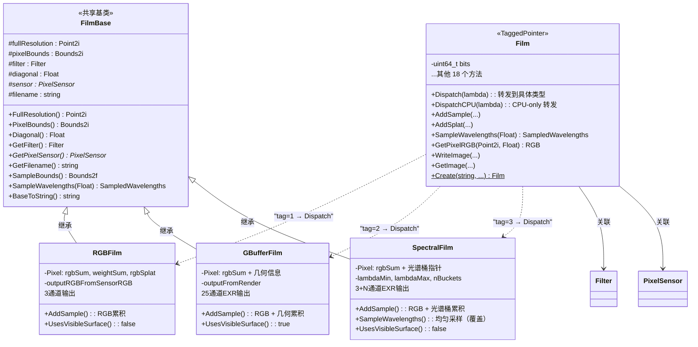

# film.h

## 1. 概述

`film.h` 定义了 PBRT-v4 渲染器中的 **Film（胶片）** 接口。胶片是渲染管线的终点，负责将积分器计算得到的光谱辐射度值累积到像素上，并最终输出图像。

Film 子系统采用**三层架构**：

| 层级 | 类 | 职责 |
|---|---|---|
| 接口层 | `Film` | TaggedPointer，对外暴露统一 API，内部通过 `Dispatch` 转发到具体类型 |
| 共享实现层 | `FilmBase` | 三个具体类型的公共基类，持有 6 个共享成员和默认方法实现 |
| 具体实现层 | `RGBFilm` / `GBufferFilm` / `SpectralFilm` | 继承 `FilmBase`，各自定义 `Pixel` 结构并实现特有逻辑 |

关键点：**`Film` 与 `FilmBase` 之间没有继承关系**。`Film` 是一个 `TaggedPointer`，它通过类型标签分派调用到三个具体类型；而三个具体类型通过普通继承共享 `FilmBase` 的成员和方法。

### 三个具体实现类

| 实现类 | 说明 |
|---|---|
| `RGBFilm` | 标准 RGB 胶片，将光谱值转换为传感器 RGB 进行存储，输出 R/G/B 三通道图像 |
| `GBufferFilm` | G-Buffer 胶片，在 RGB 基础上额外记录几何信息（位置、法线、深度导数、UV、反照率、方差），输出 25 通道 EXR |
| `SpectralFilm` | 光谱胶片，在 RGB 基础上保留完整光谱桶数据，输出 R/G/B + N 个光谱通道的 EXR |

---

## 2. TaggedPointer 多态分派机制

### 2.1 为什么不用虚函数

传统 C++ 多态通过虚函数表（vtable）实现。但 PBRT-v4 需要同时在 CPU 和 GPU 上运行，而 GPU 上的虚函数指针存在跨地址空间问题。`TaggedPointer` 将类型信息编码在指针本身中，替代了虚函数表。

### 2.2 指针中的类型编码

`Film` 的声明（`src/pbrt/base/film.h:25`）：

```cpp
class Film : public TaggedPointer<RGBFilm, GBufferFilm, SpectralFilm> { ... };
```

`TaggedPointer` 内部使用一个 `uint64_t bits` 存储两部分信息：

```
  [63 ---- 57]  [56 ------------ 0]
    7 位 tag         57 位指针
```

- **高 7 位**（`tagShift = 57`）：类型标签。`0` = nullptr，`1` = `RGBFilm`，`2` = `GBufferFilm`，`3` = `SpectralFilm`
- **低 57 位**：实际的堆指针（x86-64 虚拟地址空间仅使用 48 位，所以高位可以安全借用）

构造时编码类型标签（`src/pbrt/util/taggedptr.h:744-748`）：

```cpp
template <typename T>
TaggedPointer(T *ptr) {
    uint64_t iptr = reinterpret_cast<uint64_t>(ptr);
    constexpr unsigned int type = TypeIndex<T>();  // 编译期确定类型索引
    bits = iptr | ((uint64_t)type << tagShift);    // 将 tag 写入高位
}
```

读取时分离两部分：

```cpp
unsigned int Tag() const { return ((bits & tagMask) >> tagShift); }
void *ptr() { return reinterpret_cast<void *>(bits & ptrMask); }
```

### 2.3 Dispatch 的工作原理

`TaggedPointer::Dispatch`（`src/pbrt/util/taggedptr.h:834-838`）：

```cpp
template <typename F>
PBRT_CPU_GPU decltype(auto) Dispatch(F &&func) {
    DCHECK(ptr());
    using R = typename detail::ReturnType<F, Ts...>::type;
    return detail::Dispatch<F, R, Ts...>(func, ptr(), Tag() - 1);
    //                                         ^^^^^  ^^^^^^^^^
    //                                     裸 void*  类型索引（从0开始）
}
```

`detail::Dispatch` 是一组按参数个数重载的函数模板。对于 3 个类型的情况（`src/pbrt/util/taggedptr.h:57-69`）：

```cpp
template <typename F, typename R, typename T0, typename T1, typename T2>
PBRT_CPU_GPU R Dispatch(F &&func, const void *ptr, int index) {
    switch (index) {
    case 0: return func((const T0 *)ptr);  // T0 = RGBFilm
    case 1: return func((const T1 *)ptr);  // T1 = GBufferFilm
    default: return func((const T2 *)ptr); // T2 = SpectralFilm
    }
}
```

整个过程：
1. 从 `bits` 的高 7 位提取 `tag`（1/2/3）
2. `tag - 1` 得到 switch 索引（0/1/2）
3. 根据索引将 `void*` **强制转换**为具体类型指针（`RGBFilm*`/`GBufferFilm*`/`SpectralFilm*`）
4. 调用传入的 lambda，由于 lambda 参数是 `auto ptr`，编译器为**每个具体类型**生成一份实例化代码

### 2.4 Dispatch vs DispatchCPU

- `Dispatch`：标注 `PBRT_CPU_GPU`，可在 CPU 和 GPU 上运行。用于高频方法（`AddSample`、`SampleWavelengths` 等）
- `DispatchCPU`：无 GPU 注解，仅在 CPU 上运行。用于 I/O 方法（`WriteImage`、`GetImage`、`GetFilename`、`ToString`）

### 2.5 示例：`Film::AddSample` 的完整分派流程

调用方代码：

```cpp
film.AddSample(pFilm, L, lambda, visibleSurface, weight);
```

**第一步**：进入 `Film::AddSample`（`src/pbrt/film.h:585-592`）：

```cpp
PBRT_CPU_GPU inline void Film::AddSample(Point2i pFilm, SampledSpectrum L,
                            const SampledWavelengths &lambda,
                            const VisibleSurface *visibleSurface, Float weight) {
    auto add = [&](auto ptr) {
        return ptr->AddSample(pFilm, L, lambda, visibleSurface, weight);
    };
    return Dispatch(add);
}
```

**第二步**：`Dispatch` 提取 tag，假设当前是 `RGBFilm`（tag=1），则 `Tag()-1 = 0`。

**第三步**：`detail::Dispatch` 的 `switch(0)` 分支将 `void*` 转换为 `RGBFilm*`，调用 `add((RGBFilm*)ptr)`。

**第四步**：lambda 中 `auto ptr` 被推导为 `RGBFilm*`，执行 `ptr->AddSample(...)`，即 `RGBFilm::AddSample`。

编译器同时生成 `GBufferFilm::AddSample` 和 `SpectralFilm::AddSample` 的调用代码，分别对应 switch 的 case 1 和 default 分支。

---

## 3. FilmBase 共享基类

### 3.1 定位

`FilmBase`（`src/pbrt/film.h:180-229`）是 `RGBFilm`、`GBufferFilm`、`SpectralFilm` 三者的**公共基类**（普通 C++ 继承），但它**不是** `Film` 的基类。`Film` 是 TaggedPointer，与 `FilmBase` 没有继承关系。

```
Film (TaggedPointer)          FilmBase (普通基类)
    │                              │
    │  Dispatch ──────→      ┌─────┼─────┐
    │                        │     │     │
    └──────────────→   RGBFilm  GBufferFilm  SpectralFilm
```

### 3.2 FilmBaseParameters：统一参数解析

`FilmBaseParameters`（`src/pbrt/film.h:159-177`）是一个参数聚合结构，在工厂方法中负责从场景参数字典解析出所有基础配置：

| 成员 | 场景参数 | 默认值 | 说明 |
|---|---|---|---|
| `fullResolution` | `xresolution`, `yresolution` | 1280×720 | quickRender 模式下除以 4 |
| `pixelBounds` | `pixelbounds` 或 `cropwindow` | 完整分辨率 | 两者互斥 |
| `filter` | — | 由外部传入 | 重建滤波器 |
| `diagonal` | `diagonal` | 35（mm） | 构造函数中乘 0.001 转为米 |
| `sensor` | — | 由外部传入 | PixelSensor 指针 |
| `filename` | `filename` | `"pbrt.exr"` | 命令行 `--imageFile` 优先级更高 |

### 3.3 FilmBase 的 protected 成员

`FilmBase` 构造函数接收 `FilmBaseParameters`，初始化 6 个 protected 成员：

```cpp
protected:
    Point2i fullResolution;      // 完整图像分辨率
    Bounds2i pixelBounds;        // 实际渲染的像素区域
    Filter filter;               // 重建滤波器
    Float diagonal;              // 胶片对角线长度（米）
    const PixelSensor *sensor;   // 像素传感器
    std::string filename;        // 输出文件名
```

三个具体子类直接访问这些 protected 成员，不需要额外的 getter。

### 3.4 FilmBase 提供的默认方法

FilmBase 中实现了以下方法，子类通过继承直接获得（不需要覆盖）：

| 方法 | 实现 |
|---|---|
| `FullResolution()` | `return fullResolution;` |
| `PixelBounds()` | `return pixelBounds;` |
| `Diagonal()` | `return diagonal;` |
| `GetFilter()` | `return filter;` |
| `GetPixelSensor()` | `return sensor;` |
| `GetFilename()` | `return filename;` |
| `SampleBounds()` | 基于 pixelBounds 和 filter 半径计算采样域 |
| `SampleWavelengths(u)` | `SampledWavelengths::SampleVisible(u)`（重要性采样） |
| `BaseToString()` | 输出基础配置的格式化字符串，供子类的 `ToString` 调用 |

---

## 4. 方法实现分类

Film 接口共定义 18 个方法（含 `Create`）。按实现策略分为三类。

### 4.1 FilmBase 统一实现（子类直接继承，不覆盖）

**方法列表**：`FullResolution`、`PixelBounds`、`Diagonal`、`GetFilter`、`GetPixelSensor`、`GetFilename`、`SampleBounds`、`BaseToString`

这些方法只是返回 protected 成员变量或执行通用计算，三个子类的行为完全一致。

**SampleBounds 的计算逻辑**（`src/pbrt/film.cpp:178-182`）：

```cpp
Bounds2f FilmBase::SampleBounds() const {
    Vector2f radius = filter.Radius();
    return Bounds2f(pixelBounds.pMin - radius + Vector2f(0.5f, 0.5f),
                    pixelBounds.pMax + radius - Vector2f(0.5f, 0.5f));
}
```

像素中心在连续坐标中位于整数 + 0.5 处。采样域向外扩展滤波器半径，再向内收缩 0.5 像素，得到能对 `pixelBounds` 内任何像素产生贡献的连续采样位置范围。

### 4.2 FilmBase 提供默认实现，SpectralFilm 覆盖

**方法**：`SampleWavelengths`

| 实现 | 行为 | 原因 |
|---|---|---|
| FilmBase（RGBFilm/GBufferFilm 继承） | `SampledWavelengths::SampleVisible(u)` — 基于 CIE 可见度函数重要性采样 | 样本集中在人眼敏感的可见光范围，提高 RGB 转换效率 |
| SpectralFilm（覆盖） | `SampledWavelengths::SampleUniform(u, lambdaMin, lambdaMax)` — 均匀采样 | 光谱桶累积逻辑依赖均匀分布假设（直接累加，不额外除以 PDF） |

SpectralFilm 的覆盖代码（`src/pbrt/film.h:408-410`）：

```cpp
SampledWavelengths SampleWavelengths(Float u) const {
    return SampledWavelengths::SampleUniform(u, lambdaMin, lambdaMax);
}
```

由于名称相同，当 `Film::SampleWavelengths` 通过 Dispatch 转发到 `SpectralFilm*` 时，C++ 的名称查找会找到 `SpectralFilm::SampleWavelengths`（隐藏了 `FilmBase::SampleWavelengths`）。

### 4.3 各子类独立实现

#### 4.3.1 Pixel 结构对比

三个子类的 `Pixel` 结构差异是不同方法实现的根本驱动因素。

| 字段 | RGBFilm | GBufferFilm | SpectralFilm |
|---|---|---|---|
| `rgbSum[3]` | `double` | `double` | `double` |
| 权重和 | `weightSum` (double) | `weightSum` + `gBufferWeightSum` (double) | `rgbWeightSum` (double) |
| `rgbSplat[3]` | `AtomicDouble` | `AtomicDouble` | `AtomicDouble` |
| 几何信息 | — | `pSum`, `nSum`, `nsSum`, `dzdxSum`, `dzdySum`, `uvSum`, `rgbAlbedoSum[3]`, `rgbVariance[3]` | — |
| 光谱桶 | — | — | `*bucketSums`, `*weightSums` (double 指针), `*bucketSplats` (AtomicDouble 指针) |

线程安全设计：
- `rgbSum` / `weightSum` 使用普通 `double`——每个像素在给定时刻只由一个线程写入（`AddSample` 的调用模式保证）
- `rgbSplat` / `bucketSplats` 使用 `AtomicDouble`——`AddSplat` 中多个线程可能同时写入同一像素

#### 4.3.2 采样累积组：AddSample、AddSplat、ResetPixel

**AddSample** — 渲染管线核心方法，积分器完成光路追踪后调用。

共同流程：
1. `sensor->ToSensorRGB(L, lambda)` 将光谱转换为传感器 RGB
2. 如果 RGB 最大分量超过 `maxComponentValue`，按比例缩放（保持色度，抑制萤火虫）
3. 累积 `weight * rgb` 到 `pixel.rgbSum`，`weight` 到权重和

各子类扩展：
- **RGBFilm**：仅执行共同流程，忽略 `visibleSurface`
- **GBufferFilm**：额外累积几何信息（位置、法线、深度导数、UV、反照率、方差），使用 `outputFromRender` 矩阵做坐标变换
- **SpectralFilm**：额外将光谱 L 的每个波长样本映射到光谱桶累积（`L *= weight * CIE_Y_integral` 后累加）

**AddSplat** — 用于双向路径追踪，将贡献泼溅到浮点坐标周围的多个像素。

共同流程：光谱 → 传感器 RGB → clamp → 计算 splatBounds → 对范围内像素用滤波器权重原子累加。

各子类扩展：
- **RGBFilm** / **GBufferFilm**：完全相同（源码注释：*"NOTE: same code as RGBFilm::AddSplat()"*）
- **SpectralFilm**：额外将每个波长样本分配到对应桶，原子累加到 `pixel.bucketSplats[b]`

**ResetPixel** — SPPM 积分器在每次迭代前清除旧数据。

- **RGBFilm / GBufferFilm**：`memset(&pixels[p], 0, sizeof(Pixel))` 直接清零整个结构
- **SpectralFilm**：逐字段清零，不能直接 memset 整个 Pixel——因为 `bucketSums`、`weightSums`、`bucketSplats` 是**指向外部分配内存的指针**，memset 会将指针本身清零而非清零指向的数据

#### 4.3.3 像素读取组：GetPixelRGB、ToOutputRGB

**GetPixelRGB** — 提取单个像素的最终 RGB 值。

三个子类逻辑基本一致：
1. 读取 `pixel.rgbSum[0..2]`
2. 除以权重和归一化
3. 加上 splat 贡献：`rgb[c] += splatScale * pixel.rgbSplat[c] / filterIntegral`
4. 乘以 `outputRGBFromSensorRGB` 矩阵转换到输出色彩空间

`outputRGBFromSensorRGB` 矩阵在构造函数中预计算：

```cpp
outputRGBFromSensorRGB = colorSpace->RGBFromXYZ * sensor->XYZFromSensorRGB;
```

即：传感器 RGB → XYZ（通过 Macbeth 色卡拟合的 3×3 矩阵）→ 输出色彩空间 RGB。

**ToOutputRGB** — 将光谱辐射度一步转换为输出色彩空间 RGB。

- **RGBFilm / GBufferFilm**：`sensor->ToSensorRGB(L, lambda)` 再乘 `outputRGBFromSensorRGB`
- **SpectralFilm**：调用 `LOG_FATAL` 终止程序。这是故意的——`ToOutputRGB` 仅被 SPPM 积分器使用，而 SPPM 是基于 RGB 的，与光谱输出不兼容

#### 4.3.4 图像输出组：WriteImage、GetImage

**WriteImage** — 渲染完成后写入图像文件。

三个子类流程相同：`GetImage(&metadata, splatScale)` → `image.Write(filename, metadata)`。仅在 CPU 上运行（使用 `DispatchCPU`）。

**GetImage** — 将像素缓冲区转换为最终图像。

三种输出通道结构：

| 子类 | 通道数 | 通道 |
|---|---|---|
| RGBFilm | 3 | `R, G, B` |
| GBufferFilm | 25 | `R, G, B, Albedo.R/G/B, P.X/Y/Z, dzdx, dzdy, N.X/Y/Z, Ns.X/Y/Z, u, v, Variance.R/G/B, RelativeVariance.R/G/B` |
| SpectralFilm | 3 + N | `R, G, B` + N 个光谱通道（格式 `"S0.XXX,XXXnm"`，遵循 Fichet et al., JCGT 2021） |

GBufferFilm 的归一化规则：RGB 和反照率按 `weightSum` 归一化；几何数据按 `gBufferWeightSum` 归一化；法线归一化为单位长度；深度导数取绝对值。

SpectralFilm 的元数据额外包含 `spectralLayoutVersion = "1.0"` 和 `emissiveUnits = "W.m^-2.sr^-1"`。

所有子类的 `GetImage` 使用 `ParallelFor2D` 并行处理像素。

#### 4.3.5 查询方法：UsesVisibleSurface

| RGBFilm | GBufferFilm | SpectralFilm |
|---|---|---|
| `false` | `true` | `false` |

仅 `GBufferFilm` 返回 `true`，因为它需要存储几何信息。积分器通过此标志决定是否计算和传递 `VisibleSurface` 数据，避免不必要的几何信息计算开销。

#### 4.3.6 自描述：ToString

所有子类先调用 `FilmBase::BaseToString()` 输出基础信息，再追加各自特有配置：

- **RGBFilm**：colorSpace、maxComponentValue、writeFP16
- **GBufferFilm**：outputFromRender、applyInverse
- **SpectralFilm**：lambdaMin、lambdaMax、nBuckets、writeFP16、maxComponentValue

仅在 CPU 上运行（使用 `DispatchCPU`）。

---

## 5. 工厂方法与构造流程

### 5.1 创建链路

```
Film::Create(name, params, exposureTime, cameraTransform, filter, loc, alloc)
    │
    ├─ name == "rgb"      → RGBFilm::Create(...)
    ├─ name == "gbuffer"  → GBufferFilm::Create(...)
    └─ name == "spectral" → SpectralFilm::Create(...)
```

每个子类的 `Create` 方法执行以下流程：

```
XxxFilm::Create(params, exposureTime, filter, colorSpace, loc, alloc)
    │
    ├── 1. PixelSensor::Create(params, colorSpace, exposureTime, loc, alloc)
    │       → 创建传感器（解析 sensor 类型、ISO、白平衡等）
    │
    ├── 2. FilmBaseParameters(params, filter, sensor, loc)
    │       → 解析分辨率、裁剪窗口、对角线、文件名等
    │
    ├── 3. 解析子类特有参数
    │       RGBFilm:     maxcomponentvalue, savefp16
    │       GBufferFilm: 同上 + coordinatesystem ("camera"/"world")
    │       SpectralFilm: nbuckets, lambdamin, lambdamax, maxcomponentvalue, savefp16
    │
    └── 4. alloc.new_object<XxxFilm>(filmBaseParameters, ...)
            → 调用构造函数
```

### 5.2 构造函数中的关键初始化

**三个子类共同**：
- 调用 `FilmBase(p)` 初始化基础成员
- 计算 `outputRGBFromSensorRGB = colorSpace->RGBFromXYZ * sensor->XYZFromSensorRGB`
- 计算 `filterIntegral = filter.Integral()`
- 分配 `pixels` 数组

**SpectralFilm 独有**（`src/pbrt/film.cpp:849-887`）：

SpectralFilm 的 `Pixel` 结构中 `bucketSums`、`weightSums`、`bucketSplats` 是指针而非内联数组。构造函数中统一分配两大块连续内存，然后依次分配给每个像素：

```cpp
// 分配 2 * nBuckets * nPixels 个 double（bucketSums + weightSums）
double *bucketWeightBuffer = alloc.allocate_object<double>(2 * nBuckets * nPixels);
// 分配 nBuckets * nPixels 个 AtomicDouble（bucketSplats）
AtomicDouble *splatBuffer = alloc.allocate_object<AtomicDouble>(nBuckets * nPixels);

for (Point2i p : pixelBounds) {
    Pixel &pixel = pixels[p];
    pixel.bucketSums = bucketWeightBuffer;    bucketWeightBuffer += nBuckets;
    pixel.weightSums = bucketWeightBuffer;    bucketWeightBuffer += nBuckets;
    pixel.bucketSplats = splatBuffer;         splatBuffer += nBuckets;
}
```

这样做而不是在 Pixel 中内联定长数组，是因为桶数 `nBuckets` 是运行时参数。

### 5.3 各子类特有参数

| 参数 | 类型 | 默认值 | 适用子类 |
|---|---|---|---|
| `maxcomponentvalue` | Float | Infinity | 全部 |
| `savefp16` | bool | true | RGBFilm, SpectralFilm |
| `coordinatesystem` | string | `"camera"` | GBufferFilm |
| `nbuckets` | int | 16 | SpectralFilm |
| `lambdamin` | Float | Lambda_min (360) | SpectralFilm |
| `lambdamax` | Float | Lambda_max (830) | SpectralFilm |

GBufferFilm 和 SpectralFilm 要求输出格式为 EXR（`.exr` 扩展名）。SpectralFilm 的波长范围必须在编译期 `[Lambda_min, Lambda_max]` 之内。

---

## 6. 架构图



---

## 7. 渲染管线集成

Film 在 PBRT-v4 渲染管线中处于最终接收端，其生命周期和交互如下：

1. **初始化阶段**：场景解析器调用 `Film::Create()` 根据场景描述创建胶片实例，相机通过 `GetFilter()`、`FullResolution()`、`Diagonal()` 等方法获取胶片参数以配置投影。
2. **采样准备**：采样器调用 `SampleBounds()` 确定需要生成样本的区域，积分器调用 `SampleWavelengths()` 为每条光路获取波长集合，通过 `UsesVisibleSurface()` 决定是否计算几何信息。
3. **渲染累积**：积分器完成光路追踪后，单向方法（路径追踪等）调用 `AddSample()` 将辐射度累积到对应像素；双向方法（BDPT 等）通过 `AddSplat()` 将贡献泼溅到周围像素。SPPM 积分器使用 `ToOutputRGB()` 将光谱转为 RGB 后累积，并在每次迭代前调用 `ResetPixel()` 清除旧数据。
4. **输出阶段**：渲染完成后，调用 `WriteImage()` 或 `GetImage()` 将累积的像素数据归一化、转换色彩空间并输出为图像文件。`GetPixelRGB()` 也可用于交互式预览中查询单个像素。

---

## 8. 依赖关系

- **依赖**：
  - `pbrt/pbrt.h` — 全局类型定义与宏
  - `pbrt/base/filter.h` — `Filter` 滤波器基类接口
  - `pbrt/util/pstd.h` — 工具类型
  - `pbrt/util/taggedptr.h` — `TaggedPointer` 多态分派基础设施

- **被依赖**：
  - `src/pbrt/base/camera.h` — 相机接口（关联胶片）
  - `src/pbrt/film.h` — 胶片的完整实现
  - `src/pbrt/cameras.h` — 具体相机实现
  - `src/pbrt/wavefront/integrator.h` — 波前积分器
