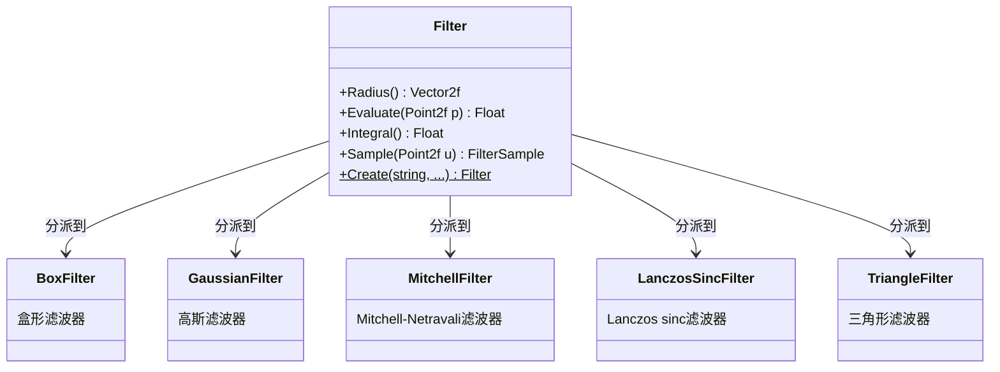

# filter.h

## 概述

`filter.h` 定义了 PBRT-v4 渲染器中的 **Filter（重建滤波器）** 基类接口。重建滤波器在渲染管线中用于将离散的采样点重建为连续的图像信号。当多个样本被累积到一个像素时，滤波器决定了每个样本根据其与像素中心的距离所获得的权重，直接影响最终图像的锐度和抗锯齿质量。

该文件是基类/接口定义，使用 `TaggedPointer` 多态机制实现高效的 CPU/GPU 动态分派。

## 主要类与接口

| 类/结构体/函数 | 说明 |
|---|---|
| `Filter` | 滤波器基类接口，继承自 `TaggedPointer`，定义了所有滤波器类型的通用接口 |
| `FilterSample` | 前向声明，表示滤波器采样结果的结构体 |
| `Filter::Radius()` | 返回滤波器的半径（x 和 y 方向），超出该范围的样本权重为零 |
| `Filter::Evaluate()` | 计算给定点处的滤波器值 |
| `Filter::Integral()` | 返回滤波器在其支撑范围上的积分值 |
| `Filter::Sample()` | 根据均匀随机数采样滤波器分布，返回 `FilterSample` |
| `Filter::Create()` | 静态工厂方法，根据名称和参数创建具体滤波器实例 |

### 具体实现类（前向声明）

| 实现类 | 说明 |
|---|---|
| `BoxFilter` | 盒形滤波器，在支撑范围内权重均匀 |
| `GaussianFilter` | 高斯滤波器，使用高斯函数加权 |
| `MitchellFilter` | Mitchell-Netravali 滤波器，在锐度和平滑之间取平衡 |
| `LanczosSincFilter` | Lanczos sinc 滤波器，基于窗口化 sinc 函数 |
| `TriangleFilter` | 三角形滤波器，线性衰减权重 |

## 架构图

## 依赖关系

- **依赖**：
  - `pbrt/pbrt.h` — 全局类型定义与宏
  - `pbrt/util/taggedptr.h` — `TaggedPointer` 多态分派基础设施

- **被依赖**：
  - `src/pbrt/base/camera.h` — 相机接口
  - `src/pbrt/base/film.h` — 胶片接口
  - `src/pbrt/filters.h` — 具体滤波器实现
  - `src/pbrt/wavefront/integrator.h` — 波前积分器
