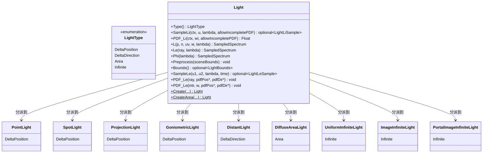

# light.h

## 概述

`light.h` 定义了 pbrt-v4 渲染器中 **Light（光源）** 的基类接口。光源是渲染管线中能量的唯一来源，负责向场景发射辐射能量。积分器通过该接口完成直接光照采样（Next Event Estimation）、多重重要性采样（MIS）权重计算、双向路径追踪中的光线发射等核心操作。

该文件是纯接口定义，使用 `TaggedPointer` 多态机制实现 CPU/GPU 统一的动态分派，不包含任何具体光源的实现逻辑。

## LightType 枚举

```cpp
enum class LightType { DeltaPosition, DeltaDirection, Area, Infinite };
```

pbrt-v4 将所有光源分为四种类型，这一分类直接影响积分器中的分支逻辑：

| 类型 | 含义 | 对应的具体光源 | 关键特性 |
|---|---|---|---|
| `DeltaPosition` | delta 位置光源，从单一空间点发射 | `PointLight`, `SpotLight`, `ProjectionLight`, `GoniometricLight` | PDF 为 delta 函数，无法被 BSDF 采样命中，MIS 时跳过 BSDF 采样分支 |
| `DeltaDirection` | delta 方向光源，沿单一方向发射平行光 | `DistantLight` | PDF 为 delta 函数，同上；BDPT 中不可连接（`IsConnectible` 返回 false） |
| `Area` | 面光源，从有限几何表面发射 | `DiffuseAreaLight` | 有空间面积，可被 BSDF 采样命中，支持完整 MIS |
| `Infinite` | 无限光源，从无穷远处包围整个场景 | `UniformInfiniteLight`, `ImageInfiniteLight`, `PortalImageInfiniteLight` | 无空间边界，需要特殊处理（`Bounds()` 返回空），光线逃逸场景时通过 `Le()` 查询贡献 |

积分器中典型的分支模式：

```cpp
// 判断是否为 delta 光源 —— delta 光源的 BSDF 采样 PDF 恒为 0，MIS 时直接使用光源采样
if (IsDeltaLight(light.Type())) { /* 仅用光源采样策略 */ }

// 判断是否为无限光源 —— 需要在初始化阶段单独收集、在光线逃逸时特殊查询
if (light.Type() == LightType::Infinite) { /* 加入 infiniteLights 列表 */ }
```

## Light 类接口

`Light` 继承自 `TaggedPointer<PointLight, DistantLight, ...>`，通过编译期类型列表实现零开销的多态分派。以下按**使用场景**分组说明各接口。

---

### 直接光照采样（Next Event Estimation）

这组接口是路径追踪中最常用的光源接口，用于从着色点向光源采样以估算直接光照贡献。

#### `SampleLi(LightSampleContext ctx, Point2f u, SampledWavelengths lambda, bool allowIncompletePDF = false) -> pstd::optional<LightLiSample>`

**功能**：给定着色点 `ctx`，使用随机数 `u` 在光源上采样一个点，返回该点向着色点发送的入射辐射度。

**返回值** `LightLiSample` 包含：
- `L` — 采样到的入射辐射度（`SampledSpectrum`）
- `wi` — 从着色点指向光源采样点的方向
- `pdf` — 该采样方向的概率密度
- `pLight` — 光源上采样点的 `Interaction`（用于可见性测试）

**使用场景**：几乎所有积分器的直接光照计算。`SimplePathIntegrator`、`VolPathIntegrator`、wavefront 积分器的表面散射/体散射/次表面散射阶段都调用此方法。典型流程：
1. 光源采样器选取一个光源
2. 调用 `SampleLi()` 获得采样
3. 发射阴影光线检测可见性
4. 计算 BSDF 值与 MIS 权重
5. 累加贡献

**参数说明**：`allowIncompletePDF` 为 true 时允许返回不完整的 PDF（用于 `PortalImageInfiniteLight` 等特殊光源在某些采样策略下的优化）。

---

#### `PDF_Li(LightSampleContext ctx, Vector3f wi, bool allowIncompletePDF = false) -> Float`

**功能**：计算 `SampleLi` 对给定方向 `wi` 的概率密度。

**使用场景**：MIS 权重计算。当 BSDF 采样碰巧命中了一个光源时，需要知道"如果用光源采样策略采样到同一方向，概率是多少"来计算 MIS 权重。具体出现在：
- BDPT 路径连接时的 PDF 计算
- wavefront 积分器中光线逃逸时计算无限光源的 MIS 权重
- wavefront 积分器中命中面光源时计算 MIS 权重

对于 delta 光源，此方法不会被调用（delta 光源的 BSDF 采样命中概率为 0，不需要 MIS）。

---

### 光源自发射查询

这组接口用于查询光源在特定条件下的自发射辐射度，不涉及采样。

#### `L(Point3f p, Normal3f n, Point2f uv, Vector3f w, const SampledWavelengths &lambda) -> SampledSpectrum`

**功能**：返回面光源表面上点 `p` 沿方向 `w` 的发射辐射度。

**使用限制**：仅对 `LightType::Area` 有效，内部会 assert 类型检查。

**使用场景**：当光线命中一个几何体并发现它是面光源时，调用此方法获取该命中点的发射值。具体出现在：
- `SurfaceInteraction::Le()` 辅助方法中（`interaction.cpp`）—— 这是最常见的调用入口
- BDPT 中连接相机子路径到面光源顶点时
- wavefront 积分器处理面光源命中时

**实现细节**（`DiffuseAreaLight`）：会考虑双面标志（是否从背面发射）、alpha 遮罩透明度、图像纹理等因素。

---

#### `Le(const Ray &ray, const SampledWavelengths &lambda) -> SampledSpectrum`

**功能**：返回无限光源沿给定光线方向的辐射度。

**使用限制**：仅对 `LightType::Infinite` 有效。

**使用场景**：当光线未命中任何几何体（逃逸场景）时，遍历所有无限光源调用 `Le()` 获取背景辐射。具体出现在：
- `RandomWalkIntegrator` 光线逃逸时
- `SimplePathIntegrator` / `VolPathIntegrator` 光线逃逸时
- wavefront 积分器的逃逸光线处理阶段
- BDPT 路径中遇到无限光源顶点时

**不同实现的差异**：
- `UniformInfiniteLight`：所有方向返回常数辐射度
- `ImageInfiniteLight`：将光线方向映射到环境贴图坐标查表
- `PortalImageInfiniteLight`：通过入口窗口变换后查表

---

### 光源总功率

#### `Phi(SampledWavelengths lambda) -> SampledSpectrum`

**功能**：返回光源的总发射功率（luminous flux）。

**使用场景**：光源采样器的初始化阶段。`PowerLightSampler` 根据各光源的 `Phi()` 值构建概率分布，使得高功率光源被更频繁地采样。这是一个**离线预计算**接口，不在每条光线的采样路径中调用。

---

### 场景预处理

#### `Preprocess(const Bounds3f &sceneBounds) -> void`

**功能**：在渲染开始前，根据场景的空间边界进行预处理。

**使用场景**：积分器构造阶段，遍历所有光源调用一次。

**具体作用**：
- `DistantLight`：根据场景边界计算场景中心和半径，用于确定平行光的"远平面"位置
- `UniformInfiniteLight` / `ImageInfiniteLight` / `PortalImageInfiniteLight`：同上，需要场景边界来确定采样光线的起始位置
- `PointLight` / `SpotLight` / `DiffuseAreaLight` 等：空实现，不需要场景信息

---

### 光源空间边界

#### `Bounds() -> pstd::optional<LightBounds>`

**功能**：返回光源的空间边界和发射特征信息。

**返回值** `LightBounds` 包含：
- `bounds` — 空间包围盒（AABB）
- `phi` — 总功率
- `w` — 主发射方向
- `cosTheta_o` — 发射锥开口角的余弦
- `cosTheta_e` — 发射锥衰减角的余弦
- `twoSided` — 是否双面发射

`LightBounds` 还提供 `Importance(Point3f p, Normal3f n)` 方法，用于评估光源在某点处的重要性。

**使用场景**：`BVHLightSampler` 构建光源 BVH 加速结构时收集所有光源的 `Bounds()`。该 BVH 支持基于空间位置的光源重要性采样——对于有大量光源的场景（如城市夜景），这比均匀采样高效得多。

**特殊情况**：无限光源返回空 `optional`（它们没有有限的空间边界，在光源采样器中需要单独处理）。

**关联类型**：`CompactLightBounds` 是 `LightBounds` 的量化压缩版本，定义在 `lightsamplers.h` 中，用于 BVH 节点中节省内存。

---

### 双向路径追踪接口

以下接口用于从**光源侧**发射光线，是 BDPT（双向路径追踪）和 MLT（Metropolis 光传输）等双向方法的基础。单向路径追踪不使用这些接口。

#### `SampleLe(Point2f u1, Point2f u2, SampledWavelengths &lambda, Float time) -> pstd::optional<LightLeSample>`

**功能**：在光源上采样一个发射点和发射方向，生成一条从光源出发的光线。

**参数**：
- `u1` — 用于采样发射位置的随机数
- `u2` — 用于采样发射方向的随机数
- `lambda` — 波长采样（可能被修改以支持光谱重要性采样）
- `time` — 时间（运动模糊）

**返回值** `LightLeSample` 包含：
- `L` — 发射辐射度
- `ray` — 从光源发出的光线
- `intr` — 面光源的发射点交互信息（`optional`，非面光源为空）
- `pdfPos` — 位置采样的概率密度
- `pdfDir` — 方向采样的概率密度

**使用场景**：
- `LightPathIntegrator` 采样光源子路径的起点
- BDPT 生成光源子路径
- 测试代码验证光源采样的正确性

**delta 光源的特殊行为**：`DeltaPosition` 光源的 `pdfPos` 为 1（只有一个发射点），`DeltaDirection` 光源的 `pdfDir` 为 1（只有一个发射方向）。

---

#### `PDF_Le(const Ray &ray, Float *pdfPos, Float *pdfDir) -> void`（非面光源版本）

**功能**：计算非面光源发射光线 `ray` 对应的位置和方向概率密度。

**使用场景**：BDPT 路径权重计算，用于无限光源和 delta 光源。

---

#### `PDF_Le(const Interaction &intr, Vector3f w, Float *pdfPos, Float *pdfDir) -> void`（面光源版本）

**功能**：计算面光源在交互点 `intr` 沿方向 `w` 发射的位置和方向概率密度。

**使用场景**：BDPT 路径权重计算，用于面光源（`DiffuseAreaLight`）。

**两个重载的区别**：面光源有具体的几何交互点（`Interaction`），而非面光源（无限光源、delta 光源）只能用光线（`Ray`）来描述发射。

---

### 工厂方法

#### `Create(const std::string &name, ...) -> Light` [static]

**功能**：根据光源类型名称和参数字典创建光源实例。

**可创建的类型**：`PointLight`, `DistantLight`, `ProjectionLight`, `GoniometricLight`, `SpotLight`, `UniformInfiniteLight`, `ImageInfiniteLight`, `PortalImageInfiniteLight`。

**使用场景**：场景解析阶段，解析器读取场景描述文件中的 `LightSource` 指令后调用此方法。

---

#### `CreateArea(const std::string &name, ...) -> Light` [static]

**功能**：创建与几何形状关联的面光源。

**参数**（相比 `Create` 额外需要）：
- `Shape shape` — 关联的几何形状
- `FloatTexture alpha` — alpha 遮罩纹理
- `MediumInterface` — 介质接口

**可创建的类型**：仅 `DiffuseAreaLight`。

**使用场景**：场景解析阶段，解析器读取 `AreaLightSource` 指令后，为每个关联的 Shape 调用此方法创建面光源。面光源的特殊之处在于它绑定到具体的几何体，需要 Shape 参数来定义发射表面。

---

### 辅助方法

#### `ToString() -> std::string`

**功能**：返回光源的字符串描述，用于调试输出。

---

## 前向声明的辅助类型

本文件前向声明了以下类型，它们的完整定义在 `lights.h` 和 `lightsamplers.h` 中：

| 类型 | 定义位置 | 用途 |
|---|---|---|
| `LightSampleContext` | `lights.h` | 封装着色点信息（位置 `pi`、法线 `n`、着色法线 `ns`），传递给 `SampleLi()` 和 `PDF_Li()` |
| `LightLiSample` | `lights.h` | `SampleLi()` 的返回值，包含辐射度 `L`、方向 `wi`、概率 `pdf`、光源交互点 `pLight` |
| `LightLeSample` | `lights.h` | `SampleLe()` 的返回值，包含辐射度 `L`、光线 `ray`、面光源交互点 `intr`、位置/方向 PDF |
| `LightBounds` | `lights.h` | 光源的空间边界和发射特征，用于 BVH 光源采样器 |
| `CompactLightBounds` | `lightsamplers.h` | `LightBounds` 的量化压缩版，用于 BVH 节点存储 |

## 具体实现类

| 实现类 | LightType | 说明 |
|---|---|---|
| `PointLight` | `DeltaPosition` | 点光源，从单一空间点向所有方向均匀发射 |
| `SpotLight` | `DeltaPosition` | 聚光灯，从单一点在锥形范围内发射，有内外锥角衰减 |
| `ProjectionLight` | `DeltaPosition` | 投影光源，从单一点发射，强度由投影图像纹理调制 |
| `GoniometricLight` | `DeltaPosition` | 光度计光源，从单一点发射，强度由配光曲线（IES 数据）调制 |
| `DistantLight` | `DeltaDirection` | 平行光，从无穷远处沿单一方向照射，模拟太阳光等 |
| `DiffuseAreaLight` | `Area` | 漫射面光源，从有限几何表面均匀发射，支持双面、alpha 遮罩和图像纹理 |
| `UniformInfiniteLight` | `Infinite` | 均匀无限光源，从所有方向以相同辐射度照射场景 |
| `ImageInfiniteLight` | `Infinite` | 环境贴图光源，辐射度由 HDR 环境贴图决定 |
| `PortalImageInfiniteLight` | `Infinite` | 带入口（portal）的环境贴图光源，通过矩形入口窗口集中采样，适用于室内场景 |

## 架构图



## 接口使用模式总结

### 单向路径追踪（直接光照 / NEE）

```
光源采样器选取光源
    ↓
light.SampleLi(ctx, u, lambda)  →  获得 LightLiSample{L, wi, pdf, pLight}
    ↓
发射阴影光线: ctx.p → pLight.p  →  检测可见性
    ↓
计算 BSDF(wi) 和 MIS 权重（若非 delta 光源）
    ↓
累加贡献: beta * f * L / pdf * misWeight
```

### 单向路径追踪（BSDF 采样命中光源）

```
BSDF 采样得到方向 wi，光线命中面光源或逃逸场景
    ↓
面光源: light.L(p, n, uv, w, lambda)  →  获得发射辐射度
无限光源: light.Le(ray, lambda)        →  获得背景辐射度
    ↓
light.PDF_Li(ctx, wi)  →  获得光源采样的 PDF（用于 MIS）
    ↓
计算 MIS 权重，累加贡献
```

### 双向路径追踪（光源子路径）

```
light.SampleLe(u1, u2, lambda, time)  →  获得 LightLeSample{L, ray, pdfPos, pdfDir}
    ↓
沿 ray 追踪光源子路径
    ↓
连接光源子路径与相机子路径
    ↓
light.PDF_Le(...)  →  计算路径权重中的光源 PDF 分量
```

### 光源采样器初始化

```
遍历所有光源:
    light.Phi(lambda)   →  收集功率，构建按功率加权的采样分布
    light.Bounds()       →  收集空间边界，构建 BVH 加速结构
```

## 依赖关系

- **依赖**：
  - `pbrt/pbrt.h` — 全局类型定义与宏（`Float`, `Point2f`, `Point3f`, `Vector3f`, `Normal3f`, `SampledSpectrum`, `SampledWavelengths` 等）
  - `pbrt/base/medium.h` — `Medium` 介质接口（`CreateArea` 的 `MediumInterface` 参数）
  - `pbrt/base/shape.h` — `Shape` 形状接口（`CreateArea` 的几何关联参数）
  - `pbrt/base/texture.h` — `FloatTexture` 纹理接口（`CreateArea` 的 alpha 遮罩参数）
  - `pbrt/util/pstd.h` — `pstd::optional` 等工具类型
  - `pbrt/util/taggedptr.h` — `TaggedPointer` 多态分派基础设施

- **被依赖**：
  - `src/pbrt/lights.h` — 9 种具体光源实现及辅助类型定义
  - `src/pbrt/lightsamplers.h` — 光源采样器（`PowerLightSampler`, `BVHLightSampler` 等）
  - `src/pbrt/interaction.h` — `SurfaceInteraction::Le()` 通过此接口查询面光源发射
  - `src/pbrt/cpu/integrators.cpp` — CPU 端所有积分器的光源交互逻辑
  - `src/pbrt/wavefront/integrator.cpp` — GPU wavefront 积分器的光源处理
  - `src/pbrt/scene.cpp` — 场景解析中调用 `Create` / `CreateArea` 工厂方法
