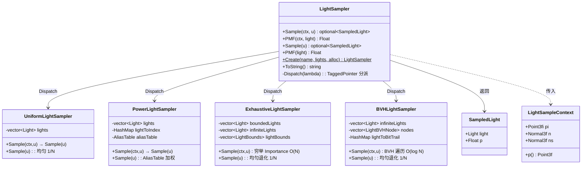

# lightsampler.h

## 概述

`lightsampler.h`（`src/pbrt/base/lightsampler.h`）定义了 PBRT-v4 中 **LightSampler（光源采样器）** 的接口。当场景包含大量光源时，逐一采样每个光源不现实，光源采样器的职责是高效地从多个光源中选出对当前着色点贡献最大的光源。

`LightSampler` 通过 `TaggedPointer` 实现编译期多态分派——内部存储一个指向具体子类对象的指针和一个类型标签，调用接口方法时根据标签转发到对应子类，无虚函数开销。具体的子类实现定义在 `src/pbrt/lightsamplers.h` 和 `src/pbrt/lightsamplers.cpp` 中。

---

## 父类接口定义

### SampledLight 结构体

```cpp
// src/pbrt/base/lightsampler.h:17-21
struct SampledLight {
    Light light;   // 被选中的光源
    Float p = 0;   // 该光源被选中的概率（PMF 值）
};
```

`p` 是 MIS（多重重要性采样）权重计算的关键：蒙特卡罗估计量为 `L(light) / p`，MIS 需要各策略的 PMF 来平衡权重。

### LightSampleContext

```cpp
// src/pbrt/lights.h:83-101
class LightSampleContext {
    Point3fi pi;   // 着色点位置（带区间误差）
    Normal3f n;    // 几何法线
    Normal3f ns;   // 着色法线
    Point3f p() const;  // 返回 pi 的中心点
};
```

`LightSampleContext` 封装着色点的空间信息。它可以从 `SurfaceInteraction`（表面交互）或 `Interaction`（通用交互）构造。空间感知的采样器（BVH、Exhaustive）利用 `p()` 和 `n`/`ns` 来评估每个光源对该着色点的重要性。

### LightSampler 接口声明

```cpp
// src/pbrt/base/lightsampler.h:29-47
class LightSampler : public TaggedPointer<UniformLightSampler, PowerLightSampler,
                                          ExhaustiveLightSampler, BVHLightSampler> {
  public:
    using TaggedPointer::TaggedPointer;

    // 工厂方法：根据名称创建具体子类
    static LightSampler Create(const std::string &name,
                                pstd::span<const Light> lights, Allocator alloc);

    std::string ToString() const;

    // 上下文感知：根据着色点选择光源
    pstd::optional<SampledLight> Sample(const LightSampleContext &ctx, Float u) const;
    Float PMF(const LightSampleContext &ctx, Light light) const;

    // 无上下文：不依赖着色点信息
    pstd::optional<SampledLight> Sample(Float u) const;
    Float PMF(Light light) const;
};
```

每个子类必须实现以上 4 个采样/PMF 方法和 `ToString()`。`Sample` 与 `PMF` 必须保持一致性——`Sample` 以概率 `p` 返回某光源，则 `PMF` 对同一光源在相同条件下必须返回同样的 `p`。

### Dispatch 分派机制

四个接口方法的实现定义在 `src/pbrt/lightsamplers.h:441-460`，每个都通过 `Dispatch` 将调用转发到具体子类：

```cpp
// 以 Sample(ctx, u) 为例
pstd::optional<SampledLight> LightSampler::Sample(
        const LightSampleContext &ctx, Float u) const {
    auto s = [&](auto ptr) { return ptr->Sample(ctx, u); };
    return Dispatch(s);
}
```

`Dispatch` 内部根据 `TaggedPointer` 存储的类型标签，将 `auto ptr` 解析为 `UniformLightSampler*`、`PowerLightSampler*`、`ExhaustiveLightSampler*` 或 `BVHLightSampler*` 之一，然后调用对应子类的同名方法。这是编译期多态：所有可能的调用目标在编译时就已确定，不需要虚函数表。

`ToString()` 和 `Create()` 实现在 `src/pbrt/lightsamplers.cpp:47-70`，其中 `ToString()` 使用 `DispatchCPU`（仅 CPU 端可用的分派），`Create()` 是普通的 `if-else` 工厂方法。

---

## 子类实现详解

### 一、UniformLightSampler — 均匀采样

**源码位置**：`src/pbrt/lightsamplers.h:26-60`

**核心思想**：以等概率 `1/N` 随机选择任意一个光源，完全不考虑光源的功率、位置或着色点信息。

#### 数据结构

```cpp
private:
    pstd::vector<Light> lights;  // 光源列表的拷贝
```

构造函数直接拷贝传入的光源列表，无预计算。

#### 接口实现

**`Sample(Float u)`** — 核心采样逻辑：

```cpp
pstd::optional<SampledLight> Sample(Float u) const {
    if (lights.empty())
        return {};
    int lightIndex = std::min<int>(u * lights.size(), lights.size() - 1);
    return SampledLight{lights[lightIndex], 1.f / lights.size()};
}
```

将 `[0,1)` 区间等分为 N 段，`u` 落入第几段就选第几个光源。`std::min` 防止 `u` 恰好等于 1.0 时越界。

**`PMF(Light light)`** — 核心 PMF 逻辑：

```cpp
Float PMF(Light light) const {
    if (lights.empty())
        return 0;
    return 1.f / lights.size();
}
```

无论哪个光源，概率都是 `1/N`。注意这里甚至不检查 `light` 是否存在于列表中。

**`Sample(ctx, u)` 和 `PMF(ctx, light)`** — 直接委托：

```cpp
pstd::optional<SampledLight> Sample(const LightSampleContext &ctx, Float u) const {
    return Sample(u);    // 忽略 ctx
}
Float PMF(const LightSampleContext &ctx, Light light) const {
    return PMF(light);   // 忽略 ctx
}
```

均匀采样器的上下文感知版本和无上下文版本行为完全相同——着色点信息被忽略。这意味着无论着色点在场景的哪个位置，每个光源被选中的概率都一样。

#### 小结

| 方法 | 行为 | 复杂度 |
|---|---|---|
| `Sample(ctx, u)` | 委托 → `Sample(u)` | O(1) |
| `PMF(ctx, light)` | 委托 → `PMF(light)` | O(1) |
| `Sample(u)` | 均匀选择，PMF = `1/N` | O(1) |
| `PMF(light)` | 返回 `1/N` | O(1) |

---

### 二、PowerLightSampler — 功率加权采样

**源码位置**：`src/pbrt/lightsamplers.h:63-99`，`src/pbrt/lightsamplers.cpp:76-96`

**核心思想**：按光源的发射功率（总辐射通量 Phi）加权采样——功率大的光源被选中概率更高。使用 `AliasTable` 实现 O(1) 加权采样。同样不考虑着色点信息。

#### 数据结构

```cpp
private:
    pstd::vector<Light> lights;            // 光源列表
    HashMap<Light, size_t> lightToIndex;   // 光源 → 索引的哈希表
    AliasTable aliasTable;                 // Alias 表：O(1) 加权采样
```

#### 构造过程

```cpp
// src/pbrt/lightsamplers.cpp:76-96
PowerLightSampler::PowerLightSampler(pstd::span<const Light> lights, Allocator alloc)
    : lights(lights.begin(), lights.end(), alloc),
      lightToIndex(alloc), aliasTable(alloc) {
    if (lights.empty()) return;

    // 1. 建立 light → index 映射
    for (size_t i = 0; i < lights.size(); ++i)
        lightToIndex.Insert(lights[i], i);

    // 2. 计算每个光源的发射功率
    pstd::vector<Float> lightPower;
    SampledWavelengths lambda = SampledWavelengths::SampleVisible(0.5f);
    for (const auto &light : lights) {
        SampledSpectrum phi = SafeDiv(light.Phi(lambda), lambda.PDF());
        lightPower.push_back(phi.Average());
    }

    // 3. 若所有功率为 0，退化为均匀
    if (std::accumulate(lightPower.begin(), lightPower.end(), 0.f) == 0.f)
        std::fill(lightPower.begin(), lightPower.end(), 1.f);

    // 4. 构建 Alias 表
    aliasTable = AliasTable(lightPower, alloc);
}
```

关键步骤：
1. 在可见光波长处采样每个光源的光谱辐射通量 `Phi(lambda)`，除以波长的 PDF 得到无偏估计，取平均作为标量功率
2. 若所有光源功率都为 0（如纯方向性光源的某些边界情况），则将所有权重设为 1.0，退化为均匀采样
3. 用这些功率值构建 `AliasTable`——该数据结构经 O(N) 预处理后，支持 O(1) 时间的加权随机采样

#### 接口实现

**`Sample(Float u)`** — 核心采样逻辑：

```cpp
pstd::optional<SampledLight> Sample(Float u) const {
    if (!aliasTable.size())
        return {};
    Float pmf;
    int lightIndex = aliasTable.Sample(u, &pmf);
    return SampledLight{lights[lightIndex], pmf};
}
```

`AliasTable::Sample(u, &pmf)` 接收一个均匀随机数 `u`，返回被选中的索引和对应的 PMF 值。功率越高的光源，对应的 PMF 越大，被选中的概率越高。

**`PMF(Light light)`** — 核心 PMF 逻辑：

```cpp
Float PMF(Light light) const {
    if (!aliasTable.size())
        return 0;
    return aliasTable.PMF(lightToIndex[light]);
}
```

先通过 `lightToIndex` 哈希表查到光源的索引，再从 `AliasTable` 查该索引的 PMF。

**`Sample(ctx, u)` 和 `PMF(ctx, light)`** — 直接委托：

```cpp
pstd::optional<SampledLight> Sample(const LightSampleContext &ctx, Float u) const {
    return Sample(u);    // 忽略 ctx
}
Float PMF(const LightSampleContext &ctx, Light light) const {
    return PMF(light);   // 忽略 ctx
}
```

与 UniformLightSampler 一样，PowerLightSampler 不使用着色点信息。上下文感知版本完全等价于无上下文版本。

#### 小结

| 方法 | 行为 | 复杂度 |
|---|---|---|
| `Sample(ctx, u)` | 委托 → `Sample(u)` | O(1) |
| `PMF(ctx, light)` | 委托 → `PMF(light)` | O(1) |
| `Sample(u)` | AliasTable 加权采样 | O(1) |
| `PMF(light)` | 查 AliasTable PMF | O(1) |

---

### 三、ExhaustiveLightSampler — 穷举空间感知采样

**源码位置**：`src/pbrt/lightsamplers.h:407-439`，`src/pbrt/lightsamplers.cpp:251-312`

**核心思想**：对每个有界光源逐一计算它相对于当前着色点的 **Importance（重要性）**，然后按重要性权重采样。这是最直接的空间感知策略，精度最高但复杂度为 O(N)。

#### 数据结构

```cpp
private:
    pstd::vector<Light> lights;          // 全部光源（用于 Sample(u) 均匀采样）
    pstd::vector<Light> boundedLights;   // 有界光源（有 LightBounds）
    pstd::vector<Light> infiniteLights;  // 无限光源（如环境贴图，无空间边界）
    pstd::vector<LightBounds> lightBounds;           // 与 boundedLights 一一对应的空间信息
    HashMap<Light, size_t> lightToBoundedIndex;      // 有界光源 → boundedLights 中的索引
```

#### 构造过程

```cpp
// src/pbrt/lightsamplers.cpp:251-266
ExhaustiveLightSampler::ExhaustiveLightSampler(pstd::span<const Light> lights,
                                               Allocator alloc)
    : lights(...), boundedLights(alloc), infiniteLights(alloc),
      lightBounds(alloc), lightToBoundedIndex(alloc) {
    for (const auto &light : lights) {
        if (pstd::optional<LightBounds> lb = light.Bounds(); lb) {
            lightToBoundedIndex.Insert(light, boundedLights.size());
            lightBounds.push_back(*lb);
            boundedLights.push_back(light);
        } else
            infiniteLights.push_back(light);
    }
}
```

将光源分为两类：
- **有界光源**：`light.Bounds()` 返回有效的 `LightBounds`（含空间包围盒、发射方向锥、辐射通量等），存入 `boundedLights` 和 `lightBounds`
- **无限光源**：`light.Bounds()` 返回空（如 `InfiniteAreaLight`），存入 `infiniteLights`

这个分类是 ExhaustiveLightSampler 和 BVHLightSampler 共享的关键设计：无限光源没有空间范围，无法计算对某个点的 Importance，只能均匀采样。

#### 接口实现

**`Sample(ctx, u)`** — 上下文感知采样（核心方法）：

```cpp
// src/pbrt/lightsamplers.cpp:268-294
pstd::optional<SampledLight> ExhaustiveLightSampler::Sample(
        const LightSampleContext &ctx, Float u) const {
    // 第一步：计算无限光源的采样概率
    Float pInfinite = Float(infiniteLights.size()) /
                      Float(infiniteLights.size() + (!lightBounds.empty() ? 1 : 0));

    if (u < pInfinite) {
        // 第二步A：采样无限光源（均匀）
        u /= pInfinite;   // 重新缩放 u 到 [0,1)
        int index = std::min<int>(u * infiniteLights.size(),
                                  infiniteLights.size() - 1);
        Float pdf = pInfinite * 1.f / infiniteLights.size();
        return SampledLight{infiniteLights[index], pdf};
    } else {
        // 第二步B：采样有界光源（按 Importance 加权）
        u = std::min<Float>((u - pInfinite) / (1 - pInfinite), OneMinusEpsilon);

        uint64_t seed = MixBits(FloatToBits(u));
        WeightedReservoirSampler<Light> wrs(seed);

        for (size_t i = 0; i < boundedLights.size(); ++i)
            wrs.Add(boundedLights[i],
                    lightBounds[i].Importance(ctx.p(), ctx.n));

        if (!wrs.HasSample())
            return {};

        Float pdf = (1.f - pInfinite) * wrs.SampleProbability();
        return SampledLight{wrs.GetSample(), pdf};
    }
}
```

流程分解：

**第一步——两级概率划分**：将随机数 `u` 的 `[0,1)` 区间分成两段：`[0, pInfinite)` 分配给无限光源，`[pInfinite, 1)` 分配给有界光源。公式 `pInfinite = nInfinite / (nInfinite + (hasBounded ? 1 : 0))` 将所有有界光源视为一个整体，与每个无限光源等权对待。

**第二步A——无限光源分支**：若 `u < pInfinite`，将 `u` 重新缩放到 `[0,1)` 后在无限光源中均匀选择。最终 PMF = `pInfinite / nInfinite`。

**第二步B——有界光源分支**：若 `u >= pInfinite`，遍历所有有界光源，对每个光源计算 `Importance(ctx.p(), ctx.n)`——这是 `LightBounds` 定义的函数，综合考虑：
- 光源到着色点的距离
- 光源的辐射通量（phi）
- 光源发射方向锥与着色方向的匹配程度
- 着色点法线与光源方向的夹角

然后用 `WeightedReservoirSampler` 做加权采样。这是一种流式算法：只需一次遍历，不需要预先归一化权重，最终返回按权重比例选中的元素。最终 PMF = `(1 - pInfinite) * sampleProbability`。

**`PMF(ctx, light)`** — 上下文感知 PMF：

```cpp
// src/pbrt/lightsamplers.cpp:296-312
Float ExhaustiveLightSampler::PMF(const LightSampleContext &ctx, Light light) const {
    // 若是无限光源
    if (!lightToBoundedIndex.HasKey(light))
        return 1.f / (infiniteLights.size() + (!lightBounds.empty() ? 1 : 0));

    // 若是有界光源：遍历所有有界光源累加 Importance
    Float importanceSum = 0;
    Float lightImportance = 0;
    for (size_t i = 0; i < boundedLights.size(); ++i) {
        Float importance = lightBounds[i].Importance(ctx.p(), ctx.n);
        importanceSum += importance;
        if (light == boundedLights[i])
            lightImportance = importance;
    }
    Float pInfinite = Float(infiniteLights.size()) /
                      Float(infiniteLights.size() + (!lightBounds.empty() ? 1 : 0));
    return lightImportance / importanceSum * (1. - pInfinite);
}
```

对于无限光源，PMF = `1 / (nInfinite + (hasBounded ? 1 : 0))`，即它在第一级划分中被均匀选中的概率。

对于有界光源，需要遍历所有有界光源计算 Importance 总和，然后返回 `该光源 Importance / 总 Importance * (1 - pInfinite)`。这与 `Sample(ctx, u)` 中 `WeightedReservoirSampler` 的采样概率一致。

**`Sample(u)` 和 `PMF(light)`** — 无上下文版本：

```cpp
pstd::optional<SampledLight> Sample(Float u) const {
    if (lights.empty()) return {};
    int lightIndex = std::min<int>(u * lights.size(), lights.size() - 1);
    return SampledLight{lights[lightIndex], 1.f / lights.size()};
}

Float PMF(Light light) const {
    if (lights.empty()) return 0;
    return 1.f / lights.size();
}
```

没有着色点信息就无法计算 Importance，退化为均匀采样 `1/N`。注意这里使用的是 `lights`（全部光源列表），不区分无限/有界。

#### 小结

| 方法 | 行为 | 复杂度 |
|---|---|---|
| `Sample(ctx, u)` | 两级采样：无限光源均匀 + 有界光源按 Importance 穷举 | O(N) |
| `PMF(ctx, light)` | 穷举累加所有有界光源 Importance | O(N) |
| `Sample(u)` | 均匀采样 `1/N` | O(1) |
| `PMF(light)` | 返回 `1/N` | O(1) |

---

### 四、BVHLightSampler — BVH 加速空间感知采样

**源码位置**：`src/pbrt/lightsamplers.h:260-404`，`src/pbrt/lightsamplers.cpp:109-238`

**核心思想**：对有界光源构建层次包围体树（BVH），每个节点存储其子树所有光源的聚合 `LightBounds`。采样时从根向下遍历，每层只需比较两个子节点的 Importance 就能选择方向，复杂度 O(log N)。这是 ExhaustiveLightSampler 的加速版本，也是 **pbrt-v4 的默认光源采样器**。

#### 数据结构

```cpp
private:
    pstd::vector<Light> lights;                    // 全部光源
    pstd::vector<Light> infiniteLights;            // 无限光源
    Bounds3f allLightBounds;                       // 所有有界光源的总包围盒
    pstd::vector<LightBVHNode> nodes;              // BVH 节点数组（扁平化存储）
    HashMap<Light, uint32_t> lightToBitTrail;      // 有界光源 → 从根到叶的路径编码
```

**`LightBVHNode`**（`src/pbrt/lightsamplers.h:231-257`）：

```cpp
struct alignas(32) LightBVHNode {
    CompactLightBounds lightBounds;    // 量化压缩的空间/方向信息
    unsigned int childOrLightIndex : 31;  // 内部节点：右子节点索引；叶节点：光源索引
    unsigned int isLeaf : 1;              // 是否叶节点
};
```

内部节点的左子节点总是 `nodeIndex + 1`（紧邻存储），右子节点索引存储在 `childOrLightIndex` 中。

**`CompactLightBounds`**（`src/pbrt/lightsamplers.h:102-228`）是 `LightBounds` 的量化压缩版本，将包围盒坐标量化为 `uint16_t`，将角度参数量化为 15 位整数，但保留了关键的 `Importance(Point3f p, Normal3f n, const Bounds3f &allb)` 函数用于计算着色点相关的重要性。

**`lightToBitTrail`**：构建 BVH 时为每个叶节点记录的路径编码。每一位表示在对应深度应走左子节点（0）还是右子节点（1），用于 PMF 计算时快速找到从根到指定光源的路径。

#### 构造过程

```cpp
// src/pbrt/lightsamplers.cpp:109-133
BVHLightSampler::BVHLightSampler(pstd::span<const Light> lights, Allocator alloc)
    : lights(...), infiniteLights(alloc), nodes(alloc), lightToBitTrail(alloc) {
    // 1. 分离无限光源与有界光源
    std::vector<std::pair<int, LightBounds>> bvhLights;
    for (size_t i = 0; i < lights.size(); ++i) {
        Light light = lights[i];
        pstd::optional<LightBounds> lightBounds = light.Bounds();
        if (!lightBounds)
            infiniteLights.push_back(light);
        else if (lightBounds->phi > 0) {
            bvhLights.push_back(std::make_pair(i, *lightBounds));
            allLightBounds = Union(allLightBounds, lightBounds->bounds);
        }
    }
    // 2. 对有界光源构建 BVH
    if (!bvhLights.empty())
        buildBVH(bvhLights, 0, bvhLights.size(), 0, 0);
}
```

与 ExhaustiveLightSampler 类似，先将光源分为无限和有界两类。额外地，功率为 0 的光源被跳过。然后对有界光源调用 `buildBVH` 递归构建二叉树。

**`buildBVH`**（`src/pbrt/lightsamplers.cpp:135-238`）采用 SAH（Surface Area Heuristic）驱动的自顶向下分裂：
1. 若只剩一个光源，创建叶节点并记录 `lightToBitTrail`
2. 否则，在三个轴上各尝试 12 个桶的划分位置，选择代价最小的划分
3. 代价函数 `EvaluateCost` 综合考虑 `LightBounds` 的辐射通量、方向分布、表面积和形状比
4. 递归构建左右子树，左子节点的 `bitTrail` 不变，右子节点的 `bitTrail` 在当前深度位置设 1

#### 接口实现

**`Sample(ctx, u)`** — 上下文感知采样（核心方法）：

```cpp
// src/pbrt/lightsamplers.h:266-320
pstd::optional<SampledLight> BVHLightSampler::Sample(
        const LightSampleContext &ctx, Float u) const {
    // 第一步：计算无限光源采样概率
    Float pInfinite = Float(infiniteLights.size()) /
                      Float(infiniteLights.size() + (nodes.empty() ? 0 : 1));

    if (u < pInfinite) {
        // 第二步A：采样无限光源（均匀）
        u /= pInfinite;
        int index = std::min<int>(u * infiniteLights.size(),
                                  infiniteLights.size() - 1);
        return SampledLight{infiniteLights[index], pInfinite / infiniteLights.size()};
    } else {
        // 第二步B：遍历 BVH 树
        if (nodes.empty()) return {};
        Point3f p = ctx.p();
        Normal3f n = ctx.ns;
        u = std::min<Float>((u - pInfinite) / (1 - pInfinite), OneMinusEpsilon);
        int nodeIndex = 0;
        Float pmf = 1 - pInfinite;

        while (true) {
            LightBVHNode node = nodes[nodeIndex];
            if (!node.isLeaf) {
                // 内部节点：计算两个子节点的 Importance
                const LightBVHNode *children[2] = {
                    &nodes[nodeIndex + 1],
                    &nodes[node.childOrLightIndex]};
                Float ci[2] = {
                    children[0]->lightBounds.Importance(p, n, allLightBounds),
                    children[1]->lightBounds.Importance(p, n, allLightBounds)};

                if (ci[0] == 0 && ci[1] == 0)
                    return {};   // 两侧 Importance 都为 0

                // 按 Importance 比例随机选择子节点
                Float nodePMF;
                int child = SampleDiscrete(ci, u, &nodePMF, &u);
                pmf *= nodePMF;
                nodeIndex = (child == 0) ? (nodeIndex + 1)
                                         : node.childOrLightIndex;
            } else {
                // 叶节点：返回该光源
                if (nodeIndex > 0 ||
                    node.lightBounds.Importance(p, n, allLightBounds) > 0)
                    return SampledLight{lights[node.childOrLightIndex], pmf};
                return {};
            }
        }
    }
}
```

流程分解：

**第一步**：与 ExhaustiveLightSampler 相同的两级概率划分——无限光源均匀采样 vs 有界光源。

**第二步B——BVH 树遍历**：
1. 从根节点开始（`nodeIndex = 0`），初始 PMF = `1 - pInfinite`
2. **内部节点**：分别计算左子节点和右子节点的 `Importance(p, n, allLightBounds)`。由于每个节点的 `lightBounds` 是其子树所有光源的聚合信息，所以这个 Importance 是子树中所有光源对着色点的总贡献的上界估计
3. 调用 `SampleDiscrete(ci, u, &nodePMF, &u)`，按 `ci[0]/(ci[0]+ci[1])` 和 `ci[1]/(ci[0]+ci[1])` 的比例选择子节点。该函数同时输出选中分支的 PMF（`nodePMF`）和重新缩放后的 `u`（用于下一层决策）
4. 将 `nodePMF` 累乘到 `pmf` 上，进入选中的子节点
5. **叶节点**：确认 Importance > 0 后返回该光源和累乘的 `pmf`
6. **特殊情况**：若两个子节点的 Importance 都为 0，说明该区域没有对当前着色点有贡献的光源，返回空

关键优势：ExhaustiveLightSampler 需要遍历所有 N 个光源计算 Importance，而 BVHLightSampler 每层只计算 2 个节点的 Importance，树高 O(log N)，总复杂度 O(log N)。

**`PMF(ctx, light)`** — 上下文感知 PMF：

```cpp
// src/pbrt/lightsamplers.h:323-358
Float BVHLightSampler::PMF(const LightSampleContext &ctx, Light light) const {
    // 无限光源：与 Sample 的第一级划分一致
    if (!lightToBitTrail.HasKey(light))
        return 1.f / (infiniteLights.size() + (nodes.empty() ? 0 : 1));

    // 有界光源：使用 bitTrail 沿树向下走
    uint32_t bitTrail = lightToBitTrail[light];
    Point3f p = ctx.p();
    Normal3f n = ctx.ns;
    Float pInfinite = Float(infiniteLights.size()) /
                      Float(infiniteLights.size() + (nodes.empty() ? 0 : 1));
    Float pmf = 1 - pInfinite;
    int nodeIndex = 0;

    while (true) {
        const LightBVHNode *node = &nodes[nodeIndex];
        if (node->isLeaf)
            return pmf;

        // 计算两个子节点的 Importance
        const LightBVHNode *child0 = &nodes[nodeIndex + 1];
        const LightBVHNode *child1 = &nodes[node->childOrLightIndex];
        Float ci[2] = {child0->lightBounds.Importance(p, n, allLightBounds),
                       child1->lightBounds.Importance(p, n, allLightBounds)};

        // 根据 bitTrail 确定该光源在哪个子节点方向
        pmf *= ci[bitTrail & 1] / (ci[0] + ci[1]);
        nodeIndex = (bitTrail & 1) ? node->childOrLightIndex : (nodeIndex + 1);
        bitTrail >>= 1;
    }
}
```

PMF 计算需要还原 `Sample` 过程中的决策路径：
1. 通过 `lightToBitTrail[light]` 获取该光源从根到叶的路径编码
2. 从根节点开始，每层计算两个子节点的 Importance，然后用 `bitTrail` 的最低位确定当前层应走左（0）还是右（1），累乘 `ci[bit] / (ci[0] + ci[1])`
3. 到达叶节点后返回累乘结果

这确保了 `PMF(ctx, light)` 与 `Sample(ctx, u)` 的概率一致性。

**`Sample(u)` 和 `PMF(light)`** — 无上下文版本：

```cpp
pstd::optional<SampledLight> Sample(Float u) const {
    if (lights.empty()) return {};
    int lightIndex = std::min<int>(u * lights.size(), lights.size() - 1);
    return SampledLight{lights[lightIndex], 1.f / lights.size()};
}

Float PMF(Light light) const {
    if (lights.empty()) return 0;
    return 1.f / lights.size();
}
```

与 ExhaustiveLightSampler 相同，没有着色点信息时退化为均匀采样。

#### 小结

| 方法 | 行为 | 复杂度 |
|---|---|---|
| `Sample(ctx, u)` | 两级采样：无限光源均匀 + 有界光源 BVH 遍历 | O(log N) |
| `PMF(ctx, light)` | bitTrail 指引的 BVH 遍历 | O(log N) |
| `Sample(u)` | 均匀采样 `1/N` | O(1) |
| `PMF(light)` | 返回 `1/N` | O(1) |

---

## 工厂方法 Create

```cpp
// src/pbrt/lightsamplers.cpp:47-62
LightSampler LightSampler::Create(const std::string &name,
                                   pstd::span<const Light> lights,
                                   Allocator alloc) {
    if (name == "uniform")
        return alloc.new_object<UniformLightSampler>(lights, alloc);
    else if (name == "power")
        return alloc.new_object<PowerLightSampler>(lights, alloc);
    else if (name == "bvh")
        return alloc.new_object<BVHLightSampler>(lights, alloc);
    else if (name == "exhaustive")
        return alloc.new_object<ExhaustiveLightSampler>(lights, alloc);
    else {
        Error(R"(Light sample distribution type "%s" unknown. Using "bvh".)",
              name.c_str());
        return alloc.new_object<BVHLightSampler>(lights, alloc);
    }
}
```

| name 值 | 创建的子类 |
|---|---|
| `"uniform"` | `UniformLightSampler` |
| `"power"` | `PowerLightSampler` |
| `"bvh"` | `BVHLightSampler` |
| `"exhaustive"` | `ExhaustiveLightSampler` |
| 其他 | `BVHLightSampler`（输出警告） |

使用 `alloc.new_object<T>` 在指定的内存分配器上构造子类对象，返回值自动转为 `LightSampler`（`TaggedPointer` 从裸指针的隐式构造）。

---

## 全局对比

### 接口实现模式

四个子类对父类四个采样/PMF 接口的实现可归纳为两种模式：

**模式一：无空间感知**（UniformLightSampler、PowerLightSampler）

```
Sample(ctx, u) ──委托──→ Sample(u) ──→ [核心采样逻辑]
PMF(ctx, light) ──委托──→ PMF(light) ──→ [核心 PMF 逻辑]
```

上下文版本直接委托给无上下文版本，`ctx` 被丢弃。所有采样逻辑集中在 `Sample(u)` 和 `PMF(light)` 中。

**模式二：空间感知**（ExhaustiveLightSampler、BVHLightSampler）

```
Sample(ctx, u) ──→ [完整的空间感知采样逻辑]
PMF(ctx, light) ──→ [完整的空间感知 PMF 逻辑]
Sample(u)       ──→ [退化为均匀采样 1/N]
PMF(light)      ──→ [退化为 1/N]
```

上下文版本和无上下文版本是完全不同的实现。上下文版本利用着色点位置和法线计算 Importance，无上下文版本退化为均匀。

### 数据结构与复杂度

| 子类 | 预计算数据结构 | `Sample(ctx,u)` | `PMF(ctx,light)` | `Sample(u)` | `PMF(light)` |
|---|---|---|---|---|---|
| Uniform | 无 | O(1) | O(1) | O(1) | O(1) |
| Power | AliasTable | O(1) | O(1) | O(1) | O(1) |
| Exhaustive | LightBounds[] | O(N) | O(N) | O(1) | O(1) |
| BVH | BVH 树 + bitTrail | O(log N) | O(log N) | O(1) | O(1) |

### 空间感知采样的共同设计

ExhaustiveLightSampler 和 BVHLightSampler 共享以下设计：

1. **无限光源 / 有界光源分离**：构造时将光源分为两类，采样时先以概率 `pInfinite` 决定选哪一类
2. **`pInfinite` 公式**：`nInfinite / (nInfinite + (hasBounded ? 1 : 0))`——所有有界光源合在一起视为"一个"，与每个无限光源等权
3. **`Importance` 函数**：基于 `LightBounds` 评估光源对着色点的贡献上界，考虑距离、辐射通量、方向分布和表面法线
4. **无上下文退化**：没有着色点信息时无法计算 Importance，退化为全列表均匀采样

两者的区别仅在于有界光源的采样方式：ExhaustiveLightSampler 遍历所有光源做加权水库采样 O(N)，BVHLightSampler 通过预构建的 BVH 树层次化选择 O(log N)。

---

## 架构图



---

## 依赖关系

- **依赖**：
  - `pbrt/pbrt.h` — 全局类型定义与宏
  - `pbrt/util/taggedptr.h` — `TaggedPointer` 多态分派基础设施

- **被依赖**：
  - `src/pbrt/lightsamplers.h` — 具体光源采样器实现
  - `src/pbrt/wavefront/integrator.h` — 波前积分器
