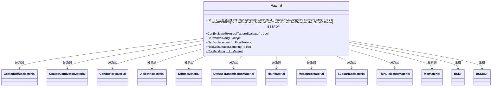

# material.h

## 概述

`material.h` 定义了 PBRT-v4 渲染器中的 **Material（材质）** 基类接口。材质是连接几何体和光学属性的桥梁，在渲染管线中，当光线击中表面时，材质负责根据表面属性和纹理信息生成对应的 BSDF（双向散射分布函数）和可选的 BSSRDF（双向次表面散射反射分布函数），从而决定光线如何在表面上散射。

该文件是基类/接口定义，使用 `TaggedPointer` 多态机制实现高效的 CPU/GPU 动态分派，支持 11 种具体材质类型。

## 主要类与接口

| 类/结构体/函数 | 说明 |
|---|---|
| `Material` | 材质基类接口，继承自 `TaggedPointer`，定义了所有材质类型的通用接口 |
| `MaterialEvalContext` | 前向声明，材质求值上下文，包含着色点的几何信息 |
| `Material::GetBSDF()` | 模板方法，根据纹理求值器和上下文生成 BSDF |
| `Material::GetBSSRDF()` | 模板方法，生成 BSSRDF（用于次表面散射材质） |
| `Material::CanEvaluateTextures()` | 检查给定的纹理求值器是否能处理该材质的纹理 |
| `Material::GetNormalMap()` | 获取法线贴图 |
| `Material::GetDisplacement()` | 获取位移纹理 |
| `Material::HasSubsurfaceScattering()` | 查询材质是否具有次表面散射属性 |
| `Material::Create()` | 静态工厂方法，根据名称和参数创建具体材质实例 |

### 具体实现类（前向声明）

| 实现类 | 说明 |
|---|---|
| `CoatedDiffuseMaterial` | 涂层漫反射材质（介电质层覆盖漫反射基底） |
| `CoatedConductorMaterial` | 涂层导体材质（介电质层覆盖导体基底） |
| `ConductorMaterial` | 导体材质（金属等） |
| `DielectricMaterial` | 介电质材质（玻璃等） |
| `DiffuseMaterial` | 漫反射材质（Lambertian） |
| `DiffuseTransmissionMaterial` | 漫透射材质 |
| `HairMaterial` | 毛发材质 |
| `MeasuredMaterial` | 基于实测数据的材质 |
| `SubsurfaceMaterial` | 次表面散射材质 |
| `ThinDielectricMaterial` | 薄介电质材质 |
| `MixMaterial` | 混合材质（按权重混合两种材质） |

## 架构图

## 依赖关系

- **依赖**：
  - `pbrt/pbrt.h` — 全局类型定义与宏
  - `pbrt/base/bssrdf.h` — `BSSRDF` 次表面散射接口
  - `pbrt/base/texture.h` — `FloatTexture` 纹理接口
  - `pbrt/util/taggedptr.h` — `TaggedPointer` 多态分派基础设施

- **被依赖**：
  - `src/pbrt/materials.h` — 具体材质实现
  - `src/pbrt/interaction.h` — 交互点信息
  - `src/pbrt/cpu/primitive.h` — CPU 图元系统
  - `src/pbrt/gpu/optix/optix.h` — GPU OptiX 集成
  - `src/pbrt/util/soa.h` — SoA 数据布局工具
