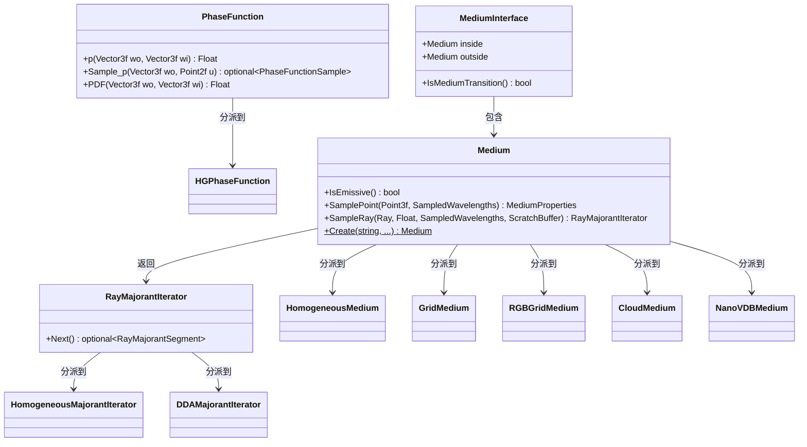

# medium.h

## 概述

`medium.h` 定义了 PBRT-v4 渲染器中的 **Medium（参与介质）** 及相关基类接口。参与介质模拟光线在体积中传播时与微粒的交互（如雾、烟、云、水下等场景），包括吸收、散射和发射。该文件同时定义了相函数（`PhaseFunction`）、光线主值迭代器（`RayMajorantIterator`）以及介质界面（`MediumInterface`）等关键抽象。

在渲染管线中，当光线穿过包含参与介质的区域时，需要通过介质接口进行体积渲染积分，计算光线在介质中被吸收和散射的效果。

## 主要类与接口

| 类/结构体/函数 | 说明 |
|---|---|
| `PhaseFunctionSample` | 结构体，表示相函数采样结果（散射值 `p`、入射方向 `wi`、概率密度 `pdf`） |
| `PhaseFunction` | 相函数基类接口，描述散射方向的概率分布 |
| `PhaseFunction::p()` | 计算给定入射和出射方向的相函数值 |
| `PhaseFunction::Sample_p()` | 采样一个散射方向 |
| `PhaseFunction::PDF()` | 计算给定方向的概率密度 |
| `RayMajorantSegment` | 结构体，表示光线主值（majorant）的一个分段，包含 `tMin`、`tMax` 和 `sigma_maj` |
| `RayMajorantIterator` | 光线主值迭代器基类接口，用于沿光线迭代获取分段的主值上界 |
| `RayMajorantIterator::Next()` | 获取下一个主值分段 |
| `MediumProperties` | 前向声明，介质属性结构体 |
| `Medium` | 参与介质基类接口，继承自 `TaggedPointer`，定义了介质的核心接口 |
| `Medium::IsEmissive()` | 查询介质是否具有自发光属性 |
| `Medium::SamplePoint()` | 在给定点采样介质属性 |
| `Medium::SampleRay()` | 沿光线采样，返回主值迭代器 |
| `Medium::Create()` | 静态工厂方法，创建介质实例 |
| `MediumInterface` | 介质界面结构体，记录表面两侧的介质 |
| `MediumInterface::IsMediumTransition()` | 判断是否存在介质过渡（两侧介质不同） |

### 具体实现类（前向声明）

| 实现类 | 说明 |
|---|---|
| `HGPhaseFunction` | Henyey-Greenstein 相函数 |
| `HomogeneousMajorantIterator` | 均匀介质的主值迭代器 |
| `DDAMajorantIterator` | DDA 遍历的主值迭代器（用于非均匀介质） |
| `HomogeneousMedium` | 均匀参与介质 |
| `GridMedium` | 网格体积介质 |
| `RGBGridMedium` | RGB 网格体积介质 |
| `CloudMedium` | 云介质 |
| `NanoVDBMedium` | 基于 NanoVDB 的体积介质 |

## 架构图

## 依赖关系

- **依赖**：
  - `pbrt/pbrt.h` — 全局类型定义与宏
  - `pbrt/util/pstd.h` — `pstd::optional` 等工具类型
  - `pbrt/util/rng.h` — 随机数生成器
  - `pbrt/util/spectrum.h` — `SampledSpectrum` 光谱采样类型
  - `pbrt/util/taggedptr.h` — `TaggedPointer` 多态分派基础设施

- **被依赖**：
  - `src/pbrt/base/light.h` — 光源接口（光源可关联介质）
  - `src/pbrt/media.h` — 具体介质实现
  - `src/pbrt/lights.h` — 具体光源实现
  - `src/pbrt/ray.h` — 光线定义
  - `src/pbrt/interaction.h` — 交互点信息
  - `src/pbrt/cpu/primitive.h` — CPU 图元系统
  - `src/pbrt/gpu/optix/optix.h` — GPU OptiX 集成
  - `src/pbrt/cameras.cpp` — 相机实现
  - `src/pbrt/wavefront/integrator.cpp` — 波前积分器实现
  - `src/pbrt/util/soa.h` — SoA 数据布局工具
