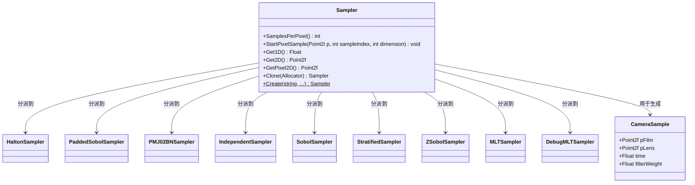

# sampler.h

## 概述

`sampler.h` 定义了 PBRT-v4 渲染器中的 **Sampler（采样器）** 基类接口。采样器是蒙特卡洛渲染的核心组件，负责生成用于积分估计的随机（或准随机）样本序列。在渲染管线中，采样器为像素位置、镜头采样、光源选择、BSDF 方向采样等各种随机决策提供高质量的样本值。

该文件还定义了 `CameraSample` 结构体，封装了生成一条相机光线所需的全部采样参数。

## 主要类与接口

| 类/结构体/函数 | 说明 |
|---|---|
| `CameraSample` | 结构体，包含相机采样所需参数：像素位置 `pFilm`、镜头位置 `pLens`、时间 `time` 和滤波器权重 `filterWeight` |
| `Sampler` | 采样器基类接口，继承自 `TaggedPointer`，定义了所有采样器类型的通用接口 |
| `Sampler::SamplesPerPixel()` | 返回每像素的采样数 |
| `Sampler::StartPixelSample()` | 开始对指定像素和样本索引进行采样，重置内部状态 |
| `Sampler::Get1D()` | 获取一个一维随机样本 |
| `Sampler::Get2D()` | 获取一个二维随机样本 |
| `Sampler::GetPixel2D()` | 获取用于像素位置的二维样本 |
| `Sampler::Clone()` | 克隆采样器（用于多线程并行渲染） |
| `Sampler::Create()` | 静态工厂方法，根据名称和参数创建具体采样器实例 |

### 具体实现类（前向声明）

| 实现类 | 说明 |
|---|---|
| `HaltonSampler` | Halton 序列采样器（低差异序列） |
| `PaddedSobolSampler` | 填充 Sobol 采样器 |
| `PMJ02BNSampler` | PMJ02BN 采样器（渐进多抖动） |
| `IndependentSampler` | 独立随机采样器 |
| `SobolSampler` | Sobol 序列采样器 |
| `StratifiedSampler` | 分层采样器 |
| `ZSobolSampler` | Z 曲线 Sobol 采样器 |
| `MLTSampler` | Metropolis 光传输采样器 |
| `DebugMLTSampler` | 调试用 MLT 采样器 |

## 架构图

## 依赖关系

- **依赖**：
  - `pbrt/pbrt.h` — 全局类型定义与宏
  - `pbrt/util/taggedptr.h` — `TaggedPointer` 多态分派基础设施
  - `pbrt/util/vecmath.h` — 向量数学类型（`Point2f`、`Point2i` 等）

- **被依赖**：
  - `src/pbrt/samplers.h` — 具体采样器实现
  - `src/pbrt/interaction.h` — 交互点信息
  - `src/pbrt/cpu/integrators.h` — CPU 积分器
  - `src/pbrt/wavefront/integrator.h` — 波前积分器
  - `src/pbrt/wavefront/workitems.h` — 波前渲染工作项
  - `src/pbrt/cmd/pspec.cpp` — 命令行工具
