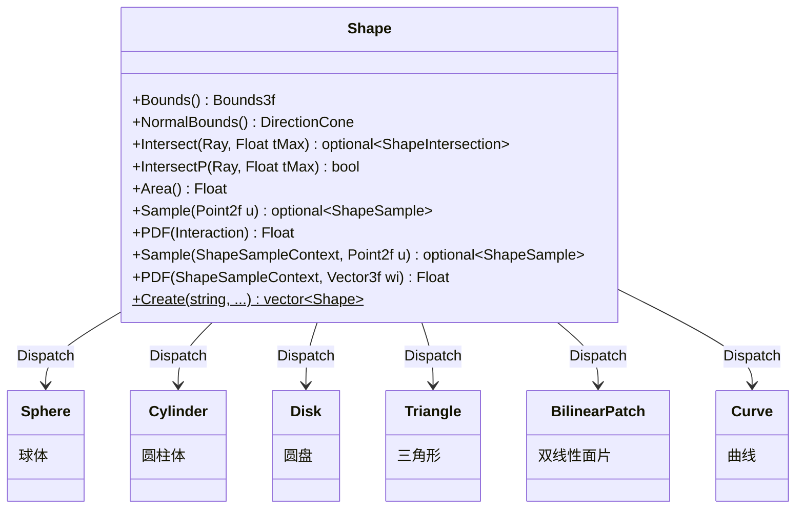

# shape.h

## 概述

`shape.h` 定义了 pbrt-v4 渲染器中的 **Shape（形状/几何体）** 基类接口。Shape 是场景中所有几何对象的抽象，在渲染管线中负责：

- 定义物体的几何形态与空间边界
- 提供光线–几何体求交测试
- 计算表面面积
- 在表面上进行采样（用于面光源的直接光照计算）
- 提供边界体积查询（用于 BVH 加速结构构建）

Shape 接口是构建图元（Primitive）和加速结构（BVH）的基础，也是面光源（area light）进行重要性采样的核心依赖。

---

## TaggedPointer 多态机制

Shape 不使用 C++ 虚函数实现多态，而是继承自 `TaggedPointer<Sphere, Cylinder, Disk, Triangle, BilinearPatch, Curve>`。`TaggedPointer` 是 pbrt-v4 为 CPU/GPU 统一架构设计的轻量级多态方案：

- **存储**：一个指针中同时编码了类型标签（tag）和实际对象地址。不需要虚函数表（vtable），因此可以在 GPU 上使用。
- **分派**：通过 `Dispatch(lambda)` 方法，根据类型标签将调用转发到具体实现类的对应方法。

所有 Shape 的接口方法都在 `shapes.h` 底部（第 1541–1586 行）以 `inline` 函数形式实现，统一遵循同一模式：

```cpp
// shapes.h:1541
PBRT_CPU_GPU inline Bounds3f Shape::Bounds() const {
    auto bounds = [&](auto ptr) { return ptr->Bounds(); };
    return Dispatch(bounds);
}
```

`Dispatch` 内部根据 tag 将 `auto ptr` 推导为具体类型指针（如 `Sphere*`、`Triangle*`），然后直接调用该类型的成员函数。因为 lambda 使用了 `auto` 参数，编译器会为每种类型生成特化版本，在编译期消除了间接调用的开销。`PBRT_CPU_GPU` 宏确保这些函数同时适用于 CPU 和 GPU（CUDA）编译路径。

---

## 辅助结构体

Shape 接口的参数和返回值依赖三个辅助结构体，定义在 `shapes.h` 中。

### ShapeSample

```cpp
// shapes.h:28
struct ShapeSample {
    Interaction intr;   // 采样点的几何信息（位置、法线等）
    Float pdf;          // 该采样点的概率密度
};
```

表示形状表面上的一个采样结果。`intr` 包含采样点的位置（`p()`）和表面法线（`n`）。`pdf` 的单位取决于采样模式——面积采样时为 1/面积（单位：1/m²），立体角采样时为 1/立体角（单位：1/sr）。

### ShapeIntersection

```cpp
// shapes.h:93
struct ShapeIntersection {
    SurfaceInteraction intr;  // 交点处的完整表面交互信息
    Float tHit;               // 光线参数 t，即交点距离光线起点的距离
};
```

表示光线与形状的求交结果。`SurfaceInteraction` 比 `Interaction` 更丰富，额外包含 UV 坐标、偏导数（dpdu/dpdv）、着色法线等信息。`tHit` 满足 `ray.o + tHit * ray.d = intr.p()`。

### ShapeSampleContext

```cpp
// shapes.h:35
struct ShapeSampleContext {
    Point3fi pi;         // 参考点位置（带浮点误差区间）
    Normal3f n;          // 参考点的几何法线
    Normal3f ns;         // 参考点的着色法线
    Float time;          // 时间（用于运动模糊）
};
```

表示"从某个参考点对形状进行采样"的上下文信息，供 `Shape::Sample(ctx, u)` 和 `Shape::PDF(ctx, wi)` 使用。通常由当前着色点构造：

- 从 `SurfaceInteraction` 构造时，`pi`、`n`、`ns`、`time` 直接取自交互信息。
- 从 `MediumInteraction` 构造时，只有 `pi` 和 `time`，法线为零向量（介质中没有表面法线）。

#### 自相交规避方法

`ShapeSampleContext` 提供了三个辅助方法来规避自相交（self-intersection）问题：

- **`Point3f p() const`**：将带误差区间的 `Point3fi` 转为普通 `Point3f`。
- **`Point3f OffsetRayOrigin(Vector3f w) const`**（shapes.h:63）：沿法线方向偏移光线起点，偏移量由浮点误差界 `pi.Error()` 决定。如果射线方向 `w` 与法线同侧，沿法线正方向偏移；反之沿负方向偏移。偏移后还会对每个分量做 `NextFloatUp/Down` 以确保保守地远离表面。这是 pbrt-v4 避免 shadow acne 等自相交伪影的核心机制。
- **`Ray SpawnRay(Vector3f w) const`**（shapes.h:86）：调用 `OffsetRayOrigin` 生成偏移后的光线起点，构造一条新光线。注意不设置介质信息，因为此方法仅供 Shape 内部判断遮挡使用。

---

## Shape 接口逐方法详解

### `Bounds3f Bounds() const`

```cpp
// shape.h:46
PBRT_CPU_GPU inline Bounds3f Bounds() const;
```

返回形状在**渲染空间**（render space）中的轴对齐包围盒（AABB）。

- **坐标系**：渲染空间，即经过 `renderFromObject` 变换后的世界坐标空间。
- **用途**：BVH 加速结构根据此包围盒组织空间层次。包围盒越紧凑，BVH 的遍历效率越高。
- **约束**：返回的包围盒必须完全包含形状的所有几何表面。各实现类通常会先在物体空间计算包围盒，再变换到渲染空间（变换后的 AABB 可能不是最紧的，但保证保守正确）。

### `DirectionCone NormalBounds() const`

```cpp
// shape.h:48
PBRT_CPU_GPU inline DirectionCone NormalBounds() const;
```

返回形状所有表面法线方向的**包围锥**（`DirectionCone`）。

- **含义**：一个方向锥，包含形状表面上所有可能的法线方向。例如，一个完整球体的法线覆盖所有方向，返回 `DirectionCone::EntireSphere()`；一个平面圆盘只有一个法线方向，返回一个角度为零的锥。
- **用途**：光源裁剪（light culling）——如果光线的入射方向不在法线包围锥的有效范围内，可以跳过该形状的光照计算。
- **注意**：这是一个保守估计，实际法线范围可能更小。

### `pstd::optional<ShapeIntersection> Intersect(const Ray &ray, Float tMax = Infinity) const`

```cpp
// shape.h:50-51
PBRT_CPU_GPU inline pstd::optional<ShapeIntersection> Intersect(
    const Ray &ray, Float tMax = Infinity) const;
```

执行光线–形状求交测试，返回最近的交点信息。

- **参数**：
  - `ray`：待测试的光线，包含起点 `o`、方向 `d`（不要求单位化）、时间 `time`。
  - `tMax`：光线参数 t 的上界。只在 `(0, tMax]` 范围内寻找交点。默认值为 `Infinity`。`tMax` 使得多次求交可以逐步缩小搜索范围——BVH 遍历中每找到一个更近的交点就用其 `tHit` 更新 `tMax`，从而跳过更远的几何体。
- **返回值**：
  - 如果存在有效交点，返回 `ShapeIntersection`（包含 `SurfaceInteraction` 和 `tHit`）。
  - 如果无交点或交点 t 超出 `(0, tMax]` 范围，返回空 `optional`。
- **调用场景**：主光线（camera ray）和非阴影光线的求交测试，需要完整交点信息（位置、法线、UV 等）以进行着色计算。

### `bool IntersectP(const Ray &ray, Float tMax = Infinity) const`

```cpp
// shape.h:53
PBRT_CPU_GPU inline bool IntersectP(const Ray &ray, Float tMax = Infinity) const;
```

光线–形状求交的**快速布尔测试**，仅判断是否存在交点，不计算交点的详细几何信息。

- **参数**：与 `Intersect` 相同。
- **返回值**：`true` 表示存在有效交点，`false` 表示不存在。
- **与 `Intersect` 的区别**：`IntersectP` 不需要计算 `SurfaceInteraction`（UV 坐标、偏导数、着色法线等），因此通常比 `Intersect` 更快。某些实现可以提前终止计算。
- **调用场景**：阴影光线（shadow ray）测试——只需知道参考点与光源之间是否被遮挡，不需要交点的几何细节。

### `Float Area() const`

```cpp
// shape.h:55
PBRT_CPU_GPU inline Float Area() const;
```

返回形状在**渲染空间**中的表面面积。

- **单位**：面积单位与渲染空间的长度单位一致（通常为米²）。
- **用途**：
  - 面光源的均匀面积采样中，`PDF = 1 / Area()`。
  - 光源功率密度的计算。
- **注意**：对于经过非均匀缩放变换的形状，面积已经包含了变换的影响。

### `pstd::optional<ShapeSample> Sample(Point2f u) const`

```cpp
// shape.h:57
PBRT_CPU_GPU inline pstd::optional<ShapeSample> Sample(Point2f u) const;
```

在形状表面上进行**均匀面积采样**，返回一个采样点。

- **参数**：
  - `u`：二维随机数，分量均在 `[0, 1)` 范围内。由采样器（Sampler）提供，用于参数化采样位置。不同的 `u` 值映射到形状表面上不同的位置，保证均匀覆盖整个表面。
- **返回值**：
  - 成功时返回 `ShapeSample`，其中 `intr` 包含采样点的位置和法线，`pdf = 1 / Area()`（均匀分布下的面积概率密度）。
  - 某些退化情况（如面积为零）可能返回空 `optional`。
- **调用场景**：当面光源需要在自身表面上随机选取一个发光点时使用。这是最基本的采样模式，不考虑参考点的位置。

### `Float PDF(const Interaction &intr) const`

```cpp
// shape.h:59
PBRT_CPU_GPU inline Float PDF(const Interaction &intr) const;
```

返回 `Sample(u)` 采样模式下的**面积概率密度**。

- **参数**：
  - `intr`：形状表面上的一个交互点（通常是 `Sample(u)` 的返回结果）。
- **返回值**：面积 PDF，单位为 1/m²。对于均匀面积采样，恒等于 `1 / Area()`。
- **用途**：多重重要性采样（MIS）中需要知道给定采样策略的 PDF 值来计算权重。

### `pstd::optional<ShapeSample> Sample(const ShapeSampleContext &ctx, Point2f u) const`

```cpp
// shape.h:61-62
PBRT_CPU_GPU inline pstd::optional<ShapeSample> Sample(
    const ShapeSampleContext &ctx, Point2f u) const;
```

从给定**参考点**方向对形状表面进行采样。

- **参数**：
  - `ctx`：采样上下文，包含参考点的位置（`pi`）、法线（`n`、`ns`）和时间（`time`）。
  - `u`：二维随机数，分量均在 `[0, 1)` 范围内。
- **返回值**：`ShapeSample`，其中 `pdf` 的含义取决于具体实现：
  - 某些实现（如 Sphere 对于外部参考点）会执行**立体角采样**，`pdf` 的单位为 1/sr。
  - 某些实现回退到均匀面积采样后再做 PDF 转换。
- **调用场景**：直接光照积分中，从着色点向面光源采样。相比无参考点的 `Sample(u)`，此版本可以集中采样到从参考点可见的面光源区域，显著降低方差。例如 Sphere 对外部点可以只在可见的球冠上采样，避免浪费样本在背面。

### `Float PDF(const ShapeSampleContext &ctx, Vector3f wi) const`

```cpp
// shape.h:64
PBRT_CPU_GPU inline Float PDF(const ShapeSampleContext &ctx, Vector3f wi) const;
```

返回 `Sample(ctx, u)` 采样模式下给定方向的**概率密度**。

- **参数**：
  - `ctx`：采样上下文（同上）。
  - `wi`：从参考点指向形状表面采样点的方向（不要求单位化，但通常是单位向量）。
- **返回值**：PDF 值。如果 `Sample(ctx, u)` 执行的是立体角采样，则返回立体角 PDF（单位 1/sr）；如果是面积采样，需要做相应转换。
- **用途**：MIS 权重计算。在 BSDF 采样碰巧命中面光源时，需要知道光源的采样 PDF 来计算 MIS 权重。

### `static pstd::vector<Shape> Create(...)`

```cpp
// shape.h:38-43
static pstd::vector<Shape> Create(
    const std::string &name, const Transform *renderFromObject,
    const Transform *objectFromRender, bool reverseOrientation,
    const ParameterDictionary &parameters,
    const std::map<std::string, FloatTexture> &floatTextures,
    const FileLoc *loc, Allocator alloc);
```

静态工厂方法，根据名称和参数字典创建形状实例。

- **参数**：
  - `name`：形状类型名（如 `"sphere"`、`"trianglemesh"` 等），对应场景描述文件中的类型标识。
  - `renderFromObject` / `objectFromRender`：物体空间与渲染空间之间的变换及其逆变换。
  - `reverseOrientation`：是否翻转法线方向（场景文件中的 `ReverseOrientation` 指令）。
  - `parameters`：参数字典，包含形状的具体参数（如球体的半径、三角网格的顶点数据等）。
  - `floatTextures`：浮点纹理映射表，用于 alpha 遮罩纹理等。
  - `loc`：场景文件中的源位置，用于错误报告。
  - `alloc`：内存分配器。
- **返回值**：`pstd::vector<Shape>` — 一个形状列表。大多数类型返回单个形状，但 `trianglemesh` 会返回多个 Triangle，`bilinearmesh` 会返回多个 BilinearPatch。

---

## 两种采样模式对比

Shape 提供了两种采样模式，适用于不同场景：

| | 面积采样 `Sample(u)` | 参考点采样 `Sample(ctx, u)` |
|---|---|---|
| **输入** | 二维随机数 `u` | 参考点上下文 `ctx` + 二维随机数 `u` |
| **采样分布** | 在形状表面上均匀按面积分布 | 集中在参考点可见区域，可按立体角分布 |
| **PDF 单位** | 1/面积（1/m²） | 1/立体角（1/sr）或 1/面积（取决于实现） |
| **典型 PDF 值** | `1 / Area()` | 与参考点到采样点的距离和角度有关 |
| **使用场景** | 光源自身发射光子 | 从着色点向光源采样直接光照 |

面积 PDF 与立体角 PDF 之间的转换关系为：

$$
p_\omega(\omega) = p_A(x) \cdot \frac{r^2}{\cos\theta}
$$

其中 $r$ 是参考点到采样点的距离，$\theta$ 是采样点法线与连接方向的夹角。当实现从面积采样回退时，`PDF(ctx, wi)` 内部需要执行此转换。

---

## 具体实现类

| 实现类 | 说明 | 源文件 |
|---|---|---|
| `Sphere` | 球体（支持部分球体：z 裁切、phi 裁切） | `shapes.h` |
| `Cylinder` | 圆柱体（支持部分圆柱） | `shapes.h` |
| `Disk` | 圆盘（支持内半径、部分圆盘） | `shapes.h` |
| `Triangle` | 三角形（三角形网格中的单个三角面） | `shapes.h` |
| `BilinearPatch` | 双线性面片（四边形网格中的单个面片） | `shapes.h` |
| `Curve` | 曲线（用于毛发等细长物体） | `shapes.h` |

---

## 架构图



---

## 依赖关系

- **依赖**：
  - `pbrt/pbrt.h` — 全局类型定义与宏（`Float`、`PBRT_CPU_GPU` 等）
  - `pbrt/base/texture.h` — `FloatTexture` 纹理接口（`Create` 方法的 alpha 遮罩参数）
  - `pbrt/util/taggedptr.h` — `TaggedPointer` 多态分派基础设施
  - `pbrt/util/vecmath.h` — 向量数学类型（`Point2f`、`Vector3f`、`Normal3f`、`Bounds3f`、`DirectionCone` 等）

- **被依赖**：
  - `pbrt/base/light.h` — 光源接口（面光源关联 Shape 进行采样）
  - `pbrt/shapes.h` — 具体形状实现、辅助结构体定义、inline 分派方法实现
  - `pbrt/cpu/primitive.h` — CPU 图元系统（GeometricPrimitive 持有 Shape）
  - `pbrt/gpu/optix/optix.h` — GPU OptiX 集成
