# texture.h

## 概述

`texture.h` 定义了 PBRT-v4 渲染器中的 **Texture（纹理）** 基类接口。纹理是材质系统的重要组成部分，为材质参数提供空间变化的值。PBRT-v4 将纹理分为两大类：**FloatTexture**（标量浮点纹理）和 **SpectrumTexture**（光谱纹理），分别用于驱动标量属性（如粗糙度、凹凸贴图）和光谱属性（如反射率、颜色）。

在渲染管线中，当材质需要在某个着色点求值参数时，会通过纹理接口查询该点处的值，从而实现程序化图案、图像贴图、噪声纹理等丰富的表面细节效果。

## 主要类与接口

| 类/结构体/函数 | 说明 |
|---|---|
| `TextureEvalContext` | 前向声明，纹理求值上下文，包含求值点的位置和微分信息 |
| `FloatTexture` | 浮点纹理基类接口，继承自 `TaggedPointer`，返回标量 `Float` 值 |
| `FloatTexture::Evaluate()` | 在给定上下文中求值纹理，返回 `Float` |
| `FloatTexture::Create()` | 静态工厂方法，创建浮点纹理实例 |
| `SpectrumTexture` | 光谱纹理基类接口，继承自 `TaggedPointer`，返回 `SampledSpectrum` 值 |
| `SpectrumTexture::Evaluate()` | 在给定上下文和波长下求值纹理，返回 `SampledSpectrum` |
| `SpectrumTexture::Create()` | 静态工厂方法，创建光谱纹理实例 |

### FloatTexture 具体实现类（前向声明）

| 实现类 | 说明 |
|---|---|
| `FloatConstantTexture` | 常量浮点纹理 |
| `FloatBilerpTexture` | 双线性插值浮点纹理 |
| `FloatCheckerboardTexture` | 棋盘格浮点纹理 |
| `FloatDotsTexture` | 圆点浮点纹理 |
| `FBmTexture` | 分形布朗运动纹理 |
| `FloatImageTexture` | 图像浮点纹理 |
| `GPUFloatImageTexture` | GPU 图像浮点纹理 |
| `FloatMixTexture` | 混合浮点纹理 |
| `FloatDirectionMixTexture` | 方向混合浮点纹理 |
| `FloatPtexTexture` | Ptex 浮点纹理 |
| `GPUFloatPtexTexture` | GPU Ptex 浮点纹理 |
| `FloatScaledTexture` | 缩放浮点纹理 |
| `WindyTexture` | 风纹理 |
| `WrinkledTexture` | 皱纹纹理 |

### SpectrumTexture 具体实现类（前向声明）

| 实现类 | 说明 |
|---|---|
| `SpectrumConstantTexture` | 常量光谱纹理 |
| `RGBConstantTexture` | RGB 常量纹理 |
| `RGBReflectanceConstantTexture` | RGB 反射率常量纹理 |
| `SpectrumBilerpTexture` | 双线性插值光谱纹理 |
| `SpectrumCheckerboardTexture` | 棋盘格光谱纹理 |
| `SpectrumImageTexture` | 图像光谱纹理 |
| `GPUSpectrumImageTexture` | GPU 图像光谱纹理 |
| `MarbleTexture` | 大理石纹理 |
| `SpectrumMixTexture` | 混合光谱纹理 |
| `SpectrumDirectionMixTexture` | 方向混合光谱纹理 |
| `SpectrumDotsTexture` | 圆点光谱纹理 |
| `SpectrumPtexTexture` | Ptex 光谱纹理 |
| `GPUSpectrumPtexTexture` | GPU Ptex 光谱纹理 |
| `SpectrumScaledTexture` | 缩放光谱纹理 |

## 架构图

```mermaid
classDiagram
    class FloatTexture {
        +Evaluate(TextureEvalContext ctx) Float
        +Create(string, ...) FloatTexture$
    }
    class FloatConstantTexture
    class FloatBilerpTexture
    class FloatCheckerboardTexture
    class FloatDotsTexture
    class FBmTexture
    class FloatImageTexture
    class FloatMixTexture
    class FloatScaledTexture
    class WindyTexture
    class WrinkledTexture

    FloatTexture --> FloatConstantTexture : 分派到
    FloatTexture --> FloatBilerpTexture : 分派到
    FloatTexture --> FloatCheckerboardTexture : 分派到
    FloatTexture --> FloatDotsTexture : 分派到
    FloatTexture --> FBmTexture : 分派到
    FloatTexture --> FloatImageTexture : 分派到
    FloatTexture --> FloatMixTexture : 分派到
    FloatTexture --> FloatScaledTexture : 分派到
    FloatTexture --> WindyTexture : 分派到
    FloatTexture --> WrinkledTexture : 分派到

    class SpectrumTexture {
        +Evaluate(TextureEvalContext ctx, SampledWavelengths lambda) SampledSpectrum
        +Create(string, ...) SpectrumTexture$
    }
    class SpectrumConstantTexture
    class SpectrumImageTexture
    class SpectrumCheckerboardTexture
    class MarbleTexture
    class SpectrumMixTexture
    class SpectrumScaledTexture

    SpectrumTexture --> SpectrumConstantTexture : 分派到
    SpectrumTexture --> SpectrumImageTexture : 分派到
    SpectrumTexture --> SpectrumCheckerboardTexture : 分派到
    SpectrumTexture --> MarbleTexture : 分派到
    SpectrumTexture --> SpectrumMixTexture : 分派到
    SpectrumTexture --> SpectrumScaledTexture : 分派到
```

## 依赖关系

- **依赖**：
  - `pbrt/pbrt.h` — 全局类型定义与宏
  - `pbrt/util/taggedptr.h` — `TaggedPointer` 多态分派基础设施

- **被依赖**：
  - `src/pbrt/base/material.h` — 材质接口（材质通过纹理获取参数）
  - `src/pbrt/base/shape.h` — 形状接口（alpha 纹理遮罩）
  - `src/pbrt/base/light.h` — 光源接口
  - `src/pbrt/textures.h` — 具体纹理实现
  - `src/pbrt/paramdict.h` — 参数字典（解析纹理参数）
  - `src/pbrt/lights.h` — 具体光源实现
  - `src/pbrt/cpu/primitive.h` — CPU 图元系统
  - `src/pbrt/gpu/optix/optix.h` — GPU OptiX 集成
