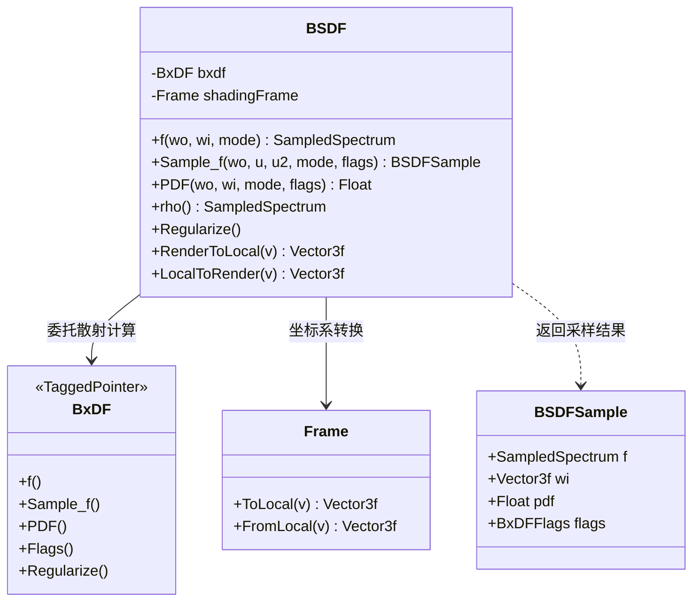

# bsdf.h / bsdf.cpp

## 概述
该文件定义了 PBRT 渲染器中的 **BSDF**（双向散射分布函数）类，它是表面着色计算的核心封装层。BSDF 类在具体的 BxDF（双向反射/透射分布函数）之上提供了一层坐标系转换，将渲染空间中的方向向量转换到以着色法线为基准的局部坐标系中，然后委托给底层的 BxDF 进行实际的散射计算。在渲染管线中，BSDF 是材质系统与积分器之间的桥梁。

## 主要类与接口

| 类/结构体/函数 | 说明 |
|---|---|
| `BSDF` | 核心 BSDF 类，封装一个 BxDF 和着色坐标帧（Frame），提供 `f()`、`Sample_f()`、`PDF()`、`rho()` 等接口，自动在渲染空间和局部空间之间进行方向向量转换 |
| `BSDF::f()` | 计算给定入射和出射方向的 BSDF 值，支持泛型版本可直接指定具体的 BxDF 类型 |
| `BSDF::Sample_f()` | 基于给定出射方向采样入射方向并返回 BSDFSample，包含采样的 BSDF 值、方向、PDF 和标志 |
| `BSDF::PDF()` | 计算给定入射和出射方向对的概率密度函数 |
| `BSDF::rho()` | 通过蒙特卡洛积分估计半球方向反射率（hemispherical-directional reflectance）和半球-半球反射率 |
| `BSDF::Regularize()` | 对底层 BxDF 进行正则化处理，减少渲染中的萤火虫噪点 |
| `BSDF::RenderToLocal()` / `LocalToRender()` | 在渲染空间和着色坐标系之间转换方向向量 |
| `BSDFSample` (定义在 base 中) | BSDF 采样结果结构体，包含采样的频谱值 `f`、入射方向 `wi`、概率密度 `pdf`、BxDF 标志 `flags` |

## 架构图

## 依赖关系
- **依赖**：`pbrt/bxdfs.h`（BxDF 的具体实现）、`pbrt/interaction.h`（交互点信息）、`pbrt/util/memory.h`、`pbrt/util/pstd.h`、`pbrt/util/vecmath.h`、`pbrt/util/spectrum.h`
- **被依赖**：`pbrt/bssrdf.h`、`pbrt/cameras.cpp`、`pbrt/film.h`、`pbrt/film.cpp`、`pbrt/materials.h`、`pbrt/materials.cpp`、`pbrt/cpu/integrators.h`、`pbrt/cpu/integrators.cpp`、`pbrt/util/soa.h`
