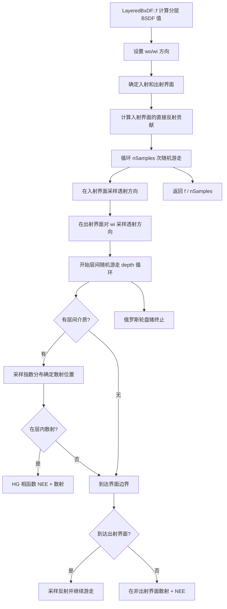
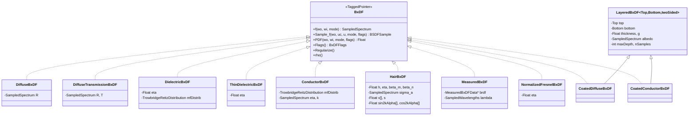

# bxdfs.h / bxdfs.cpp

## 1. 概述

`bxdfs.h` 和 `bxdfs.cpp` 是 pbrt-v4 中所有 **BxDF 具体实现类**的集合。如果说 `bxdf.h` 定义了散射函数的接口契约（`Flags()`/`f()`/`Sample_f()`/`PDF()`/`Regularize()`），那么本文件就是这些契约的全部履行者——从最简单的 Lambertian 漫反射到最复杂的分层材质随机游走，每一种表面散射模型都在这里实现。

每种 BxDF 遵循统一的模式：

1. **`Flags()`**：声明该 BxDF 支持的散射类型组合（Diffuse/Glossy/Specular × Reflection/Transmission）
2. **`f(wo, wi, mode)`**：给定方向对，评估 BxDF 值 f(ωo, ωi)
3. **`Sample_f(wo, uc, u, mode, sampleFlags)`**：重要性采样，根据出射方向生成入射方向
4. **`PDF(wo, wi, mode, sampleFlags)`**：计算给定方向对的采样概率密度
5. **`Regularize()`**：将近镜面分布平滑为有限宽度，减少路径追踪中的萤火虫噪点

这些实现类通过 `TaggedPointer` 的 `Dispatch` 机制实现多态分派（`bxdfs.h:1134-1162`），避免虚函数开销。

## 2. 通用约定

在阅读各 BxDF 实现之前，需要理解以下贯穿所有实现的共同约定：

**局部坐标系**：所有 BxDF 方法工作在局部着色坐标系中，其中 **z 轴 = 表面法线**。这使得 cos θ 的计算极为简单：`CosTheta(w) = w.z`，`AbsCosTheta(w) = |w.z|`。"同半球"判断等价于 `wo.z * wi.z > 0`（即 `SameHemisphere(wo, wi)`）。

**wo/wi 方向约定**：`wo` 和 `wi` 均为**从表面出发**的方向（指向远离表面的方向）。在 `TransportMode::Radiance` 下，`wo` 朝向相机，`wi` 朝向光源。

**随机数参数**：`uc`（一维 Float）用于**离散选择**——例如按菲涅尔系数的比例选择反射或折射；`u`（二维 Point2f）用于**连续方向采样**——例如映射到余弦加权半球或微表面法线分布。

**Specular BxDF 的 delta 分布约定**：理想镜面反射/折射是 delta 分布，其 `f()` 和 `PDF()` 在连续测度下返回 0。散射贡献完全通过 `Sample_f()` 获取——`Sample_f()` 返回的 `pdf = 1`（采样成功的概率为 1），`f` 字段包含了 `F / |cos θ_i|` 形式的值，使得 `f * |cos θ_i| / pdf` 给出正确的蒙特卡洛估计量。

**TransportMode 的折射校正**：当光线穿过折射率不同的界面时，由于立体角的压缩/扩展，Radiance 模式和 Importance 模式下的 BTDF 值不同。在 `TransportMode::Radiance` 下，透射 BxDF 值需要额外除以 η²（有效折射率的平方），以补偿从光源到相机方向上辐射度的非对称性。

---

## 3. DiffuseBxDF — Lambertian 漫反射

### 物理模型

DiffuseBxDF 实现了最简单的散射模型——**Lambertian 漫反射**。物理上，Lambertian 表面将入射光均匀地散射到出射半球的所有方向，没有任何方向偏好。这是对粗糙不透明表面（如粉笔、哑光油漆）的理想化近似。

由于辐射度在所有出射方向上均匀分布，BRDF 为常数。结合能量守恒约束（半球积分不超过 1），得到：

$$f(\omega_o, \omega_i) = \frac{R}{\pi}$$

其中 R 是反射率光谱（`SampledSpectrum`），π 来自余弦加权半球积分的归一化因子 $\int_{H^2} \frac{1}{\pi} |\cos\theta| \, d\omega = 1$。

### 成员变量

| 成员 | 类型 | 含义 |
|---|---|---|
| `R` | `SampledSpectrum` | 漫反射反射率，各波长分量 ∈ [0, 1] |

### 接口实现

**`Flags()`**（`bxdfs.h:76-78`）：若 R 非零（至少有一个波长分量 > 0），返回 `DiffuseReflection`；否则返回 `Unset`（无散射能力）。

**`f(wo, wi, mode)`**（`bxdfs.h:38-42`）：
1. 若 wo 和 wi 不在同一半球（`!SameHemisphere(wo, wi)`）→ 返回 0（漫反射只发生在同侧）
2. 返回 `R * InvPi`，即 R/π

**`Sample_f(wo, uc, u, mode, sampleFlags)`**（`bxdfs.h:45-57`）：
1. 检查 `sampleFlags` 是否允许反射，不允许则返回空
2. **余弦加权半球采样**：`wi = SampleCosineHemisphere(u)`——这是 Lambertian BRDF 的精确重要性采样，按 cos θ / π 的分布生成方向
3. 若 `wo.z < 0`（出射方向在下半球），翻转 `wi.z`，确保 wi 与 wo 同半球
4. 计算 PDF = `CosineHemispherePDF(|cos θ_i|)` = |cos θ_i| / π
5. 返回 `BSDFSample(R/π, wi, pdf, DiffuseReflection)`

**`PDF(wo, wi, mode, sampleFlags)`**（`bxdfs.h:60-65`）：
1. 若不允许反射或 wo/wi 不在同半球 → 返回 0
2. 返回 `CosineHemispherePDF(|cos θ_i|)` = |cos θ_i| / π

**`Regularize()`**（`bxdfs.h:73`）：空操作。漫反射本身已是宽分布，无需平滑。

---

## 4. DiffuseTransmissionBxDF — 漫反射 + 漫透射

### 物理模型

DiffuseTransmissionBxDF 是 DiffuseBxDF 的扩展，同时支持**漫反射和漫透射**。物理上，它模拟的是半透明材质（如薄纸、树叶）：入射光一部分从表面同侧漫反射，一部分穿透表面从对面漫透射。两者均为 Lambertian 分布。

$$f(\omega_o, \omega_i) = \begin{cases} R / \pi & \text{wo 与 wi 同半球（反射）} \\ T / \pi & \text{wo 与 wi 异半球（透射）} \end{cases}$$

### 成员变量

| 成员 | 类型 | 含义 |
|---|---|---|
| `R` | `SampledSpectrum` | 漫反射反射率 |
| `T` | `SampledSpectrum` | 漫透射透射率 |

### 接口实现

**`Flags()`**（`bxdfs.h:156-159`）：R 和 T 各自独立控制——R 非零时设置 `DiffuseReflection` 位，T 非零时设置 `DiffuseTransmission` 位，两者按位或。

**`f(wo, wi, mode)`**（`bxdfs.h:93-95`）：同半球返回 `R * InvPi`（反射），异半球返回 `T * InvPi`（透射）。

**`Sample_f(wo, uc, u, mode, sampleFlags)`**（`bxdfs.h:98-127`）：
1. 计算反射概率 `pr = R.MaxComponentValue()`，透射概率 `pt = T.MaxComponentValue()`
2. 根据 `sampleFlags` 屏蔽不允许的模式（将对应的 pr 或 pt 置 0）
3. 若 pr 和 pt 都为 0 → 返回空
4. 用 `uc` 按 `pr/(pr+pt)` 的比例**离散选择**反射或透射：
   - **反射**（`uc < pr/(pr+pt)`）：余弦加权半球采样 wi，若 `wo.z < 0` 则翻转 `wi.z` 使 wi 与 wo 同半球；PDF = `CosineHemispherePDF(|cos θ_i|) × pr/(pr+pt)`
   - **透射**（否则）：余弦加权半球采样 wi，若 `wo.z > 0` 则翻转 `wi.z` 使 wi 与 wo 异半球；PDF = `CosineHemispherePDF(|cos θ_i|) × pt/(pr+pt)`

PDF 是**混合概率**：离散选择概率 × 连续采样 PDF。

**`PDF(wo, wi, mode, sampleFlags)`**（`bxdfs.h:130-145`）：计算 pr、pt 并根据 sampleFlags 屏蔽。同半球返回 `pr/(pr+pt) × |cos θ_i|/π`，异半球返回 `pt/(pr+pt) × |cos θ_i|/π`。

**`Regularize()`**（`bxdfs.h:153`）：空操作。

---

## 5. DielectricBxDF — 电介质（玻璃/水）

### 物理模型概述

DielectricBxDF 模拟**电介质材料**（如玻璃、水、塑料）的散射行为。电介质的光学特性由实数折射率 η 描述——光线到达界面时，一部分被反射，一部分被折射透过界面。反射与折射的比例由**菲涅尔方程**决定。

根据表面粗糙度，DielectricBxDF 提供两条路径：

- **光滑路径（Specular）**：当微表面分布有效光滑（`mfDistrib.EffectivelySmooth()`，即 α < 10⁻³）时，退化为理想镜面反射 + 折射，散射分布为 delta 函数
- **粗糙路径（Glossy）**：使用 **Trowbridge-Reitz（GGX）微表面分布**模拟粗糙表面——表面由大量微小面元组成，每个面元是完美镜面，面元法线的统计分布决定了宏观散射外观

### 菲涅尔方程

电介质界面的菲涅尔反射率由 `FrDielectric(cos θ_i, η)` 计算（`scattering.h:61-79`）：

$$F = \frac{1}{2}\left(\left(\frac{\eta \cos\theta_i - \cos\theta_t}{\eta \cos\theta_i + \cos\theta_t}\right)^2 + \left(\frac{\cos\theta_i - \eta \cos\theta_t}{\cos\theta_i + \eta \cos\theta_t}\right)^2\right)$$

其中 cos θ_t 由 Snell 定律 $\eta_i \sin\theta_i = \eta_t \sin\theta_t$ 求得。当 sin²θ_t ≥ 1 时发生全内反射，F = 1。

### 微表面 BRDF/BTDF 公式

粗糙路径使用 Cook-Torrance 微表面模型。其核心组件：

- **D(wm)**：法线分布函数（NDF），描述微面元法线 wm 的统计分布。Trowbridge-Reitz 分布：
  $$D(\mathbf{w}_m) = \frac{1}{\pi \alpha_x \alpha_y \cos^4\theta_m (1 + e)^2}$$
  其中 $e = \tan^2\theta_m (\cos^2\phi_m / \alpha_x^2 + \sin^2\phi_m / \alpha_y^2)$

- **G(wo, wi)**：遮蔽-阴影函数（Smith 形式）：$G(\omega_o, \omega_i) = \frac{1}{1 + \Lambda(\omega_o) + \Lambda(\omega_i)}$

- **F**：菲涅尔反射率，基于入射光与微面元法线的夹角 `Dot(wo, wm)` 计算

**微表面 BRDF**（反射）：

$$f_r = \frac{D(\mathbf{w}_m) \cdot G(\omega_o, \omega_i) \cdot F}{4 |\cos\theta_o| |\cos\theta_i|}$$

半向量 $\mathbf{w}_m = \text{Normalize}(\omega_i + \omega_o)$。

**微表面 BTDF**（透射）：

$$f_t = \frac{D(\mathbf{w}_m) \cdot (1-F) \cdot G(\omega_o, \omega_i) \cdot |\omega_i \cdot \mathbf{w}_m| \cdot |\omega_o \cdot \mathbf{w}_m|}{|\cos\theta_o| \cdot |\cos\theta_i| \cdot d^2}$$

其中广义半向量 $\mathbf{w}_m = \text{Normalize}(\eta' \omega_i + \omega_o)$（η' 为有效折射率），$d = \omega_i \cdot \mathbf{w}_m + \omega_o \cdot \mathbf{w}_m / \eta'$。在 Radiance 模式下还需除以 η'²。

### 成员变量

| 成员 | 类型 | 含义 |
|---|---|---|
| `eta` | `Float` | 界面折射率比 η_t / η_i |
| `mfDistrib` | `TrowbridgeReitzDistribution` | 微表面法线分布，由粗糙度参数 (α_x, α_y) 参数化 |

### 接口实现

**`Flags()`**（`bxdfs.h:176-181`）：
- 若 `eta == 1`（两侧介质相同）：只有 Transmission（光线直接穿过，无反射）
- 否则：Reflection | Transmission
- 光滑度：`mfDistrib.EffectivelySmooth()` ? Specular : Glossy

#### 光滑路径

**`f()`**（`bxdfs.cpp:173-174`）：返回 0（delta 分布）。

**`Sample_f()`**（`bxdfs.cpp:80-116`）：
1. 计算菲涅尔反射率 `R = FrDielectric(CosTheta(wo), eta)`，透射率 `T = 1 - R`
2. 设置 `pr = R`、`pt = T`，根据 sampleFlags 屏蔽
3. 用 uc 按 `pr/(pr+pt)` 选择：
   - **反射**：`wi = (-wo.x, -wo.y, wo.z)`（镜面反射方向），`f = R / |cos θ_i|`，`pdf = pr/(pr+pt)`，标记 `SpecularReflection`
   - **折射**：调用 `Refract(wo, n, eta)` 计算折射方向 wi 和有效折射率 etap，`f = T / |cos θ_i|`；若 `mode == Radiance` 则 `f /= etap²`（非对称校正），标记 `SpecularTransmission`

**`PDF()`**（`bxdfs.cpp:213-214`）：返回 0（delta 分布）。

#### 粗糙路径

**`f(wo, wi, mode)`**（`bxdfs.cpp:176-208`）：
1. 判断反射/折射：`reflect = (cosθ_i × cosθ_o > 0)`
2. 计算有效折射率 etap：反射时 etap = 1；折射时根据 wo 在哪一侧确定 etap = η 或 1/η
3. 计算**广义半向量** `wm = Normalize(wi × etap + wo)`，朝向正 z 半球
4. 丢弃背面微面元（几何约束检查）
5. 计算 `F = FrDielectric(Dot(wo, wm), eta)`
6. 反射：返回 `D(wm) × G(wo,wi) × F / |4 × cosθ_i × cosθ_o|`
7. 折射：返回 `D(wm) × (1-F) × G(wo,wi) × |Dot(wi,wm) × Dot(wo,wm)| / (cosθ_i × cosθ_o × denom²)`，其中 `denom = Dot(wi,wm) + Dot(wo,wm)/etap`；Radiance 模式除以 etap²

**`Sample_f(wo, uc, u, mode, sampleFlags)`**（`bxdfs.cpp:117-169`）：
1. **采样微面元法线**：`wm = mfDistrib.Sample_wm(wo, u)` — 按可见法线分布（VNDF）采样
2. 计算菲涅尔 `R = FrDielectric(Dot(wo, wm), eta)`，`T = 1 - R`
3. 设置 pr/pt 并根据 sampleFlags 屏蔽
4. 用 uc 选择反射或折射：
   - **反射**：`wi = Reflect(wo, wm)`，检查 wo/wi 同半球。PDF = `mfDistrib.PDF(wo, wm) / (4 × |Dot(wo, wm)|) × pr/(pr+pt)`。反射的雅可比变换 $\frac{\partial \omega_m}{\partial \omega_i} = \frac{1}{4 |\omega_o \cdot \mathbf{w}_m|}$
   - **折射**：`Refract(wo, wm, eta) → wi`。PDF = `mfDistrib.PDF(wo, wm) × dwm_dwi × pt/(pr+pt)`，其中 `dwm_dwi = |Dot(wi,wm)| / denom²`。折射的雅可比变换 $\frac{\partial \omega_m}{\partial \omega_i} = \frac{|\omega_i \cdot \mathbf{w}_m|}{d^2}$

**`PDF(wo, wi, mode, sampleFlags)`**（`bxdfs.cpp:211-258`）：与 f() 共享半向量和菲涅尔计算逻辑，根据反射/折射分别应用对应的雅可比变换。

**`Regularize()`**（`bxdfs.h:200`）：委托给 `mfDistrib.Regularize()`。

### 色散支持（Dispersion）

**物理背景**：真实电介质的折射率随波长变化——短波长（蓝/紫光）折射率较高，折射角度较大；长波长（红光）折射率较低，折射角度较小。这就是三棱镜将白光分解为彩虹的原理，即**色散（dispersion）**。

**DielectricBxDF 本身不处理色散**。注意其成员 `eta` 是单一 `Float`，不携带波长信息。色散逻辑在上层的 `DielectricMaterial::GetBxDF()` 中实现，利用了 pbrt-v4 的 **Hero Wavelength Spectral Sampling** 机制：

1. **多波长光线**：pbrt-v4 每条光线携带 `NSpectrumSamples = 4` 个波长样本（`util/spectrum.h:36`），而非单一波长。通常情况下，4 个波长共享同一条光路，一次追踪同时计算 4 个波长的贡献。

2. **材质层触发色散**：`DielectricMaterial::GetBxDF()`（`materials.h:185-187`）中，若 eta 光谱不是 `ConstantSpectrum`（即折射率随波长变化），则：
   - 仅取 `lambda[0]`（英雄波长）的折射率作为 `DielectricBxDF` 的 `eta`
   - 调用 `lambda.TerminateSecondary()` 终止次级波长

3. **TerminateSecondary() 的作用**（`util/spectrum.h:313-320`）：将 `lambda[1]`、`lambda[2]`、`lambda[3]` 的 PDF 置零，仅保留 `lambda[0]`（英雄波长）的贡献，同时将 `pdf[0]` 除以 `NSpectrumSamples` 以补偿采样权重。此后该光线只为英雄波长积累辐射度。

4. **色散的产生**：不同光线的 `lambda[0]` 不同（通过分层采样覆盖整个可见光谱），因此各光线使用不同的折射率 → 不同的折射角度 → 多条光线叠加后自然呈现色散效果。

**效率代价**：色散激活后，每条光线从同时追踪 4 个波长退化为仅追踪 1 个波长，需要约 4 倍的采样量才能达到同等收敛质量。

**使用方法**：为 `DielectricMaterial` 的 `eta` 参数提供随波长变化的光谱（如 Cauchy 或 Sellmeier 色散模型的光谱数据），即可自动触发色散。若 `eta` 是常数光谱（`ConstantSpectrum`），则不触发色散，4 个波长共享同一光路，效率最高。

---

## 6. ThinDielectricBxDF — 薄电介质

### 物理模型

ThinDielectricBxDF 模拟**无厚度的薄膜**（如玻璃窗、肥皂泡膜），将前后两个折射界面的效果合并为单层近似。与 DielectricBxDF 的关键区别：

1. **透射方向为 -wo**（无偏折）：由于薄膜无厚度，光线经过前表面折射 → 后表面折射后，出射方向平行于入射方向（只有平移偏移，对无厚度薄膜而言偏移为零）
2. **多次反弹的等比级数合并**：光线在两个界面之间可以来回反弹。设单界面菲涅尔反射率为 R₁、透射率为 T₁ = 1 - R₁，则无穷次反弹的总反射率为：

$$R_{eff} = R_1 + \frac{T_1^2 R_1}{1 - R_1^2} = R_1 + T_1^2 R_1 \sum_{k=0}^{\infty} R_1^{2k}$$

总透射率 $T_{eff} = 1 - R_{eff}$。

### 成员变量

| 成员 | 类型 | 含义 |
|---|---|---|
| `eta` | `Float` | 薄膜折射率 |

### 接口实现

**`Flags()`**（`bxdfs.h:271-273`）：始终返回 `Specular | Reflection | Transmission`。无论折射率多少，薄电介质总是纯镜面的。

**`f(wo, wi, mode)`**（`bxdfs.h:217-219`）：始终返回 0（纯 delta 分布）。

**`Sample_f(wo, uc, u, mode, sampleFlags)`**（`bxdfs.h:222-253`）：
1. 计算单界面菲涅尔 `R = FrDielectric(|cos θ_o|, eta)`，`T = 1 - R`
2. 若 R < 1，合并多次反弹：`R += T² × R / (1 - R²)`，`T = 1 - R`
3. 设置 pr = R，pt = T，根据 sampleFlags 屏蔽
4. 用 uc 按 `pr/(pr+pt)` 选择：
   - **反射**：`wi = (-wo.x, -wo.y, wo.z)`，`f = R / |cos θ_i|`，标记 `SpecularReflection`
   - **透射**：`wi = -wo`（直线穿过，无偏折），`f = T / |cos θ_i|`，标记 `SpecularTransmission`

**`PDF(wo, wi, mode, sampleFlags)`**（`bxdfs.h:256-259`）：始终返回 0（纯 delta 分布）。

**`Regularize()`**（`bxdfs.h:267-268`）：空操作（TODO，当前未实现）。

---

## 7. ConductorBxDF — 导体（金属）

### 物理模型

ConductorBxDF 模拟**导体材料**（如金、银、铜、铝）。导体与电介质的根本区别在于：

1. **复数折射率**：导体的折射率为复数 $\hat{\eta} = \eta + ik$，其中 k 是消光系数（extinction coefficient），描述光在导体中被吸收的速度。由于强烈吸收，实际上**没有透射**——所有光要么被反射，要么被吸收。

2. **复数菲涅尔方程**：使用 `FrComplex(cos θ_i, η, k)` 计算（`scattering.h:81-100`），形式与电介质相同但使用复数运算。η 和 k 均为波长相关的光谱量（`SampledSpectrum`），这使得金属反射具有颜色（如金的黄色、铜的红色）。

3. **仅反射**：由于消光系数导致光在导体内部迅速衰减，ConductorBxDF 不包含任何透射分量。

与 DielectricBxDF 类似，ConductorBxDF 也提供光滑和粗糙两条路径。粗糙路径使用与 DielectricBxDF 相同的 Trowbridge-Reitz 微表面模型，但菲涅尔项替换为复数版本。

### 成员变量

| 成员 | 类型 | 含义 |
|---|---|---|
| `mfDistrib` | `TrowbridgeReitzDistribution` | 微表面法线分布 |
| `eta` | `SampledSpectrum` | 折射率实部（波长相关） |
| `k` | `SampledSpectrum` | 消光系数（波长相关） |

### 接口实现

**`Flags()`**（`bxdfs.h:290-293`）：
- `mfDistrib.EffectivelySmooth()` → `SpecularReflection`
- 否则 → `GlossyReflection`

（永远不包含 Transmission）

#### 光滑路径

**`f()`**（`bxdfs.h:334-335`）：返回 0（delta 分布）。

**`Sample_f()`**（`bxdfs.h:301-306`）：
1. `wi = (-wo.x, -wo.y, wo.z)`（镜面反射方向）
2. `f = FrComplex(|cos θ_i|, eta, k) / |cos θ_i|` — 复数菲涅尔反射率除以余弦（delta 分布的惯例）
3. `pdf = 1`，标记 `SpecularReflection`

#### 粗糙路径

**`f(wo, wi, mode)`**（`bxdfs.h:331-350`）：
1. 检查 wo/wi 同半球，cos θ 非零
2. 计算半向量 `wm = Normalize(wi + wo)`
3. 计算复数菲涅尔 `F = FrComplex(|Dot(wo, wm)|, eta, k)` — 注意 F 是光谱量，金属反射颜色由此产生
4. 返回 `D(wm) × F × G(wo,wi) / (4 × cosθ_i × cosθ_o)` — 标准微表面 BRDF 公式

**`Sample_f(wo, uc, u, mode, sampleFlags)`**（`bxdfs.h:307-328`）：
1. 采样微面元法线 `wm = mfDistrib.Sample_wm(wo, u)`
2. `wi = Reflect(wo, wm)`，检查 wo/wi 同半球
3. PDF = `mfDistrib.PDF(wo, wm) / (4 × |Dot(wo, wm)|)`
4. `F = FrComplex(|Dot(wo, wm)|, eta, k)`
5. `f = D(wm) × F × G(wo,wi) / (4 × cosθ_i × cosθ_o)`

**`PDF(wo, wi, mode, sampleFlags)`**（`bxdfs.h:353-368`）：
1. 检查同半球、非光滑
2. 计算半向量 `wm = FaceForward(Normalize(wo + wi), (0,0,1))`
3. 返回 `mfDistrib.PDF(wo, wm) / (4 × |Dot(wo, wm)|)`

**`Regularize()`**（`bxdfs.h:375`）：委托给 `mfDistrib.Regularize()`。

---

## 8. LayeredBxDF — 分层材质

### 物理模型概述

LayeredBxDF 模拟**分层材质结构**——两层界面之间可能存在参与介质（participating medium）的多层散射模型。物理上，这对应涂层材质：例如清漆下的金属（CoatedConductorBxDF）、上釉的陶瓷（CoatedDiffuseBxDF）。

光线进入顶层界面后，可能在两层界面之间多次反弹和散射，最终从某一界面逸出。精确求解这种多次散射积分是困难的，pbrt 采用**蒙特卡洛随机游走**模拟这一过程。

### 模板参数与成员

```
template <typename TopBxDF, typename BottomBxDF, bool twoSided>
```

| 成员 | 类型 | 含义 |
|---|---|---|
| `top` | `TopBxDF` | 顶层界面的 BxDF |
| `bottom` | `BottomBxDF` | 底层界面的 BxDF |
| `thickness` | `Float` | 层间距离 |
| `albedo` | `SampledSpectrum` | 层间介质的散射反照率（为 0 表示无介质） |
| `g` | `Float` | Henyey-Greenstein 相函数的非对称参数 |
| `maxDepth` | `int` | 随机游走最大弹射次数 |
| `nSamples` | `int` | f()/PDF() 中的蒙特卡洛采样数 |

### 特化类型

- **`CoatedDiffuseBxDF`** = `LayeredBxDF<DielectricBxDF, DiffuseBxDF, true>`（`bxdfs.h:903-909`）
- **`CoatedConductorBxDF`** = `LayeredBxDF<DielectricBxDF, ConductorBxDF, true>`（`bxdfs.h:912-918`）

### TopOrBottomBxDF 辅助类

`TopOrBottomBxDF<Top, Bottom>`（`bxdfs.h:384-428`）是一个轻量代理类，持有指向 top 或 bottom BxDF 的指针，提供统一的 `f()`/`Sample_f()`/`PDF()`/`Flags()` 接口。在随机游走中，光线到达哪个界面就通过该代理调用对应的 BxDF。

### Flags()

`Flags()`（`bxdfs.h:456-474`）的组合逻辑：
- 始终包含 Reflection（至少有顶层的反射）
- 若顶层是 Specular，标记 Specular
- 若任一层是 Diffuse 或存在介质散射，标记 Diffuse；否则若任一层是 Glossy，标记 Glossy
- 若顶层和底层都支持 Transmission，标记 Transmission

### f() 随机游走算法

`f(wo, wi, mode)`（`bxdfs.h:477-653`）通过 nSamples 次随机游走估计分层 BxDF 值：

1. **设置方向**：若 `twoSided && wo.z < 0`，翻转 wo 和 wi

2. **确定界面角色**：
   - `enterInterface`：入射界面（光线从哪一侧进入）
   - `exitInterface`：出射界面（光线应从哪一侧离开）
   - `exitZ`：出射界面的 z 坐标（0 或 thickness）

3. **直接反射贡献**：若 wo/wi 同半球，累加入射界面的直接反射 `nSamples × enterInterface.f(wo, wi)`

4. **初始化确定性 RNG**：基于 wo 和 wi 的哈希，保证对相同方向对的计算可复现

5. **nSamples 次随机游走**（每次独立）：
   - **入射采样**：在入射界面采样透射方向 wos
   - **出射虚拟光源**：在出射界面从 wi 方向反向采样透射方向 wis（用于后续 NEE）
   - **初始化路径权重** `beta = wos.f × |cos θ| / wos.pdf`
   - **层间深度循环**（最大 maxDepth 次）：
     - **俄罗斯轮盘赌**：depth > 3 且 beta 较小时概率终止
     - **无介质**（albedo == 0）：直接跳到对面界面，乘以透射率 `Tr(thickness, w) = exp(-thickness / |w.z|)`
     - **有介质**（albedo != 0）：指数分布采样散射距离 dz
       - **层内散射**（0 < zp < thickness）：HG 相函数 NEE（MIS 加权）+ 采样相函数获取新方向 + 向出口界面做 NEE
       - **到达界面边界**：clamp 到 0 或 thickness
     - **到达出射界面**：在出射界面采样反射，继续游走（反射失败则终止）
     - **到达非出射界面**：NEE（MIS 加权）+ 采样反射获取新方向 + 向出口界面做 NEE

6. **返回** `f / nSamples`

### Sample_f()

`Sample_f(wo, uc, u, mode, sampleFlags)`（`bxdfs.h:656-775`）执行**单条**随机游走路径：

1. 在入射界面采样 BSDF 获取初始方向
2. 若结果是反射 → 直接返回（设置 `pdfIsProportional = true`）
3. 若结果是透射 → 进入随机游走：
   - 层间循环：俄罗斯轮盘赌、介质散射或直接跳到对面界面、界面 BSDF 采样
   - 若光线透射离开层结构 → 返回 BSDFSample，`pdfIsProportional = true`
   - 若反射 → 继续游走
4. 超过 maxDepth → 返回空

注意 `pdfIsProportional = true`：由于随机游走的精确 PDF 无法解析求得，返回的 pdf 仅与真实 PDF 成正比。积分器会额外调用 `PDF()` 获取蒙特卡洛估计。

### PDF()

`PDF(wo, wi, mode, sampleFlags)`（`bxdfs.h:778-883`）通过 nSamples 次蒙特卡洛估计 PDF：

1. 若同半球（反射路径），累加入口界面的直接反射 PDF
2. 循环 nSamples 次：
   - **同半球（TRT 路径）**：在入口界面采样透射 wos，从 wi 方向采样透射 wis，根据界面是否 Specular 选择 MIS 或直接计算
   - **异半球（TT 路径）**：在入口和出口分别采样透射，根据 Specular/非 Specular 组合估计 PDF
3. 最终结果混合：`Lerp(0.9, 1/(4π), pdfSum/nSamples)` — 90% 蒙特卡洛估计 + 10% 均匀 PDF，防止 PDF 为 0 导致 MIS 权重异常

### 算法流程图



---

## 9. HairBxDF — 毛发散射

### 物理模型

HairBxDF 实现了 **Marschner 毛发纤维散射模型**。毛发不是平面，而是圆柱形纤维——光线打到纤维上会产生复杂的散射模式。该模型将散射分解为三个独立分量的乘积，并按**散射阶数 p** 叠加：

$$f(\omega_o, \omega_i) = \frac{1}{|\cos\theta_i|} \sum_{p=0}^{p_{Max}} A_p \cdot M_p(\theta) \cdot N_p(\phi)$$

各分量含义：

- **Ap（衰减项）**：描述光线在纤维中经过 p 次内反射后的能量衰减。p=0 为表面直接反射（R），p=1 为穿入再穿出（TT），p=2 为穿入-内反射-穿出（TRT），p≥3 为更高阶散射
- **Mp（纵向散射分布）**：沿纤维轴方向的散射分布，基于修正 Bessel 函数 I₀ 的分布，方差 v[p] 由参数 beta_m 控制
- **Np（方位角散射分布）**：绕纤维轴的散射分布，使用截断 logistic 分布，尺度参数 s 由 beta_n 控制

### 表层倾斜修正（Scale Tilt）

真实毛发表面有微小鳞片（cuticle scales），导致不同阶数的散射在纵向上有系统偏移。参数 alpha 控制倾斜角度，通过 `sin2kAlpha[]` 和 `cos2kAlpha[]` 数组在 f() 和 Sample_f() 中对各阶 p 的 sinθ_o/cosθ_o 进行修正。

### 成员变量

| 成员 | 类型 | 含义 |
|---|---|---|
| `h` | `Float` | 纤维截面偏移量 ∈ [-1, 1]，描述光线打到纤维截面的位置 |
| `eta` | `Float` | 纤维折射率 |
| `sigma_a` | `SampledSpectrum` | 吸收系数（控制发色） |
| `beta_m` | `Float` | 纵向粗糙度 |
| `beta_n` | `Float` | 方位角粗糙度 |
| `v[pMax+1]` | `Float[]` | 各阶纵向方差，由 beta_m 推导 |
| `s` | `Float` | 方位角 logistic 分布尺度参数，由 beta_n 推导 |
| `sin2kAlpha[pMax]` | `Float[]` | 表层倾斜角的正弦倍角 |
| `cos2kAlpha[pMax]` | `Float[]` | 表层倾斜角的余弦倍角 |

### 构造函数

构造函数（`bxdfs.cpp:275-301`）完成参数预计算：

1. **纵向方差 v[]**：`v[0] = Sqr(0.726 × beta_m + 0.812 × beta_m² + 3.7 × beta_m²⁰)`，`v[1] = v[0]/4`，`v[2] = 4 × v[0]`，`v[3..pMax] = v[2]`
2. **方位角尺度 s**：`s = √(π/8) × (0.265 × beta_n + 1.194 × beta_n² + 5.372 × beta_n²²)`
3. **倾斜角**：从 alpha（度数）计算 sin2kAlpha[0..2] 和 cos2kAlpha[0..2]，使用二倍角公式递推

### 接口实现

**`Flags()`**（`bxdfs.h:946`）：始终返回 `GlossyReflection`。

**`f(wo, wi, mode)`**（`bxdfs.cpp:303-366`）：
1. 从 wo 提取毛发坐标系参数：sinθ_o = wo.x（纤维方向的正弦），cosθ_o，φ_o，γ_o = asin(h)
2. 从 wi 提取：sinθ_i，cosθ_i，φ_i
3. 计算折射角：sinθ_t = sinθ_o / eta → cosθ_t
4. 计算纤维内折射角 γ_t
5. 计算单次穿越衰减：`T = exp(-σ_a × 2 cosγ_t / cosθ_t)`
6. 计算各阶衰减系数 `Ap[0..pMax]`：
   - Ap[0] = F（菲涅尔反射）
   - Ap[1] = (1-F)² × T（穿入-穿出）
   - Ap[p] = Ap[p-1] × T × F（更高阶）
   - Ap[pMax] = 余项求和 Ap[pMax-1] × F × T / (1 - T × F)
7. 对 p = 0 到 pMax-1，累加 `Mp × Ap[p] × Np`（应用表层倾斜修正）
8. 最后一阶 pMax：`Mp × Ap[pMax] / (2π)`（均匀方位角分布，因为高阶散射方位角信息已丢失）
9. 除以 |cosθ_i| 得到最终值

**`Sample_f(wo, uc, u, mode, sampleFlags)`**（`bxdfs.cpp:397-490`）：
1. 计算 `ApPDF`：各阶 Ap 的平均能量作为离散采样概率
2. 用 uc 离散选择散射阶数 p
3. 应用表层倾斜修正得到 sinθ'_o, cosθ'_o
4. **采样 Mp**：从 v[p] 参数化的分布中逆变换采样 cosθ → 计算 sinθ_i
5. **采样 Np**：p < pMax 时 `φ_i = φ_o + Phi(p, γ_o, γ_t) + SampleTrimmedLogistic(uc, s, -π, π)`；p == pMax 时均匀采样 `φ_i = φ_o + 2π × uc`
6. 组装 wi 向量
7. 计算 PDF：遍历所有 p 累加 `Mp × apPDF[p] × Np`
8. 返回 `BSDFSample(f(wo, wi), wi, pdf, GlossyReflection)`

**`PDF(wo, wi, mode, sampleFlags)`**（`bxdfs.cpp:492-545`）：从 wo/wi 提取角度参数，计算 γ_t 和 ApPDF，对所有 p 累加 `Mp × apPDF[p] × Np`，加上 pMax 均匀项。

**`Regularize()`**（`bxdfs.h:939`）：空操作。

---

## 10. MeasuredBxDF — 实测数据

### 物理模型

MeasuredBxDF 不基于任何解析物理模型，而是从**实测 BRDF 数据**中查表插值。这种方法能精确重现真实材料的外观（如布料、汽车漆、陶瓷），但代价是需要大量存储和更复杂的采样策略。

数据从 `.tensor` 格式文件加载（通过 `Tensor` 类），包含多维分片线性插值表。

### MeasuredBxDFData 结构

`MeasuredBxDFData`（`bxdfs.cpp:861-885`）存储预处理后的实测数据：

| 成员 | 类型 | 含义 |
|---|---|---|
| `ndf` | `PiecewiseLinear2D<0>` | 法线分布函数 NDF |
| `vndf` | `PiecewiseLinear2D<2>` | 可见法线分布函数 VNDF（条件于 φ_o, θ_o） |
| `sigma` | `PiecewiseLinear2D<0>` | 投影表面积 σ |
| `spectra` | `PiecewiseLinear2D<3>` | 光谱反射率（5D 插值） |
| `luminance` | `PiecewiseLinear2D<2>` | 亮度分布（用于引导采样） |
| `wavelengths` | `pstd::vector<float>` | 波长采样点 |
| `isotropic` | `bool` | 是否各向同性 |

### 坐标映射

球坐标到 [0,1]² 单位方块的映射（`bxdfs.h:1058-1065`）：
- `theta2u(θ) = √(θ × 2/π)` — θ 到 u 的非线性映射
- `phi2u(φ) = φ/(2π) + 0.5` — φ 到 u 的线性映射
- 逆映射：`u2theta(u) = u² × π/2`，`u2phi(u) = (2u - 1) × π`

### 成员变量

| 成员 | 类型 | 含义 |
|---|---|---|
| `brdf` | `const MeasuredBxDFData*` | 指向共享的实测数据 |
| `lambda` | `SampledWavelengths` | 当前光谱采样波长 |

### 接口实现

**`Flags()`**（`bxdfs.h:1053`）：始终返回 `Reflection | Glossy`。

**`f(wo, wi, mode)`**（`bxdfs.cpp:999-1034`）：
1. 仅处理同半球反射，异半球返回 0
2. 若 `wo.z < 0`，翻转 wo 和 wi（对称处理下半球）
3. 计算半向量 `wm = Normalize(wi + wo)`
4. 将 wo 和 wm 分别映射到单位方块：`u_wo = (θ2u(θ_o), φ2u(φ_o))`，`u_wm = (θ2u(θ_m), φ2u(φ_m))`
5. VNDF 逆参数化：`ui = vndf.Invert(u_wm, φ_o, θ_o)` — 获取在数据空间中的采样坐标
6. 对每个光谱样本，在 5D 光谱插值器中评估 `fr[i] = spectra.Evaluate(ui.p, φ_o, θ_o, λ[i])`
7. 返回 `fr × ndf.Evaluate(u_wm) / (4 × σ.Evaluate(u_wo) × cosθ_i)`

**`Sample_f(wo, uc, u, mode, sampleFlags)`**（`bxdfs.cpp:1036-1085`）：
1. 仅采样反射
2. 若 `wo.z ≤ 0`，翻转 wo 并标记 flipWi
3. **luminance 引导采样**：先用 luminance 分布 warp 采样点 u → 得到 lum_pdf（引导采样集中于高亮度区域）
4. **VNDF 采样**：`vndf.Sample(u, φ_o, θ_o)` → u_wm 和 vndf_pdf
5. 从 u_wm 反算球坐标 → 微面元法线 wm → `wi = Reflect(wo, wm)`
6. 光谱插值评估 fr
7. `fr *= ndf(u_wm) / (4 × σ(u_wo) × |cosθ_i|)`
8. PDF 应用雅可比变换：`pdf /= 4 × Dot(wo, wm) × max(2π² × u_wm.x × sinθ_m, 10⁻⁶)`
9. 返回 `BSDFSample(fr, wi, pdf × lum_pdf, GlossyReflection)`

**`PDF(wo, wi, mode, sampleFlags)`**（`bxdfs.cpp:1087-1120`）：
1. 仅处理同半球反射
2. 计算半向量 wm → 球坐标 → 单位方块 u_wm
3. VNDF 逆映射得到 sample 和 vndfPDF
4. `lumPDF = luminance.Evaluate(sample, φ_o, θ_o)`
5. `jacobian = 4 × Dot(wo, wm) × max(2π² × u_wm.x × sinθ_m, 10⁻⁶)`
6. 返回 `vndfPDF × lumPDF / jacobian`

**`Regularize()`**（`bxdfs.h:1045`）：空操作（数据驱动，无法修改分布）。

### Tensor 文件 I/O

`Tensor` 类（`bxdfs.cpp:580-858`）实现 `.tensor` 格式的文件读取。该格式是一种简单的二进制张量存储格式：

- 文件头："tensor_file" 标识 + 版本号 (1.0)
- 字段列表：每个字段包含名称、数据类型（UInt8 到 Float64）、维度和形状、数据偏移
- 支持的数据类型通过 `Tensor::Type` 枚举定义

`MeasuredBxDFData::Create()`（`bxdfs.cpp:889-988`）从 Tensor 文件构建插值器数据结构，并通过 `BRDFDataFromFile()` 缓存已加载的数据避免重复读取。

---

## 11. NormalizedFresnelBxDF — BSSRDF 边界项

### 物理用途

NormalizedFresnelBxDF 不是普通的表面散射模型，而是用于**次表面散射（BSSRDF）** 的辅助 BxDF。在次表面散射模型中，光线从表面某点进入、在介质内部散射后从另一点离开。出射点的辐射度需要乘以一个方向分布权重，该权重考虑了出射界面的菲涅尔透射效应并归一化。

### 归一化常数

$$c = 1 - 2 \cdot \text{FresnelMoment1}(1/\eta)$$

其中 `FresnelMoment1` 是菲涅尔反射率的余弦加权半球平均。这个归一化因子确保出射方向的总权重积分为 1。

### 成员变量

| 成员 | 类型 | 含义 |
|---|---|---|
| `eta` | `Float` | 界面折射率 |

### 接口实现

**`Flags()`**（`bxdfs.h:1111-1113`）：返回 `Reflection | Diffuse`。

**`f(wo, wi, mode)`**（`bxdfs.h:1116-1128`）：
1. 不同半球返回 0
2. 计算归一化常数 `c = 1 - 2 × FresnelMoment1(1/η)`
3. `f = (1 - FrDielectric(cosθ_i, η)) / (c × π)` — 菲涅尔透射率除以归一化常数和 π
4. 若 `mode == Radiance`，乘以 η²（非对称校正，补偿从外部到内部折射的辐射度缩放）

**`Sample_f(wo, uc, u, mode, sampleFlags)`**（`bxdfs.h:1081-1092`）：
1. 检查 sampleFlags 允许反射
2. 余弦加权半球采样 `wi = SampleCosineHemisphere(u)`
3. 若 `wo.z < 0` 翻转 wi.z
4. 返回 `BSDFSample(f(wo, wi, mode), wi, PDF(wo, wi, mode, sampleFlags), DiffuseReflection)`

**`PDF(wo, wi, mode, sampleFlags)`**（`bxdfs.h:1095-1100`）：
1. 若不允许反射返回 0
2. 同半球：返回 `|cosθ_i| / π`；否则返回 0

**`Regularize()`**（`bxdfs.h:1103`）：空操作。

---

## 12. Regularize() 总览

`Regularize()` 用于在路径追踪中遇到近镜面 BxDF 时，将其"正则化"为粗糙版本，避免因过于尖锐的散射分布导致的高方差（萤火虫噪点）。

各 BxDF 的 Regularize 行为：

| BxDF | Regularize 行为 |
|---|---|
| `DiffuseBxDF` | 空操作（漫反射本身已足够平滑） |
| `DiffuseTransmissionBxDF` | 空操作 |
| `DielectricBxDF` | 调用 `mfDistrib.Regularize()`，将微表面粗糙度 alpha 加倍（alpha < 0.3 时 → clamp(2×alpha, 0.1, 0.3)） |
| `ThinDielectricBxDF` | 空操作（TODO，当前未实现） |
| `ConductorBxDF` | 调用 `mfDistrib.Regularize()`，同 DielectricBxDF |
| `LayeredBxDF` | 递归调用 `top.Regularize()` 和 `bottom.Regularize()` |
| `HairBxDF` | 空操作 |
| `MeasuredBxDF` | 空操作（数据驱动，无法修改分布） |
| `NormalizedFresnelBxDF` | 空操作 |

`TrowbridgeReitzDistribution::Regularize()` 的具体逻辑（`scattering.h:200-205`）：
- 若 `alpha_x < 0.3`，则 `alpha_x = Clamp(2 × alpha_x, 0.1, 0.3)`
- 若 `alpha_y < 0.3`，则 `alpha_y = Clamp(2 × alpha_y, 0.1, 0.3)`
- 效果：将接近镜面的微表面分布强制提高到一个最低粗糙度，保留 glossy 特性但消除极端尖锐的 specular peak

---

## 13. BxDF 接收的光谱数据与运行时转换

BxDF 的构造函数接收的是 `SampledSpectrum`——已在当前追踪波长上采样的离散光谱值。从场景文件的 RGB 参数到 BxDF 可用的 `SampledSpectrum`，经历了三个阶段。

### 从 RGB 到 SampledSpectrum 的完整路径

以 `DiffuseMaterial` 的 `reflectance` 参数为例：

```
场景文件 "rgb reflectance" [0.8 0.2 0.1]

① 解析阶段（paramdict.cpp:384-408）
   → extractSpectrumArray(SpectrumType::Albedo)
     → RGBAlbedoSpectrum(cs, rgb)    ← 色彩空间在此消耗，查 rgbToSpectrumTable
       → 封装为 SpectrumConstantTexture

② 材质创建阶段（materials.cpp:197-198）
   → parameters.GetSpectrumTexture("reflectance", ..., SpectrumType::Albedo)
     → 拿到 SpectrumTexture（内含 RGBAlbedoSpectrum）

③ 运行时求值阶段（materials.h:465-468）
   → texEval(reflectance, ctx, lambda)
     → RGBAlbedoSpectrum::Sample(lambda)    ← 在追踪波长上采样
       → SampledSpectrum r
         → DiffuseBxDF(r)                   ← BxDF 拿到 SampledSpectrum
```

BxDF 本身不涉及 RGB→光谱转换，也不持有色彩空间信息。

### 各 BxDF 接收的光谱参数

| BxDF | 光谱参数 | 来源材质参数 | SpectrumType |
|------|---------|------------|-------------|
| DiffuseBxDF | `R`（反射率） | `reflectance` | Albedo |
| DiffuseTransmissionBxDF | `R`, `T` | `reflectance`, `transmittance` | Albedo |
| ConductorBxDF | `eta`, `k` | `eta`, `k` | Unbounded |
| HairBxDF | `sigma_a` | `sigma_a` | Unbounded |
| LayeredBxDF | `albedo`（介质散射反照率） | `albedo` | Albedo |

### 与光源系统的对比

| 方面 | 光源 | BxDF/材质 |
|------|------|----------|
| 光谱类型 | `RGBIlluminantSpectrum`（乘 illuminant） | `RGBAlbedoSpectrum` / `RGBUnboundedSpectrum`（不乘） |
| 色彩空间消耗时机 | 解析阶段（纯色参数）或运行时（图像纹理） | 解析阶段（纯色参数）或运行时（图像纹理） |
| scale 校准 | 有（归一化到 1 nit + 物理单位校准） | 无（反射率本身就是物理量，无需校准） |
| 运行时形式 | `scale × spectrum.Sample(λ)` | `texEval(texture, ctx, λ)` → `SampledSpectrum` |

详细的 SpectrumType 分类和转换机制参见 `materials.cn.md` 中"RGB→光谱转换与色彩空间"一节。

---

## 14. 架构图



---

## 15. 依赖关系

- **依赖**：`pbrt/base/bxdf.h`、`pbrt/interaction.h`、`pbrt/media.h`、`pbrt/options.h`、`pbrt/bssrdf.h`（cpp）、`pbrt/util/math.h`、`pbrt/util/memory.h`、`pbrt/util/pstd.h`、`pbrt/util/scattering.h`、`pbrt/util/spectrum.h`、`pbrt/util/taggedptr.h`、`pbrt/util/vecmath.h`、`pbrt/util/color.h`、`pbrt/util/colorspace.h`、`pbrt/util/sampling.h`、`pbrt/util/hash.h`
- **被依赖**：`pbrt/bsdf.h`、`pbrt/wavefront/surfscatter.cpp`
