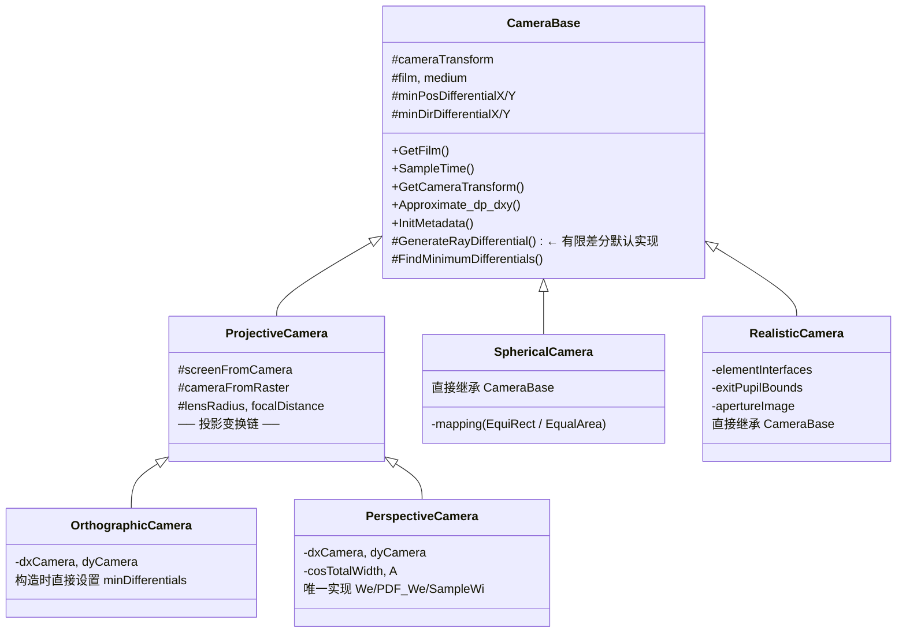

# cameras.h / cameras.cpp — 相机模型实现

## 第一部分：概述与物理背景

相机是渲染管线的起点：它将图像平面上的像素坐标映射为场景空间中的光线。积分器调用 `Camera::GenerateRay`（或 `GenerateRayDifferential`）获取光线后，沿该光线追踪场景并计算颜色。

`base/camera.h` 定义了 `Camera` 的 **10 个接口方法**（参见 [camera.md](../base/camera.md)），而 `cameras.h` / `cameras.cpp` 提供了 **4 种具体实现**：

| 相机 | 一句话定位 |
|------|-----------|
| **OrthographicCamera** | 平行投影，光线方向恒定，适用于工程制图和 CAD 预览 |
| **PerspectiveCamera** | 经典透视投影（针孔/薄透镜），最常用的相机模型 |
| **SphericalCamera** | 360° 球面映射，用于环境贴图和全景渲染 |
| **RealisticCamera** | 基于物理透镜元件描述文件的真实光学系统模拟 |

---

## 第二部分：继承体系与设计思路

### 三层继承关系



### 设计决策：为什么 Spherical 和 Realistic 直接继承 CameraBase

`ProjectiveCamera` 封装的是**投影矩阵变换链**（Camera → Screen → NDC → Raster），依赖一个线性投影矩阵 `screenFromCamera` 将相机空间映射到屏幕空间。这对 Orthographic（正交投影矩阵）和 Perspective（透视投影矩阵）是自然的。

但 SphericalCamera 将像素坐标映射到球面方向（非线性映射），RealisticCamera 通过物理透镜折射生成光线——两者都无法用一个 4×4 投影矩阵描述。因此它们跳过 `ProjectiveCamera`，直接继承 `CameraBase`。

### TaggedPointer 分派与 AllInheritFrom 优化

`Camera` 是一个 `TaggedPointer<PerspectiveCamera, OrthographicCamera, SphericalCamera, RealisticCamera>`，大多数接口通过 `Dispatch` 进行动态分派。

`Approximate_dp_dxy` 是一个例外：由于所有四种相机都继承自 `CameraBase`，且该方法在 `CameraBase` 中有统一实现，编译器通过 `AllInheritFrom<CameraBase>(Camera::Types())` 检查后，可以直接将 `TaggedPointer` 的内部指针 `static_cast` 为 `CameraBase*` 并调用，绕过 `Dispatch` 的类型分支判断，减少了运行时开销。

---

## 第三部分：四种相机的物理模型

### 1. OrthographicCamera — 正交投影

**物理原型**：无穷远处的望远镜、工程制图视图。所有光线互相平行，无近大远小的透视效果。

**光线生成几何**：
```
胶片平面 (z=0)             场景
  ●──────────→ (0,0,1)     物体保持真实比例
  ●──────────→ (0,0,1)     所有光线方向相同
  ●──────────→ (0,0,1)     原点由像素位置决定
```

**关键参数**：
- `screenWindow`：控制视野范围（相机空间中可见区域的边界）
- `lensRadius` > 0 时启用薄透镜景深模型（正交+景深组合较少见，但实现上支持）

**特殊之处**：构造时**直接设置** `minPosDifferentialX/Y = dxCamera/dyCamera`，`minDirDifferentialX/Y = (0,0,0)`，不调用 `FindMinimumDifferentials`。原因：正交投影中所有光线方向相同，位置微分等于固定的像素偏移，不随像素位置变化，是常量。

**适用场景**：建筑可视化、工程图纸渲染、2D 游戏或 UI 元素渲染。

### 2. PerspectiveCamera — 透视投影

**物理原型**：针孔相机（`lensRadius = 0`）或带光圈的薄透镜相机（`lensRadius > 0`）。

**光线生成几何**：
```
                    场景
                  ／
  原点 (0,0,0) ——— 像素方向 → 光线方向由像素位置决定
                  ＼
                    近处物体大，远处物体小
```

**关键参数**：
- `fov`：视场角（field of view），决定画面的宽广程度
- `lensRadius`：光圈半径。= 0 时为理想针孔（全景深锐利），> 0 时启用景深模糊
- `focalDistance`：对焦距离，景深效果中清晰的平面位置
- `cosTotalWidth`：视野边缘方向与光轴的余弦值，用于裁剪超出视野的光线
- `A`：z=1 平面上的图像面积，用于 BDPT 的重要度计算

**特殊之处**：**唯一实现了双向渲染接口**（`We`、`PDF_We`、`SampleWi`）的相机。原因是透视投影有明确的 cos⁴θ 衰减公式，可以解析地表达相机重要度函数。构造时调用 `FindMinimumDifferentials` 预计算微分。

**适用场景**：绝大多数渲染任务的默认选择。

### 3. SphericalCamera — 球面相机

**物理原型**：360° 全景相机、环境贴图捕获设备。

**光线生成几何**：
```
  所有光线从原点 (0,0,0) 出发，
  方向覆盖整个球面 4π 立体角。
  像素坐标 (u,v) 通过映射函数转换为球面方向。
```

**两种映射模式**：

| 映射 | 公式 | 特点 |
|------|------|------|
| `EquiRectangular` | θ = π·v, φ = 2π·u | 经纬度映射，极点处有拉伸畸变 |
| `EqualArea` | `EqualAreaSquareToSphere(u,v)` | 等面积映射，球面各处采样密度一致 |

**注意 y/z 交换**：球面方向计算函数（`SphericalDirection`、`EqualAreaSquareToSphere`）默认使用 z-up 约定，但 pbrt 的相机空间是 y-up（朝 +z 看），因此生成方向后需要 `swap(dir.y, dir.z)`。

**适用场景**：环境贴图生成、360° VR 内容渲染、光照探针捕获。

### 4. RealisticCamera — 真实透镜系统

**物理原型**：真实照相机的多元件透镜组（如 50mm 标准镜头、广角镜头等）。

**光线生成几何**：
```
  胶片 (z=0)    透镜元件组          场景
    ●  ────→  |) ( |) ( |  ────→  光线经过多次折射
    采样出瞳    光圈   前镜片       可能被光圈或孔径截断（渐晕）
```

**构造过程**（四个阶段）：
1. **解析透镜文件**：读取每个元件的曲率半径、厚度、折射率、孔径半径
2. **设置光圈**：将用户指定的光圈直径应用到光圈元件（`curvatureRadius == 0` 的元件）
3. **厚透镜对焦**：通过 `FocusThickLens` 计算透镜组到胶片的距离，使指定对焦距离处的物体成像清晰
4. **预计算出瞳边界**：沿胶片半径方向划分 64 个区间，对每个区间调用 `BoundExitPupil` 预计算出瞳包围盒

**关键概念**：
- **出瞳（exit pupil）**：从胶片上某点看过去，能通过整个透镜系统的光线所覆盖的区域。预计算出瞳边界避免了对无效方向的无谓采样
- **渐晕（vignetting）**：靠近画面边缘的光线更容易被透镜孔径截断，导致画面边缘自然变暗
- **光圈形状**：除了标准圆形光圈，支持高斯、方形、五边形、星形和自定义图像，影响散景（bokeh）的形状

**适用场景**：需要物理精确的光学效果（真实景深、畸变、渐晕、色散等）。

---

## 第四部分：接口实现对比

### 接口总览表

各行为 4 种相机 + CameraBase，列为 10 个 Camera 接口方法。标注每个方法的实现来源：

| 方法 | CameraBase | Orthographic | Perspective | Spherical | Realistic |
|------|-----------|-------------|------------|----------|----------|
| `GenerateRay` | — | 自己实现 | 自己实现 | 自己实现 | 自己实现 |
| `GenerateRayDifferential` | 有限差分默认实现 | 自己实现(解析) | 自己实现(解析) | 继承默认 | 继承默认 |
| `GetFilm` | 实现 | 继承 | 继承 | 继承 | 继承 |
| `SampleTime` | 实现 | 继承 | 继承 | 继承 | 继承 |
| `GetCameraTransform` | 实现 | 继承 | 继承 | 继承 | 继承 |
| `Approximate_dp_dxy` | 实现 | 继承 | 继承 | 继承 | 继承 |
| `InitMetadata` | 实现 | 继承(Projective) | 继承(Projective) | 继承 | 继承 |
| `We` | — | LOG_FATAL | **自己实现** | LOG_FATAL | LOG_FATAL |
| `PDF_We` | — | LOG_FATAL | **自己实现** | LOG_FATAL | LOG_FATAL |
| `SampleWi` | — | LOG_FATAL | **自己实现** | LOG_FATAL | LOG_FATAL |

### GenerateRay 对比

四种相机的核心差异在于如何从采样参数构造光线：

| | 光线原点 | 光线方向 | 景深支持 |
|---|---------|---------|---------|
| **Orthographic** | `cameraFromRaster(pFilm)`（像素位置映射到相机空间） | 固定 `(0, 0, 1)` | 薄透镜模型 |
| **Perspective** | 固定 `(0, 0, 0)` | `Normalize(pCamera)`（由像素位置决定） | 薄透镜模型 |
| **Spherical** | 固定 `(0, 0, 0)` | 球面映射方向（EquiRect 或 EqualArea） | 不支持 |
| **Realistic** | 胶片上的物理位置 | 经多个透镜元件折射后确定 | 物理透镜（非模型） |

正交和透视相机的景深实现方式相同：在圆形光圈上均匀采样一点 `pLens`，计算焦平面上的对焦点 `pFocus`，然后将光线从 `pLens` 指向 `pFocus`。差异仅在于初始光线的构造方式。

### GenerateRayDifferential 对比

| | 实现方式 | 理由 |
|---|---------|------|
| **Orthographic** | 解析计算：无景深时微分是纯平移（`rxOrigin = o + dxCamera`，方向不变） | 正交投影的位置/方向微分是常量 |
| **Perspective** | 解析计算：无景深时原点不变、方向偏移（`rxDirection = Normalize(pCamera + dxCamera)`） | 透视投影微分可以预计算 |
| **Spherical** | 使用 `CameraBase::GenerateRayDifferential`（±0.05 像素有限差分） | 球面映射的非线性使解析微分复杂 |
| **Realistic** | 使用 `CameraBase::GenerateRayDifferential`（±0.05 像素有限差分） | 透镜折射路径无解析公式 |

### 双向接口（We / PDF_We / SampleWi）对比

**仅 PerspectiveCamera 实现**了这三个方法，其余三种相机调用时会触发 `LOG_FATAL`。

为什么只有透视相机适合实现？因为透视投影有明确的解析公式：

- `We = 1 / (A · lensArea · cos⁴θ)` — cos⁴θ 衰减来自投影几何（立体角缩小 + 面积拉伸）
- `pdfPos = 1 / lensArea` — 在镜头上均匀采样
- `pdfDir = 1 / (A · cos³θ)` — 方向 PDF 与 We 对偶

正交相机的平行光线模型无法定义有意义的方向 PDF；球面和真实透镜相机的辐射度分布没有简洁的解析形式（RealisticCamera 需要蒙特卡洛积分来估计这些量，代价太高）。

---

## 第五部分：共享基础设施详解

### CameraTransform

`CameraTransform` 管理 Camera space ↔ Render space ↔ World space 之间的变换。

**三种渲染空间模式**（由 `Options->renderingSpace` 控制）：

| 模式 | `worldFromRender` | 优点 | 缺点 |
|------|-------------------|------|------|
| `Camera` | 快门中点时刻的 worldFromCamera | 相机附近数值精度最高 | 相机运动导致场景在渲染空间中移动，需要处理运动模糊 |
| `CameraWorld` | 仅平移到相机位置 | 轴向对齐世界坐标，减少方向相关的数值误差 | 平衡方案 |
| `World` | 单位矩阵（Render = World） | 最简单，直觉清晰 | 相机远离原点时浮点精度下降 |

关键设计：`renderFromCamera` 使用 `AnimatedTransform`（支持两端插值），因此相机可以在快门时间内运动以产生运动模糊。`worldFromRender` 则是静态的 `Transform`，因为渲染空间在一帧内不变。

### CameraBase 通用方法

#### FindMinimumDifferentials

在构造时沿图像对角线采样 512 个像素，对每个像素生成 `RayDifferential`，取所有采样中模长最小的位置微分和方向微分。这些值用于 `Approximate_dp_dxy` 的保守估计。

详细原理参见 [camera.md 中的 Approximate_dp_dxy 章节](../base/camera.md)。

#### Approximate_dp_dxy

利用 `FindMinimumDifferentials` 预计算的最小微分，在任意表面交点处近似计算 dp/dx 和 dp/dy。核心思路：在以主光线方向为 z 轴的坐标系中，用预计算微分构造近似偏移光线，与表面切平面求交，得到像素偏移引起的表面位置变化。

详细计算流程（8 步）参见 [camera.md 中的深度解析](../base/camera.md)。

#### GenerateRayDifferential 默认实现

`CameraBase::GenerateRayDifferential` 是一个静态方法，提供通用的有限差分实现：

1. 调用 `GenerateRay(sample)` 得到主光线
2. 在 x 方向偏移 ±0.05 像素，生成偏移光线，计算 `rxOrigin` 和 `rxDirection`
3. 在 y 方向同理计算 `ryOrigin` 和 `ryDirection`
4. 将差值除以偏移量（0.05），得到每像素的微分近似

为什么选 ±0.05 而不是 ±1？较小的偏移更接近真实导数，同时避免偏移到无效区域（如球面相机的边缘、真实透镜的渐晕区域）。先尝试 +0.05，失败则回退到 -0.05。

### ProjectiveCamera 变换链

投影相机的核心是一条变换链，将像素坐标映射到相机空间中的点：

```
Raster space  ──screenFromRaster──→  Screen space  ──screenFromCamera⁻¹──→  Camera space
  (像素坐标)                         (归一化屏幕)                           (3D 相机坐标)
```

完整链路：

```
Camera ──screenFromCamera──→ Screen ──NDCFromScreen──→ NDC ──rasterFromNDC──→ Raster
```

- `screenFromCamera`：由子类提供。OrthographicCamera 传入 `Orthographic(0, 1)`，PerspectiveCamera 传入 `Perspective(fov, near, far)`
- `NDCFromScreen`：将 screenWindow 归一化到 [0,1] 范围
- `rasterFromNDC`：缩放到像素分辨率（`film.FullResolution()`）
- `cameraFromRaster`：`Inverse(screenFromCamera) * screenFromRaster`，是光线生成时直接使用的变换

### 薄透镜景深模型

`ProjectiveCamera` 为 OrthographicCamera 和 PerspectiveCamera 提供了统一的薄透镜景深（depth of field）支持。当 `lensRadius > 0` 时启用。

#### 物理背景

理想针孔相机（`lensRadius = 0`）的光圈无限小，所有物体都完美锐利——但通光量也无限小。现实相机使用有限大小的透镜/光圈来收集更多光线，代价是只有对焦距离（`focalDistance`）处的物体清晰成像，偏离焦平面的物体会产生弥散圆（circle of confusion），表现为模糊。

薄透镜模型是对此效应的一阶近似：假设透镜无限薄，所有折射发生在同一平面上。核心性质是**焦平面上的所有光线，无论从透镜的哪个位置出发，都会汇聚到同一个点**。

#### 几何原理

薄透镜的核心性质：**从镜头上任意位置出发、指向焦平面上同一点的光线，经过透镜折射后方向一致**。这意味着焦平面上的物体始终成像清晰，而偏离焦平面的物体因光线发散产生模糊。

**图 1：焦平面上的物体 → 清晰（光线汇聚）**

```
     镜头 (z=0)                         焦平面 (z=fd)
        │                                   │
        │                                   │
  p₁  ──●━━━━━━━━━━━━━━━━━━━━━━━━━━━━━━━╲   │
        │                                ╲  │
  p₂  ──●━━━━━━━━━━━━━━━━━━━━━━━━━━━━━━━━━● pFocus ← 所有光线汇聚
        │                                ╱  │         于同一点
  p₃  ──●━━━━━━━━━━━━━━━━━━━━━━━━━━━━━━━╱   │
        │                                   │
        │  三个不同的镜头采样点               │  同一个像素的三次采样
        │  (p₁, p₂, p₃)                     │  都命中 pFocus → 清晰
```

**图 2：焦平面外的物体 → 模糊（光线发散）**

```
     镜头 (z=0)             焦平面              物体 (z > fd)
        │                      │                    │
        │                      │                    │
  p₁  ──●━━━━━━━━━━━━━━━━╲    │              ╱━━━━━● hit₁
        │                 ╲   │           ╱━━━━━━  │
  p₂  ──●━━━━━━━━━━━━━━━━━━● pFocus ━━━━━━━━━━━━━━● hit₂
        │                 ╱   │           ╲━━━━━━  │
  p₃  ──●━━━━━━━━━━━━━━━━╱    │              ╲━━━━━● hit₃
        │                      │                    │
        │  光线在焦平面汇聚      │  焦平面之后重新发散  │  命中不同位置
        │                      │                    │  → 弥散圆(模糊)
```

**图 3：算法步骤（以透视相机为例）**

```
  Step ① 生成针孔光线          Step ② 求焦平面交点         Step ③④ 从 pLens 出发

  origin                       origin        焦平面         pLens         焦平面
    ●━━━━━━━━━━━━━→              ●─ ─ ─ ─ ─ ─ ─● pFocus       ●━━━━━━━━━━━● pFocus
    (0,0,0)  方向 d               针孔光线延伸    │              ╲         ╱
                                  到焦平面        │              实际发射光线
                                                  │
```

- **无景深**（`lensRadius = 0`）：光线从固定原点沿确定方向出发，一个像素对应一条光线
- **有景深**（`lensRadius > 0`）：同一个像素需要多次采样（不同的 `sample.pLens`），每次从镜头上不同位置出发。如图 1 和图 2 所示，焦平面上的物体始终被命中同一点（清晰），焦平面外的物体被命中不同点（模糊）

#### 实现步骤

两种投影相机共享相同的景深实现逻辑，代码位于 `GenerateRay` 中：

```cpp
if (lensRadius > 0) {
    // 1. 在圆形镜头上均匀采样一个点
    Point2f pLens = lensRadius * SampleUniformDiskConcentric(sample.pLens);

    // 2. 计算无景深光线与焦平面的交点（焦平面位于 z = focalDistance）
    Float ft = focalDistance / ray.d.z;
    Point3f pFocus = ray(ft);

    // 3. 将光线原点移到镜头采样点，方向指向焦平面交点
    ray.o = Point3f(pLens.x, pLens.y, 0);
    ray.d = Normalize(pFocus - ray.o);
}
```

**步骤解读**：

1. `SampleUniformDiskConcentric` 将 `[0,1)²` 的均匀随机数映射为单位圆盘上的均匀采样点，乘以 `lensRadius` 得到镜头平面上的物理位置
2. `ft = focalDistance / ray.d.z` 计算原始光线到达焦平面的参数 t（焦平面与 z 轴垂直，位于 `z = focalDistance`）
3. `pFocus = ray(ft)` 得到焦平面上的交点——这是"无论从镜头何处出发都应命中的点"
4. 将光线原点替换为镜头采样点，方向指向 `pFocus`

#### 正交 vs 透视的差异

虽然景深代码形式相同，但**进入景深逻辑前的初始光线不同**，导致 `pFocus` 的计算结果不同：

| | 初始光线原点 | 初始光线方向 | pFocus 的含义 |
|---|---|---|---|
| **Orthographic** | `cameraFromRaster(pFilm)` | `(0, 0, 1)` | 像素正前方焦平面上的点 |
| **Perspective** | `(0, 0, 0)` | `Normalize(pCamera)` | 像素方向延伸到焦平面的交点 |

对于正交相机，由于初始方向恒为 `(0,0,1)`，`ft = focalDistance / 1 = focalDistance`，`pFocus` 就是像素位置正前方 `focalDistance` 处的点。这意味着正交相机的景深模糊模式与透视相机不同——没有汇聚/发散的效果，只有纯粹的平移模糊。

#### 景深对光线微分的影响

`GenerateRayDifferential` 中，景深的处理逻辑稍有不同：

**Orthographic 有景深时**：
```cpp
// 偏移像素的焦平面交点（注意：方向是 (0,0,1)，所以用 dxCamera 做位置偏移）
Point3f pFocus = pCamera + dxCamera + (ft * Vector3f(0, 0, 1));
ray.rxOrigin = Point3f(pLens.x, pLens.y, 0);  // 原点同一个镜头采样点
ray.rxDirection = Normalize(pFocus - ray.rxOrigin);
```

**Perspective 有景深时**：
```cpp
// 偏移像素的方向（先偏移相机空间坐标再归一化）
Vector3f dx = Normalize(Vector3f(pCamera + dxCamera));
Float ft = focalDistance / dx.z;
Point3f pFocus = Point3f(0, 0, 0) + (ft * dx);
ray.rxOrigin = Point3f(pLens.x, pLens.y, 0);
ray.rxDirection = Normalize(pFocus - ray.rxOrigin);
```

关键差异：正交相机偏移的是**位置**（`pCamera + dxCamera`），透视相机偏移的是**方向**（`Normalize(pCamera + dxCamera)`）。但两者都从同一个镜头采样点出发，指向各自偏移后的焦平面交点。

无景深时的微分则简单得多：正交相机仅平移原点（方向不变），透视相机仅改变方向（原点不变）。景深的引入使得微分光线的原点和方向都可能与主光线不同。

---

## 第六部分：各相机详细实现

### OrthographicCamera

#### 构造过程

```cpp
OrthographicCamera(...)
    : ProjectiveCamera(..., Orthographic(0, 1), ...) {
    dxCamera = cameraFromRaster(Vector3f(1, 0, 0));  // 光栅 x 方向一个像素对应的相机空间偏移
    dyCamera = cameraFromRaster(Vector3f(0, 1, 0));  // 光栅 y 方向一个像素对应的相机空间偏移

    // 正交投影的微分是常量，直接赋值，无需采样计算
    minDirDifferentialX = minDirDifferentialY = Vector3f(0, 0, 0);
    minPosDifferentialX = dxCamera;
    minPosDifferentialY = dyCamera;
}
```

**设计决策**：正交投影中光线方向恒为 `(0,0,1)`，不随像素位置变化，因此方向微分为零。位置微分就是 `cameraFromRaster` 对一个像素偏移的变换结果，也是常量。不需要调用 `FindMinimumDifferentials` 做采样搜索。

#### GenerateRay

核心逻辑：将像素坐标通过 `cameraFromRaster` 变换到相机空间作为光线原点，方向固定为 `(0,0,1)`。

```cpp
Point3f pCamera = cameraFromRaster(Point3f(sample.pFilm.x, sample.pFilm.y, 0));
Ray ray(pCamera, Vector3f(0, 0, 1), ...);
```

若启用景深（`lensRadius > 0`），则在镜头上采样、计算焦平面交点、重定向光线——与 PerspectiveCamera 的景深逻辑相同。

#### GenerateRayDifferential

无景深时，微分光线的计算极其简单：
- 原点平移：`rxOrigin = o + dxCamera`，`ryOrigin = o + dyCamera`
- 方向不变：`rxDirection = ryDirection = d`

有景深时，需要在焦平面上重新计算偏移一个像素后的交点，再从同一个镜头采样点指向新交点。

### PerspectiveCamera

#### 构造过程

```cpp
PerspectiveCamera(..., Float fov, ...)
    : ProjectiveCamera(..., Perspective(fov, 1e-2f, 1000.f), ...) {
    // 预计算像素偏移在相机空间中的方向差
    dxCamera = cameraFromRaster(Point3f(1,0,0)) - cameraFromRaster(Point3f(0,0,0));
    dyCamera = cameraFromRaster(Point3f(0,1,0)) - cameraFromRaster(Point3f(0,0,0));

    // 计算视野边缘余弦：从 raster 最角落的像素方向得到
    cosTotalWidth = Normalize(Vector3f(cameraFromRaster(pCorner))).z;

    // 计算 z=1 平面上的图像面积 A，用于 We/PDF_We
    A = abs((pMax.x - pMin.x) * (pMax.y - pMin.y));  // pMin/pMax 已投影到 z=1

    FindMinimumDifferentials(this);  // 采样搜索最小微分
}
```

**为什么 dxCamera 的计算方式与正交相机不同？** 正交相机中 `cameraFromRaster` 对向量和点的变换结果相同（无透视除法）。透视相机中必须用两个点的差值才能得到正确的方向偏移。

**cosTotalWidth 的用途**：在 `We` 和 `PDF_We` 中，光线方向与光轴夹角的余弦若小于 `cosTotalWidth`，直接返回零——该方向已超出相机视野。

**A 的用途**：z=1 平面上的图像面积，出现在 `We = 1/(A·lensArea·cos⁴θ)` 的分母中，确保重要度函数在整个视野上积分为 1。

#### GenerateRay

核心逻辑：光线从原点 `(0,0,0)` 出发，方向为像素位置在相机空间中的归一化向量。

```cpp
Point3f pCamera = cameraFromRaster(Point3f(sample.pFilm.x, sample.pFilm.y, 0));
Ray ray(Point3f(0,0,0), Normalize(Vector3f(pCamera)), ...);
```

与正交相机对比：正交相机的"信息"在原点（随像素变化），透视相机的"信息"在方向（随像素变化）。

#### GenerateRayDifferential

无景深时：
- 原点不变：`rxOrigin = ryOrigin = o`
- 方向偏移：`rxDirection = Normalize(Vector3f(pCamera) + dxCamera)`

这里直接用预计算的 `dxCamera` 偏移相机空间坐标，然后重新归一化，得到偏移一个像素后的方向。

有景深时：每个偏移方向都需要独立计算焦平面交点和从镜头采样点出发的新光线方向。

#### BDPT 接口：We / PDF_We / SampleWi

**We（相机重要度函数）**：

物理意义：如果把相机当作"光源"，`We` 描述了它在各方向"发射"的重要度强度。推导来自投影几何：

1. 计算光线方向与光轴的夹角余弦 `cosθ`
2. 若 `cosθ ≤ cosTotalWidth`，超出视野，返回 0
3. 通过焦平面反投影光线到光栅坐标，检查是否在采样边界内
4. 返回 `1 / (A · lensArea · cos⁴θ)`

cos⁴θ 衰减的物理来源：cos²θ 来自光线斜射时立体角缩小，另一个 cos²θ 来自像平面上的面积拉伸。

**PDF_We**：

将相机发射光线的概率分解为位置和方向两个独立分量：
- `pdfPos = 1 / lensArea`：在镜头面积上均匀采样
- `pdfDir = 1 / (A · cos³θ)`：与 We 对偶（We 多了一个 cosθ 来自立体角到面积的转换）

**SampleWi**：

从场景中的参考点 `ref` 向相机采样一个连接方向：
1. 在镜头上均匀采样一点 `pLens`
2. 计算从 `ref` 到 `pLens` 的方向 `wi` 和距离 `dist`
3. 计算 PDF（考虑面积到立体角的转换）：`pdf = dist² / (|cosθ_lens| · lensArea)`
4. 调用 `We` 获取该方向的重要度
5. 返回 `CameraWiSample{Wi, wi, pdf, pRaster, ref, lensIntr}`

### SphericalCamera

#### 构造过程

构造函数仅存储 `mapping` 类型（`EquiRectangular` 或 `EqualArea`），然后调用 `FindMinimumDifferentials(this)` 预计算微分。

#### GenerateRay

```cpp
// 将像素坐标归一化到 [0,1]
Point2f uv(sample.pFilm.x / film.FullResolution().x,
           sample.pFilm.y / film.FullResolution().y);

Vector3f dir;
if (mapping == EquiRectangular) {
    Float theta = Pi * uv[1], phi = 2 * Pi * uv[0];
    dir = SphericalDirection(sin(theta), cos(theta), phi);
} else {
    uv = WrapEqualAreaSquare(uv);   // 处理边界环绕
    dir = EqualAreaSquareToSphere(uv);
}
pstd::swap(dir.y, dir.z);  // z-up → y-up 转换
```

**y/z 交换的原因**：`SphericalDirection` 和 `EqualAreaSquareToSphere` 遵循数学约定中 z 轴为极轴的球坐标系。pbrt 的相机空间中相机朝 +z 看、y 轴朝上。交换 y 和 z 使得球面映射的"北极"对应相机的"上方"。

#### GenerateRayDifferential

直接委托给 `CameraBase::GenerateRayDifferential(this, sample, lambda)`，使用有限差分。

### RealisticCamera

#### 构造过程详解

**阶段一：透镜文件解析**

透镜参数以 4 个一组的浮点数读入，每组表示一个元件：`(曲率半径, 厚度, 折射率, 孔径直径)`。单位从 mm 转换为 m（除以 1000）。`curvatureRadius == 0` 的元件是光圈挡板。

**阶段二：光圈设置**

用户指定的 `apertureDiameter` 应用到光圈元件。若用户值大于文件中的最大值，则 clamp 并发出警告。

**阶段三：厚透镜对焦**

`FocusThickLens(focusDistance)` 调整透镜组到胶片的距离，使指定距离处的物体成像清晰：

1. `ComputeThickLensApproximation`：分别从场景侧和胶片侧发射平行光线穿过透镜组，通过 `ComputeCardinalPoints` 计算两侧的主点位置 `pz[]` 和焦点位置 `fz[]`
2. 利用薄透镜公式 `1/f = 1/do + 1/di` 的厚透镜版本，求解透镜需要的位移量 `delta`
3. 将 `delta` 加到最后一个元件的厚度上（即调整胶片到最近透镜元件的距离）

**阶段四：出瞳预计算**

将胶片半径方向等分为 64 个区间。对每个区间，`BoundExitPupil` 用 1M 个样本暴力搜索能通过整个透镜系统的后镜片上的点，构建包围盒。包围盒用 `Expand` 略微扩展以补偿采样间距。

这一预计算使得 `GenerateRay` 中的出瞳采样只需在包围盒内均匀采样，大大减少无效光线（否则大多数随机方向的光线都会被透镜孔径截断）。

#### GenerateRay

```
采样点 pFilm → 映射到胶片物理尺寸 → SampleExitPupil 得到出瞳点
→ 构造 pFilm→pPupil 光线 → TraceLensesFromFilm 追踪透镜
→ 成功则变换到渲染空间并计算权重
```

**权重计算**：`weight = tracingWeight × cos⁴θ / (exitPupilPDF × LensRearZ²)`

- `tracingWeight`：来自 `TraceLensesFromFilm`，通常为 1，但使用光圈图像时可能小于 1
- `cos⁴θ`：胶片上的 cosine 权重
- 除以 `exitPupilPDF × LensRearZ²`：补偿出瞳采样的 PDF，并将后镜片面积上的密度转换为立体角密度

#### TraceLensesFromFilm / TraceLensesFromScene

这两个方法是透镜光线追踪的核心，方向相反：

- `TraceLensesFromFilm`：光线从胶片侧进入，从后到前遍历元件（`i = size-1 → 0`）
- `TraceLensesFromScene`：光线从场景侧进入，从前到后遍历元件（`i = 0 → size-1`）

**透镜空间约定**：在透镜空间中 z 轴翻转（`Scale(1,1,-1)`），因此进入和离开透镜系统时都需要做 z 翻转变换。这样做的原因是让光线沿 +z 方向传播通过透镜，简化交点计算。

**逐元件处理**：
1. 计算光线与元件的交点（球面元件用 `IntersectSphericalElement`，光圈用平面求交）
2. 检查交点是否在孔径半径内（光圈元件还检查光圈图像）
3. 若非光圈，通过 Snell 定律折射光线（`Refract` 函数，传入相邻元件的折射率比）

#### 出瞳采样优化

`SampleExitPupil` 的工作流程：

1. 根据胶片上采样点到中心的距离 `rFilm`，查找对应的出瞳包围盒
2. 在包围盒内均匀采样一个 2D 点
3. 将采样点旋转到与 `pFilm` 方向一致的角度（利用 `sinTheta`/`cosTheta` 的旋转矩阵）
4. 返回出瞳点和采样 PDF

旋转的原因：出瞳包围盒是在 `pFilm` 沿 x 轴时预计算的，但实际的 `pFilm` 可能在任意方向。利用透镜系统的旋转对称性，只需预计算不同半径处的包围盒，然后旋转到实际角度即可。

#### 光圈形状支持

`RealisticCamera::Create` 支持以下光圈形状：

| 形状 | 实现方式 |
|------|---------|
| 圆形（默认） | 不设置 `apertureImage`，使用孔径半径的圆形裁剪 |
| `gaussian` | 生成高斯衰减的 256×256 灰度图 |
| `square` | 中心 50% 区域为亮，其余为暗 |
| `pentagon` | 正五边形顶点光栅化 |
| `star` | 五角星顶点光栅化 |
| 自定义图像 | 读取用户提供的图像文件 |

所有光圈图像在创建后会归一化亮度，使其整体通光量匹配圆形光圈（乘以 `(π/4) / avg` 的缩放因子）。

---

## 第七部分：依赖关系

**依赖**：`pbrt/base/camera.h`、`pbrt/base/film.h`、`pbrt/base/medium.h`、`pbrt/film.h`、`pbrt/interaction.h`、`pbrt/ray.h`、`pbrt/samplers.h`、`pbrt/bsdf.h`、`pbrt/filters.h`、`pbrt/options.h`、`pbrt/paramdict.h`、`pbrt/util/image.h`、`pbrt/util/scattering.h`、`pbrt/util/math.h`、`pbrt/util/lowdiscrepancy.h`、`pbrt/util/parallel.h`

**被依赖**：`pbrt/interaction.cpp`、`pbrt/film.cpp`、`pbrt/lights.cpp`、`pbrt/samplers.cpp`、`pbrt/scene.h`、`pbrt/cpu/integrators.h`、`pbrt/cpu/integrators.cpp`、`pbrt/cpu/render.cpp`、`pbrt/wavefront/camera.cpp`、`pbrt/wavefront/integrator.cpp`、`pbrt/wavefront/surfscatter.cpp`
