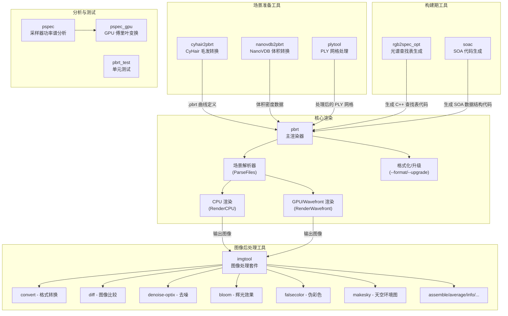
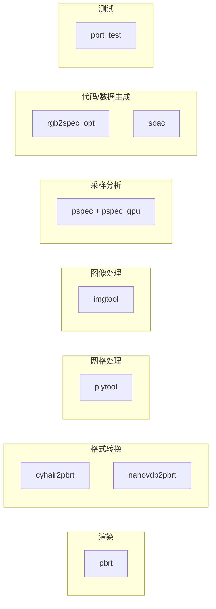
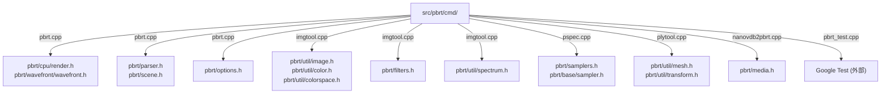
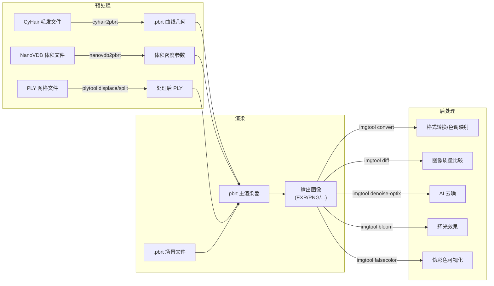
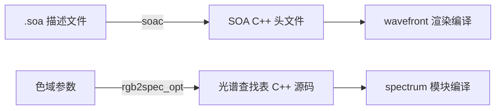
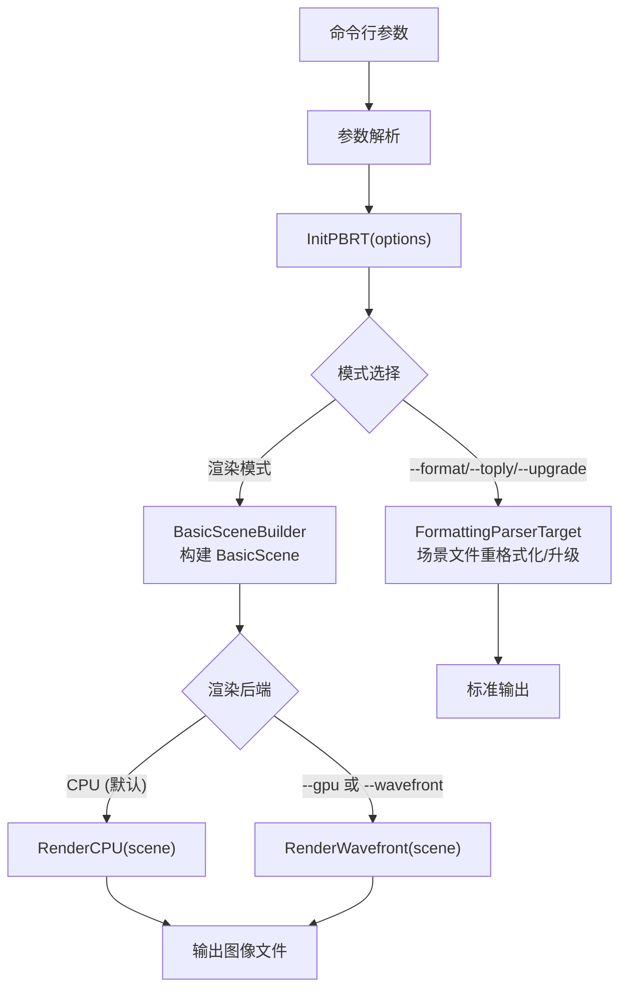

# PBRT-v4 命令行工具 (`src/pbrt/cmd/`)

## 概述

本目录包含 PBRT-v4 物理渲染系统的所有命令行工具入口程序。这些工具涵盖了渲染系统的完整工作流程，包括核心渲染器、图像处理与转换、场景格式转换、网格处理、采样器分析、光谱优化以及代码生成等功能。每个 `.cpp` 文件编译后生成一个独立的可执行文件，共同构成了 PBRT 项目的命令行工具集。

## 文件列表

| 文件名 | 生成的可执行文件 | 功能说明 |
|--------|-----------------|---------|
| `pbrt.cpp` | `pbrt` | 核心渲染器主程序，解析场景文件并执行光线追踪渲染 |
| `imgtool.cpp` | `imgtool` | 综合图像处理工具，提供十余种图像操作子命令 |
| `cyhair2pbrt.cpp` | `cyhair2pbrt` | 将 CyHair 毛发格式转换为 PBRT 曲线几何体 |
| `nanovdb2pbrt.cpp` | `nanovdb2pbrt` | 将 NanoVDB 体积数据转换为 PBRT 体积介质格式 |
| `plytool.cpp` | `plytool` | PLY 网格文件的查看、信息获取、位移映射和分割 |
| `pspec.cpp` | `pspec` | 采样点集的功率谱分析工具（CPU 端逻辑） |
| `pspec_gpu.cpp` | _(pspec 的 GPU 部分)_ | 采样器功率谱分析的 GPU/CUDA 加速代码 |
| `rgb2spec_opt.cpp` | `rgb2spec_opt` | RGB 到光谱的查找表优化生成器 |
| `soac.cpp` | `soac` | Structure-of-Arrays (SOA) 代码自动生成编译器 |
| `pbrt_test.cpp` | `pbrt_test` | 基于 Google Test 的单元测试运行器 |

## 架构图

### 工具与渲染管线关系



### 工具分类视图



## 核心类与接口

### 1. `pbrt` -- 主渲染器

文件 `pbrt.cpp` 是整个渲染系统的入口点。其核心流程如下：

1. 解析命令行参数填充 `PBRTOptions` 结构体
2. 调用 `InitPBRT(options)` 初始化渲染系统
3. 根据模式分支：
   - **格式化模式** (`--format`/`--toply`/`--upgrade`)：通过 `FormattingParserTarget` 对场景文件进行重新格式化或版本升级
   - **渲染模式**：通过 `BasicSceneBuilder` 构建 `BasicScene`，然后调用 `RenderCPU()` 或 `RenderWavefront()` 执行渲染

**主要命令行参数：**

| 参数 | 说明 |
|------|------|
| `--gpu` | 启用 GPU 渲染（需编译 GPU 支持） |
| `--wavefront` | 使用 wavefront 体积路径积分器 |
| `--nthreads <n>` | 指定渲染线程数 |
| `--spp <n>` | 覆盖每像素采样数 |
| `--outfile <filename>` | 指定输出图像文件名 |
| `--cropwindow <x0,x1,y0,y1>` | 指定 [0,1]^2 范围的裁剪窗口 |
| `--pixel <x,y>` | 仅渲染指定像素（调试用） |
| `--quick` | 快速渲染模式（自动降低质量） |
| `--interactive` | 交互式渲染模式（仅 GPU/wavefront） |
| `--format` | 重新格式化场景文件（不执行渲染） |
| `--upgrade` | 将 pbrt-v3 场景升级为 v4 格式 |
| `--toply` | 格式化并将三角网格转换为 PLY 文件 |
| `--seed <n>` | 设置随机数种子 |
| `--stats` | 渲染完成后打印统计信息 |
| `--render-coord-sys <name>` | 渲染坐标系（camera/cameraworld/world） |

### 2. `imgtool` -- 图像处理套件

`imgtool.cpp` 是一个基于子命令架构的综合图像处理工具，支持以下子命令：

| 子命令 | 功能 |
|--------|------|
| `assemble` | 将多个裁剪区域图像组装为完整图像 |
| `average` | 对多张图像求平均值 |
| `bloom` | 对高亮像素施加辉光效果 |
| `cat` | 将图像像素值输出到标准输出 |
| `convert` | 图像格式转换与处理（色调映射、裁剪、缩放、色彩空间转换等） |
| `diff` | 图像差异比较（支持 MAE/MSE/MRSE/FLIP 指标） |
| `denoise-optix` | 使用 OptiX 深度学习模型去噪（需 GPU） |
| `scale-optix` | 使用 OptiX 进行 2 倍超分辨率（需 GPU） |
| `error` | 计算一组图像相对于参考图像的平均误差 |
| `falsecolor` | 生成伪彩色可视化图像 |
| `info` | 输出图像元信息（分辨率、色彩空间、像素统计） |
| `makeequiarea` | 将等距矩形环境贴图转换为等面积参数化 |
| `makeemitters` | 根据图像像素生成四边形发光体描述 |
| `makesky` | 基于 Hosek-Wilkie 天空模型生成环境贴图 |
| `scalenormalmap` | 缩放法线贴图 |
| `splitn` | 从多张图像中各取条带合成对比图 |
| `whitebalance` | 白平衡校正 |

### 3. `cyhair2pbrt` -- 毛发格式转换

将 CyHair（.hair）毛发文件转换为 PBRT 场景描述中的三次贝塞尔曲线（cubic Bezier）。转换过程将 Catmull-Rom 样条控制点转换为贝塞尔控制点。

**使用方法：**
```
cyhair2pbrt <input.hair> <output.pbrt> [max_strands] [thickness]
```

**核心类：**
- `cyhair::CyHair`：CyHair 文件的加载器，读取头发丝数据（顶点、粗细、颜色等）
- `cyhair::CyHair::ToCubicBezierCurves()`：将 Catmull-Rom 样条转换为三次贝塞尔曲线

### 4. `nanovdb2pbrt` -- NanoVDB 体积转换

将 NanoVDB 格式的体积网格数据（`.nvdb` 文件）导出为 PBRT 可直接使用的密度体积参数格式（文本形式，包含 nx/ny/nz 分辨率、边界框和体素值）。

**使用方法：**
```
nanovdb2pbrt [--grid <name>] <filename.nvdb>
```

- `--grid <name>`：指定要提取的网格名称，默认为 `"density"`

### 5. `plytool` -- PLY 网格工具

基于子命令架构的 PLY 多边形网格文件处理工具：

| 子命令 | 功能 |
|--------|------|
| `cat` | 以文本形式打印网格的三角形、四边形、顶点、法线和 UV 信息 |
| `info` | 输出网格统计信息（面数、顶点数、包围盒等） |
| `displace` | 根据图像纹理对网格施加位移映射 |
| `split` | 将大网格分割为多个小 PLY 文件 |

**displace 子命令参数：**
- `--scale <s>`：位移缩放因子
- `--uvscale <s>`：UV 坐标缩放因子
- `--edge-length <s>`：未位移网格的最大边长
- `--image <name>`：位移贴图文件
- `--outfile <name>`：输出 PLY 文件名

### 6. `pspec` / `pspec_gpu` -- 功率谱分析

用于分析采样器生成的点集的频率域特性。该工具对多种采样策略生成的 2D 点集计算功率谱密度（通过离散傅里叶变换），输出 EXR 格式的功率谱图像和径向平均文本文件。

**支持的采样器：**
- `independent`：独立均匀随机采样
- `stratified`：分层采样
- `lhs`：拉丁超立方采样
- `halton` / `halton.owen` / `halton.permutedigits`：Halton 序列及其随机化变体
- `sobol` / `sobol.owen` / `sobol.fastowen` / `sobol.permutedigits`：Sobol 序列及其随机化变体
- `sobol.z`：Morton Z 曲线 Sobol 采样
- `pmj02bn`：渐进多抖动 (0,2) 蓝噪声点集
- `grid`：规则网格
- `stdin.binary` / `stdin.dat` / `cwd.pts`：从外部输入读取点集

**命令行参数：**
- `--npoints <n>`：每个点集中的采样点数（默认 1024）
- `--nsets <n>`：独立点集的数量（默认 4）
- `--resolution <res>`：功率谱图像分辨率（默认 1500）
- `--outbase <name>`：输出文件基础名

`pspec_gpu.cpp` 实现了 GPU 上的离散傅里叶变换加速，使用 CUDA 环形缓冲区管理采样点数据的异步传输。

### 7. `rgb2spec_opt` -- RGB 到光谱转换表生成

离线优化工具，为指定色彩空间生成 RGB 到光谱反射率的查找表。使用 Gauss-Newton 迭代在 CIE Lab 色彩空间中最小化误差，输出 C++ 源代码形式的预计算数据表。

**使用方法：**
```
rgb2spec_opt <resolution> <output_file> [<gamut>]
```

**支持的色域（gamut）：**
- `sRGB`、`eRGB`、`XYZ`、`ProPhotoRGB`、`ACES2065_1`、`REC2020`、`DCI_P3`

**核心算法：**
- 使用 sigmoid 函数参数化光谱反射率曲线
- CIE 1931 标准观察者曲线的 5nm 间隔离散化
- Simpson 3/8 法则进行数值积分
- 自带精简版 `ParallelFor` 多线程实现

### 8. `soac` -- SOA 代码生成器

Structure-of-Arrays (SOA) 编译器，读取自定义的 `.soa` 描述文件并生成对应的 C++ 模板特化代码。生成的 SOA 结构支持 GPU (`PBRT_CPU_GPU`) 下标访问，使用 `GetSetIndirector` 代理模式实现透明的读写操作。

**使用方法：**
```
soac <filename.soa>
```

**输入语法关键字：**
- `flat <type>;` -- 声明标量类型（直接存储为指针数组）
- `soa <Type> { ... };` -- 声明 SOA 类型及其成员
- `soa <Type><T> { ... };` -- 声明模板化 SOA 类型

### 9. `pbrt_test` -- 单元测试运行器

基于 Google Test 框架的测试入口，提供以下过滤和配置选项：

| 参数 | 说明 |
|------|------|
| `--list-tests` | 列出所有可用测试 |
| `--test-filter <regexp>` | 通过正则表达式过滤要运行的测试 |
| `--nthreads <num>` | 指定渲染线程数 |
| `--log-level <level>` | 日志级别（verbose/error/fatal） |

## 依赖关系

### 本模块依赖的内部模块



### 外部库依赖

| 工具 | 外部依赖 |
|------|---------|
| `imgtool` | `flip.h`（FLIP 图像比较库）、`ArHosekSkyModel`（天空模型） |
| `nanovdb2pbrt` | NanoVDB（OpenVDB 的轻量级 GPU 友好版本） |
| `pspec_gpu` | CUDA Runtime API |
| `imgtool (denoise/scale)` | OptiX（NVIDIA 光线追踪 SDK 的去噪模块） |
| `pbrt_test` | Google Test |
| `cyhair2pbrt` | 无外部依赖（CyHair 加载器内嵌于文件中） |
| `rgb2spec_opt` | 无外部依赖（自带并行化实现） |
| `soac` | 无外部依赖（纯文本解析和代码生成） |

### 被其他模块依赖

- `rgb2spec_opt` 生成的查找表代码被 `pbrt/util/spectrum.h` 和光谱相关模块编译时引用
- `soac` 生成的 SOA 结构定义代码被 `pbrt/wavefront/` 下的 GPU wavefront 渲染路径使用

## 数据流

### 完整渲染工作流



### 构建期数据流



### pbrt 主渲染器内部流程


