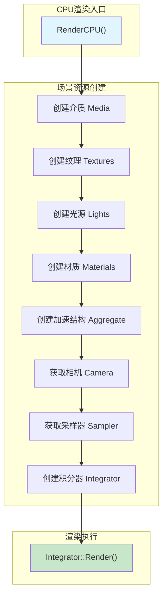
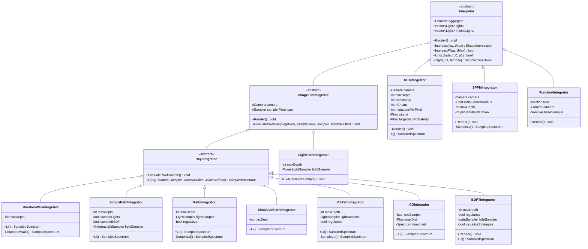
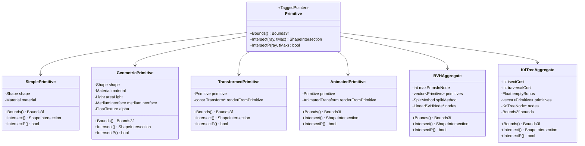
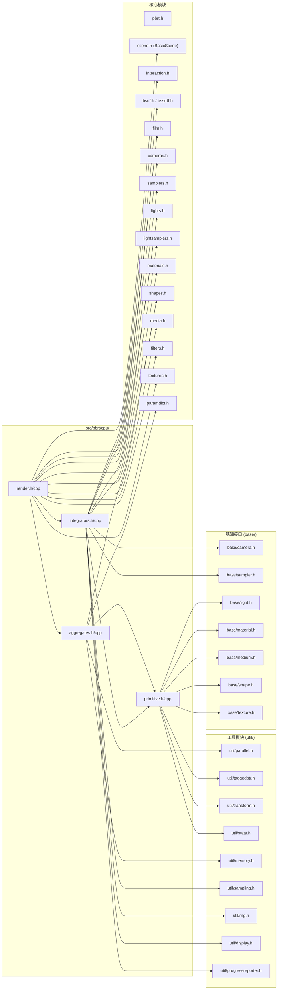
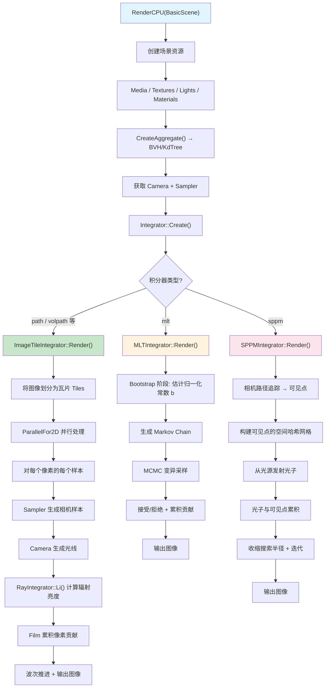
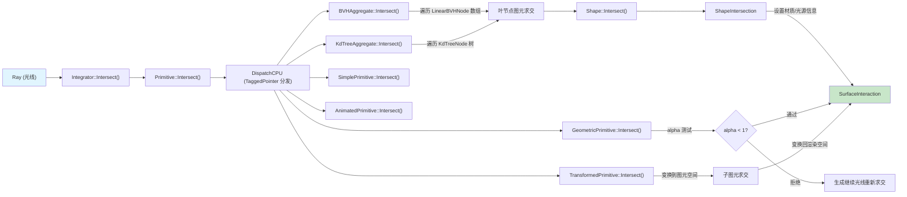
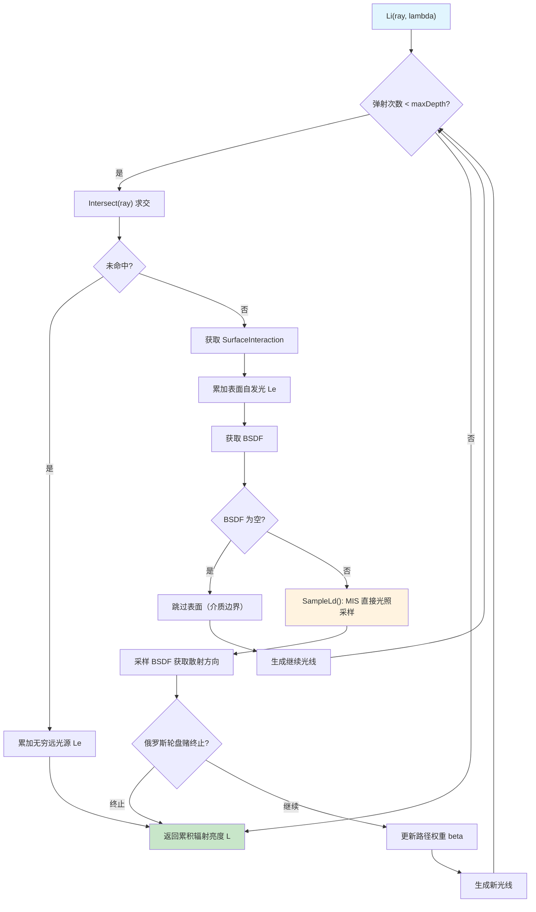

# CPU 渲染后端 (`src/pbrt/cpu/`)

## 概述

`src/pbrt/cpu/` 目录是 PBRT-v4 的 **CPU 渲染后端**，实现了基于 CPU 的完整光线追踪渲染管线。该模块包含三大核心子系统：

1. **积分器（Integrators）**：实现了 11 种不同的光传输算法，从简单的随机游走到复杂的 Metropolis 光传输和随机渐进光子映射。
2. **加速结构（Aggregates）**：提供 BVH（层次包围体）和 KD-Tree 两种空间加速结构，用于高效的光线-场景求交。
3. **图元（Primitives）**：定义了场景中可渲染对象的抽象层，封装几何形状、材质、光源和变换信息。

该模块是 PBRT 中代码量最大的子模块之一（`integrators.cpp` 超过 3600 行），完整实现了教科书级别的物理正确渲染算法。

## 文件列表

| 文件名 | 大小 | 说明 |
|---|---|---|
| `render.h` / `render.cpp` | ~6.8 KB | CPU 渲染入口函数 `RenderCPU()`，负责场景资源创建与渲染流程编排 |
| `integrators.h` / `integrators.cpp` | ~177 KB | 所有 CPU 积分器的声明与实现，包含 11 种光传输算法 |
| `primitive.h` / `primitive.cpp` | ~9.2 KB | 图元类型定义（`Primitive` TaggedPointer 及 4 种具体图元类型） |
| `aggregates.h` / `aggregates.cpp` | ~52 KB | BVH 和 KD-Tree 加速结构的声明与实现 |
| `integrators_test.cpp` | ~20 KB | 积分器的 Google Test 单元测试 |

**共计 9 个文件**（4 个头文件、4 个实现文件、1 个测试文件）。

## 架构图

### 模块整体架构

### 积分器类层次结构

### 图元与加速结构类型体系

## 核心类与接口

### 渲染入口

#### `RenderCPU(BasicScene &scene)`
CPU 渲染的顶层入口函数（定义于 `render.h` / `render.cpp`）。负责完整的渲染流程编排：

1. 从 `BasicScene` 创建介质（Media）、纹理（Textures）、光源（Lights）、材质（Materials）
2. 创建加速结构（Aggregate）
3. 获取相机（Camera）和采样器（Sampler）
4. 创建并配置积分器（Integrator）
5. 执行渲染警告检查（散射介质兼容性、光源存在性、GBufferFilm 兼容性、次表面散射支持）
6. 支持 `--pixelMaterial` 调试模式：输出指定像素处的材质信息
7. 调用 `integrator->Render()` 执行最终渲染

---

### 积分器体系

#### `Integrator`（基类）
所有 CPU 积分器的抽象基类，管理场景聚合体（aggregate）和光源列表（lights / infiniteLights）。提供核心的光线求交方法 `Intersect()` 和 `IntersectP()`，以及透射率计算 `Tr()` 和遮挡检测 `Unoccluded()`。

#### `ImageTileIntegrator`
基于图像瓦片（tile）的并行渲染基类。`Render()` 方法实现了完整的瓦片式并行渲染管线：
- 将图像划分为瓦片，通过 `ParallelFor2D` 并行处理
- 采用波次（wave）渐进式渲染策略（1, 2, 4, 8, ... 最多 64 个样本/波次）
- 支持连接远程显示服务器实时预览
- 支持 MSE 参考图像对比
- 支持像素级统计信息收集

#### `RayIntegrator`
继承自 `ImageTileIntegrator`，为基于相机光线的积分器提供通用框架。`EvaluatePixelSample()` 负责：
1. 从采样器获取相机样本
2. 生成相机光线（含微分光线）
3. 调用子类的 `Li()` 方法计算入射辐射亮度
4. 将结果写入胶片（Film）

#### 具体积分器实现

| 积分器 | 场景名称 | 算法说明 |
|---|---|---|
| `RandomWalkIntegrator` | `randomwalk` | 最简单的路径追踪：随机游走采样，均匀球面方向，无重要性采样 |
| `SimplePathIntegrator` | `simplepath` | 简化路径追踪：支持可选的光源采样和 BSDF 采样 |
| `PathIntegrator` | `path` | **生产级路径追踪**：多重重要性采样（MIS），支持 BVH 光源采样策略，BSDF 正则化 |
| `SimpleVolPathIntegrator` | `simplevolpath` | 简化体积路径追踪：支持参与介质的基础体积渲染 |
| `VolPathIntegrator` | `volpath` | **生产级体积路径追踪**：完整的体积散射和次表面散射支持，MIS 直接光照采样 |
| `AOIntegrator` | `ambientocclusion` | 环境遮蔽：计算表面点的可见性因子，支持余弦加权采样 |
| `LightPathIntegrator` | `lightpath` | 光线路径追踪：从光源出发追踪路径，与标准路径追踪方向相反 |
| `BDPTIntegrator` | `bdpt` | **双向路径追踪**：同时从相机和光源生成子路径并连接，支持策略可视化 |
| `MLTIntegrator` | `mlt` | **Metropolis 光传输**：基于 MCMC 的采样方法，擅长复杂光传输路径（如焦散） |
| `SPPMIntegrator` | `sppm` | **随机渐进光子映射**：两阶段算法（相机路径追踪 + 光子发射），适合焦散效果 |
| `FunctionIntegrator` | `function` | 工具积分器：用于评估采样器对给定函数的积分精度 |

---

### 图元类型

#### `Primitive`（TaggedPointer）
使用 `TaggedPointer` 实现的多态图元类型，通过 `DispatchCPU` 进行类型分发，避免虚函数调用开销。所有图元类型共享统一的 `Bounds()`、`Intersect()` 和 `IntersectP()` 接口。

| 图元类型 | 说明 |
|---|---|
| `SimplePrimitive` | 最简图元，仅包含 Shape 和 Material，无面光源、无介质接口、无 alpha 纹理 |
| `GeometricPrimitive` | 完整几何图元，包含 Shape、Material、面光源（AreaLight）、介质接口和 alpha 纹理。支持随机化 alpha 测试 |
| `TransformedPrimitive` | 变换实例图元，包装一个子图元并应用静态变换（`renderFromPrimitive`）。光线在求交时变换到图元空间 |
| `AnimatedPrimitive` | 动画实例图元，类似 `TransformedPrimitive` 但使用 `AnimatedTransform` 支持运动模糊 |

---

### 加速结构

#### `BVHAggregate`
层次包围体加速结构，**默认加速结构**。支持四种构建策略：

| 策略 | 枚举值 | 说明 |
|---|---|---|
| **SAH** | `SplitMethod::SAH` | 表面积启发式（默认），使用 12 个桶进行近似 SAH 评估 |
| **HLBVH** | `SplitMethod::HLBVH` | 基于 Morton 码的线性 BVH，并行构建效率高 |
| **Middle** | `SplitMethod::Middle` | 中点分割，最快但质量较低 |
| **EqualCounts** | `SplitMethod::EqualCounts` | 等量分割，保证树的平衡性 |

关键实现细节：
- 构建阶段生成树形 `BVHBuildNode`，随后扁平化为紧凑的 `LinearBVHNode` 数组（32 字节对齐）
- 遍历使用栈式迭代（最大深度 64），根据光线方向优先访问近子节点
- 大规模图元（>128K）时自动并行构建子树
- HLBVH 使用 Morton 码编码 + 基数排序实现空间局部性分组

#### `KdTreeAggregate`
KD-Tree 加速结构。基于 SAH 的自适应分割：
- 每个维度计算所有候选分割面的代价
- 自动选择最优维度和分割位置
- 支持空节点奖励（`emptyBonus`）以鼓励生成空子空间
- 最大深度默认 `8 + 1.3 * log2(N)`
- KD-Tree 节点紧凑编码为 8 字节（`alignas(8)`），使用位标志区分叶节点和内部节点

#### `CreateAccelerator(name, prims, parameters)`
工厂函数，根据名称字符串（`"bvh"` 或 `"kdtree"`）创建对应的加速结构。

---

## 依赖关系

### 本模块依赖的其他模块

### 被其他模块依赖

- **`src/pbrt/`（顶层模块）**：`scene.h` 中的 `BasicScene` 引用 `CreateAccelerator` 创建加速结构
- **`src/pbrt/cmd/`（命令行工具）**：主程序入口调用 `RenderCPU()` 启动 CPU 渲染
- **GPU 后端**不直接依赖此模块，但 `Primitive` 的 TaggedPointer 设计使其在 GPU 端也有对应实现

---

## 数据流

### CPU 渲染主流程

### 光线求交数据流

### 路径追踪 Li() 计算流程（PathIntegrator）

