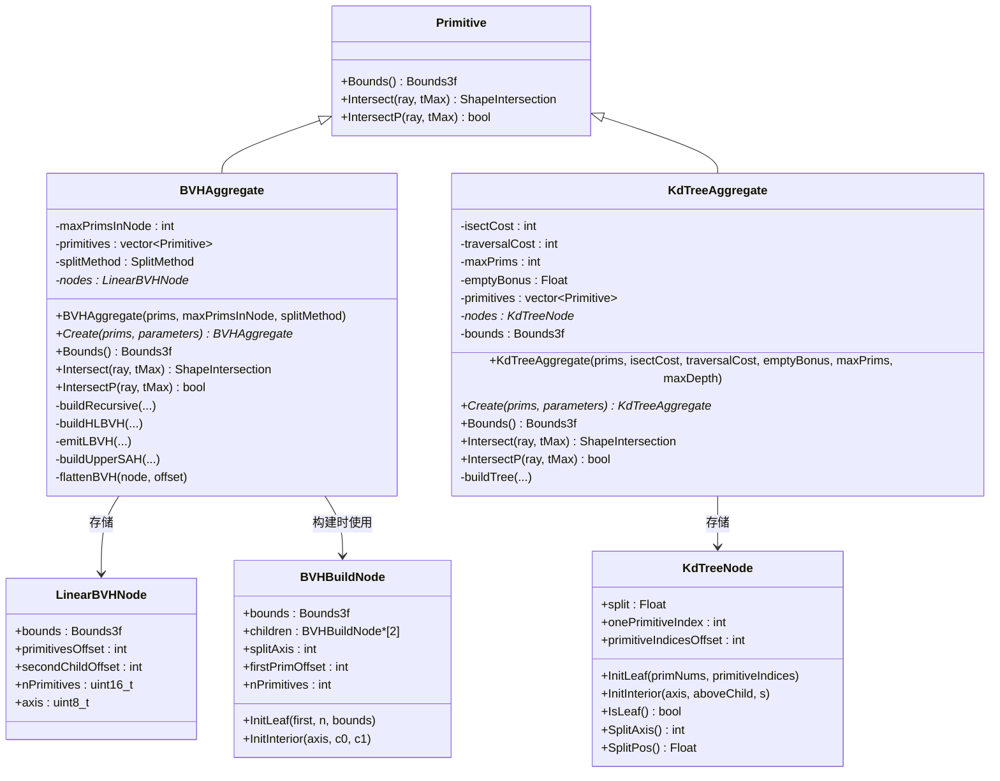
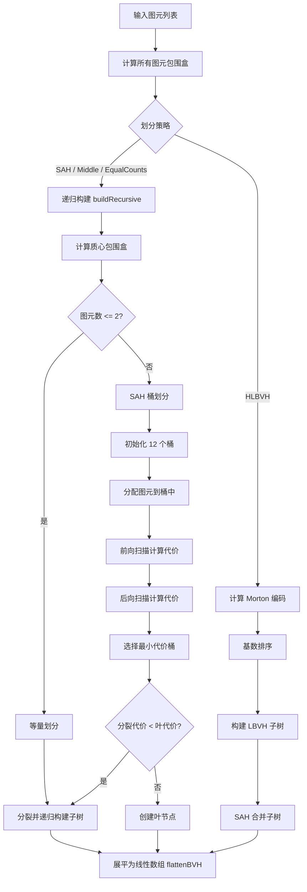
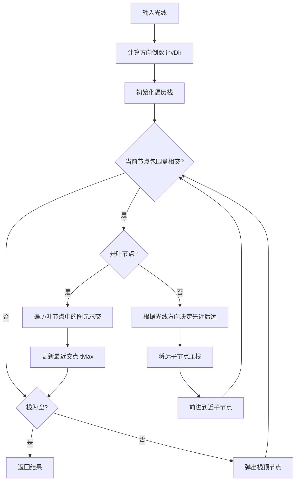

# aggregates.h / aggregates.cpp

## 概述

该文件实现了 PBRT-v4 渲染器中的空间加速结构（Acceleration Structures），用于高效地组织场景中的几何图元，从而加速光线与场景的求交运算。文件提供了两种经典加速结构：**BVH（层次包围盒）** 和 **KdTree（k-d 树）**，它们是光线追踪渲染管线中至关重要的性能核心模块。工厂函数 `CreateAccelerator` 根据用户参数创建对应的加速结构实例。

## 主要类与接口

| 类/结构体/函数 | 说明 |
|---|---|
| `CreateAccelerator` | 工厂函数，根据名称（`"bvh"` 或 `"kdtree"`）和参数字典创建对应的加速结构 `Primitive` |
| `BVHAggregate` | 基于层次包围盒（Bounding Volume Hierarchy）的加速结构，支持多种划分策略 |
| `BVHAggregate::SplitMethod` | 枚举类型，定义 BVH 的划分策略：`SAH`（表面积启发式）、`HLBVH`（层次线性 BVH）、`Middle`（中点划分）、`EqualCounts`（等量划分） |
| `BVHBuildNode` | BVH 构建阶段的树节点，包含包围盒、子节点指针和图元偏移信息 |
| `BVHPrimitive` | BVH 构建时每个图元的包围盒及索引信息 |
| `LinearBVHNode` | BVH 的紧凑线性存储节点（32 字节对齐），用于高效遍历 |
| `MortonPrimitive` | HLBVH 构建中使用的 Morton 编码图元，用于空间排序 |
| `LBVHTreelet` | HLBVH 中的子树片段，包含起始索引和构建节点 |
| `BVHSplitBucket` | SAH 划分中的桶结构，记录图元计数和包围盒 |
| `KdTreeAggregate` | 基于 k-d 树的加速结构，使用 SAH 启发式选择最优划分平面 |
| `KdTreeNode` | k-d 树节点（8 字节对齐），通过 flags 位域区分内部节点和叶子节点 |
| `BoundEdge` | k-d 树构建中表示图元包围盒在某轴上的边界事件 |
| `RadixSort` | 针对 Morton 编码的基数排序函数，用于 HLBVH 构建 |

## 架构图

## 算法流程图

### BVH 构建流程（SAH 策略）

### 光线-BVH 求交流程

## 依赖关系

- **依赖**：
  - `pbrt/pbrt.h` — 全局类型定义和宏
  - `pbrt/cpu/primitive.h` — `Primitive` 类型定义
  - `pbrt/util/parallel.h` — 并行计算工具（`ParallelFor`、`ThreadLocal`）
  - `pbrt/interaction.h` — `ShapeIntersection` 交互数据
  - `pbrt/paramdict.h` — 参数字典
  - `pbrt/shapes.h` — 形状接口
  - `pbrt/util/error.h` — 错误处理
  - `pbrt/util/log.h` — 日志系统
  - `pbrt/util/math.h` — 数学工具（`EncodeMorton3`、`Log2Int`、`FindInterval`）
  - `pbrt/util/memory.h` — 内存分配器
  - `pbrt/util/stats.h` — 性能统计计数器
  - `pbrt/util/print.h` — 格式化打印

- **被依赖**：
  - `pbrt/cpu/primitive.cpp` — 图元分派调用加速结构的求交方法
  - `pbrt/cpu/render.cpp` — CPU 渲染入口，创建加速结构
  - `pbrt/cpu/integrators_test.cpp` — 集成测试中构建 BVH
  - `pbrt/scene.cpp` — 场景构建中创建加速结构
  - `pbrt/wavefront/aggregate.cpp` — GPU 波前渲染路径中引用加速结构
