# CPU 积分器 (integrators.h / integrators.cpp)

## 目录

- [1. 概述与学习路线](#sec-1)
  - [1.1 积分器的职责](#sec-1-1)
  - [1.2 推荐阅读顺序](#sec-1-2)
  - [1.3 类继承关系](#sec-1-3)
- [2. 基类详解](#sec-2)
  - [2.1 Integrator — 场景交互基础设施](#sec-2-1)
  - [2.2 ImageTileIntegrator — 并行分块渲染框架](#sec-2-2)
  - [2.3 RayIntegrator — 像素采样标准化流水线](#sec-2-3)
- [3. 单向路径追踪积分器族](#sec-3)
  - [3.1 RandomWalkIntegrator](#sec-3-1)
  - [3.2 SimplePathIntegrator](#sec-3-2)
  - [3.3 PathIntegrator](#sec-3-3)
- [4. 体积路径追踪积分器族](#sec-4)
  - [4.1 SimpleVolPathIntegrator](#sec-4-1)
  - [4.2 VolPathIntegrator](#sec-4-2)
- [5. 特殊用途积分器](#sec-5)
  - [5.1 AOIntegrator](#sec-5-1)
  - [5.2 LightPathIntegrator](#sec-5-2)
  - [5.3 FunctionIntegrator](#sec-5-3)
- [6. 双向与全局方法](#sec-6)
  - [6.1 BDPTIntegrator](#sec-6-1)
  - [6.2 MLTIntegrator](#sec-6-2)
  - [6.3 SPPMIntegrator](#sec-6-3)
- [7. 积分器对比](#sec-7)
- [8. 工厂方法与参数汇总](#sec-8)
- [9. 依赖关系](#sec-9)

---

<a id="sec-1"></a>

## 1. 概述与学习路线

<a id="sec-1-1"></a>

### 1.1 积分器的职责

积分器（Integrator）是 PBRT-v4 渲染管线的核心计算模块，负责求解**光传输方程**（Light Transport Equation, LTE）。对于每条从相机出发的光线，积分器通过模拟光子在场景中的传播过程，计算该光线对应像素的辐亮度（radiance）值。

光传输方程的积分形式为：

$L_o(p, \omega_o) = L_e(p, \omega_o) + \int_{S^2} f(p, \omega_o, \omega_i) \, L_i(p, \omega_i) \, |\cos\theta_i| \, d\omega_i$

其中 $L_o$ 是出射辐亮度，$L_e$ 是自发光，$f$ 是 BSDF，$L_i$ 是入射辐亮度。不同积分器的本质区别在于如何近似计算这个积分——采用何种采样策略、何种方差缩减技术、以及是否支持参与介质等。

<a id="sec-1-2"></a>

### 1.2 推荐阅读顺序（从简到繁）

1. **`RandomWalkIntegrator`** — 最简单的蒙特卡洛积分器，在每个交点均匀随机采样方向。适合理解基本的路径追踪框架。
2. **`SimplePathIntegrator`** — 在随机游走基础上增加可选的直接光照采样和 BSDF 重要性采样，适合理解方差缩减的效果。
3. **`PathIntegrator`** — 生产级单向路径追踪，包含下一事件估计（NEE）、多重重要性采样（MIS）和俄罗斯轮盘赌（Russian Roulette）。
4. **`SimpleVolPathIntegrator`** → **`VolPathIntegrator`** — 从简单 delta tracking 到完整的加权增量追踪，理解体积渲染。
5. **`BDPTIntegrator`** → **`MLTIntegrator`** → **`SPPMIntegrator`** — 高级全局光照方法。

<a id="sec-1-3"></a>

### 1.3 类继承关系

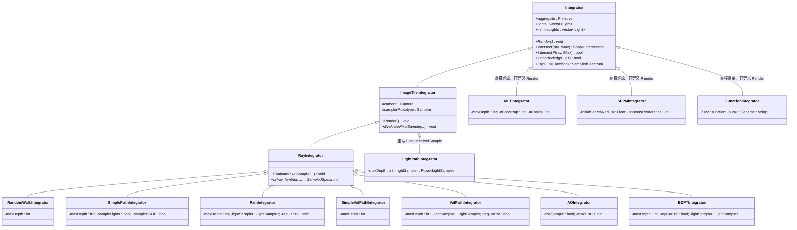

继承层次体现了设计意图：

- **`Integrator`** — 提供场景交互基础设施（求交、遮挡、透射率）
- **`ImageTileIntegrator`** — 在此基础上增加并行分块渲染框架
- **`RayIntegrator`** — 进一步标准化「每像素采样 → 相机光线 → Li()」的流程
- **`MLTIntegrator` / `SPPMIntegrator` / `FunctionIntegrator`** — 直接继承 `Integrator`，因为它们有完全不同的渲染循环

---

<a id="sec-2"></a>

## 2. 基类详解

<a id="sec-2-1"></a>

### 2.1 Integrator — 场景交互基础设施

### # 职责

`Integrator` 是所有积分器的根基类，提供与场景几何和光源交互的通用方法。它不包含渲染循环逻辑，仅封装场景数据和光线-场景交互操作。

### # 核心成员

| 成员 | 类型 | 说明 |
|---|---|---|
| `aggregate` | `Primitive` | 场景的加速结构（BVH 等），所有几何体的聚合 |
| `lights` | `vector<Light>` | 场景中所有光源的列表 |
| `infiniteLights` | `vector<Light>` | 无限远光源（环境光）的子列表，构造时从 `lights` 中筛选 |

构造函数中会遍历所有光源，调用 `light.Preprocess(sceneBounds)` 进行预处理，并将类型为 `LightType::Infinite` 的光源收集到 `infiniteLights` 中。

### # 方法详解

**`Intersect(ray, tMax) → optional<ShapeIntersection>`**

求光线与场景最近交点。内部调用 `aggregate.Intersect()`，同时递增性能计数器 `nIntersectionTests`。

**`IntersectP(ray, tMax) → bool`**

仅判断光线是否与场景有交点（不需要交点信息）。用于阴影测试（shadow ray），比 `Intersect` 更高效。

**`Unoccluded(p0, p1) → bool`**

判断两个交互点之间是否无遮挡。实现为从 `p0` 向 `p1` 发射光线并调用 `IntersectP`，`tMax` 设为 `1 - ShadowEpsilon` 以避免自交。

**`Tr(p0, p1, lambda) → SampledSpectrum`**

计算两点之间的透射率（transmittance），用于处理参与介质中的光线衰减。

### # Tr 的 ratio-tracking 算法原理

透射率 $T_r$ 定义为光线穿过介质时未被吸收或散射的比例：

$T_r(p_0, p_1) = e^{-\int_0^d \sigma_t(p + t\omega) \, dt}$

其中 $\sigma_t(p) = \sigma_a(p) + \sigma_s(p)$ 是消光系数，随空间位置变化。对于均匀介质（$\sigma_t$ 为常数），指数可以直接计算；但对于非均匀介质，指数中的积分没有解析解，需要数值方法估计。

**核心思想：引入空散射将非均匀问题转化为均匀问题**

Ratio tracking 的关键洞察是：通过引入一种虚拟的「**空散射**」（null scattering）事件，将非均匀介质在数学上等价地转化为均匀介质。

具体做法是选取一个常数 $\sigma_{maj}$（majorant），满足 $\sigma_{maj} \geq \max_p \sigma_t(p)$，然后定义空散射系数：

$\sigma_n(p) = \sigma_{maj} - \sigma_t(p) \geq 0$

空散射不改变光线方向，也不衰减光线能量——它是物理上不存在的虚拟事件。但引入后，总交互速率变成了常数：

$\sigma_t(p) + \sigma_n(p) = \sigma_{maj} \quad \text{（处处相等）}$

这样就可以像处理均匀介质一样，用指数分布 $p(t) = \sigma_{maj} \, e^{-\sigma_{maj} t}$ 采样交互点。

在每个交互点 $p_i$，事件可能是：

- **真实交互**（吸收或散射）：概率 $\sigma_t(p_i) / \sigma_{maj}$，光线被终止
- **空散射**：概率 $\sigma_n(p_i) / \sigma_{maj}$，光线继续传播，不受任何影响

透射率的物理意义是「光线从 $p_0$ 到 $p_1$ 不发生任何真实交互的概率」，等价于：光线遇到的每一次交互都恰好是空散射。

**Delta tracking vs Ratio tracking**

基于上述框架，可以设计两种估计器：

- **Delta tracking**（随机估计器）：在每个交互点随机决定事件类型——以概率 $\sigma_n/\sigma_{maj}$ 判定为空散射（继续），否则终止返回 0。到达终点返回 1。这个估计器无偏，但只输出 0 或 1，方差很大。

- **Ratio tracking**（确定性加权估计器）：不做随机决定，而是在每个交互点确定性地将运行权重乘以空散射概率 $\sigma_n(p_i)/\sigma_{maj}$。到达终点返回累积权重 $\hat{T}_r = \prod_{i=1}^{N} \sigma_n(p_i)/\sigma_{maj}$。

两者估计的是同一个量——「每次交互都是空散射」的概率。Delta tracking 通过抛硬币来估计；ratio tracking 直接计算条件概率的精确值（给定交互点位置后的精确乘积），只有交互点位置仍是随机的。因此 ratio tracking 的方差严格小于 delta tracking——它消除了事件类型选择这一层随机性。

**多波长处理与 `inv_w`**

上述推导假设单波长。在 pbrt 的光谱渲染中，不同波长的 $\sigma_t(\lambda)$ 不同，但采样基于**主波长** $\lambda_0$ 的 majorant 进行。`inv_w` 追踪次要波长的采样偏差：对于主波长 `inv_w[0]` 始终为 1（采样分布匹配），对于次要波长 `inv_w[k]` 累积「实际 PDF / 主波长 PDF」的比值。最终 `Tr / inv_w.Average()` 通过跨波长的重要性权重平均来校正偏差。

**具体步骤**

对于非均匀介质，这个积分没有解析解。`Tr` 使用**比率追踪**（ratio tracking）算法进行估计：

1. 从 `p0` 向 `p1` 发射光线
2. 如果途中碰到不透明表面（`si->intr.material` 非空），透射率为 0
3. 如果光线穿过介质，使用 `SampleT_maj` 采样主要系数（majorant）的自由程
4. 在每个采样点，计算空散射系数 $\sigma_n = \sigma_{maj} - \sigma_a - \sigma_s$
5. 累乘更新：`Tr *= T_maj * sigma_n / pdf`，同时维护权重 `inv_w`
6. 最终返回 `Tr / inv_w.Average()`

比率追踪的关键思想是：只考虑空散射（null scattering）事件，将吸收和真实散射视为终止条件，通过比率 $\sigma_n / \sigma_{maj}$ 逐步估计透射率。

### # 流程图

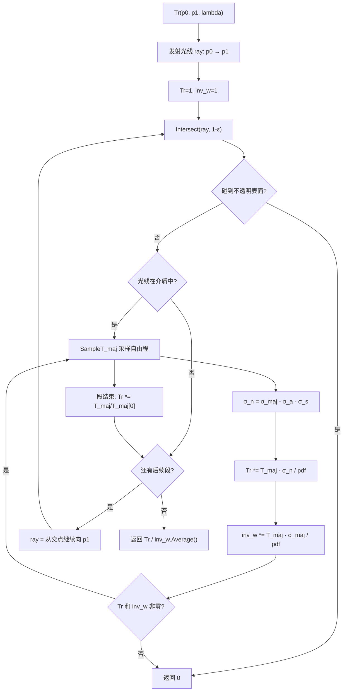

---

<a id="sec-2-2"></a>

### 2.2 ImageTileIntegrator — 并行分块渲染框架

### # 职责

`ImageTileIntegrator` 继承自 `Integrator`，提供基于图像分块（tile）的并行渲染框架。它实现了完整的 `Render()` 方法，将图像分成若干块，多线程并行处理每个块中的像素采样。

### # 核心成员

| 成员 | 类型 | 说明 |
|---|---|---|
| `camera` | `Camera` | 相机对象，用于生成光线和获取胶片信息 |
| `samplerPrototype` | `Sampler` | 采样器原型，每个线程会 Clone 一份独立副本 |

### # Render() 的 wave-based 设计

`Render()` 采用 **wave（波次）** 机制组织渲染，而非一次性处理所有采样：

1. **为什么用 wave？** — 每个 wave 为**所有像素**增加若干个采样（sample）。第一波每像素渲染 1 个采样，第二波再加 1 个，然后 2、4、8...每波上限 64 个采样。这样可以快速产出预览图像，并在有 MSE 参考图时按指数递增获得不同采样数下的误差曲线。
2. **`debugStart`** — 如果设置了 `--debugstart x,y,sampleIndex`，只渲染该像素的那一个采样，用于调试特定像素的问题。
3. **MSE 参考图** — 如果提供了 `--mseReferenceImage`，每波结束后计算当前图像与参考图的均方误差（MSE），写入输出文件。
4. **显示服务器** — 如果设置了 `--displayServer`，连接到实时显示服务器，渲染过程中可实时预览。

每波中，使用 `ParallelFor2D` 将像素边界分成若干 tile，每个 tile 由一个线程处理。线程从 `ThreadLocal` 获取自己的 `Sampler` 和 `ScratchBuffer`。

### # 流程图

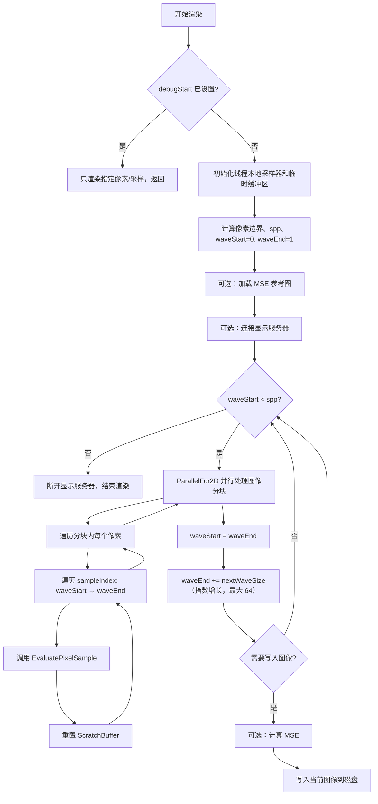

---

<a id="sec-2-3"></a>

### 2.3 RayIntegrator — 像素采样标准化流水线

### # 职责

`RayIntegrator` 继承自 `ImageTileIntegrator`，将单个像素采样的流程标准化为「生成相机光线 → 调用 `Li()` 获取辐亮度 → 写入胶片」。子类只需实现纯虚函数 `Li()` 即可。

### # EvaluatePixelSample() 流水线

`EvaluatePixelSample` 被标记为 `final`，子类不可重写。它的步骤如下：

1. **采样波长** — 使用 `sampler.Get1D()` 获取随机数 `lu`，通过 `film.SampleWavelengths(lu)` 生成 `SampledWavelengths lambda`（光谱渲染的波长组）
2. **生成 CameraSample** — 通过滤波器偏移和镜头采样生成 `CameraSample`
3. **生成相机光线** — 调用 `camera.GenerateRayDifferential` 生成光线及其微分
4. **缩放光线微分** — 根据每像素采样数缩放微分，公式为 `scale = max(0.125, 1/sqrt(spp))`
5. **调用 Li()** — 调用子类实现的虚函数，获取沿光线方向的辐亮度
6. **NaN/Inf 防护** — 检查返回的辐亮度是否包含 NaN 或无穷大，如果是则记录错误并置为黑色
7. **写入胶片** — 调用 `film.AddSample()` 将辐亮度贡献累加到像素

### # 流程图

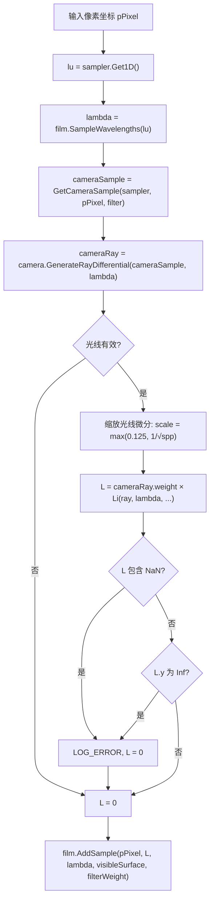

### # 光线微分在路径中的传播

光线微分（`RayDifferential`）用于**纹理过滤**：通过 MIP map 层级选择，需要知道屏幕空间一个像素对应物体表面多大面积（即 $\partial p / \partial x$ 和 $\partial p / \partial y$）。以下是光线微分在路径追踪中从生成到丢失再到近似恢复的完整生命周期。

**1. 初始生成（相机端）**

相机通过**有限差分**生成光线微分：对当前像素坐标分别在 x/y 方向偏移 0.05 像素，生成额外的偏移光线，用差分近似屏幕空间导数。生成后根据每像素采样数缩放微分（见上方 `EvaluatePixelSample` 步骤 4）。

**2. 在表面交点处计算微分（`ComputeDifferentials`）**

实现位于 `interaction.cpp:41-89`。当 `ray.hasDifferentials == true` 时：

- 辅助光线（`rxOrigin + t·rxDirection`、`ryOrigin + t·ryDirection`）与交点处的切平面求交，得到辅助交点 `px`、`py`
- 计算 `dpdx = px - p`、`dpdy = py - p`，即表面位置对屏幕坐标的偏导数
- 通过最小二乘法（$A^T A x = A^T b$）从 `dpdx/dpdy` 和 `dpdu/dpdv` 解出 `dudx/dvdx/dudy/dvdy`，即 UV 坐标对屏幕坐标的偏导数，供纹理查询使用

**3. 镜面弹射后传播（`SpawnRay`）**

实现位于 `interaction.cpp:99-157`。对于**镜面反射**和**镜面透射**，出射方向由确定性公式（反射定律 / Snell 定律）给出，因此可以对公式求导，得到辅助光线的新方向：

- 镜面反射：对反射公式 $\omega_i = -\omega_o + 2(\omega_o \cdot n)n$ 求全微分，得到 `rxDirection`/`ryDirection`
- 镜面透射：对 Snell 定律求全微分，包含折射率比 $\eta$ 和法线变化 `dndx/dndy` 的贡献
- 辅助光线原点设为 `p + dpdx` 和 `p + dpdy`

这使得光线微分能穿过镜面链（如玻璃球内部的多次反射/折射）持续传播。

**4. 非镜面弹射后丢失**

对于漫反射、光泽反射等非镜面散射，出射方向是通过 BSDF 随机采样得到的，无有意义的导数可言。`SpawnRay` 中不会进入镜面分支，返回的 `RayDifferential` 其 `hasDifferentials` 保持为 `false`。

**5. 近似恢复（`Approximate_dp_dxy`）**

后续弹射命中新表面时，`ComputeDifferentials` 发现 `hasDifferentials == false`，走 else 分支（`interaction.cpp:63-66`），调用 `camera.Approximate_dp_dxy`（实现位于 `cameras.h:155-183`）。该函数利用相机在构造时预计算的**最小微分**（沿图像对角线 512 个采样点中模长最小的位置/方向偏移），在当前交点处构造近似的辅助光线并与切平面求交，从而保守地恢复 `dpdx/dpdy`。

这是一种**保守估计**：取最小微分意味着倾向于更精细的纹理采样（可能轻微混叠），而非过度模糊。

> 详细原理与逐步计算流程见 [`camera.md` — Approximate_dp_dxy 原理与计算流程](../base/camera.md#approximate_dp_dxy-原理与计算流程)。

---

<a id="sec-3"></a>

## 3. 单向路径追踪积分器族

本节介绍三个从简到繁的单向路径追踪积分器，它们都继承自 `RayIntegrator`，仅处理表面散射（无参与介质）。

<a id="sec-3-1"></a>

### 3.1 RandomWalkIntegrator — 教学用随机游走

### # 适用场景

`RandomWalkIntegrator` 是最简单的路径追踪实现，仅用于教学目的。它在每个交点上**均匀随机采样球面方向**，不使用任何方差缩减技术。

- **擅长**：代码极其简洁，适合理解蒙特卡洛路径追踪的核心概念
- **不擅长**：收敛极慢，因为不采用 BSDF 重要性采样，也不进行直接光照采样。实际渲染中不应使用

### # 算法原理

光传输方程的蒙特卡洛估计最朴素的形式：在交点 $p$ 处均匀采样球面方向 $\omega_i$，PDF 为 $1/(4\pi)$，则辐亮度估计为：

$L(p, \omega_o) \approx L_e(p, \omega_o) + \frac{f(p, \omega_o, \omega_i) \cdot |\cos\theta_i|}{1/(4\pi)} \cdot L_i(p, \omega_i)$

递归地对 $L_i$ 应用同样的估计，直到达到最大深度。这里没有使用 BSDF 重要性采样（会把大量采样浪费在 BSDF 值为零的方向上），也没有直接光照采样（完全依赖随机碰到光源）。

### # 关键实现要点

- `Li()` 直接委托给私有递归函数 `LiRandomWalk(ray, lambda, sampler, scratchBuffer, depth)`
- 采样方向使用 `SampleUniformSphere(sampler.Get2D())`，PDF 为 $1/(4\pi)$
- 如果 BSDF 无效（介质边界），跳过该交点继续传播（`return Le`，不再递归——这是一个简化）
- 实际实现中 `fcos` 的计算为 `bsdf.f(wo, wp) * AbsDot(wp, isect.shading.n)`，权重为 `fcos / (1/(4π)) = fcos * 4π`

### # 参数表

| 参数 | 类型 | 默认值 | 说明 |
|---|---|---|---|
| `maxdepth` | `int` | 5 | 最大递归深度 |

### # 流程图

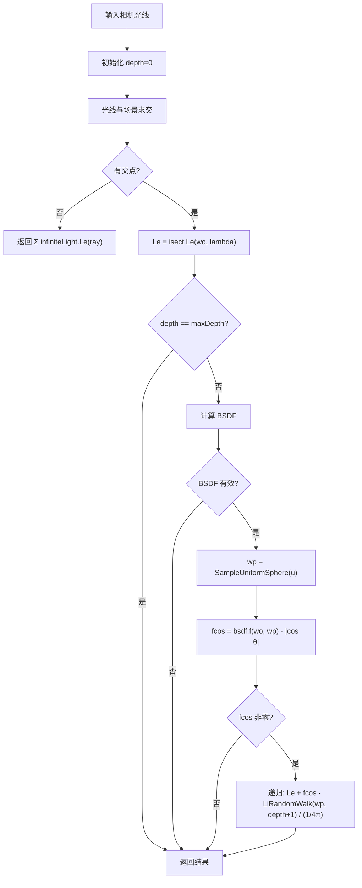

---

<a id="sec-3-2"></a>

### 3.2 SimplePathIntegrator — 可配置教学版

### # 适用场景

`SimplePathIntegrator` 是教学用的路径追踪器，通过两个布尔开关 `sampleLights` 和 `sampleBSDF` 让学习者对比不同采样策略的效果：

- `sampleLights=false, sampleBSDF=false` — 退化为类似 RandomWalk 的纯随机采样
- `sampleLights=true, sampleBSDF=false` — 增加直接光照采样但不用 BSDF 重要性采样
- `sampleLights=false, sampleBSDF=true` — 只用 BSDF 采样，依赖随机碰到光源
- `sampleLights=true, sampleBSDF=true`（默认）— 同时使用两种策略（但**不做 MIS**）

**注意**：即使同时开启两个选项，此积分器也**不使用 MIS**，因此当光源采样和 BSDF 采样同时使用时会导致直接光照被重复计算（通过 `specularBounce` 标志部分缓解，但并非完整的 MIS 方案）。

### # 算法原理

与 `RandomWalkIntegrator` 相比的改进：

1. **直接光照采样**（`sampleLights=true`）：使用 `UniformLightSampler` 均匀随机选取一个光源，在光源上采样一个点，计算该光源对交点的直接照明贡献。
2. **BSDF 重要性采样**（`sampleBSDF=true`）：使用 `bsdf.Sample_f()` 根据 BSDF 的分布来采样下一个方向，而不是均匀随机。这大幅减少了方差。
3. **`specularBounce` 标志**：当上一次反弹是镜面反射时，即使开启了 `sampleLights`，也会计算碰到的光源自发光（因为镜面反射的光源贡献无法通过直接光照采样获得）。

### # 关键实现要点

- 使用 `UniformLightSampler`（均匀采样光源），而非 `PathIntegrator` 的可配置光源采样器
- 当 `sampleBSDF=false` 时，根据 BSDF 的反射/透射特性选择均匀采样球面或半球
- 介质边界处理：如果 `bsdf` 无效，设置 `specularBounce=true` 并跳过该交点继续传播
- 迭代式实现（while 循环），非递归

### # 参数表

| 参数 | 类型 | 默认值 | 说明 |
|---|---|---|---|
| `maxdepth` | `int` | 5 | 最大路径深度 |
| `samplelights` | `bool` | `true` | 是否进行直接光照采样 |
| `samplebsdf` | `bool` | `true` | 是否使用 BSDF 重要性采样 |

### # 流程图

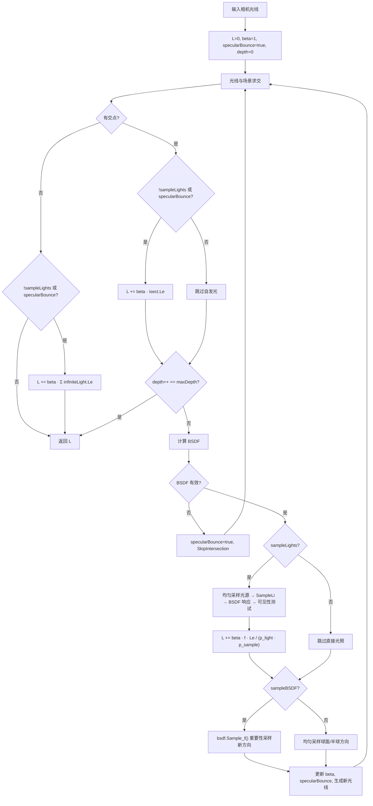

---

<a id="sec-3-3"></a>

### 3.3 PathIntegrator — 生产首选单向路径追踪

### # 适用场景

`PathIntegrator` 是 pbrt 中最常用的积分器，适合**不含参与介质**的通用场景渲染。它实现了完整的单向路径追踪算法，包含所有关键的方差缩减技术：

- **擅长**：通用表面场景、直接/间接光照、光泽和镜面反射、折射
- **不擅长**：参与介质（烟雾、云、半透明材质）→ 应使用 `VolPathIntegrator`；焦散等需要从光源出发的路径 → 应考虑 `BDPTIntegrator`

### # 算法原理

`PathIntegrator` 的核心方差缩减技术：

**1. 下一事件估计（Next Event Estimation, NEE）**

在每个非镜面交点处，显式地采样光源来估计直接光照，而不依赖路径随机碰到光源。这通过 `SampleLd()` 方法实现。

**2. 多重重要性采样（Multiple Importance Sampling, MIS）**

光源贡献可以通过两种策略获得：(a) 直接采样光源（NEE），(b) BSDF 采样碰巧命中光源。MIS 使用**幂启发式**（Power Heuristic）来组合两种估计：

$w_s = \frac{p_s^2}{p_s^2 + p_b^2}$

其中 $p_s$ 是光源采样 PDF，$p_b$ 是 BSDF 采样 PDF。这确保了无论哪种策略更好，组合结果的方差都不会太高。

具体实现中：
- NEE 中用 `PowerHeuristic(1, p_l, 1, p_b)` 计算光源采样的 MIS 权重
- BSDF 采样命中光源时，用 `PowerHeuristic(1, p_b, 1, p_l)` 计算 BSDF 采样的 MIS 权重
- 对于 delta 光源（点光源等），只有光源采样有效，无需 MIS

**3. 俄罗斯轮盘赌（Russian Roulette）**

在 `depth > 1` 时，根据路径权重 `beta * etaScale` 决定是否终止路径。如果 `rrBeta.MaxComponentValue() < 1`，以概率 `q = max(0, 1 - rrBeta.MaxComponentValue())` 终止；存活的路径权重除以 `1 - q` 以保持无偏。

**4. BSDF 正则化（Regularization）**

可选功能（默认关闭）。在第一次非镜面反弹后，对 BSDF 进行正则化处理，将接近 delta 分布的 BSDF 平滑为有限宽度的分布。这减少了由高光路径引起的「萤火虫」噪点，代价是引入轻微偏差。

### # 关键实现要点

- `lightSampler` 可配置（默认 `"bvh"`，即 `BVHLightSampler`），也支持 `"uniform"` 和 `"power"` 等策略
- `prevIntrCtx` 记录上一个交点的 `LightSampleContext`，用于在 BSDF 采样命中光源时计算光源的 PDF
- `etaScale` 追踪折射引起的辐亮度缩放，用于俄罗斯轮盘赌的正确判断
- `specularBounce` 控制是否将碰到的光源自发光计入 L（避免与 NEE 重复计数）
- 在 `depth == 0` 时初始化 `VisibleSurface`（用于去噪器等后处理）

### # 参数表

| 参数 | 类型 | 默认值 | 说明 |
|---|---|---|---|
| `maxdepth` | `int` | 5 | 最大路径深度 |
| `lightsampler` | `string` | `"bvh"` | 光源采样策略（`"bvh"` / `"uniform"` / `"power"`） |
| `regularize` | `bool` | `false` | 是否启用 BSDF 正则化 |

### # PathIntegrator::Li 流程图

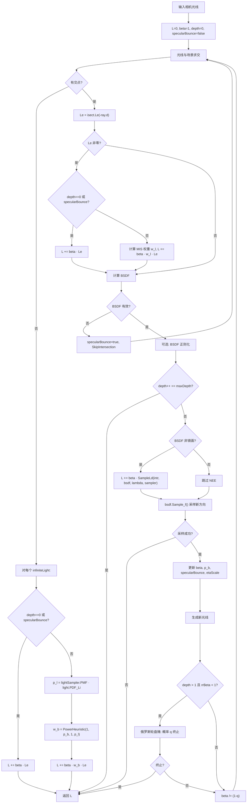

### # SampleLd 直接光照采样详解

`SampleLd` 是 `PathIntegrator` 的核心方法，实现了带 MIS 的下一事件估计：

1. **调整采样位置** — 根据 BSDF 的反射/透射性，将 `LightSampleContext` 的位置向表面正确一侧偏移，避免自交
2. **选择光源** — 通过 `lightSampler.Sample(ctx, u)` 按光源分布选择一个光源
3. **光源上采样** — 在选中的光源上采样一个点，获得入射方向 `wi`、辐亮度 `Le` 和 PDF `ls->pdf`
4. **评估 BSDF** — 计算 `f = bsdf.f(wo, wi) * |cos θ|`
5. **遮挡测试** — 检查交点与光源采样点之间是否无遮挡
6. **MIS 加权** — 对于 delta 光源直接返回 `Le * f / p_l`；否则计算 BSDF 的 PDF `p_b`，用 `PowerHeuristic` 计算权重

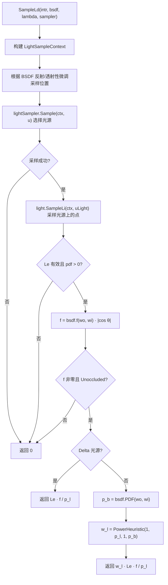

---

<a id="sec-4"></a>

## 4. 体积路径追踪积分器族

本节介绍两个处理参与介质（participating media）的路径追踪积分器。参与介质包括烟雾、云、雾、半透明材质等，光线在其中传播时会被吸收、散射或继续传播（空散射）。

### # 核心采样函数：`SampleT_maj`

两个体积积分器都依赖同一个核心函数 `SampleT_maj`（定义在 `media.h:725`），它实现了沿光线的 **delta tracking 采样**。在阅读具体积分器之前，先了解这个函数的接口和行为模式。

**函数签名**

```cpp
template <typename F>
SampledSpectrum SampleT_maj(Ray ray, Float tMax, Float u, RNG &rng,
                            const SampledWavelengths &lambda, F callback);
```

**参数含义**

| 参数 | 说明 |
|------|------|
| `ray` | 待采样的光线（携带 `ray.medium` 信息） |
| `tMax` | 光线的最大参数范围（到下一个表面交点或场景边界） |
| `u` | 初始均匀随机数，用于指数分布采样；后续采样点由 `rng` 生成 |
| `rng` | 随机数生成器，在采样循环内部持续提供随机数 |
| `lambda` | 采样波长 |
| `callback` | 回调函数，在每个采样点被调用 |

**回调机制**

`SampleT_maj` 沿光线进行 delta tracking：按 majorant 衰减系数 $\sigma_{maj}$ 从指数分布中采样距离，在每个采样点调用：

```cpp
bool callback(Point3f p, MediumProperties mp, SampledSpectrum sigma_maj, SampledSpectrum T_maj)
```

- `p`：采样点位置
- `mp`：该点的介质属性（$\sigma_a$、$\sigma_s$、相函数等）
- `sigma_maj`：当前段的 majorant 衰减系数
- `T_maj`：从上一个采样点（或光线起点）到当前点的 majorant 透射率

回调返回 `true` 表示继续采样（如空散射），返回 `false` 表示终止（如发生真实散射或吸收）。

**返回值**

函数返回 `SampledSpectrum T_maj`——从最后一个采样点到 `tMax` 的 majorant 透射率。如果回调提前终止了采样，返回的是终止时的累积透射率。

> 关于 `SampleT_maj` 的完整实现细节和流程图，参见 [media.cn.md — SampleT_maj 沿光线采样](../media.cn.md)。

<a id="sec-4-1"></a>

### 4.1 SimpleVolPathIntegrator — 教学用体积路径追踪

### # 适用场景

`SimpleVolPathIntegrator` 是体积渲染的简化教学版本，演示 delta tracking 的基本原理。

- **擅长**：纯介质场景（如烟雾盒子），帮助理解 delta tracking 的工作方式
- **不擅长**：不支持 delta 光源（点光源、方向光会报错退出）；不支持表面散射（如果碰到有 BSDF 的表面会报错）；不做直接光照采样和 MIS，收敛较慢

### # 算法原理

**Delta Tracking（增量追踪）**

在非均匀介质中，需要沿光线采样散射/吸收事件。Delta tracking 引入一个虚拟的「空散射」事件，使得总衰减系数在整个介质中成为常数 $\sigma_{maj}$（majorant）：

$\sigma_{maj} = \sigma_a + \sigma_s + \sigma_n$

其中 $\sigma_n = \sigma_{maj} - \sigma_a - \sigma_s$ 是空散射系数。在每个采样点，按概率选择事件类型：

- **吸收**（概率 $\sigma_a / \sigma_{maj}$）：路径终止，累加介质自发光
- **真实散射**（概率 $\sigma_s / \sigma_{maj}$）：采样相函数获取新方向
- **空散射**（概率 $\sigma_n / \sigma_{maj}$）：继续 delta tracking，光线不改变方向

**次要波长终止**

`SimpleVolPathIntegrator` 在路径开始前调用 `lambda.TerminateSecondary()`，只追踪主要波长。这是一个简化：完整版的 `VolPathIntegrator` 使用 `r_u`/`r_l` 来正确处理多波长。

### # 关键实现要点

- 构造函数中检查所有光源，如果存在 delta 光源则 `ErrorExit`
- 使用 `SampleT_maj` 进行 delta tracking，通过 lambda 回调处理每个采样事件
- 采样事件类型使用 `SampleDiscrete({pAbsorb, pScatter, pNull}, uMode)`
- 如果碰到有 BSDF 的表面，调用 `bsdf.Sample_f` 后报错退出（`ErrorExit`）
- 介质边界（BSDF 无效的表面）通过 `SkipIntersection` 跳过

### # 参数表

| 参数 | 类型 | 默认值 | 说明 |
|---|---|---|---|
| `maxdepth` | `int` | 5 | 最大路径深度 |

### # 流程图

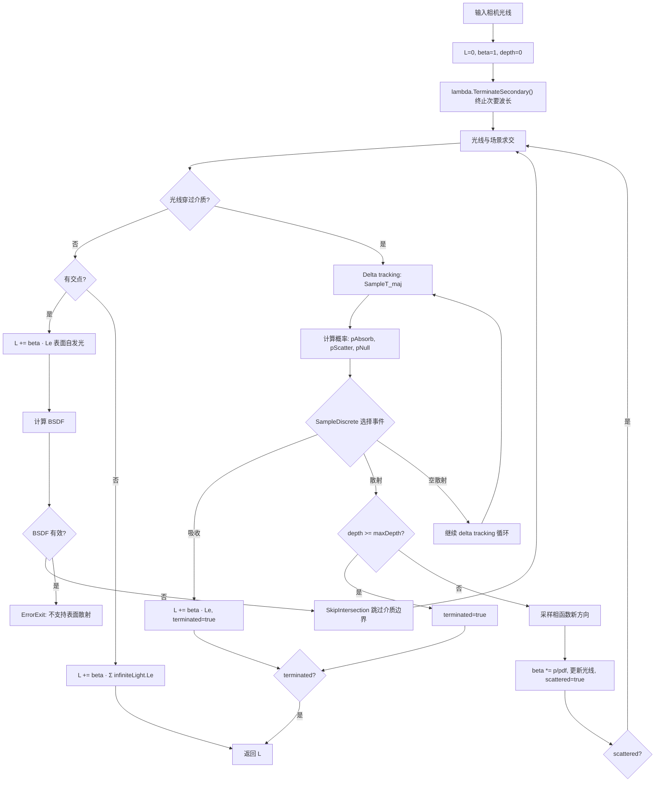

---

<a id="sec-4-2"></a>

### 4.2 VolPathIntegrator — 生产级完整体积路径追踪

### # 适用场景

`VolPathIntegrator` 是 pbrt 中功能最全面的积分器，在 `PathIntegrator` 的基础上增加了参与介质和次表面散射（BSSRDF）支持：

- **擅长**：含烟雾/云/雾的场景、半透明材质（次表面散射）、同时包含表面和介质的通用场景
- **不擅长**：纯表面场景（不含介质时开销比 `PathIntegrator` 略高）；焦散路径仍需 BDPT/MLT

### # 算法原理

**加权增量追踪（Weighted Delta Tracking）**

与 `SimpleVolPathIntegrator` 的标准 delta tracking 不同，`VolPathIntegrator` 使用**加权**版本来正确处理多波长。核心思想是维护两组「重缩放概率」（rescaled probabilities）：

- $r_u$（unscattered）：BSDF/相函数采样路径的累积概率比
- $r_l$（light）：光源采样路径的累积概率比

体积 MIS 的加权公式使用这两组概率：

$L = \frac{\beta \cdot Le}{(r_u + r_l).Average()}$

在空散射事件中，三个变量的更新：
- `beta *= T_maj * sigma_n / pdf`
- `r_u *= T_maj * sigma_n / pdf`（与 beta 同步）
- `r_l *= T_maj * sigma_maj / pdf`（使用 majorant 而非空散射系数）

这种不对称的更新使得 $r_u$ 和 $r_l$ 分别追踪了两种采样策略的相对概率。

**BSSRDF 处理**

当 BSDF 采样为透射方向且表面有 BSSRDF 时：

1. 调用 `bssrdf.SampleSp()` 采样探测线段
2. 沿探测线段求交，使用加权水库采样（Weighted Reservoir Sampling）选择一个出射点
3. 将出射点的 BSSRDF 贡献转换为 `BSSRDFSample`
4. 在出射点进行直接光照采样和间接散射采样
5. 更新 `beta` 和 `r_u`

### # 关键实现要点

- `SampleLd` 方法签名比 `PathIntegrator` 多出 `beta` 和 `r_p` 参数，用于体积 MIS
- `SampleLd` 内部也使用 ratio tracking 估计到光源的透射率，并维护独立的 `r_l` / `r_u`
- 俄罗斯轮盘赌使用 `beta * etaScale / r_u.Average()` 作为判断依据（考虑了体积 MIS 权重）
- 介质交互计数器 `volumeInteractions` 和表面交互计数器 `surfaceInteractions` 用于性能统计
- 对于介质自发光（`mp.Le`），使用 $\beta' = \beta \cdot T_{maj} / pdf$ 和 $r_e = r_u \cdot \sigma_{maj} \cdot T_{maj} / pdf$ 来计算贡献

### # 参数表

| 参数 | 类型 | 默认值 | 说明 |
|---|---|---|---|
| `maxdepth` | `int` | 5 | 最大路径深度 |
| `lightsampler` | `string` | `"bvh"` | 光源采样策略 |
| `regularize` | `bool` | `false` | 是否启用 BSDF 正则化 |

### # VolPathIntegrator::Li 流程图

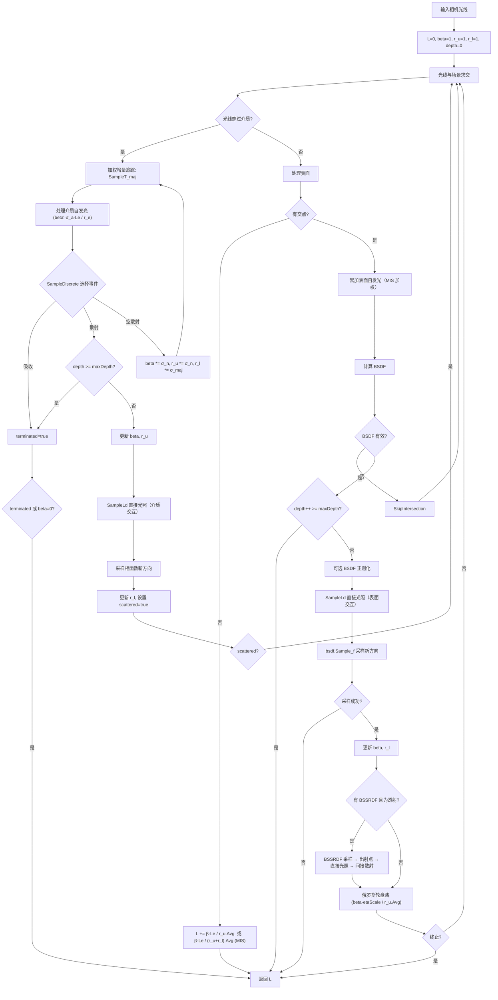

### # VolPathIntegrator::SampleLd 体积直接光照采样

`VolPathIntegrator` 的 `SampleLd` 比 `PathIntegrator` 版本复杂得多，因为需要处理到光源路径上的介质透射率，并维护体积 MIS 权重：

1. **构建 LightSampleContext** — 表面交互时，根据 BSDF 的反射/透射特性将采样位置向表面正确一侧偏移（反射性用 `OffsetRayOrigin(wo)`，透射性用 `OffsetRayOrigin(-wo)`），避免自交；介质交互时直接从 `Interaction` 构建上下文
2. **选择光源 + 光源上采样** — 通过 `lightSampler.Sample(ctx, u)` 按光源分布选择一个光源（概率 `sampledLight.p`），再调用 `SampleLi` 在光源上采样一个点，获得入射方向 `wi`、辐亮度 `Le` 和 PDF `ls.pdf`；联合光源 PDF 为 `p_l = sampledLight.p * ls.pdf`
3. **评估散射函数** — 根据 `bsdf` 是否为 null 区分：
   - 表面交互：`f_hat = bsdf.f(wo, wi) * |cos θ|`，`scatterPDF = bsdf.PDF(wo, wi)`
   - 介质交互：`f_hat = phase.p(wo, wi)`，`scatterPDF = phase.PDF(wo, wi)`
4. **Ratio tracking 透射率估计**（核心步骤）— 初始化 `T_ray = 1`、`r_l = 1`、`r_u = 1`，构造从交互点到光源的阴影光线，然后沿光线循环追踪：
   - **几何求交**：对场景做求交测试，若碰到不透明表面（`si->intr.material` 存在）直接返回 0
   - **介质段内 ratio tracking**：调用 `SampleT_maj` 沿当前段采样，在回调中计算 null 散射系数 `sigma_n = sigma_maj - sigma_a - sigma_s`，然后更新三个权重：
     - `T_ray *= T_maj * sigma_n / pdf` — 透射率估计，乘以 null 散射权重
     - `r_u *= T_maj * sigma_n / pdf` — 散射策略的 MIS 权重，同样乘以 null 散射权重
     - `r_l *= T_maj * sigma_maj / pdf` — 光源策略的 MIS 权重，乘以 majorant 权重（不对称更新，因为光源策略不区分散射类型）
   - **俄罗斯轮盘赌**：当 `T_ray / (r_l + r_u).Average()` 的最大分量 < 0.05 时，以 75% 概率终止（将 `T_ray` 置零），25% 概率继续并除以存活概率
   - **最终段处理**：`T_ray *= T_maj / T_maj[0]` 归一化剩余透射率
5. **跨段循环** — 如果光线穿过透明表面（无材质的交点），用 `SpawnRayTo` 生成下一段光线继续追踪，直到光线到达光源
6. **最终 MIS 加权** — 将路径权重和 PDF 合入：`r_l *= r_p * p_l`，`r_u *= r_p * scatterPDF`，然后：
   - Delta 光源：`beta * f_hat * T_ray * Le / r_l.Average()`
   - 非 delta 光源：`beta * f_hat * T_ray * Le / (r_l + r_u).Average()`

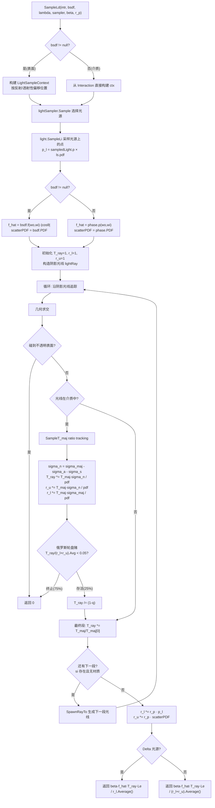

---

<a id="sec-5"></a>

## 5. 特殊用途积分器

<a id="sec-5-1"></a>

### 5.1 AOIntegrator — 环境光遮蔽

### # 适用场景

`AOIntegrator` 计算环境光遮蔽（Ambient Occlusion, AO），不求解完整的光传输方程。AO 衡量表面上每个点被周围几何体遮挡的程度，是一种快速可视化几何复杂度的方法。

- **擅长**：几何遮挡可视化、快速预览场景几何关系、烘焙 AO 贴图
- **不擅长**：不计算真实光照、材质和反射，只是一个单次弹射的遮挡测试

### # 算法原理

对于每个可见表面点：

1. 根据真实几何法线（非着色法线）构建局部坐标系
2. 在法线方向的半球上采样一个方向：余弦加权（`cosSample=true`，默认）或均匀
3. 发射遮挡测试光线，最大距离为 `maxDist`
4. 如果未被遮挡，返回 `illuminant * cos(θ) / (π * pdf)`；否则返回 0

输出被归一化使得完全可见的点返回值为 1（除以 $\pi$）。`illuminant` 参数允许指定环境光的光谱。`illumScale` 在构造时计算为 `1 / SpectrumToPhotometric(illuminant)`。

### # 关键实现要点

- 使用 `FaceForward(isect.n, -ray.d)` 确保法线朝向光线来的方向
- 采用 `goto retry` 跳过介质边界——这是代码中少见的 goto 用法，因为 AO 不需要处理介质
- 使用 `Frame::FromZ(n)` 构建局部坐标系，`f.FromLocal(wi)` 转换到世界坐标
- 遮挡测试使用 `IntersectP(r, maxDist)` 而非完整的 `Intersect`

### # 参数表

| 参数 | 类型 | 默认值 | 说明 |
|---|---|---|---|
| `cossample` | `bool` | `true` | 是否使用余弦加权半球采样（否则使用均匀半球采样） |
| `maxdistance` | `Float` | `Infinity` | 遮挡测试的最大距离 |

> 注：`illuminant` 不是用户参数，由场景颜色空间的光源光谱确定。

### # 流程图

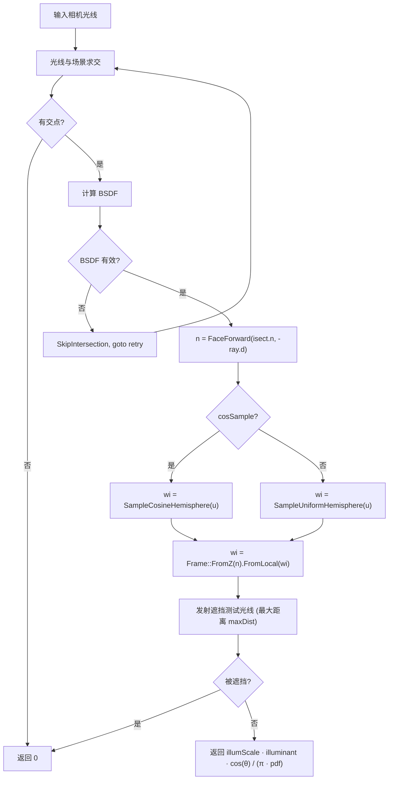

---

<a id="sec-5-2"></a>

### 5.2 LightPathIntegrator — 从光源出发的路径追踪

### # 适用场景

`LightPathIntegrator` 从光源出发追踪路径并向相机投影，是双向路径追踪的「光源子路径」部分的独立版本。

- **擅长**：焦散路径（光源 → 镜面反射/折射 → 漫反射表面 → 相机），这类路径用从相机出发的方法很难找到
- **不擅长**：通用场景（从光源出发的效率很低），仅适合焦散占主导的特殊场景
- **限制**：仅支持 `PerspectiveCamera`

### # 算法原理

传统路径追踪从相机出发，而 `LightPathIntegrator` 从光源出发：

**1. 光源采样与出射**

使用 `PowerLightSampler` 按光源功率选择光源（概率 $p_l$），然后调用 `light.SampleLe(ul0, ul1, lambda, time)` 在光源上采样出射点和方向，获得位置 PDF $p_{\text{pos}}$ 和方向 PDF $p_{\text{dir}}$。

**2. 直接相机投影**

如果光源有交互点（`les->intr` 存在），尝试直接向相机投影。调用 `camera.SampleWi(*les->intr, u, lambda)` 返回：相机方向 $w_i$、像素坐标 `pRaster`、相机重要性 $W_i$（包含 PDF 和几何项）。贡献公式：

$L = \frac{L_e \cdot d^2 \cdot W_i}{p_l \cdot p_{\text{pos}} \cdot p_{\text{cs}}}$

其中 $d^2$ 是交互点到相机镜头的距离平方（立体角校正因子）。通过 `Unoccluded` 可见性测试后，调用 `film.AddSplat(pRaster, L)` 写入像素。

**3. 路径权重初始化**

$\beta = \frac{L_e \cdot |\cos\theta|}{p_l \cdot p_{\text{pos}} \cdot p_{\text{dir}}}$

包含光源自发亮度、出射方向与光源法线的余弦、以及三个 PDF 的归一化。

**4. 逐顶点追踪与投影**

在每个交点处：
- 获取 BSDF，若无效则 `SkipIntersection` 跳过介质边界
- 检查 `depth++ == maxDepth`，超过则终止
- 调用 `camera.SampleWi` 向相机投影，用 `TransportMode::Importance` 评估 BSDF
- 贡献：$L = \beta \cdot f \cdot |\cos\theta| \cdot W_i / p_{\text{cs}}$
- 通过 `Unoccluded` 后 `AddSplat`

BSDF 采样下一方向：`bsdf.Sample_f(wo, uc, u2, TransportMode::Importance)`，更新路径权重：

$\beta \mathrel{*}= \frac{f \cdot |\cos\theta|}{p_{\text{bsdf}}}$

**5. 与 PathIntegrator 的关键差异**

| 特性 | PathIntegrator | LightPathIntegrator |
|---|---|---|
| 基类 | `RayIntegrator`（实现 `Li()`） | `ImageTileIntegrator`（重写 `EvaluatePixelSample()`） |
| 传输模式 | `Radiance`（相机→光源） | `Importance`（光源→相机） |
| 输出方式 | `AddSample()`（预定像素） | `AddSplat()`（任意像素） |
| 直接光照 | NEE + MIS（`SampleLd`） | 无 NEE、无 MIS |
| 俄罗斯轮盘赌 | 有（`depth > 1`） | 无 |
| BSDF 正则化 | 可选 | 无 |
| 效率 | 通用高效 | 仅焦散场景有效 |

### # 关键实现要点

- 继承自 `ImageTileIntegrator`（而非 `RayIntegrator`），因为它重写了 `EvaluatePixelSample` 而非 `Li`
- 像素坐标 `pPixel` 参数实际上被忽略——路径从光源出发，像素位置由相机投影决定
- BSDF 采样使用 `TransportMode::Importance`（非 `Radiance`），因为是从光源到相机的方向
- `camera.SampleWi(isect, u, lambda)` 返回相机采样权重 `cs->Wi`，包含了 PDF 和几何项
- `PowerLightSampler` 是固定的光源采样器（不像 PathIntegrator 可配置 BVH/Uniform/Power），因为从光源出发时按功率采样已足够
- 没有 MIS、NEE、俄罗斯轮盘赌 — 这使实现简单但通用效率低；大量光源路径无法命中相机（相机立体角很小），因此在非焦散场景下收敛极慢

### # 参数表

| 参数 | 类型 | 默认值 | 说明 |
|---|---|---|---|
| `maxdepth` | `int` | 5 | 最大路径深度 |

### # 流程图

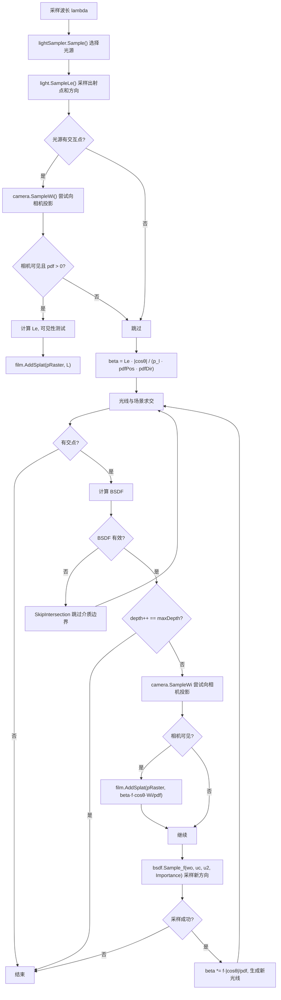

---

<a id="sec-5-3"></a>

### 5.3 FunctionIntegrator — 采样器性能评估

### # 适用场景

`FunctionIntegrator` 不是传统意义上的渲染积分器。它对预定义的二维函数进行数值积分，用于评估不同采样器的收敛性能（通过比较 MSE）。

- **用途**：对比不同采样器（Halton、Sobol、Stratified 等）在积分标准测试函数时的 MSE 收敛速率

### # 算法原理

1. 选择一个目标函数 $f: [0,1]^2 \to \mathbb{R}$，其积分值应为 1
2. 将图像的每个像素视为一个独立的积分估计器
3. 逐步增加采样数，每次计算 MSE：$MSE = \frac{1}{N} \sum_i (\bar{v}_i - 1)^2$
4. 输出「采样数 → MSE」的关系，用于分析收敛速率

可用的测试函数：
- `step` — 阶梯函数：$x < 0.5$ 时为 2，否则为 0
- `diagonal` — 对角线：$x + y < 1$ 时为 2，否则为 0
- `disk` — 圆盘：距中心 < 0.5 时为 $1/(\pi \cdot 0.25)$
- `checkerboard` — 10×10 棋盘格
- `rotatedcheckerboard` — 旋转 45° 的棋盘格
- `gaussian` — 二维高斯

### # 关键实现要点

- 对不同采样器类型有特殊处理：`StratifiedSampler` 跳过非完全平方数的采样数；`PaddedSobolSampler` 跳过非 2 的幂的采样数；`HaltonSampler` 跳过非 $2^a \cdot 3^b$ 形式的采样数（`skipBad=true` 时）
- 对 Halton 和 Sobol 采样器，使用独立的数字排列（digit permutations）和 Owen scrambling 哈希
- `SobolSampler` 不被支持（会报错），必须使用 `PaddedSobolSampler`

### # 参数表

| 参数 | 类型 | 默认值 | 说明 |
|---|---|---|---|
| `function` | `string` | `"step"` | 测试函数名称 |
| `filename` | `string` | `"{function}-mse.txt"` | MSE 输出文件路径 |
| `skipbad` | `bool` | `true` | 是否跳过不适合当前采样器的采样数 |
| `imagefilename` | `string` | `""` | 可选：输出函数的参考图像 |

### # 流程图

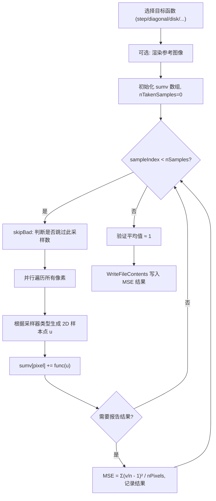

---

<a id="sec-6"></a>

## 6. 双向与全局方法

本节的三个积分器使用更高级的路径构建和采样策略。`BDPTIntegrator` 继承 `RayIntegrator`，而 `MLTIntegrator` 和 `SPPMIntegrator` 直接继承 `Integrator`（它们有完全不同的渲染循环）。

<a id="sec-6-1"></a>

### 6.1 BDPTIntegrator — 双向路径追踪

### # 适用场景

双向路径追踪（Bidirectional Path Tracing, BDPT）同时从相机和光源构建子路径，然后尝试所有可能的连接策略。

- **擅长**：复杂光传输路径（间接照明、多次反弹的焦散）、含参与介质的光传输（RandomWalk 中处理）
- **不擅长**：简单场景（开销高于 `PathIntegrator`）；SDS（镜面-漫反射-镜面）路径仍然困难
- **限制**：仅支持 `PerspectiveCamera`

### # 算法原理

**子路径生成**

1. **相机子路径**：从相机出发，通过 `GenerateCameraSubpath` 进行随机游走，生成最多 `maxDepth + 2` 个顶点
2. **光源子路径**：从光源出发，通过 `GenerateLightSubpath` 进行随机游走，生成最多 `maxDepth + 1` 个顶点
3. 两端的随机游走由共享的 `RandomWalk` 函数实现，支持表面和介质交互

**连接策略 (s, t)**

枚举所有策略组合 $(s, t)$，其中 $s$ 是光源子路径顶点数，$t$ 是相机子路径顶点数，且 $s + t - 2 \leq maxDepth$。`ConnectBDPT` 函数处理四种情况：

| 情况 | 说明 |
|---|---|
| $s = 0$ | 纯相机路径：直接计算路径末端碰到的光源自发光 |
| $t = 1$ | 从光源子路径末端向相机投影（`camera.SampleWi`），使用 `AddSplat` |
| $s = 1$ | 从相机子路径末端采样光源点连接 |
| 一般情况 | 连接两条子路径的末端，计算几何项 $G$ 和透射率 $T_r$ |

注意 $(s=1, t=1)$ 被跳过，因为这对应于直接从光源到相机的连接，没有中间顶点。

**MIS 权重计算**

`MISWeight` 函数使用 balance heuristic 的变体。对于每种策略 $(s, t)$，需要计算所有替代策略的相对采样概率：

1. 临时替换连接点的 `pdfRev`
2. 沿相机子路径回溯，累乘比值 `ri *= pdfRev_i / pdfFwd_i`，跳过 delta 顶点
3. 沿光源子路径回溯，同样累加
4. 返回 `1 / (1 + sumRi)`

当 $s + t = 2$ 时直接返回 1（只有唯一策略）。

### # 关键实现要点

- `Vertex` 结构体使用 union 存储 `EndpointInteraction` / `MediumInteraction` / `SurfaceInteraction`
- `Vertex::IsConnectible()` 判断顶点是否可连接（delta 光源的方向光不可连接，纯镜面表面不可连接）
- `BDPTIntegrator::Render()` 先分配可视化缓冲区，然后调用 `RayIntegrator::Render()`
- 可选的 `visualizeStrategies` / `visualizeWeights` 将每种 $(s,t)$ 策略的贡献分别输出为独立的 EXR 文件
- 对 $t = 1$ 策略使用 `AddSplat`（泼溅），其他策略使用 `AddSample`（按像素累加）
- `splatScale` 校正：处理渲染区域与完整分辨率不一致时的 splat 权重缩放（参见 pbrt-v4 issue #347）

### # 参数表

| 参数 | 类型 | 默认值 | 说明 |
|---|---|---|---|
| `maxdepth` | `int` | 5 | 最大路径深度 |
| `regularize` | `bool` | `false` | 是否启用 BSDF 正则化 |
| `visualizestrategies` | `bool` | `false` | 输出每种策略的单独图像（开启后 maxDepth 限制为 5） |
| `visualizeweights` | `bool` | `false` | 输出每种策略的 MIS 加权图像 |

### # BDPT 总体流程图

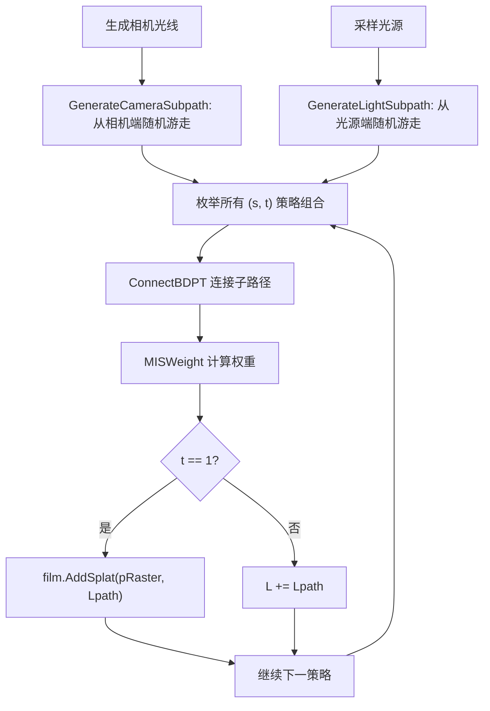

### # ConnectBDPT 连接策略详细流程

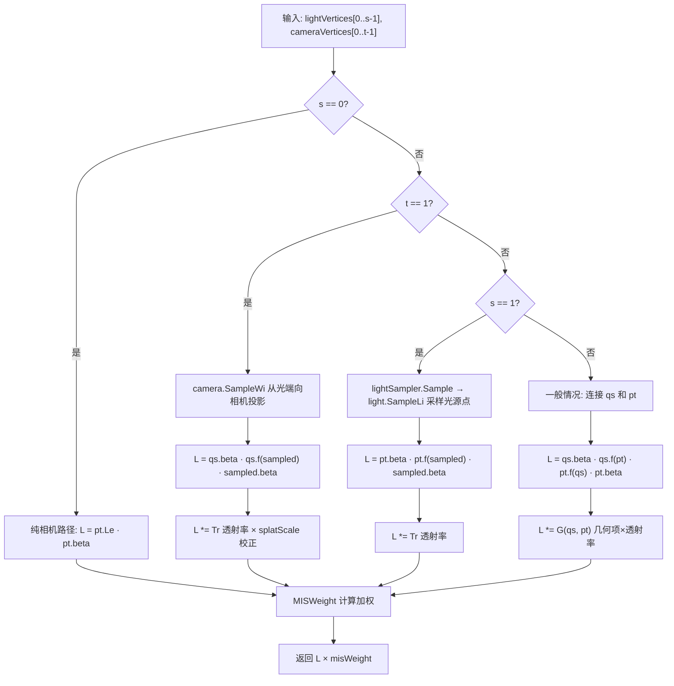

### # MISWeight 计算

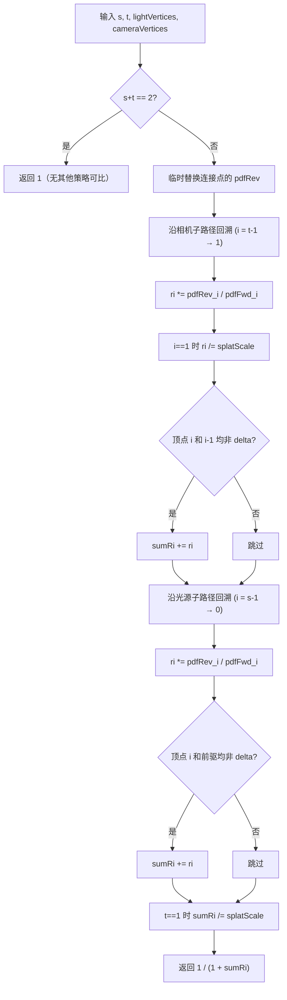

---

<a id="sec-6-2"></a>

### 6.2 MLTIntegrator — 梅特罗波利斯光传输

### # 适用场景

梅特罗波利斯光传输（Metropolis Light Transport, MLT）在路径空间中使用马尔可夫链蒙特卡洛（MCMC）采样，能够发现和集中采样高贡献路径。

- **擅长**：强焦散、SDS 路径（镜面-漫反射-镜面）、泳池底部的光斑等「困难光传输」场景
- **不擅长**：简单场景（MCMC 开销高，且不能像传统方法一样利用并行性）；不保证均匀采样所有像素，可能产生低频噪点
- **限制**：仅支持 `PerspectiveCamera`

### # 算法原理

MLT 本身不实现路径构建，而是复用 BDPT 的子路径生成 + 连接机制。其核心是在路径空间上进行 Metropolis-Hastings 采样：

**1. Bootstrap 阶段**

并行生成 `nBootstrap × (maxDepth + 1)` 个样本（每种路径深度分别采样），计算每个样本的亮度权重 `c(L, lambda) = L.y(lambda)`。使用这些权重构建 `AliasTable` 用于快速选择初始状态，并计算归一化常数 $b$。

**2. Markov Chain 阶段**

并行运行 `nChains` 条马尔可夫链，每条链执行 `nChainMutations` 次突变：

1. `sampler.StartIteration()` 提议新样本（通过扰动随机数序列）
2. 调用 `L()` 评估提议路径的辐亮度
3. 计算接受概率 `accept = min(1, c_proposed / c_current)`
4. 两个样本都会贡献到图像：提议样本按 `accept / c_proposed` 权重泼溅，当前样本按 `(1 - accept) / c_current` 权重泼溅
5. 以概率 `accept` 接受提议（更新当前状态），否则拒绝

**3. L() 路径评估**

`L()` 方法内部：
1. 根据路径深度 `depth` 确定策略数 `nStrategies = depth + 2`
2. 随机选择一种 $(s, t)$ 策略
3. 使用 `MLTSampler` 的三个流（camera、light、connection）分别生成相机子路径、光源子路径和连接采样
4. 调用 `ConnectBDPT` 连接子路径，返回 `L × nStrategies`

### # 关键实现要点

- `MLTSampler` 有三个独立的采样流：`cameraStreamIndex=0`，`lightStreamIndex=1`，`connectionStreamIndex=2`
- `sigma` 控制小步突变的幅度，`largeStepProbability` 控制大步突变（完全重新采样）的概率
- 图像最终缩放因子为 `b / mutationsPerPixel`
- 如果 bootstrap 阶段所有样本亮度为 0，报错退出（场景中无光）
- 使用 `AddSplat` 输出（因为 MCMC 采样的路径不对应特定像素）

### # 参数表

| 参数 | 类型 | 默认值 | 说明 |
|---|---|---|---|
| `maxdepth` | `int` | 5 | 最大路径深度 |
| `bootstrapsamples` | `int` | 100000 | Bootstrap 阶段的样本数 |
| `chains` | `int` | 1000 | 马尔可夫链数量 |
| `mutationsperpixel` | `int` | 100 | 每像素的突变次数 |
| `sigma` | `Float` | 0.01 | 小步突变的标准差 |
| `largestepprobability` | `Float` | 0.3 | 大步突变的概率 |
| `regularize` | `bool` | `false` | 是否启用 BSDF 正则化 |

### # 流程图

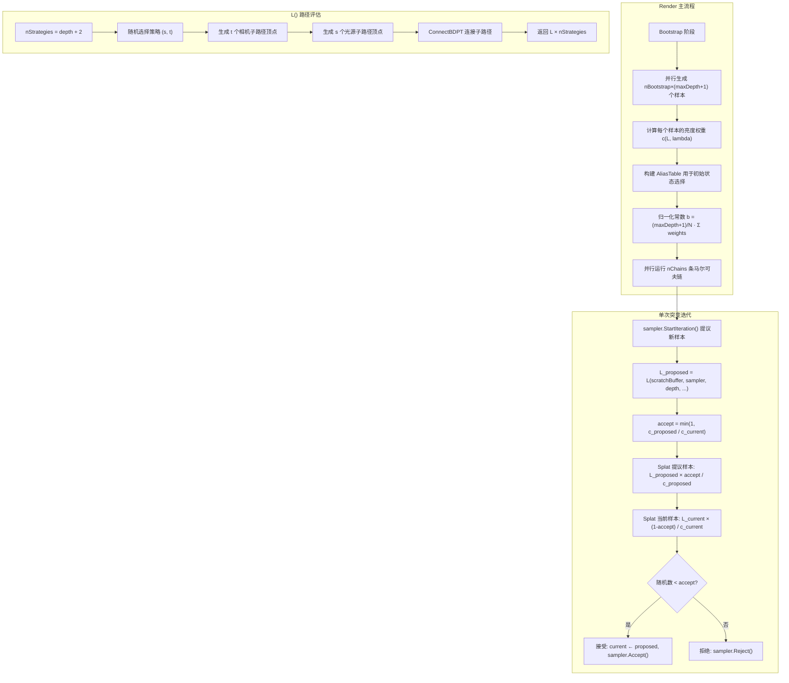

---

<a id="sec-6-3"></a>

### 6.3 SPPMIntegrator — 随机渐进光子映射

### # 适用场景

随机渐进光子映射（Stochastic Progressive Photon Mapping, SPPM）结合了光线追踪和光子映射，通过多次迭代渐进收敛。

- **擅长**：焦散、复杂光传输、SDS 路径（与 MLT 类似），特别是当光源到漫反射表面的路径经过镜面反射时
- **不擅长**：不处理参与介质；需要大量迭代才能获得高质量结果；内存消耗较大（存储所有可见点）
- **特点**：有偏但一致（biased but consistent）——随着迭代次数增加，偏差趋向于零

### # 算法原理

每次迭代包含两个阶段：

**第一阶段：从相机追踪光线到可见点**

从每个像素出发追踪光线，沿路径累加直接光照（使用 NEE + MIS，与 `PathIntegrator` 类似），直到碰到漫反射或最终光泽表面，记录为**可见点**（Visible Point）。可见点保存位置、方向、BSDF 和路径权重。

**第二阶段：从光源发射光子**

从光源发射 `photonsPerIteration` 个光子，光子在场景中随机游走。当光子碰到表面时，搜索附近的可见点（在搜索半径内），将光子贡献累加到可见点。使用哈希网格加速空间查询。

**渐进半径收缩**

每次迭代后，更新每个可见点的统计量：
- 新光子计数：$n_{new} = n + \gamma \cdot m$（$\gamma = 2/3$）
- 新搜索半径：$r_{new} = r \cdot \sqrt{n_{new} / (n + m)}$
- 更新光通量：$\tau_{new} = (\tau + \Phi) \cdot r_{new}^2 / r^2$

搜索半径逐步缩小，使得估计的偏差逐渐减小。

**最终像素值**

$L_{pixel} = \frac{L_d}{iterations} + \frac{\tau}{N_p \cdot \pi \cdot r^2}$

其中 $L_d$ 是直接光照累加，$\tau$ 是光子贡献的光通量，$N_p$ 是总光子数。

### # 关键实现要点

- 直接继承 `Integrator`，有完全自定义的 `Render()` 循环
- 使用两个不同的光源采样器：`BVHLightSampler` 用于第一阶段的直接光照采样，`PowerLightSampler` 用于第二阶段的光子发射
- 光子采样使用 Halton 序列（`ScrambledRadicalInverse`）而非传统随机采样器
- 哈希网格使用 `NextPrime(nPixels)` 大小，通过 `std::atomic<SPPMPixelListNode*>` 实现无锁链表
- `SPPMPixel` 使用 `AtomicFloat` 存储 `Phi_i`（光通量），允许多线程并发更新
- 波长在每次迭代中统一采样（`RadicalInverse(1, iter)`），所有像素使用相同波长
- 定期输出中间图像：在前 64 次迭代中按 2 的幂输出，之后每 64 次输出一次

### # 参数表

| 参数 | 类型 | 默认值 | 说明 |
|---|---|---|---|
| `maxdepth` | `int` | 5 | 最大路径深度（用于相机路径和光子路径） |
| `photonsperiteration` | `int` | -1（= 像素数） | 每次迭代发射的光子数 |
| `radius` | `Float` | 1.0 | 初始搜索半径 |
| `seed` | `int` | `Options->seed` | 随机数种子（影响光子采样的数字排列） |

### # 流程图

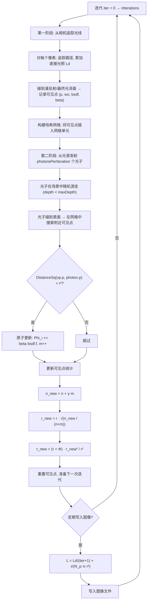

---

<a id="sec-7"></a>

## 7. 积分器对比

### 7.1 选择指南（按场景推荐）

| 场景类型 | 推荐积分器 | 理由 |
|---|---|---|
| **通用表面场景**（无介质） | `PathIntegrator` | NEE + MIS + RR，收敛快，开销低 |
| **含烟雾/云/雾的场景** | `VolPathIntegrator` | 完整的体积散射和 MIS 支持 |
| **含次表面散射（皮肤、蜡等）** | `VolPathIntegrator` | 唯一支持 BSSRDF 的积分器 |
| **强焦散场景** | `BDPTIntegrator` 或 `SPPMIntegrator` | 双向路径更容易找到焦散路径 |
| **极难光传输（SDS 路径等）** | `MLTIntegrator` | MCMC 能集中采样高贡献路径 |
| **快速几何预览** | `AOIntegrator` | 只计算遮挡，最快 |
| **教学 / 算法对比** | `RandomWalkIntegrator` 或 `SimplePathIntegrator` | 代码简洁，方便理解 |
| **采样器性能评估** | `FunctionIntegrator` | 专门用于测试采样器收敛性 |

### 7.2 算法特性对比

### # 表A: 核心算法特性

| 积分器 | NEE | MIS | 俄罗斯轮盘赌 | 参与介质 | BSSRDF | Delta 光源 |
|---|---|---|---|---|---|---|
| `RandomWalk` | 否 | 否 | 否 | 否 | 否 | 是（隐式） |
| `SimplePath` | 可选 | 否 | 否 | 否 | 否 | 是 |
| `Path` | 是 | 是 (PowerHeuristic) | 是 (depth > 1) | 否 | 否 | 是 |
| `SimpleVolPath` | 否 | 否 | 否 | 是 (delta tracking) | 否 | 否 (ErrorExit) |
| `VolPath` | 是 | 是 (加权增量追踪) | 是 (depth > 1) | 是 | 是 | 是 |
| `AO` | 否 | 否 | 否 | 否 | 否 | 是 |
| `LightPath` | 否（反向投影） | 否 | 否 | 否 | 否 | 是 |
| `BDPT` | 是（连接策略） | 是 (balance heuristic) | 否 (maxDepth 截断) | 是 (RandomWalk) | 否 | 是 |
| `MLT` | 是（通过 BDPT） | 是（通过 BDPT） | 否 | 是（通过 BDPT） | 否 | 是 |
| `SPPM` | 是 (PowerHeuristic) | 是 (PowerHeuristic) | 是 | 否 | 否 | 是 |

### # 表B: 工程特性

| 积分器 | 基类 | 光源采样器 | 相机要求 | 输出方式 | 正则化 |
|---|---|---|---|---|---|
| `RandomWalk` | `RayIntegrator` | 无 | 任意 | `AddSample` | 否 |
| `SimplePath` | `RayIntegrator` | `UniformLightSampler` | 任意 | `AddSample` | 否 |
| `Path` | `RayIntegrator` | 可配置 (默认 BVH) | 任意 | `AddSample` | 可选 |
| `SimpleVolPath` | `RayIntegrator` | 无 | 任意 | `AddSample` | 否 |
| `VolPath` | `RayIntegrator` | 可配置 (默认 BVH) | 任意 | `AddSample` | 可选 |
| `AO` | `RayIntegrator` | 无 | 任意 | `AddSample` | 否 |
| `LightPath` | `ImageTileIntegrator` | `PowerLightSampler` | 仅 Perspective | `AddSplat` | 否 |
| `BDPT` | `RayIntegrator` | `PowerLightSampler` | 仅 Perspective | `AddSample` + `AddSplat` | 可选 |
| `MLT` | `Integrator` | `PowerLightSampler` | 仅 Perspective | `AddSplat` | 可选 |
| `SPPM` | `Integrator` | BVH + Power | 任意 | 自定义像素累加 | 否 |

### # 表C: 性能与适用性

| 积分器 | 收敛速度 | 擅长场景 | 默认 maxDepth |
|---|---|---|---|
| `RandomWalk` | 极慢 | 教学 | 5 |
| `SimplePath` | 慢 | 教学 / 对比实验 | 5 |
| `Path` | 快 | 通用表面场景 | 5 |
| `SimpleVolPath` | 中 | 纯介质教学场景 | 5 |
| `VolPath` | 快 | 含介质 / SSS 的通用场景 | 5 |
| `AO` | 快 | 遮挡可视化 | 无（单次反射） |
| `LightPath` | 慢 | 焦散路径 | 5 |
| `BDPT` | 中 | 复杂光传输 | 5 |
| `MLT` | 场景依赖 | 强焦散 / SDS 路径 | 5 |
| `SPPM` | 渐进 | 焦散 / 复杂光传输 | 5 |

### 7.3 关键区别说明

- **`AddSample` vs `AddSplat`**：`AddSample` 是标准的按像素权重累加，`AddSplat` 是向任意像素位置泼溅贡献。从光源出发的路径（`LightPath`、BDPT 的 $t=1$ 策略、MLT）使用 `AddSplat`，因为路径投影到的像素不是预先确定的。

- **`Path` vs `VolPath`**：`VolPath` 在 `Path` 基础上增加了参与介质和 BSSRDF 支持。核心区别是 `VolPath` 使用 `r_u`/`r_l` 两组重缩放概率来实现体积中的 MIS。如果场景没有介质，`PathIntegrator` 开销更低。

- **`MLT` 不实现路径构建**：MLT 复用 BDPT 的子路径生成 + 连接机制（`GenerateCameraSubpath`、`GenerateLightSubpath`、`ConnectBDPT`），在路径空间上做 Metropolis-Hastings 采样来探索高贡献区域。

- **`SPPM` 是有偏但一致的**：与其他积分器不同，SPPM 的光子密度估计引入了偏差。但随着迭代次数增加（搜索半径收缩），偏差趋向于零。每次迭代不需要存储整个光子图，只需要原子更新可见点的统计量。

---

<a id="sec-8"></a>

## 8. 工厂方法与参数汇总

`Integrator::Create` 是静态工厂方法，根据名称字符串创建对应的积分器实例。名称映射关系：

| 名称字符串 | 积分器类 | Create 方法 |
|---|---|---|
| `"path"` | `PathIntegrator` | `PathIntegrator::Create` |
| `"volpath"` | `VolPathIntegrator` | `VolPathIntegrator::Create` |
| `"simplepath"` | `SimplePathIntegrator` | `SimplePathIntegrator::Create` |
| `"simplevolpath"` | `SimpleVolPathIntegrator` | `SimpleVolPathIntegrator::Create` |
| `"randomwalk"` | `RandomWalkIntegrator` | `RandomWalkIntegrator::Create` |
| `"ambientocclusion"` | `AOIntegrator` | `AOIntegrator::Create` |
| `"lightpath"` | `LightPathIntegrator` | `LightPathIntegrator::Create` |
| `"bdpt"` | `BDPTIntegrator` | `BDPTIntegrator::Create` |
| `"mlt"` | `MLTIntegrator` | `MLTIntegrator::Create` |
| `"sppm"` | `SPPMIntegrator` | `SPPMIntegrator::Create` |
| `"function"` | `FunctionIntegrator` | `FunctionIntegrator::Create` |

所有参数汇总（按积分器分组）：

| 积分器 | 参数 | 类型 | 默认值 |
|---|---|---|---|
| **RandomWalk** | `maxdepth` | int | 5 |
| **SimplePath** | `maxdepth` | int | 5 |
| | `samplelights` | bool | true |
| | `samplebsdf` | bool | true |
| **Path** | `maxdepth` | int | 5 |
| | `lightsampler` | string | "bvh" |
| | `regularize` | bool | false |
| **SimpleVolPath** | `maxdepth` | int | 5 |
| **VolPath** | `maxdepth` | int | 5 |
| | `lightsampler` | string | "bvh" |
| | `regularize` | bool | false |
| **AO** | `cossample` | bool | true |
| | `maxdistance` | Float | Infinity |
| **LightPath** | `maxdepth` | int | 5 |
| **BDPT** | `maxdepth` | int | 5 |
| | `regularize` | bool | false |
| | `visualizestrategies` | bool | false |
| | `visualizeweights` | bool | false |
| **MLT** | `maxdepth` | int | 5 |
| | `bootstrapsamples` | int | 100000 |
| | `chains` | int | 1000 |
| | `mutationsperpixel` | int | 100 |
| | `sigma` | Float | 0.01 |
| | `largestepprobability` | Float | 0.3 |
| | `regularize` | bool | false |
| **SPPM** | `maxdepth` | int | 5 |
| | `photonsperiteration` | int | -1 (= 像素数) |
| | `radius` | Float | 1.0 |
| | `seed` | int | Options->seed |
| **Function** | `function` | string | "step" |
| | `filename` | string | "{function}-mse.txt" |
| | `skipbad` | bool | true |
| | `imagefilename` | string | "" |

---

<a id="sec-9"></a>

## 9. 依赖关系

### 依赖

- `pbrt/pbrt.h` — 全局类型定义
- `pbrt/base/camera.h` — 相机基类
- `pbrt/base/sampler.h` — 采样器基类
- `pbrt/bsdf.h` — BSDF 类
- `pbrt/bssrdf.h` — BSSRDF（次表面散射）
- `pbrt/cameras.h` — 相机实现
- `pbrt/cpu/primitive.h` — 图元类型
- `pbrt/film.h` — 胶片和图像输出
- `pbrt/filters.h` — 重建滤波器
- `pbrt/interaction.h` — 表面和介质交互
- `pbrt/lights.h` — 光源实现
- `pbrt/lightsamplers.h` — 光源采样器
- `pbrt/materials.h` — 材质实现
- `pbrt/media.h` — 参与介质
- `pbrt/options.h` — 全局选项
- `pbrt/paramdict.h` — 参数字典
- `pbrt/samplers.h` — 采样器实现
- `pbrt/shapes.h` — 形状实现
- `pbrt/util/bluenoise.h` — 蓝噪声数据
- `pbrt/util/color.h` — 颜色工具
- `pbrt/util/colorspace.h` — 色彩空间
- `pbrt/util/containers.h` — 容器工具
- `pbrt/util/display.h` — 实时显示接口
- `pbrt/util/file.h` — 文件操作
- `pbrt/util/hash.h` — 哈希函数
- `pbrt/util/image.h` — 图像读写
- `pbrt/util/lowdiscrepancy.h` — 低差异序列
- `pbrt/util/math.h` — 数学工具
- `pbrt/util/memory.h` — 内存管理
- `pbrt/util/parallel.h` — 并行工具
- `pbrt/util/progressreporter.h` — 进度报告
- `pbrt/util/rng.h` — 随机数生成
- `pbrt/util/sampling.h` — 采样工具函数
- `pbrt/util/spectrum.h` — 光谱
- `pbrt/util/stats.h` — 性能统计

### 被依赖

- `pbrt/cpu/render.cpp` — CPU 渲染入口创建积分器
- `pbrt/cpu/integrators_test.cpp` — 积分器集成测试
- `pbrt/scene.cpp` — 场景构建中创建积分器
