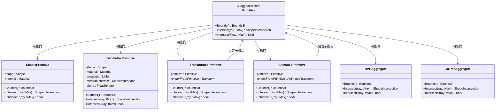
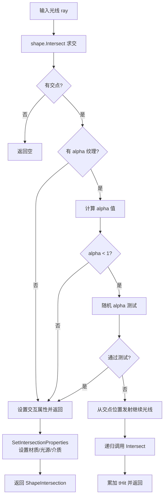

# primitive.h / primitive.cpp

## 概述

该文件定义了 PBRT-v4 中"图元"（Primitive）的类型系统，是光线追踪渲染管线中连接几何形状（Shape）与材质（Material）、光源（Light）、介质（Medium）等属性的核心抽象层。`Primitive` 使用 `TaggedPointer` 模式实现多态分派，避免了虚函数开销，并统一了简单图元、几何图元、变换图元、动画图元以及加速结构聚合体的接口。

## 主要类与接口

| 类/结构体/函数 | 说明 |
|---|---|
| `Primitive` | 基于 `TaggedPointer` 的多态图元类型，可指向 `SimplePrimitive`、`GeometricPrimitive`、`TransformedPrimitive`、`AnimatedPrimitive`、`BVHAggregate`、`KdTreeAggregate` 中的任一类型 |
| `SimplePrimitive` | 最简单的图元，仅包含形状和材质，不支持面光源、alpha 纹理或介质接口 |
| `GeometricPrimitive` | 完整功能的几何图元，支持形状、材质、面光源、介质接口和 alpha 透明度纹理 |
| `TransformedPrimitive` | 变换图元，将一个子图元包装在一个静态变换下，用于实例化 |
| `AnimatedPrimitive` | 动画图元，将一个子图元包装在时变动画变换下，支持运动模糊 |

## 架构图

## 算法流程图

### GeometricPrimitive::Intersect 求交流程（含 alpha 测试）

## 依赖关系

- **依赖**：
  - `pbrt/pbrt.h` — 全局类型定义
  - `pbrt/base/light.h` — 光源基类
  - `pbrt/base/material.h` — 材质基类
  - `pbrt/base/medium.h` — 介质基类
  - `pbrt/base/shape.h` — 形状基类
  - `pbrt/base/texture.h` — 纹理基类
  - `pbrt/util/stats.h` — 内存统计计数器
  - `pbrt/util/taggedptr.h` — `TaggedPointer` 多态机制
  - `pbrt/util/transform.h` — 变换和动画变换
  - `pbrt/cpu/aggregates.h` — 加速结构（在 .cpp 中引用）
  - `pbrt/interaction.h` — 表面交互
  - `pbrt/materials.h` — 材质实现
  - `pbrt/shapes.h` — 形状实现
  - `pbrt/textures.h` — 纹理实现

- **被依赖**：
  - `pbrt/cpu/aggregates.h` — 加速结构存储 `Primitive` 数组
  - `pbrt/cpu/integrators.h` — 积分器持有聚合体 `Primitive`
  - `pbrt/scene.h` — 场景管理中使用 `Primitive`
  - `pbrt/wavefront/aggregate.h` — GPU 波前路径中引用 `Primitive`
