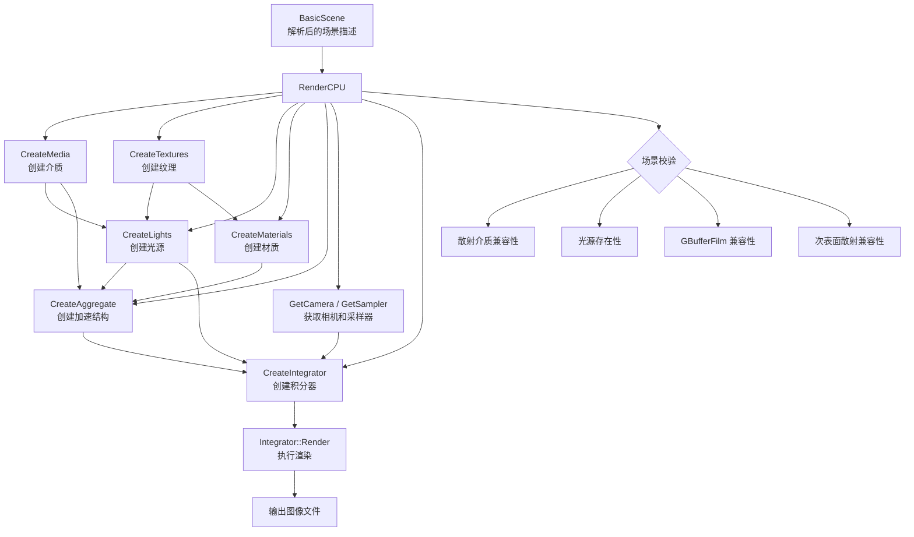
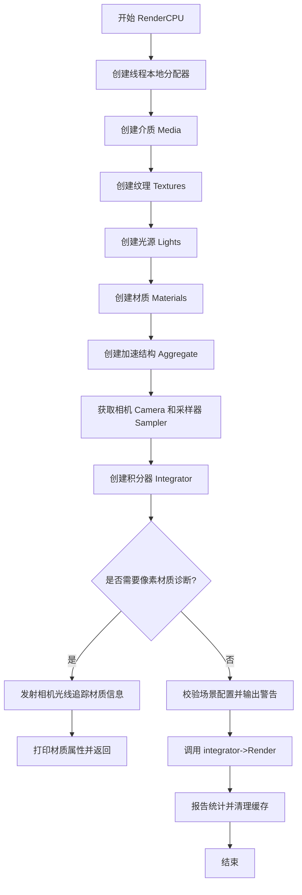

# render.h / render.cpp

## 概述

该文件是 PBRT-v4 的 CPU 渲染入口，提供了 `RenderCPU` 函数作为从场景描述到最终图像输出的完整 CPU 渲染管线的总调度器。它负责从解析后的场景（`BasicScene`）中依次创建介质、纹理、光源、材质、加速结构、相机、采样器和积分器等所有渲染资源，并最终调用积分器的 `Render()` 方法执行渲染。同时还包含场景配置校验和诊断功能。

## 主要类与接口

| 类/结构体/函数 | 说明 |
|---|---|
| `RenderCPU(BasicScene &scene)` | CPU 渲染主入口函数，接受解析后的场景，协调创建所有渲染组件并执行渲染 |

### RenderCPU 函数的主要职责

| 步骤 | 说明 |
|---|---|
| 创建介质 | 调用 `parsedScene.CreateMedia()` 创建参与介质映射表 |
| 创建纹理 | 调用 `parsedScene.CreateTextures()` 创建命名纹理集合 |
| 创建光源 | 调用 `parsedScene.CreateLights()` 创建光源列表，同时建立形状到面光源的映射 |
| 创建材质 | 调用 `parsedScene.CreateMaterials()` 创建命名材质和材质数组 |
| 创建加速结构 | 调用 `parsedScene.CreateAggregate()` 构建场景图元的加速结构 |
| 创建积分器 | 调用 `parsedScene.CreateIntegrator()` 创建适当的积分器实例 |
| 校验场景配置 | 检测散射介质与积分器兼容性、缺少光源警告、GBuffer 兼容性、次表面散射支持 |
| 像素材质诊断 | 若命令行指定了 `--pixelmaterial`，则追踪该像素的光线并打印命中材质信息 |
| 执行渲染 | 调用 `integrator->Render()` 开始正式渲染 |
| 清理资源 | 输出纹理缓存统计并清理 `ImageTextureBase` 和 `PtexTextureBase` 缓存 |

## 架构图

## 算法流程图

### RenderCPU 主流程

## 依赖关系

- **依赖**：
  - `pbrt/cpu/render.h` — 自身头文件
  - `pbrt/cpu/aggregates.h` — 加速结构创建
  - `pbrt/cpu/integrators.h` — 积分器创建
  - `pbrt/cameras.h` — 相机实现
  - `pbrt/film.h` — 胶片（图像输出）
  - `pbrt/filters.h` — 重建滤波器
  - `pbrt/lights.h` — 光源实现
  - `pbrt/materials.h` — 材质实现
  - `pbrt/media.h` — 参与介质实现
  - `pbrt/samplers.h` — 采样器实现
  - `pbrt/scene.h` — `BasicScene` 场景类
  - `pbrt/shapes.h` — 形状实现
  - `pbrt/textures.h` — 纹理实现
  - `pbrt/util/colorspace.h` — 色彩空间
  - `pbrt/util/parallel.h` — 并行工具

- **被依赖**：
  - `pbrt/cmd/pbrt.cpp` — 主程序入口调用 `RenderCPU`
