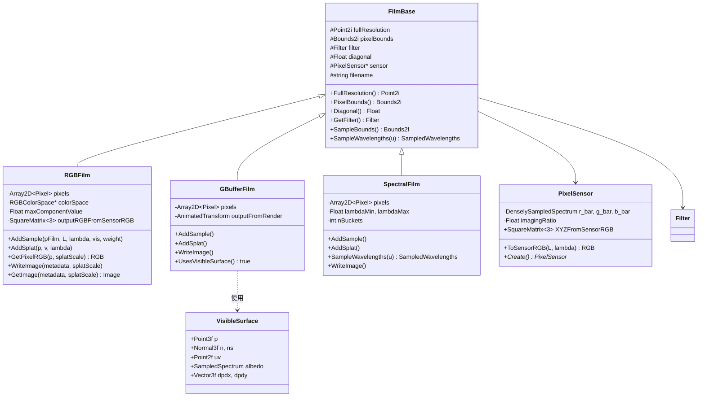
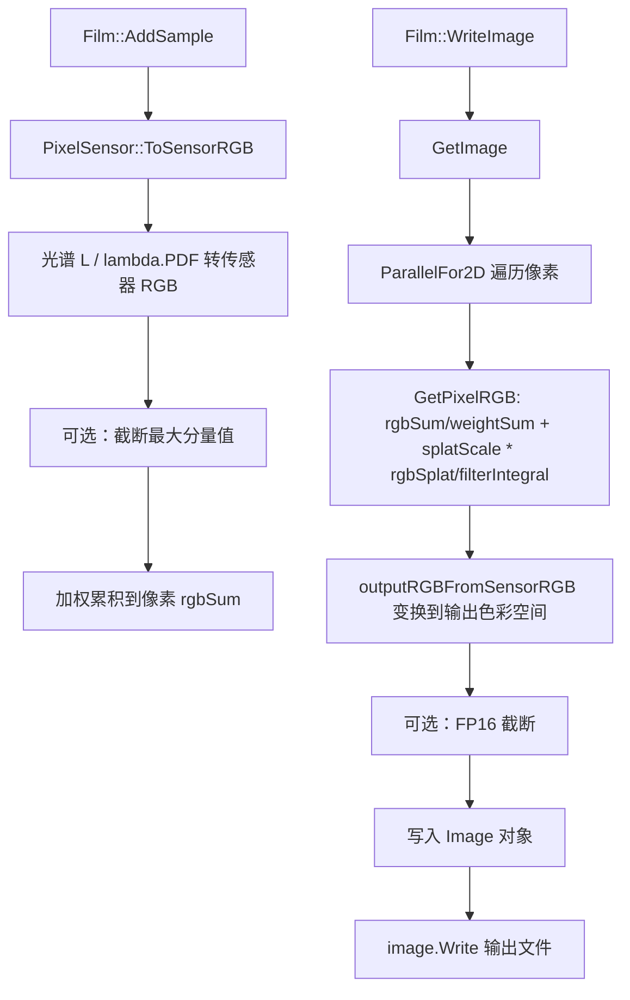

# film.h / film.cpp

## 概述
该文件实现了 PBRT 渲染器中的 **胶片系统**，负责将渲染计算得到的光谱辐射度值累积为最终的图像像素。胶片模块是渲染管线的终点，它处理从光谱到 RGB 的转换、像素传感器模拟、色彩空间变换，并支持输出 RGB、几何缓冲 (G-Buffer) 和光谱三种不同格式。文件还包含了物理相机传感器模型 `PixelSensor` 和可见表面信息 `VisibleSurface` 的定义。

## 主要类与接口

### 1. PixelSensor（像素传感器）

#### 1.1 概述

`PixelSensor` 模拟物理相机传感器，负责将光谱辐射度（`SampledSpectrum`）转换为传感器 RGB 值。它是渲染管线中光谱→色彩转换的第一步，后续再由 `XYZFromSensorRGB` 矩阵将传感器 RGB 变换到 CIE XYZ 色彩空间。

PixelSensor 支持两种工作模式：
- **CIE 1931 标准观察者**（默认直通模式）：使用 CIE X(λ)/Y(λ)/Z(λ) 匹配函数作为传感器响应曲线，传感器 RGB 直接等于 XYZ 值
- **自定义传感器响应曲线**：模拟真实相机传感器（如 Canon EOS、Sony IMX 等）的光谱灵敏度，通过线性最小二乘法校准将传感器 RGB 映射到 XYZ

PhysLight（物理光照）相关代码来自 Weta Digital，由 Anders Langlands 和 Luca Fascione 贡献。

#### 1.2 数据结构

| 成员 | 类型 | 说明 |
|---|---|---|
| `r_bar`, `g_bar`, `b_bar` | `DenselySampledSpectrum` | 三通道光谱响应函数。自定义模式下为传感器实际响应曲线；CIE 1931 模式下分别为 X(λ)、Y(λ)、Z(λ) |
| `imagingRatio` | `Float` | 曝光缩放因子，`= exposureTime × ISO / 100`。默认场景下为 1.0（直通） |
| `XYZFromSensorRGB` | `SquareMatrix<3>` | 从传感器 RGB 到 CIE XYZ 的 3×3 变换矩阵（公共成员） |
| `swatchReflectances[24]` | `static Spectrum[]` | Macbeth ColorChecker 24 块色卡的光谱反射率数据（静态成员） |
| `nSwatchReflectances` | `static constexpr int` | 色卡数量，固定为 24 |

#### 1.3 Create 工厂方法（`film.cpp:213-253`）

`Create` 是创建 `PixelSensor` 的主入口，根据参数选择不同的构造路径。

**参数**：
- `iso`：感光度，默认 100
- `whitebalance`：白平衡色温（K），默认 0 表示不做白平衡
- `sensor`：传感器类型名称，默认 `"cie1931"`

**流程**：

1. 计算 `imagingRatio = exposureTime × ISO / 100`。默认值 `exposureTime=1, ISO=100` 使 `imagingRatio=1`，即"直通"模式，适合非物理光照的场景
2. 若 `sensor != "cie1931"` 且 `whitebalance == 0`，自动将白平衡设为 6500K（D65 日光）
3. 根据白平衡色温生成 D 光源光谱 `sensorIllum`（`whitebalance=0` 时为 `nullptr`，表示不做白平衡）
4. **`"cie1931"` 路径**：调用第二构造函数 `PixelSensor(colorSpace, sensorIllum, imagingRatio, alloc)`
5. **自定义传感器路径**：通过 `GetNamedSpectrum(sensorName + "_r/_g/_b")` 获取三通道响应曲线，调用第一构造函数

`CreateDefault` 是便捷方法，等价于 `Create(默认参数, sRGB色彩空间, exposureTime=1.0)`。

#### 1.4 构造函数一：自定义传感器响应曲线（`film.h:45-78`）

```
PixelSensor(Spectrum r, Spectrum g, Spectrum b,
            const RGBColorSpace *outputColorSpace,
            Spectrum sensorIllum, Float imagingRatio, Allocator alloc)
```

此构造函数接受自定义的 r/g/b 光谱响应曲线，通过 **线性最小二乘法** 校准，计算从传感器 RGB 到 CIE XYZ 的 3×3 变换矩阵。

**校准流程**：

**第一步：计算传感器 RGB 训练数据**

对 24 块 Macbeth ColorChecker 色卡，在传感器光源 `sensorIllum` 下，用自定义响应曲线计算各色卡的传感器 RGB 值：

```cpp
RGB rgb = ProjectReflectance<RGB>(swatchReflectances[i], sensorIllum,
                                   &r_bar, &g_bar, &b_bar);
```

**第二步：计算目标 XYZ 训练数据**

对同样的 24 块色卡，在输出色彩空间的标准光源下，用 CIE X(λ)/Y(λ)/Z(λ) 匹配函数计算各色卡的 XYZ 值：

```cpp
XYZ xyz = ProjectReflectance<XYZ>(s, &outputColorSpace->illuminant,
                                   &Spectra::X(), &Spectra::Y(), &Spectra::Z())
          * (sensorWhiteY / sensorWhiteG);
```

其中 `sensorWhiteY / sensorWhiteG` 是亮度归一化因子：`sensorWhiteY = ∫ sensorIllum(λ) × Y(λ) dλ`，`sensorWhiteG = ∫ sensorIllum(λ) × g_bar(λ) dλ`，确保传感器 g 通道与 CIE Y 通道的白点亮度一致。

**第三步：线性最小二乘法求解**

用 24 组 `(传感器RGB, XYZ)` 数据对求解 3×3 矩阵 `M`，使得 `XYZ ≈ M × SensorRGB` 的残差最小：

```cpp
pstd::optional<SquareMatrix<3>> m =
    LinearLeastSquares(rgbCamera, xyzOutput, nSwatchReflectances);
XYZFromSensorRGB = *m;
```

#### 1.5 构造函数二：CIE 1931 标准观察者（`film.h:80-92`）

```
PixelSensor(const RGBColorSpace *outputColorSpace,
            Spectrum sensorIllum, Float imagingRatio, Allocator alloc)
```

此构造函数使用 CIE 1931 标准色彩匹配函数作为传感器响应：
- `r_bar = X(λ)`，`g_bar = Y(λ)`，`b_bar = Z(λ)`

**白平衡处理**：
- 若指定了 `sensorIllum`（即 `whitebalance != 0`）：计算色适应矩阵 `XYZFromSensorRGB = WhiteBalance(sourceWhite, targetWhite)`，其中 `sourceWhite` 为传感器光源的 CIE xy 色度坐标，`targetWhite` 为输出色彩空间的白点
- 若未指定 `sensorIllum`：`XYZFromSensorRGB` 保持默认单位矩阵（直通模式，传感器 RGB 即 XYZ）

#### 1.6 ToSensorRGB 方法（`film.h:94-100`）

```cpp
RGB ToSensorRGB(SampledSpectrum L, const SampledWavelengths &lambda) const {
    L = SafeDiv(L, lambda.PDF());
    return imagingRatio * RGB((r_bar.Sample(lambda) * L).Average(),
                              (g_bar.Sample(lambda) * L).Average(),
                              (b_bar.Sample(lambda) * L).Average());
}
```

这是蒙特卡罗光谱积分的核心方法。流程：

1. `L(λ) / pdf(λ)`：除以波长采样的 PDF，得到蒙特卡罗估计量
2. 对每个通道，逐波长计算 `r_bar(λᵢ) × L(λᵢ)/pdf(λᵢ)`，然后取 `.Average()`
3. 乘以 `imagingRatio` 应用曝光缩放

数学上等价于蒙特卡罗估计：`∫ L(λ) × r_bar(λ) dλ ≈ (1/N) Σ L(λᵢ) × r_bar(λᵢ) / pdf(λᵢ)`

#### 1.7 ProjectReflectance 辅助方法（`film.h:119-131`）

```cpp
template <typename Triplet>  // Triplet = RGB 或 XYZ
static Triplet ProjectReflectance(Spectrum refl, Spectrum illum,
                                   Spectrum b1, Spectrum b2, Spectrum b3);
```

计算反射率光谱在给定光源和基函数下的三通道投影值：

```
result[c] = ∫ bₐ(λ) × refl(λ) × illum(λ) dλ / ∫ b₂(λ) × illum(λ) dλ
```

其中 `c ∈ {0,1,2}` 对应三个通道。除以 `b₂`（g 通道 / Y 通道）与光源的积分实现亮度归一化，确保纯白反射体（refl=1）在 g/Y 通道上恒为 1.0。

实现中采用逐纳米（`Lambda_min` 到 `Lambda_max`）的黎曼求和近似积分。

#### 1.8 Macbeth ColorChecker 色卡数据（`film.cpp:259-479`）

24 块色卡的分段线性光谱反射率（`PiecewiseLinearSpectrum`），波长范围 380-730nm，每 10nm 一个采样点。

- **来源**：BabelColor / Danny Pascale 的 ColorChecker 实测数据
- **用途**：作为线性最小二乘法校准的训练数据——提供一组覆盖色彩空间各区域的"已知答案"，使求解出的 `XYZFromSensorRGB` 矩阵在各种颜色上都有良好的近似精度

#### 1.9 方法总览

| 方法 | 说明 |
|---|---|
| `Create(parameters, colorSpace, exposureTime, loc, alloc)` | 静态工厂方法，根据参数创建传感器实例 |
| `CreateDefault(alloc)` | 创建默认 CIE 1931 传感器（直通模式） |
| `PixelSensor(r, g, b, outputColorSpace, sensorIllum, imagingRatio, alloc)` | 自定义传感器构造函数，线性最小二乘法校准 |
| `PixelSensor(outputColorSpace, sensorIllum, imagingRatio, alloc)` | CIE 1931 构造函数，可选白平衡 |
| `ToSensorRGB(L, lambda)` | 蒙特卡罗光谱积分，转为传感器 RGB |
| `ProjectReflectance<Triplet>(refl, illum, b1, b2, b3)` | 反射率光谱投影（模板辅助方法） |

### 2. VisibleSurface（可见表面信息）

存储表面交互点的几何属性，用于 G-Buffer 输出。包含位置、法线、UV、反照率等信息。

| 方法 | 说明 |
|---|---|
| `VisibleSurface(si, albedo, lambda)` | 从 `SurfaceInteraction` 构造，提取位置、法线、UV、反照率等 |
| `VisibleSurface()` | 默认构造函数，`set = false` |
| `operator bool()` | 返回 `set`，判断是否包含有效表面数据 |
| `ToString()` | 返回字符串表示 |

公共成员：`p`（位置）、`n`/`ns`（几何法线/着色法线）、`uv`（纹理坐标）、`time`（时间）、`dpdx`/`dpdy`（位置导数）、`albedo`（反照率）、`set`（有效标志）

### 3. FilmBaseParameters（胶片基础参数）

胶片基础参数的聚合结构，包含创建胶片所需的通用配置。

成员：`fullResolution`（完整分辨率）、`pixelBounds`（像素边界）、`filter`（重建滤波器）、`diagonal`（对角线长度）、`sensor`（像素传感器）、`filename`（输出文件名）

### 4. FilmBase（胶片基类）

所有胶片实现的公共基类，提供分辨率、像素边界、对角线长度、滤波器等通用接口。

| 方法 | 说明 |
|---|---|
| `FilmBase(p)` | 构造函数，验证像素边界不为空且在分辨率范围内，`diagonal` 从 mm 转换为 m（×0.001） |
| `FullResolution()` | 返回完整图像分辨率 `Point2i` |
| `PixelBounds()` | 返回活跃像素区域 `Bounds2i` |
| `Diagonal()` | 返回胶片对角线长度（米） |
| `GetFilter()` | 返回像素重建滤波器 |
| `GetPixelSensor()` | 返回像素传感器指针 |
| `GetFilename()` | 返回输出文件名 |
| `SampleWavelengths(u)` | 默认实现：采样可见光谱波长（`SampledWavelengths::SampleVisible`） |
| `SampleBounds()` | 返回像素边界向外扩展滤波器半径后的采样区域 |
| `BaseToString()` | 返回基类参数的字符串表示 |

### 5. RGBFilm（RGB 胶片）

标准 RGB 胶片实现，将光谱采样累积为 RGB 像素值并输出标准 RGB 图像。支持 splat（双向方法中从光源出发的能量溅射）和最大分量值截断。

| 方法 | 说明 |
|---|---|
| `RGBFilm(p, colorSpace, maxComponentValue, writeFP16, alloc)` | 构造函数 |
| `Create(parameters, exposureTime, filter, colorSpace, loc, alloc)` | 静态工厂方法 |
| `UsesVisibleSurface()` | 返回 `false`，不需要可见表面信息 |
| `AddSample(pFilm, L, lambda, vis, weight)` | 将光谱 L 转为传感器 RGB，可选截断最大分量值，加权累积到像素 `rgbSum` |
| `AddSplat(p, v, lambda)` | 将光谱值转为 RGB 后原子累积到 `rgbSplat`（用于双向方法从光源出发的贡献） |
| `GetPixelRGB(p, splatScale)` | 归一化 `rgbSum/weightSum`，加上 `splatScale * rgbSplat/filterIntegral`，再经 `outputRGBFromSensorRGB` 变换到输出色彩空间 |
| `WriteImage(metadata, splatScale)` | 调用 `GetImage` 获取图像后写入文件 |
| `GetImage(metadata, splatScale)` | 并行遍历像素，调用 `GetPixelRGB`，支持 FP16 或 Float32 输出 |
| `ToOutputRGB(L, lambda)` | 将光谱转为传感器 RGB 再乘 `outputRGBFromSensorRGB` |
| `ResetPixel(p)` | 将像素数据清零 |
| `ToString()` | 返回字符串表示 |

私有结构 `Pixel`：`rgbSum[3]`、`weightSum`、`rgbSplat[3]`（AtomicDouble）

### 6. GBufferFilm（G-Buffer 胶片）

除 RGB 外还输出几何信息（位置、法线、着色法线、UV、深度导数、反照率、方差等），支持相机/世界坐标系输出。

| 方法 | 说明 |
|---|---|
| `GBufferFilm(p, outputFromRender, applyInverse, colorSpace, maxComponentValue, writeFP16, alloc)` | 构造函数，额外接受坐标变换参数 |
| `Create(parameters, exposureTime, cameraTransform, filter, colorSpace, loc, alloc)` | 静态工厂方法，解析 `coordinatesystem` 参数（"camera" 或 "world"） |
| `UsesVisibleSurface()` | 返回 `true`，需要可见表面信息 |
| `AddSample(pFilm, L, lambda, visibleSurface, weight)` | 除 RGB 累积外，若 `visibleSurface` 有效，还累积位置、法线、着色法线、UV、深度导数、反照率，并更新方差估计 |
| `AddSplat(p, v, lambda)` | 同 RGBFilm |
| `GetPixelRGB(p, splatScale)` | 同 RGBFilm |
| `WriteImage(metadata, splatScale)` | 输出 24 通道 EXR：RGB(3) + Albedo.RGB(3) + Position.XYZ(3) + dzdx/dzdy(2) + Normal.XYZ(3) + Shading Normal.XYZ(3) + UV(2) + Variance(3) + RelativeVariance(3) |
| `GetImage(metadata, splatScale)` | 并行遍历像素，生成上述 24 通道图像 |
| `ToOutputRGB(L, lambda)` | 同 RGBFilm |
| `ResetPixel(p)` | 将像素数据清零 |
| `ToString()` | 返回字符串表示 |

私有结构 `Pixel`：除 RGB 字段外，增加 `gBufferWeightSum`、`pSum`、`dzdxSum`/`dzdySum`、`nSum`/`nsSum`、`uvSum`、`rgbAlbedoSum[3]`、`rgbVariance[3]`

### 7. SpectralFilm（光谱胶片）

在 RGB 输出之外额外存储光谱桶数据，遵循 OpenEXR 光谱图像布局规范 (Fichet et al.)，支持自定义波长范围和桶数。

| 方法 | 说明 |
|---|---|
| `SpectralFilm(p, lambdaMin, lambdaMax, nBuckets, colorSpace, maxComponentValue, writeFP16, alloc)` | 构造函数 |
| `Create(parameters, exposureTime, filter, colorSpace, loc, alloc)` | 静态工厂方法 |
| `UsesVisibleSurface()` | 返回 `false` |
| `SampleWavelengths(u)` | 重写基类：在 `[lambdaMin, lambdaMax]` 范围内均匀采样（而非可见光谱） |
| `AddSample(pFilm, L, lambda, vis, weight)` | 先像 RGBFilm 一样累积 RGB；然后将 L 乘以 `CIE_Y_integral` 后按波长映射到光谱桶累积 |
| `AddSplat(p, v, lambda)` | 同时累积 RGB splat 和光谱桶 splat |
| `GetPixelRGB(p, splatScale)` | 归一化 RGB 并加上 splat 贡献 |
| `WriteImage(metadata, splatScale)` | 输出包含 RGB + 光谱桶通道的 EXR，遵循 Fichet et al. OpenEXR 光谱布局规范 |
| `GetImage(metadata, splatScale)` | 生成 3 + nBuckets 通道图像（RGB + 各波长桶） |
| `ToOutputRGB(L, lambda)` | 未实现（LOG_FATAL），因仅 SPPM 使用此方法，而 SPPM 本质上基于 RGB |
| `ResetPixel(p)` | 清零 RGB 和所有光谱桶数据 |
| `ToString()` | 返回字符串表示 |

私有方法 `LambdaToBucket(lambda)`：将波长映射到桶索引

私有结构 `Pixel`：`rgbSum[3]`、`rgbWeightSum`、`rgbSplat[3]`，以及动态分配的 `bucketSums`/`weightSums`/`bucketSplats`（各 nBuckets 个）

## 架构图



## 算法流程图



## 依赖关系
- **依赖**：`pbrt/base/bxdf.h`、`pbrt/base/camera.h`、`pbrt/base/film.h`、`pbrt/bsdf.h`、`pbrt/cameras.h`（cpp）、`pbrt/filters.h`（cpp）、`pbrt/options.h`（cpp）、`pbrt/paramdict.h`（cpp）、`pbrt/util/color.h`、`pbrt/util/colorspace.h`、`pbrt/util/parallel.h`、`pbrt/util/pstd.h`、`pbrt/util/sampling.h`、`pbrt/util/spectrum.h`、`pbrt/util/transform.h`、`pbrt/util/vecmath.h`、`pbrt/util/image.h`
- **被依赖**：`pbrt/cameras.h`、`pbrt/cameras.cpp`、`pbrt/cpu/integrators.h`、`pbrt/cpu/integrators.cpp`、`pbrt/cpu/render.cpp`、`pbrt/wavefront/film.cpp`、`pbrt/wavefront/integrator.cpp`、`pbrt/wavefront/workitems.h`
