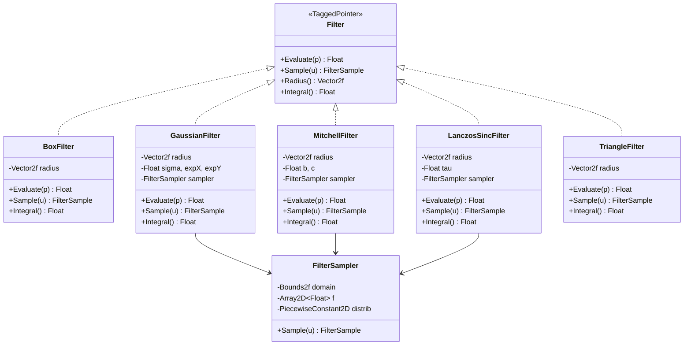

# filters.h / filters.cpp

## 概述
该文件实现了 PBRT 渲染器中的 **像素重建滤波器**，用于将离散的采样点贡献平滑地分配到相邻像素上，从而减少锯齿和噪声。滤波器在胶片的 `AddSample` 和 `AddSplat` 过程中决定每个采样点对其周围像素的权重分配方式。文件提供了五种常见的滤波器实现以及一个通用的 `FilterSampler` 工具类。

## 主要类与接口

| 类/结构体/函数 | 说明 |
|---|---|
| `BoxFilter` | 盒式滤波器，在其支撑域内返回恒定权重 1，支撑域外为 0。最简单的滤波器，可直接解析采样 |
| `GaussianFilter` | 高斯滤波器，以高斯函数为核进行加权，在边界处减去截断值以保证滤波器在边缘衰减为零，使用 `FilterSampler` 进行重要性采样 |
| `MitchellFilter` | Mitchell-Netravali 滤波器，参数化的三次多项式滤波器（B/C 参数），平衡了模糊和振铃伪影，使用 `FilterSampler` 采样 |
| `LanczosSincFilter` | Lanczos sinc 滤波器，窗口化的 sinc 函数（参数 tau 控制窗口宽度），在频域中具有接近理想低通滤波器的特性 |
| `TriangleFilter` | 三角滤波器，线性衰减的帐篷函数，可直接解析采样 |
| `FilterSample` | 滤波器采样结果结构体，包含采样位置 `p` 和权重 `weight` |
| `FilterSampler` | 通用滤波器采样器，将任意滤波器函数表格化后构建分片常数 2D 分布用于重要性采样 |

## 架构图

## 依赖关系
- **依赖**：`pbrt/base/filter.h`、`pbrt/util/math.h`、`pbrt/util/sampling.h`、`pbrt/paramdict.h`（cpp）、`pbrt/util/print.h`（cpp）、`pbrt/util/rng.h`（cpp）
- **被依赖**：`pbrt/cameras.cpp`、`pbrt/film.cpp`、`pbrt/samplers.h`、`pbrt/samplers.cpp`、`pbrt/cpu/integrators.cpp`、`pbrt/cpu/render.cpp`、`pbrt/wavefront/integrator.cpp`、`pbrt/cmd/imgtool.cpp`
