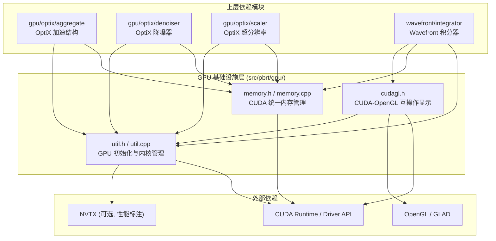
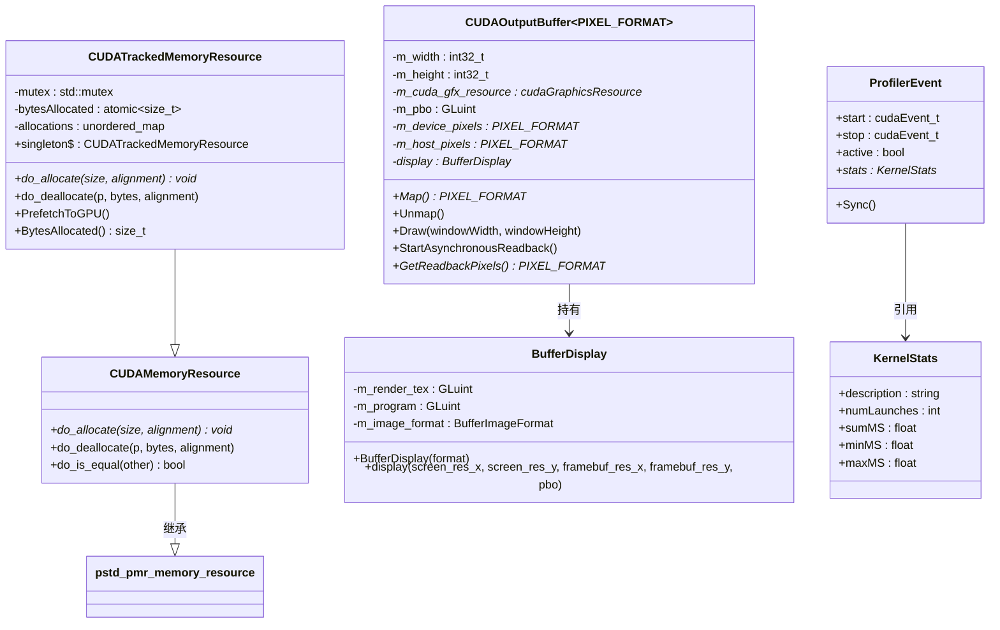
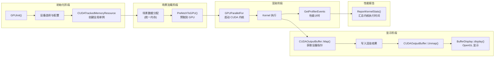
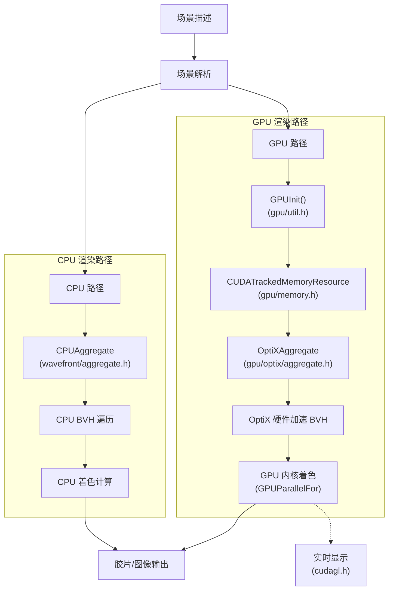

# GPU 渲染后端

## 概述

`src/pbrt/gpu/` 目录实现了 PBRT-v4 的 GPU 渲染后端基础设施。该模块提供基于 CUDA 的 GPU 计算核心工具，包括 GPU 统一内存管理、CUDA 内核启动封装、GPU/OpenGL 互操作显示，以及 GPU 设备初始化与性能分析等功能。此模块是 GPU 渲染路径（Wavefront Path Tracing）的底层支撑层，为上层的 OptiX 光线追踪加速和 Wavefront 积分器提供基础服务。

## 文件列表

| 文件 | 用途说明 |
|------|---------|
| `util.h` | GPU 工具函数头文件：定义 CUDA 错误检查宏（`CUDA_CHECK`、`CU_CHECK`）、`GPUParallelFor` 并行执行模板、`Kernel` CUDA 内核函数、GPU 初始化与同步接口、性能分析事件管理 |
| `util.cpp` | GPU 工具函数实现：`GPUInit` 设备初始化（CUDA 驱动/运行时版本检测、设备选择、栈大小及缓存配置）、`GPUWait` 同步、`ReportKernelStats` 性能报告、NVTX 标注支持 |
| `memory.h` | CUDA 统一内存资源头文件：定义 `CUDAMemoryResource`（基础 CUDA 托管内存分配器）和 `CUDATrackedMemoryResource`（带跟踪的内存分配器，支持分配统计与 GPU 预取） |
| `memory.cpp` | CUDA 内存资源实现：通过 `cudaMallocManaged` 分配统一内存、线程安全的分配跟踪、`PrefetchToGPU` 批量预取所有托管内存到 GPU |
| `cudagl.h` | CUDA-OpenGL 互操作头文件：定义 `BufferDisplay`（通过 OpenGL 着色器将渲染结果显示到屏幕）和 `CUDAOutputBuffer`（管理 CUDA/GL 共享像素缓冲区的映射、异步回读） |

## 架构图

### 类关系图

## 核心类与接口

### CUDAMemoryResource

基础 CUDA 统一内存分配器，继承自 `pstd::pmr::memory_resource`。使用 `cudaMallocManaged` 分配 CUDA 托管内存（Unified Memory），CPU 和 GPU 均可直接访问。

### CUDATrackedMemoryResource

扩展的 CUDA 内存分配器，额外维护所有分配记录。关键功能：
- **线程安全分配跟踪**：通过互斥锁保护分配映射表
- **PrefetchToGPU()**：在渲染开始前将所有托管内存批量预取到 GPU，避免运行时页面迁移带来的性能损失
- **BytesAllocated()**：查询当前分配的总字节数
- **singleton**：全局单例，供整个 GPU 渲染管线使用

### GPUParallelFor

核心 GPU 并行执行模板函数，将任意可调用对象包装为 CUDA 内核并启动：
- 自动计算最优线程块大小（通过 `cudaOccupancyMaxPotentialBlockSize`）
- 集成 CUDA 事件进行性能计时
- 支持 NVTX 范围标注用于 Nsight 性能分析
- Debug 模式下自动同步以便调试

### GPUInit

GPU 设备初始化函数，执行以下操作：
- 检测 CUDA 驱动版本和运行时版本
- 枚举并选择 GPU 设备
- 设置栈大小（8192 字节）和 printf 缓冲区大小
- 配置 L1 缓存优先策略
- Windows 平台多 GPU 限制处理

### BufferDisplay / CUDAOutputBuffer

实现 CUDA 渲染结果到 OpenGL 窗口的实时显示：
- `BufferDisplay`：通过 OpenGL 着色器程序将纹理渲染到全屏四边形
- `CUDAOutputBuffer`：管理 CUDA 和 OpenGL 之间共享的像素缓冲对象（PBO），支持异步回读到 CPU

## 依赖关系

### 本模块依赖

| 依赖模块 | 说明 |
|---------|------|
| `pbrt/util/check.h` | 断言与检查宏 |
| `pbrt/util/error.h` | 错误处理 |
| `pbrt/util/log.h` | 日志系统 |
| `pbrt/util/parallel.h` | 并行工具 |
| `pbrt/util/pstd.h` | 标准库多态内存资源适配 |
| `pbrt/options.h` | 运行时选项（GPU 设备选择等） |
| CUDA Runtime / Driver API | GPU 计算基础 |
| OpenGL / GLAD | 图形显示（仅 `cudagl.h`） |
| NVTX（可选） | NVIDIA 性能分析标注 |

### 被以下模块依赖

| 模块 | 说明 |
|------|------|
| `gpu/optix/aggregate` | OptiX 加速结构构建与光线追踪 |
| `gpu/optix/denoiser` | OptiX AI 降噪 |
| `gpu/optix/scaler` | OptiX AI 超分辨率 |
| `wavefront/integrator` | Wavefront 路径追踪积分器 |
| `wavefront/workqueue` | 工作队列管理 |
| `pbrt/scene.cpp` | 场景构建 |
| `pbrt/lights.cpp` | 光源创建 |
| `pbrt/shapes.cpp` | 几何形状创建 |
| 多个 `util/` 模块 | 日志、光谱、颜色空间等工具 |

## 数据流

### GPU 与 CPU 渲染路径对比

