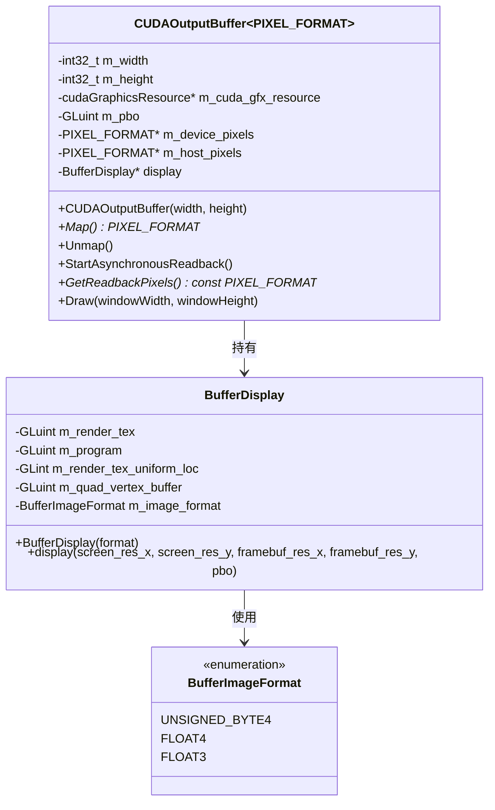
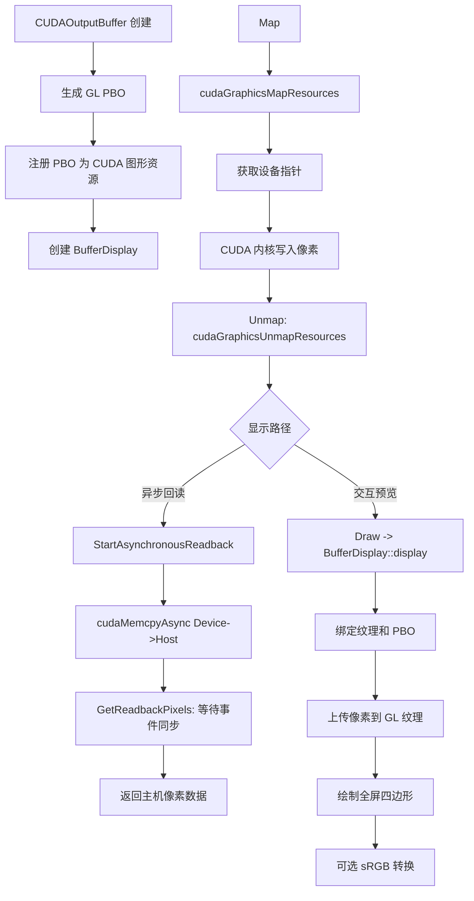

# cudagl.h

## 概述

该文件实现了 CUDA 与 OpenGL 的互操作（interop）功能，提供了将 GPU 渲染结果通过 OpenGL 显示到屏幕上的能力。文件包含两个核心类：`BufferDisplay` 负责将像素缓冲区对象（PBO）渲染到屏幕四边形上，`CUDAOutputBuffer` 则管理 CUDA 与 OpenGL 之间的共享像素缓冲区，支持异步回读（readback）操作。该文件在 pbrt 的交互式 GPU 渲染预览模式中扮演关键角色。

## 主要类与接口

| 类/结构体/函数 | 说明 |
|---|---|
| `BufferImageFormat` | 枚举类型，定义像素格式：`UNSIGNED_BYTE4`、`FLOAT4`、`FLOAT3` |
| `BufferDisplay` | 负责将 PBO 内容通过 OpenGL 着色器渲染到屏幕四边形上，内部管理纹理、着色器程序和顶点缓冲区 |
| `BufferDisplay::display()` | 将指定 PBO 的内容显示到帧缓冲区中，支持自动 sRGB 转换 |
| `CUDAOutputBuffer<PIXEL_FORMAT>` | 模板类，管理 CUDA-GL 互操作的输出缓冲区，支持映射/取消映射和异步回读 |
| `CUDAOutputBuffer::Map()` | 将 GL 缓冲区映射为 CUDA 可访问的设备指针 |
| `CUDAOutputBuffer::Unmap()` | 取消映射，使 GL 可以再次访问缓冲区 |
| `CUDAOutputBuffer::StartAsynchronousReadback()` | 启动异步设备到主机的像素数据回读 |
| `CUDAOutputBuffer::GetReadbackPixels()` | 等待异步回读完成并返回主机侧像素指针 |
| `CUDAOutputBuffer::Draw()` | 将缓冲区内容绘制到窗口 |
| `createGLShader()` | 辅助函数，编译 OpenGL 着色器 |
| `createGLProgram()` | 辅助函数，链接顶点和片段着色器为 GL 程序 |
| `getGLUniformLocation()` | 获取 GL 着色器 uniform 变量位置 |
| `pixelFormatSize()` | 返回指定像素格式的字节大小 |
| `GL_CHECK` / `GL_CHECK_ERRORS` | 宏，用于 OpenGL 错误检查 |

## 架构图

## 算法流程图

## 依赖关系

- **依赖**：
  - `pbrt/gpu/util.h` -- CUDA 错误检查宏（`CUDA_CHECK`）
  - `pbrt/util/error.h` -- 日志与错误处理
  - `glad/glad.h` -- OpenGL 函数加载
  - `cuda.h`、`cuda_gl_interop.h`、`cuda_runtime.h` -- CUDA 运行时与 GL 互操作

- **被依赖**：
  - `pbrt/util/gui.h` -- GUI 交互式预览系统引用此文件
