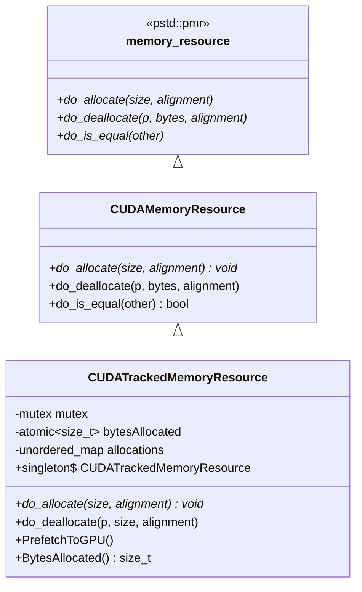
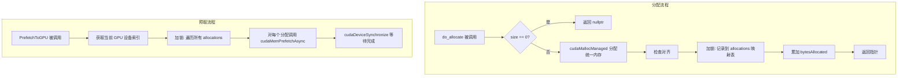

# memory.h / memory.cpp

## 概述

该文件实现了基于 CUDA 统一内存（Unified Memory）的内存资源分配器，是 pbrt GPU 渲染器的核心内存管理模块。它提供了两个符合 `pstd::pmr::memory_resource` 接口的内存资源类：`CUDAMemoryResource`（基础 CUDA 统一内存分配）和 `CUDATrackedMemoryResource`（带分配跟踪和 GPU 预取功能的增强版本）。这些分配器使得场景数据可以在 CPU 和 GPU 之间透明共享。

## 主要类与接口

| 类/结构体/函数 | 说明 |
|---|---|
| `CUDAMemoryResource` | 基础 CUDA 统一内存分配器，继承自 `pstd::pmr::memory_resource`，使用 `cudaMallocManaged` 分配和 `cudaFree` 释放内存 |
| `CUDAMemoryResource::do_allocate()` | 通过 `cudaMallocManaged` 分配指定大小和对齐的统一内存 |
| `CUDAMemoryResource::do_deallocate()` | 通过 `cudaFree` 释放统一内存 |
| `CUDATrackedMemoryResource` | 继承自 `CUDAMemoryResource`，增加了分配跟踪（记录每次分配的地址和大小），支持预取到 GPU 和查询已分配字节数 |
| `CUDATrackedMemoryResource::do_allocate()` | 分配内存并记录到内部 `allocations` 映射表，线程安全 |
| `CUDATrackedMemoryResource::do_deallocate()` | 释放内存并从跟踪表中移除记录 |
| `CUDATrackedMemoryResource::PrefetchToGPU()` | 将所有已跟踪的分配块通过 `cudaMemPrefetchAsync` 预取到 GPU 显存中，提升后续 GPU 访问性能 |
| `CUDATrackedMemoryResource::BytesAllocated()` | 返回当前已分配的总字节数 |
| `CUDATrackedMemoryResource::singleton` | 全局单例实例，供整个渲染器使用 |

## 架构图

## 算法流程图

## 依赖关系

- **依赖**：
  - `pbrt/pbrt.h` -- 基础类型定义
  - `pbrt/util/check.h` -- 断言检查
  - `pbrt/util/math.h` -- 数学工具
  - `pbrt/util/pstd.h` -- `pstd::pmr::memory_resource` 多态内存资源基类
  - `pbrt/gpu/util.h` -- `CUDA_CHECK` 宏
  - `pbrt/util/log.h` -- 日志输出
  - `cuda.h`、`cuda_runtime.h` -- CUDA 运行时 API

- **被依赖**：
  - `pbrt/gpu/optix/aggregate.h` -- OptiX 加速结构构建使用跟踪内存资源
  - `pbrt/gpu/optix/denoiser.cpp` -- 降噪器模块
  - `pbrt/gpu/optix/scaler.cpp` -- 超分辨率缩放模块
  - `pbrt/scene.cpp` -- 场景数据加载
  - `pbrt/wavefront/integrator.cpp` -- 波前积分器
  - `pbrt/pbrt.cpp` -- 核心渲染流程
  - `pbrt/lights.cpp` -- 光源模块
  - `pbrt/cmd/pbrt.cpp` -- 主程序入口
  - `pbrt/cmd/pspec.cpp` -- 性能分析工具
