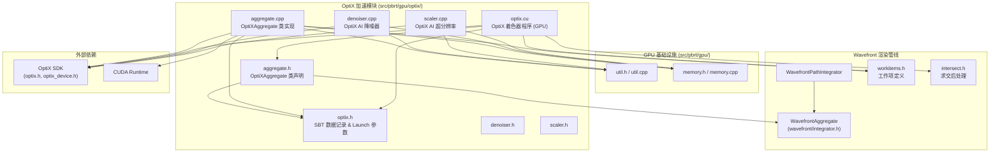
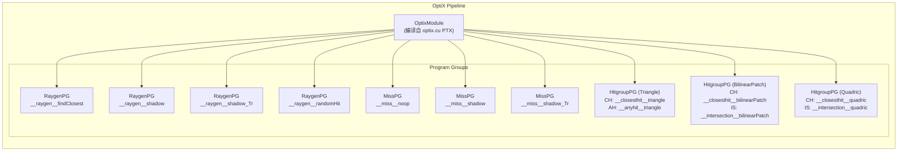
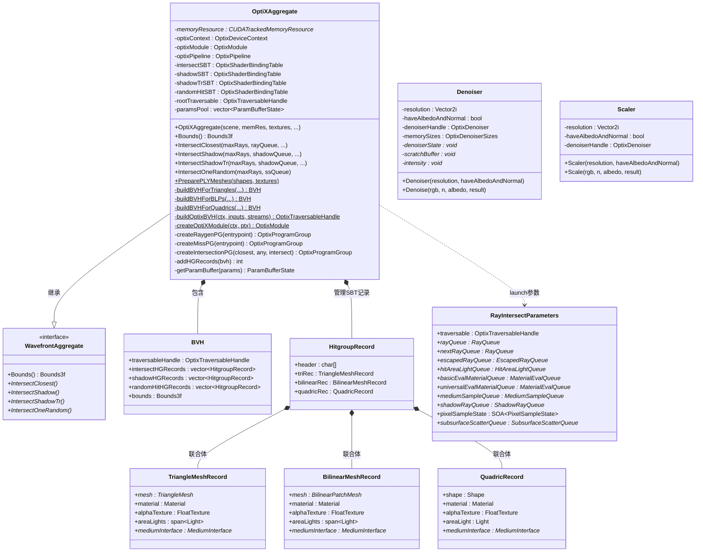
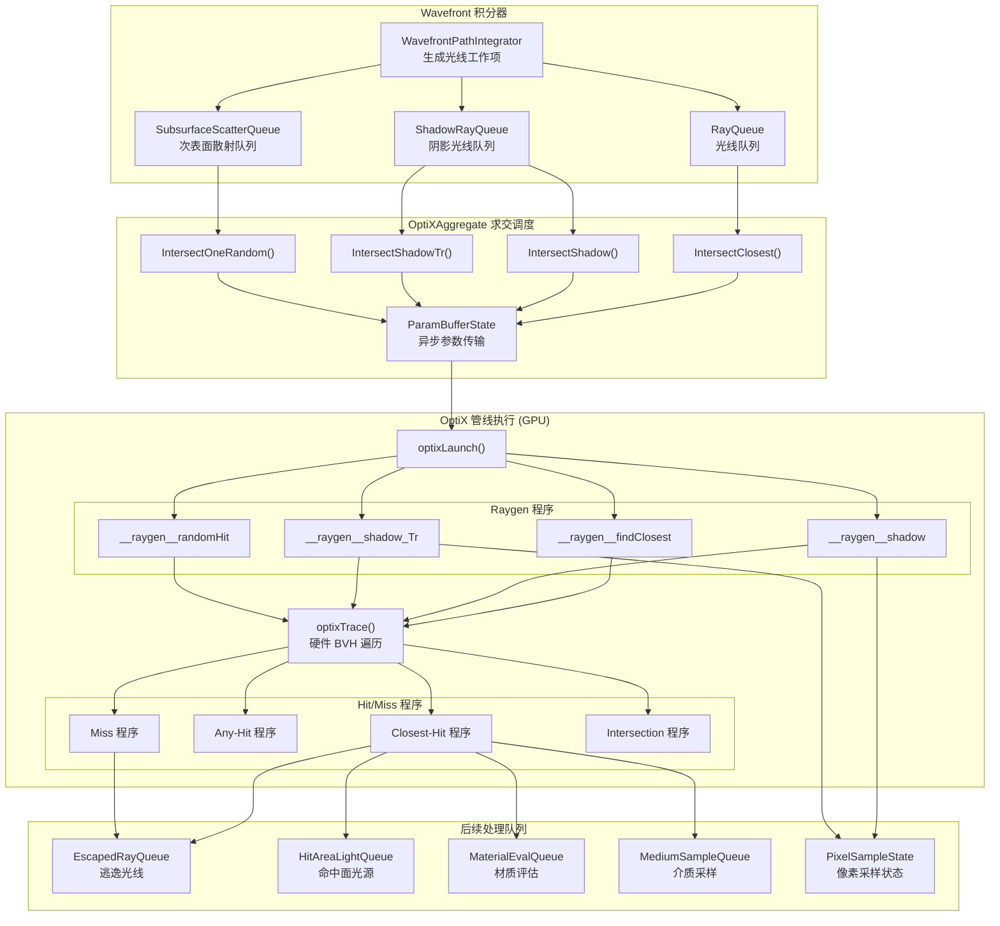
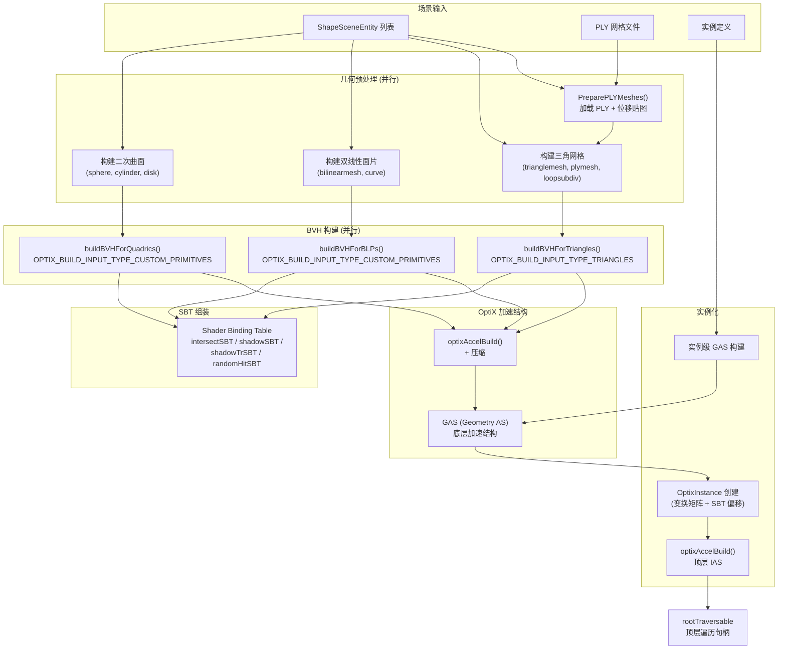
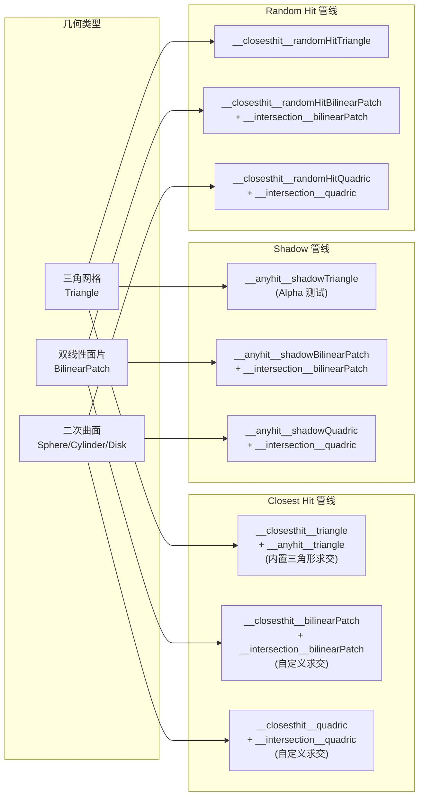

# OptiX 光线追踪加速

## 概述

`src/pbrt/gpu/optix/` 目录实现了 PBRT-v4 基于 NVIDIA OptiX 的 GPU 硬件加速光线追踪系统。该模块是 GPU 渲染路径的核心组件，负责构建 OptiX 加速结构（BVH）、定义 OptiX 着色器程序（raygen、closest-hit、any-hit、miss、intersection）、管理 Shader Binding Table（SBT），以及集成 OptiX AI 降噪器和超分辨率缩放器。`OptiXAggregate` 类继承自 `WavefrontAggregate` 接口，作为 GPU 渲染路径的几何求交后端，替代 CPU 路径中的 `CPUAggregate`。

## 文件列表

| 文件 | 用途说明 |
|------|---------|
| `optix.h` | OptiX 数据记录定义：`TriangleMeshRecord`（三角网格 SBT 数据）、`BilinearMeshRecord`（双线性面片 SBT 数据）、`QuadricRecord`（二次曲面 SBT 数据）、`RayIntersectParameters`（OptiX launch 参数，传递遍历句柄和各工作队列指针） |
| `optix.cu` | OptiX CUDA 着色器程序：包含所有 raygen、closest-hit、any-hit、miss、intersection 程序的 GPU 设备端实现，处理光线-场景求交逻辑 |
| `aggregate.h` | `OptiXAggregate` 类声明：继承 `WavefrontAggregate`，定义四种求交接口（closest、shadow、shadowTr、randomHit）、BVH 构建方法、SBT 管理、OptiX 管线配置 |
| `aggregate.cpp` | `OptiXAggregate` 类实现：OptiX 上下文创建、模块编译、程序组创建、管线构建、三角网格/双线性面片/二次曲面的 BVH 构建、实例化支持、SBT 组装、PLY 网格加载与位移贴图 |
| `denoiser.h` | `Denoiser` 类声明：基于 OptiX AI 降噪器的 HDR 图像降噪，支持 RGB + 法线 + 反照率引导 |
| `denoiser.cpp` | `Denoiser` 类实现：OptiX Denoiser 初始化、内存分配、`Denoise()` 降噪执行，兼容 OptiX 7.x 和 8.x API |
| `scaler.h` | `Scaler` 类声明：基于 OptiX AI 的 2 倍超分辨率放大器，接口与 Denoiser 类似 |
| `scaler.cpp` | `Scaler` 类实现：使用 `OPTIX_DENOISER_MODEL_KIND_UPSCALE2X` 模型实现图像 2x 放大，兼容多版本 OptiX API |

## 架构图

### OptiX 管线架构

### 类关系图

## 核心类与接口

### OptiXAggregate

GPU 渲染路径的核心几何求交聚合体，继承自 `WavefrontAggregate`。负责整个 OptiX 管线的生命周期管理。

**构造过程**（在 `aggregate.cpp` 中实现）：
1. 初始化 OptiX 上下文（`optixInit` + `optixDeviceContextCreate`）
2. 从嵌入的 PTX 代码创建 OptiX 模块
3. 创建 16 个程序组（4 个 raygen + 3 个 miss + 9 个 hitgroup）
4. 链接所有程序组为一条 OptiX 管线
5. 并行构建三种几何类型的 BVH（三角网格、双线性面片、二次曲面）
6. 处理实例化（Instance）几何，构建实例级 BVH
7. 构建顶层实例加速结构（IAS）
8. 组装四套 Shader Binding Table（intersect、shadow、shadowTr、randomHit）

**四种求交操作**：

| 方法 | 用途 | 对应的 SBT |
|------|------|-----------|
| `IntersectClosest` | 查找最近交点，分发到材质评估队列 | `intersectSBT` |
| `IntersectShadow` | 阴影光线遮挡测试（二值结果） | `shadowSBT` |
| `IntersectShadowTr` | 带透射率的阴影光线（处理半透明介质） | `shadowTrSBT` |
| `IntersectOneRandom` | 次表面散射随机采样交点 | `randomHitSBT` |

### OptiX 着色器程序（optix.cu）

`optix.cu` 中实现了完整的 OptiX 着色器程序集，按功能分为以下几组：

#### Raygen 程序

| 程序名 | 功能说明 |
|--------|---------|
| `__raygen__findClosest` | 从 `RayQueue` 取出光线，调用 `optixTrace` 查找最近交点，命中时通过 `EnqueueWorkAfterIntersection` 分发工作，未命中时通过 `EnqueueWorkAfterMiss` 处理 |
| `__raygen__shadow` | 从 `ShadowRayQueue` 取出阴影光线，进行遮挡测试，通过 `RecordShadowRayResult` 记录结果 |
| `__raygen__shadow_Tr` | 处理带透射率的阴影光线，使用 `TraceTransmittance` 迭代追踪穿过半透明表面的光线 |
| `__raygen__randomHit` | 次表面散射探针光线，使用加权储层采样（`WeightedReservoirSampler`）随机选择一个同材质交点 |

#### Closest-Hit 程序

| 程序名 | 几何类型 | 功能说明 |
|--------|---------|---------|
| `__closesthit__triangle` | 三角网格 | 计算重心坐标插值，生成 `SurfaceInteraction`，设置材质和面光源 |
| `__closesthit__bilinearPatch` | 双线性面片 | 从自定义属性获取 UV，生成交互信息 |
| `__closesthit__quadric` | 二次曲面 | 从自定义属性获取交点和 phi 角，分派到球体/圆柱/圆盘求交 |
| `__closesthit__randomHitTriangle` | 三角网格（随机） | 储层采样，记录同材质交点 |
| `__closesthit__randomHitBilinearPatch` | 双线性面片（随机） | 同上 |
| `__closesthit__randomHitQuadric` | 二次曲面（随机） | 同上 |

#### Any-Hit 程序

| 程序名 | 功能说明 |
|--------|---------|
| `__anyhit__triangle` | Alpha 纹理测试，透明区域调用 `optixIgnoreIntersection` |
| `__anyhit__shadowTriangle` | 阴影光线的 Alpha 透明测试 |
| `__anyhit__shadowBilinearPatch` | 双线性面片阴影 Any-Hit（空实现） |
| `__anyhit__shadowQuadric` | 二次曲面阴影 Any-Hit（空实现） |

#### Miss 程序

| 程序名 | 功能说明 |
|--------|---------|
| `__miss__noop` | 设置 payload 标记光线未命中 |
| `__miss__shadow` | 阴影光线未命中（表示无遮挡） |
| `__miss__shadow_Tr` | 透射率阴影光线未命中 |

#### Intersection 程序

| 程序名 | 功能说明 |
|--------|---------|
| `__intersection__bilinearPatch` | 双线性面片的自定义求交测试，使用 `IntersectBilinearPatch`，支持 Alpha 透明 |
| `__intersection__quadric` | 二次曲面（球体、圆柱、圆盘）的自定义求交测试，通过 `BasicIntersect` 执行 |

### Denoiser

基于 OptiX AI 的 HDR 图像降噪器。支持纯 RGB 降噪，以及 RGB + 反照率（Albedo）+ 法线（Normal）的引导降噪模式。内部使用 `OPTIX_DENOISER_MODEL_KIND_HDR` 模型。兼容 OptiX 7.0 至 8.x 的 API 变更。

### Scaler

基于 OptiX AI 的 2 倍超分辨率缩放器。使用 `OPTIX_DENOISER_MODEL_KIND_UPSCALE2X` 模型，将输入图像分辨率放大两倍。接口设计与 `Denoiser` 保持一致，同样支持反照率和法线引导。输出图像尺寸为输入的 2 倍（宽和高各翻倍）。

## 依赖关系

### 本模块依赖

| 依赖模块 | 说明 |
|---------|------|
| `gpu/util.h` | CUDA 错误检查宏、GPU 初始化、`GPUParallelFor` |
| `gpu/memory.h` | `CUDATrackedMemoryResource` 内存管理 |
| `wavefront/integrator.h` | `WavefrontAggregate` 基类定义 |
| `wavefront/workitems.h` | 工作项类型（`RayWorkItem`、`ShadowRayWorkItem` 等） |
| `wavefront/workqueue.h` | 工作队列类型 |
| `wavefront/intersect.h` | `EnqueueWorkAfterIntersection`、`EnqueueWorkAfterMiss` 等求交后处理函数 |
| `pbrt/scene.h` | `BasicScene`、`ShapeSceneEntity` 场景描述 |
| `pbrt/materials.h` | 材质系统 |
| `pbrt/lights.h` | 光源系统 |
| `pbrt/shapes.h` | 几何形状（`Triangle`、`BilinearPatch`、`Sphere` 等） |
| `pbrt/textures.h` | 纹理系统（Alpha 纹理评估） |
| `pbrt/interaction.h` | `SurfaceInteraction` 表面交互 |
| `util/mesh.h` | 三角网格、双线性面片网格数据结构 |
| `util/loopsubdiv.h` | Loop 细分曲面 |
| `util/splines.h` | 样条曲线（曲线转双线性面片） |
| `util/parallel.h` | `ParallelFor`、`ThreadLocal`、`RunAsync` |
| OptiX SDK | `optix.h`、`optix_device.h`、`optix_stubs.h` |
| CUDA Runtime | `cuda.h`、`cuda_runtime.h` |

### 被以下模块依赖

| 模块 | 说明 |
|------|------|
| `wavefront/integrator.cpp` | 创建 `OptiXAggregate` 实例作为 GPU 求交后端 |
| `wavefront/wavefront.cpp` | Wavefront 渲染入口 |

## 数据流

### 光线求交数据流

### BVH 构建数据流

### OptiX 着色器程序与几何类型映射

