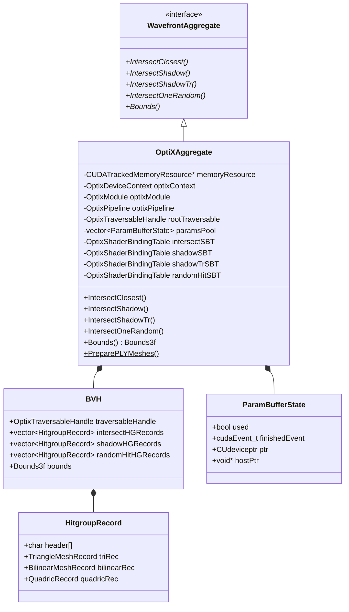

# aggregate.h / aggregate.cpp

## 概述

该文件实现了 `OptiXAggregate` 类，是 pbrt GPU 渲染器中基于 NVIDIA OptiX 的光线追踪加速结构聚合体。它负责将场景中的所有几何体（三角形网格、双线性面片、二次曲面）构建为 OptiX BVH 加速结构，并提供四种光线求交接口：最近交点查询、阴影光线、带透射率的阴影光线和随机交点（用于次表面散射）。该模块是 GPU 波前渲染管线中几何求交的核心。

## 主要类与接口

| 类/结构体/函数 | 说明 |
|---|---|
| `OptiXAggregate` | 继承自 `WavefrontAggregate`，核心加速结构聚合类，管理 OptiX 上下文、管线和 SBT |
| `OptiXAggregate::OptiXAggregate()` | 构造函数，完成 OptiX 初始化、模块编译、程序组创建、管线构建、BVH 构建以及 SBT 初始化 |
| `OptiXAggregate::Bounds()` | 返回整个场景的包围盒 |
| `OptiXAggregate::IntersectClosest()` | 发射最近交点查询光线，结果分发到材质评估队列、区域光命中队列等 |
| `OptiXAggregate::IntersectShadow()` | 发射阴影光线，用于遮挡测试 |
| `OptiXAggregate::IntersectShadowTr()` | 发射带透射率的阴影光线，用于半透明介质 |
| `OptiXAggregate::IntersectOneRandom()` | 发射随机交点光线，用于次表面散射的蓄水池采样 |
| `OptiXAggregate::PreparePLYMeshes()` | 静态方法，并行加载 PLY 网格文件并处理置换贴图 |
| `OptiXAggregate::BVH` | 内部结构体，封装 OptiX 可遍历句柄和各类型 SBT 命中组记录 |
| `OptiXAggregate::HitgroupRecord` | SBT 命中组记录，使用 union 存储三角形、双线性面片或二次曲面数据 |
| `buildBVHForTriangles()` | 静态方法，为三角形网格（trianglemesh、plymesh、loopsubdiv）构建 BVH |
| `buildBVHForBLPs()` | 静态方法，为双线性面片和曲线（curve）构建 BVH |
| `buildBVHForQuadrics()` | 静态方法，为二次曲面（sphere、cylinder、disk）构建 BVH |
| `diceCurveToBLP()` | 静态方法，将曲线细分为双线性面片网格 |
| `buildOptixBVH()` | 静态方法，通用 OptiX BVH 构建，支持压缩 |
| `createOptiXModule()` | 静态方法，从嵌入的 PTX 创建 OptiX 模块 |
| `getPipelineCompileOptions()` | 静态方法，获取管线编译选项 |
| `createRaygenPG()` | 创建光线生成程序组 |
| `createMissPG()` | 创建未命中程序组 |
| `createIntersectionPG()` | 创建命中组程序组（closest-hit / any-hit / intersection） |
| `addHGRecords()` | 将 BVH 的命中组记录追加到全局 SBT 记录列表 |
| `getParamBuffer()` | 管理参数缓冲区池，用于异步 OptiX 启动 |
| `ParamBufferState` | 内部结构体，管理参数缓冲区的设备/主机内存和同步事件 |

## 架构图

## 算法流程图

```mermaid
flowchart TD
    subgraph 构造函数初始化
        A[初始化 OptiX 上下文] --> B[创建 OptiX 模块 - 嵌入 PTX]
        B --> C[创建程序组 - raygen/miss/hitgroup]
        C --> D[创建 OptiX 管线]
        D --> E[初始化 SBT raygen/miss 记录]
    end

    subgraph BVH构建
        F[并行加载 PLY 网格] --> G["异步构建三角形 BVH"]
        F --> H["异步构建双线性面片 BVH"]
        F --> I["异步构建二次曲面 BVH"]
        G --> J[合并命中组记录到全局 SBT]
        H --> J
        I --> J
        J --> K[处理场景实例化]
        K --> L["构建顶层 IAS (Instance AS)"]
        L --> M[最终 SBT 初始化 - 复制记录到设备]
    end

    subgraph BVH单次构建
        N["计算内存需求 (optixAccelComputeMemoryUsage)"] --> O["分配临时缓冲区"]
        O --> P["构建加速结构 (optixAccelBuild)"]
        P --> Q{"需要压缩?"}
        Q -->|是| R["压缩加速结构 (optixAccelCompact)"]
        Q -->|否| S["直接使用"]
        R --> T["释放原始缓冲区"]
    end

    subgraph 光线求交
        U["IntersectClosest"] --> V["填充 RayIntersectParameters"]
        V --> W["getParamBuffer: 复制参数到设备"]
        W --> X["optixLaunch 启动光线追踪"]
    end
```

## 依赖关系

- **依赖**：
  - `pbrt/gpu/memory.h` -- CUDA 跟踪内存资源
  - `pbrt/gpu/optix/optix.h` -- OptiX 数据记录定义和参数结构
  - `pbrt/gpu/util.h` -- GPU 工具函数（`CUDA_CHECK`、`GPUParallelFor`）
  - `pbrt/scene.h` -- 场景描述
  - `pbrt/wavefront/integrator.h` -- 波前积分器
  - `pbrt/wavefront/workitems.h` -- 工作项定义
  - `pbrt/wavefront/intersect.h` -- 交点后续处理逻辑
  - `pbrt/lights.h`、`pbrt/materials.h`、`pbrt/textures.h` -- 光源、材质、纹理
  - `pbrt/util/containers.h`、`pbrt/util/soa.h`、`pbrt/util/vecmath.h` -- 容器、SOA、向量数学
  - `pbrt/util/mesh.h`、`pbrt/util/loopsubdiv.h`、`pbrt/util/splines.h` -- 网格工具
  - `optix.h`、`optix_stubs.h` -- OptiX SDK

- **被依赖**：
  - `pbrt/wavefront/integrator.cpp` -- 波前积分器创建和使用此加速结构
  - `pbrt/gpu/optix/optix.cu` -- OptiX 着色器代码引用此头文件
