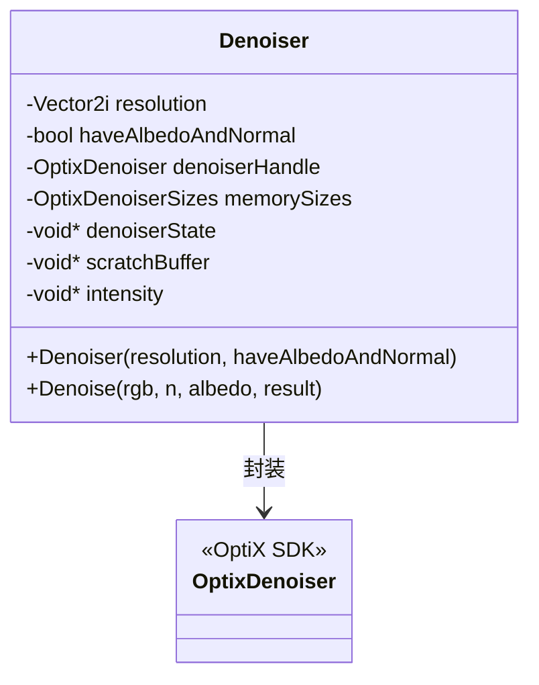

# denoiser.h / denoiser.cpp

## 概述

该文件实现了基于 NVIDIA OptiX AI 降噪器的图像去噪功能，用于在 GPU 渲染完成后对带有噪声的 HDR 图像进行降噪处理。`Denoiser` 类封装了 OptiX 降噪器的完整生命周期，支持仅使用 RGB 颜色输入或同时使用颜色、法线和反照率（albedo）三通道引导的增强降噪模式。该模块在渲染管线的后处理阶段发挥作用。

## 主要类与接口

| 类/结构体/函数 | 说明 |
|---|---|
| `Denoiser` | 封装 OptiX AI 降噪器，管理降噪所需的设备内存和状态 |
| `Denoiser::Denoiser()` | 构造函数：初始化 OptiX 上下文，创建 HDR 降噪器，计算内存需求，分配状态/暂存缓冲区并调用 `optixDenoiserSetup` 完成设置 |
| `Denoiser::Denoise()` | 执行降噪操作：设置输入图像层（RGB，可选 albedo 和 normal），计算 HDR 强度，调用 `optixDenoiserInvoke` 完成降噪 |

## 架构图

## 算法流程图

```mermaid
flowchart TD
    subgraph 初始化
        A[获取当前 CUDA 上下文] --> B[初始化 OptiX]
        B --> C[创建 OptiX 设备上下文]
        C --> D[配置降噪选项]
        D --> E{"haveAlbedoAndNormal?"}
        E -->|是| F[启用 guideAlbedo 和 guideNormal]
        E -->|否| G[仅 RGB 输入]
        F --> H["创建 HDR 降噪器 (OPTIX_DENOISER_MODEL_KIND_HDR)"]
        G --> H
        H --> I[计算内存需求]
        I --> J[分配 denoiserState 和 scratchBuffer]
        J --> K["optixDenoiserSetup 初始化"]
        K --> L[分配 intensity 缓冲区]
    end

    subgraph 降噪执行
        M["Denoise() 被调用"] --> N[配置输入图像层]
        N --> O[设置 RGB 数据]
        O --> P{"有 albedo 和 normal?"}
        P -->|是| Q[设置 albedo 和 normal 引导层]
        P -->|否| R[仅使用 RGB]
        Q --> S[配置输出图像]
        R --> S
        S --> T["计算 HDR 强度 (optixDenoiserComputeIntensity)"]
        T --> U[设置降噪参数]
        U --> V["调用 optixDenoiserInvoke"]
        V --> W[降噪结果写入 result]
    end
```

## 依赖关系

- **依赖**：
  - `pbrt/pbrt.h` -- 基础类型定义
  - `pbrt/util/color.h` -- `RGB` 颜色类型
  - `pbrt/util/vecmath.h` -- `Vector2i`、`Normal3f` 类型
  - `pbrt/gpu/memory.h` -- CUDA 内存管理（通过 `CU_CHECK` 宏）
  - `pbrt/gpu/util.h` -- `CUDA_CHECK` 宏
  - `optix.h`、`optix_stubs.h` -- OptiX SDK
  - `cuda.h`、`cuda_runtime.h` -- CUDA 运行时

- **被依赖**：
  - `pbrt/cmd/imgtool.cpp` -- 图像工具命令行程序使用此降噪器
