# optix.h / optix.cu

## 概述

该文件组合定义了 OptiX 光线追踪的数据记录结构（`.h`）和 GPU 端着色器程序（`.cu`）。头文件定义了 SBT（Shader Binding Table）所需的几何体命中记录结构和光线求交参数；`.cu` 文件则实现了完整的 OptiX 着色器程序集，包括光线生成（raygen）、最近命中（closest-hit）、任意命中（any-hit）、未命中（miss）和自定义相交（intersection）程序，覆盖三角形、双线性面片和二次曲面三种几何类型。这是 GPU 波前渲染器中光线-场景求交的核心 GPU 着色器代码。

## 主要类与接口

### 头文件 (optix.h) -- 数据结构定义

| 类/结构体/函数 | 说明 |
|---|---|
| `TriangleMeshRecord` | 三角形网格 SBT 记录：包含网格指针、材质、alpha 纹理、面积光源列表和介质接口 |
| `BilinearMeshRecord` | 双线性面片网格 SBT 记录：结构与 `TriangleMeshRecord` 类似 |
| `QuadricRecord` | 二次曲面 SBT 记录：包含形状、材质、alpha 纹理、单个面积光源和介质接口 |
| `RayIntersectParameters` | OptiX 启动参数结构体，包含可遍历句柄和所有工作队列指针（光线队列、逃逸光线队列、阴影光线队列、材质评估队列等） |

### CUDA 着色器 (optix.cu) -- GPU 程序

| 类/结构体/函数 | 说明 |
|---|---|
| `packPointer0/1()` | 将 64 位指针拆分为两个 32 位载荷（OptiX payload） |
| `getPayload<T>()` | 从 OptiX payload 恢复 64 位指针 |
| `Trace()` | 封装 `optixTrace` 的辅助函数模板 |
| `ClosestHitContext` | 最近命中上下文，存储光线介质、命中点信息和材质 |
| `__raygen__findClosest()` | 光线生成程序：发射最近交点查询光线 |
| `__miss__noop()` | 通用未命中程序：设置载荷标记 |
| `__closesthit__triangle()` | 三角形最近命中程序：获取交点信息、设置材质和面积光源 |
| `__anyhit__triangle()` | 三角形任意命中程序：处理 alpha 纹理裁剪 |
| `__anyhit__shadowTriangle()` | 三角形阴影任意命中程序：alpha 裁剪 |
| `__raygen__shadow()` | 阴影光线生成程序：发射遮挡测试光线 |
| `__miss__shadow()` | 阴影未命中程序：标记无遮挡 |
| `__raygen__shadow_Tr()` | 带透射率的阴影光线生成程序：追踪透射率 |
| `__miss__shadow_Tr()` | 带透射率的阴影未命中程序 |
| `__closesthit__quadric()` | 二次曲面最近命中程序 |
| `__intersection__quadric()` | 二次曲面自定义相交程序：调用球体/圆柱/圆盘的 `BasicIntersect` |
| `__anyhit__shadowQuadric()` | 二次曲面阴影任意命中程序（空操作） |
| `__closesthit__bilinearPatch()` | 双线性面片最近命中程序 |
| `__intersection__bilinearPatch()` | 双线性面片自定义相交程序 |
| `__anyhit__shadowBilinearPatch()` | 双线性面片阴影任意命中程序（空操作） |
| `RandomHitPayload` | 随机命中载荷：包含蓄水池采样器和材质匹配信息 |
| `__raygen__randomHit()` | 随机命中光线生成程序：用于次表面散射的蓄水池采样 |
| `__closesthit__randomHitTriangle()` | 三角形随机命中最近命中程序 |
| `__closesthit__randomHitBilinearPatch()` | 双线性面片随机命中最近命中程序 |
| `__closesthit__randomHitQuadric()` | 二次曲面随机命中最近命中程序 |
| `getTriangleIntersection()` | 辅助函数，从 OptiX 内置三角形属性获取表面交互信息 |
| `getBilinearPatchIntersection()` | 辅助函数，从自定义属性获取双线性面片交互信息 |
| `getQuadricIntersection()` | 辅助函数，从自定义属性获取二次曲面交互信息 |
| `getWorldFromInstance()` | 辅助函数，从 OptiX 变换列表提取世界-实例变换矩阵 |
| `alphaKilled()` | 辅助函数，评估 alpha 纹理决定是否丢弃命中 |

## 架构图

```mermaid
graph TB
    subgraph "OptiX SBT 数据结构 (optix.h)"
        TMR[TriangleMeshRecord]
        BMR[BilinearMeshRecord]
        QR[QuadricRecord]
        RIP[RayIntersectParameters]
    end

    subgraph "光线生成程序 (Raygen)"
        RG1["__raygen__findClosest"]
        RG2["__raygen__shadow"]
        RG3["__raygen__shadow_Tr"]
        RG4["__raygen__randomHit"]
    end

    subgraph "未命中程序 (Miss)"
        M1["__miss__noop"]
        M2["__miss__shadow"]
        M3["__miss__shadow_Tr"]
    end

    subgraph "三角形着色器"
        T1["__closesthit__triangle"]
        T2["__anyhit__triangle"]
        T3["__anyhit__shadowTriangle"]
        T4["__closesthit__randomHitTriangle"]
    end

    subgraph "双线性面片着色器"
        B1["__closesthit__bilinearPatch"]
        B2["__intersection__bilinearPatch"]
        B3["__anyhit__shadowBilinearPatch"]
        B4["__closesthit__randomHitBilinearPatch"]
    end

    subgraph "二次曲面着色器"
        Q1["__closesthit__quadric"]
        Q2["__intersection__quadric"]
        Q3["__anyhit__shadowQuadric"]
        Q4["__closesthit__randomHitQuadric"]
    end

    RG1 --> T1 & B1 & Q1
    RG1 --> M1
    RG2 --> T3 & B3 & Q3
    RG2 --> M2
    RG3 --> T1 & B1 & Q1
    RG3 --> M3
    RG4 --> T4 & B4 & Q4

    RIP --> RG1 & RG2 & RG3 & RG4
    TMR --> T1 & T2 & T3 & T4
    BMR --> B1 & B2 & B3 & B4
    QR --> Q1 & Q2 & Q3 & Q4
```

## 算法流程图

## 依赖关系

- **依赖**（optix.h）：
  - `pbrt/pbrt.h` -- 基础类型
  - `pbrt/base/light.h`、`pbrt/base/material.h`、`pbrt/base/medium.h`、`pbrt/base/shape.h`、`pbrt/base/texture.h` -- 渲染基类
  - `pbrt/util/pstd.h` -- `pstd::span` 等工具类型
  - `pbrt/wavefront/workitems.h`、`pbrt/wavefront/workqueue.h` -- 工作项和工作队列定义
  - `optix.h` -- OptiX SDK

- **依赖**（optix.cu）：
  - `pbrt/gpu/optix/aggregate.h` -- 聚合体定义
  - `pbrt/gpu/optix/optix.h` -- 数据结构定义
  - `pbrt/interaction.h` -- 表面交互
  - `pbrt/materials.h`、`pbrt/media.h`、`pbrt/shapes.h`、`pbrt/textures.h` -- 材质/介质/形状/纹理具体实现
  - `pbrt/wavefront/intersect.h` -- 交点处理工具函数
  - `pbrt/util/color.cpp`、`pbrt/util/colorspace.cpp`、`pbrt/util/spectrum.cpp` 等 -- 通过 `#include .cpp` 使函数对 OptiX 可见
  - `optix_device.h` -- OptiX 设备端 API

- **被依赖**：
  - `pbrt/gpu/optix/aggregate.h` -- 聚合体头文件引用此头文件
  - `pbrt/gpu/optix/aggregate.cpp` -- 聚合体实现引用此头文件
  - `pbrt/gpu/optix/optix.cu` -- CUDA 着色器引用此头文件
