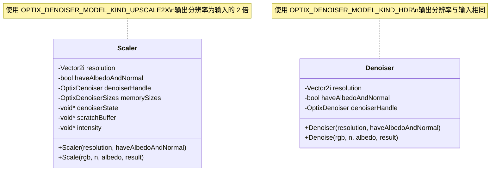

# scaler.h / scaler.cpp

## 概述

该文件实现了基于 NVIDIA OptiX AI 超分辨率模型的 2 倍图像放大（upscale）功能。`Scaler` 类利用 OptiX 降噪器框架中的 `OPTIX_DENOISER_MODEL_KIND_UPSCALE2X` 模型，将输入图像在宽度和高度上各放大 2 倍，同时保持图像质量。与 `Denoiser` 类似，它支持仅 RGB 输入或附带法线和反照率引导的增强模式。该模块在渲染管线的后处理阶段用于图像超分辨率缩放。

## 主要类与接口

| 类/结构体/函数 | 说明 |
|---|---|
| `Scaler` | 封装 OptiX 2x 超分辨率缩放器，管理降噪器句柄和 GPU 内存 |
| `Scaler::Scaler()` | 构造函数：初始化 OptiX 上下文，创建 `UPSCALE2X` 模型的降噪器，计算内存需求，分配缓冲区并完成设置 |
| `Scaler::Scale()` | 执行 2x 超分辨率缩放：设置输入图像层（分辨率为原始大小），输出图像为 2x 分辨率，调用 `optixDenoiserInvoke` 执行放大 |

## 架构图

## 算法流程图

```mermaid
flowchart TD
    subgraph 初始化
        A[获取当前 CUDA 上下文] --> B[初始化 OptiX]
        B --> C[创建 OptiX 设备上下文]
        C --> D[配置降噪选项]
        D --> E{"haveAlbedoAndNormal?"}
        E -->|是| F[启用 guideAlbedo 和 guideNormal]
        E -->|否| G[仅 RGB 输入]
        F --> H["创建 UPSCALE2X 降噪器"]
        G --> H
        H --> I[计算内存需求]
        I --> J[分配 denoiserState 和 scratchBuffer]
        J --> K[optixDenoiserSetup]
        K --> L[分配 intensity 缓冲区]
    end

    subgraph 缩放执行
        M["Scale() 被调用"] --> N["配置输入层 (resolution.x * resolution.y)"]
        N --> O["配置输出层 (resolution.x*2 * resolution.y*2)"]
        O --> P["计算 HDR 强度"]
        P --> Q["设置参数 (hdrIntensity, blendFactor)"]
        Q --> R{"有引导数据?"}
        R -->|是| S[设置 guideLayer: albedo + normal]
        R -->|否| T[无引导层]
        S --> U["optixDenoiserInvoke: 执行 2x 超分辨率"]
        T --> U
        U --> V["结果写入 result (2x 分辨率)"]
    end
```

## 依赖关系

- **依赖**：
  - `pbrt/pbrt.h` -- 基础类型定义
  - `pbrt/util/color.h` -- `RGB` 颜色类型
  - `pbrt/util/vecmath.h` -- `Vector2i`、`Normal3f` 类型
  - `pbrt/gpu/memory.h` -- CUDA 内存管理（通过 `CU_CHECK` 宏）
  - `pbrt/gpu/util.h` -- `CUDA_CHECK` 宏
  - `optix.h`、`optix_stubs.h` -- OptiX SDK
  - `cuda.h`、`cuda_runtime.h` -- CUDA 运行时

- **被依赖**：
  - `pbrt/cmd/imgtool.cpp` -- 图像工具命令行程序使用此缩放器
