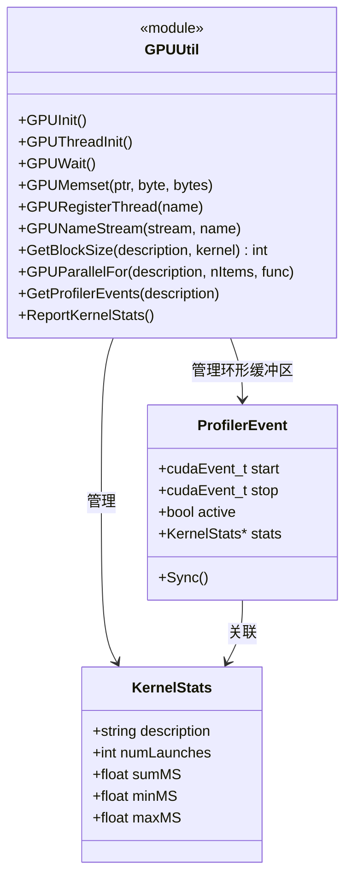

# util.h / util.cpp

## 概述

该文件是 pbrt GPU 渲染器的核心工具模块，提供了 CUDA GPU 初始化、并行执行（`GPUParallelFor`）、内核性能剖析以及同步等基础设施。它定义了关键的 CUDA 错误检查宏、GPU 内核启动模板函数，以及完整的 GPU 内核性能统计系统。该模块是所有 GPU 渲染代码的基础依赖，几乎每个 GPU 相关源文件都会引用它。

## 主要类与接口

| 类/结构体/函数 | 说明 |
|---|---|
| `CUDA_CHECK(EXPR)` | 宏，检查 CUDA Runtime API 调用结果，失败时触发致命错误 |
| `CU_CHECK(EXPR)` | 宏，检查 CUDA Driver API 调用结果，失败时触发致命错误 |
| `GPUInit()` | 初始化 GPU：检测设备、选择 GPU、设置栈大小、缓存配置等 |
| `GPUThreadInit()` | 在工作线程中初始化 GPU 设备（设置 `cudaSetDevice`） |
| `GPUWait()` | 等待所有 GPU 操作完成（`cudaDeviceSynchronize`） |
| `GPUMemset()` | 对 GPU 内存进行 memset 操作 |
| `GPURegisterThread()` | 使用 NVTX 为线程命名（便于调试和性能分析） |
| `GPUNameStream()` | 使用 NVTX 为 CUDA stream 命名 |
| `GetBlockSize()` | 模板函数，使用 `cudaOccupancyMaxPotentialBlockSize` 自动计算内核最优线程块大小，带缓存 |
| `Kernel<F>` | CUDA 全局内核函数模板，执行传入的函数对象 |
| `GPUParallelFor()` | 模板函数，在 GPU 上并行执行指定数量的工作项，自动计算网格/块尺寸，并集成性能剖析事件 |
| `GetProfilerEvents()` | 获取一对 CUDA 事件用于内核计时，使用环形缓冲区管理 |
| `ReportKernelStats()` | 汇总并打印所有 GPU 内核的性能统计信息（启动次数、总时间、最小/最大/平均时间） |
| `KernelStats` | 内部结构体，存储单个内核的性能统计数据 |
| `ProfilerEvent` | 内部结构体，包含 CUDA 开始/结束事件和关联的统计信息 |

## 架构图

## 算法流程图

```mermaid
flowchart TD
    subgraph GPUParallelFor
        A[GPUParallelFor 调用] --> B[NVTX Range Push]
        B --> C[GetBlockSize: 查询最优块大小]
        C --> D[GetProfilerEvents: 获取计时事件对]
        D --> E[cudaEventRecord start]
        E --> F[计算 gridSize]
        F --> G["Kernel<<<gridSize, blockSize>>>(func, nItems)"]
        G --> H[cudaEventRecord stop]
        H --> I[Debug 模式: cudaDeviceSynchronize]
        I --> J[NVTX Range Pop]
    end

    subgraph GPUInit
        K[GPUInit] --> L[获取 CUDA 驱动/运行时版本]
        L --> M[枚举所有 GPU 设备]
        M --> N[选择目标设备 cudaSetDevice]
        N --> O[验证统一寻址支持]
        O --> P[设置栈大小 8192 字节]
        P --> Q[设置 printf 缓冲区 32MB]
        Q --> R[配置 L1 缓存优先]
    end

    subgraph ReportKernelStats
        S[ReportKernelStats] --> T[cudaDeviceSynchronize]
        T --> U[Drain 所有活跃的 ProfilerEvent]
        U --> V[计算总毫秒数]
        V --> W[按时间占比排序输出]
        W --> X[输出 Other 类别汇总]
        X --> Y[输出总渲染时间]
    end
```

## 依赖关系

- **依赖**：
  - `pbrt/pbrt.h` -- 基础类型定义
  - `pbrt/util/check.h` -- 断言检查
  - `pbrt/util/log.h` -- 日志系统
  - `pbrt/util/parallel.h` -- 并行工具
  - `pbrt/util/progressreporter.h` -- 进度报告
  - `pbrt/options.h` -- 渲染选项（GPU 设备选择）
  - `pbrt/util/error.h` -- 错误处理
  - `pbrt/util/print.h` -- 格式化输出
  - `cuda.h`、`cuda_runtime_api.h` -- CUDA API
  - `nvtx3/nvToolsExt.h`（可选）-- NVIDIA 性能分析工具扩展

- **被依赖**：
  - `pbrt/gpu/cudagl.h` -- CUDA-GL 互操作
  - `pbrt/gpu/memory.cpp` -- CUDA 内存管理
  - `pbrt/gpu/optix/aggregate.cpp` -- OptiX 加速结构
  - `pbrt/gpu/optix/denoiser.cpp` -- OptiX 降噪器
  - `pbrt/gpu/optix/scaler.cpp` -- OptiX 超分辨率缩放
  - `pbrt/wavefront/workqueue.h` -- 波前工作队列
  - `pbrt/wavefront/integrator.h` -- 波前积分器
  - `pbrt/shapes.cpp` -- 几何形状
  - `pbrt/textures.cpp` -- 纹理处理
  - `pbrt/pbrt.cpp` -- 主渲染流程
  - 以及其他多个核心模块
