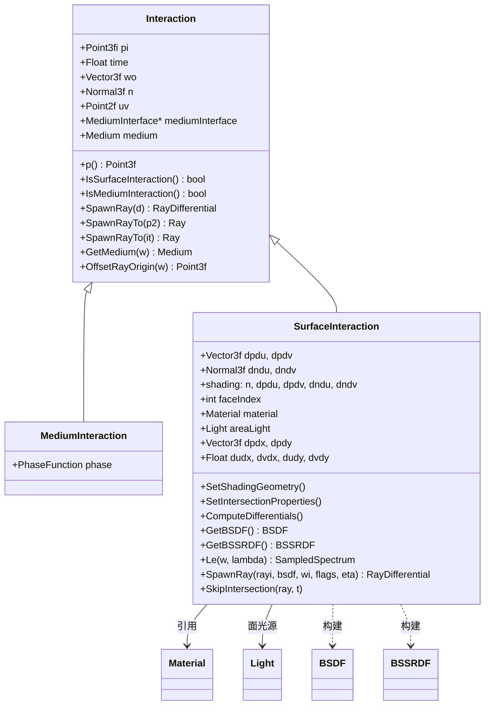
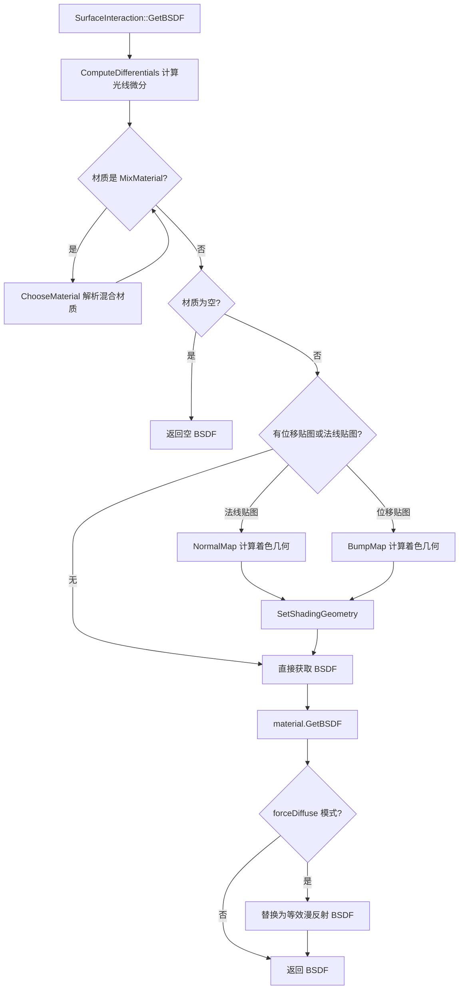

# interaction.h / interaction.cpp

## 概述
该文件定义了 PBRT 渲染器中光线与场景的 **交互点**（Interaction）相关数据结构，是光线追踪管线中贯穿始终的核心数据类型。交互点记录了光线与表面或介质相交时的所有几何信息、材质属性以及着色数据。`SurfaceInteraction` 是最常用的类型，它在光线追踪、材质评估、BSDF 构建、光源采样等几乎所有渲染步骤中都被使用。

## 主要类与接口

| 类/结构体/函数 | 说明 |
|---|---|
| `Interaction` | 交互点基类，存储位置 `pi`（带误差区间）、法线 `n`、UV 坐标、出射方向 `wo`、时间 `time` 和介质信息。提供 `OffsetRayOrigin()`/`SpawnRay()`/`SpawnRayTo()` 用于从交互点生成偏移射线（避免自交），以及 `GetMedium()` 获取光线方向对应的介质 |
| `Interaction::OffsetRayOrigin()` | 计算偏移后的光线原点，避免自交。利用浮点误差区间和法线方向，沿法线方向偏移并使用 `NextFloatUp`/`NextFloatDown` 确保数值稳定性 |
| `Interaction::SpawnRay()` | 从交互点生成沿给定方向的射线，原点使用 `OffsetRayOrigin()` 偏移，介质通过 `GetMedium()` 获取 |
| `Interaction::SpawnRayTo()` | 从交互点生成指向目标点的射线，支持单点目标和双点目标（带法线）两种重载，原点均使用 `OffsetRayOrigin()` 偏移 |
| `MediumInteraction` | 介质交互点（继承 Interaction），在体积散射事件中使用，额外存储相函数 `PhaseFunction phase` |
| `SurfaceInteraction` | 表面交互点（继承 Interaction），是系统中最关键的数据结构。存储完整的几何微分信息（dpdu/dpdv/dndu/dndv）、着色几何（shading 结构体）、材质、面光源、光线微分（dpdx/dpdy/dudx/dvdx/dudy/dvdy）以及面索引 |
| `SurfaceInteraction::SetShadingGeometry()` | 设置着色几何信息（法线、偏导数），处理法线朝向一致性 |
| `SurfaceInteraction::SetIntersectionProperties()` | 在光线追踪完成后设置材质、面光源和介质属性 |
| `SurfaceInteraction::ComputeDifferentials()` | 计算光线微分：利用光线微分或相机投影近似计算屏幕空间中 dp/dx、dp/dy 以及 du/dx、dv/dx 等纹理坐标导数。用于纹理滤波（MIPMap 等级选择、各向异性滤波），避免纹理走样 |
| `SurfaceInteraction::GetBSDF()` | 核心方法，评估法线/凹凸贴图，解析混合材质，调用材质的 `GetBSDF()` 构建着色用的 BSDF 对象 |
| `SurfaceInteraction::GetBSSRDF()` | 获取次表面散射 BSSRDF 对象 |
| `SurfaceInteraction::SpawnRay()` (重载) | 针对镜面反射/折射生成带光线微分的射线 |
| `SurfaceInteraction::SkipIntersection()` | 跳过当前交叉点继续追踪（用于 alpha 遮罩等场景） |
| `SurfaceInteraction::Le()` | 返回交互点作为面光源时沿给定方向的自发辐射 |

## 架构图

## 算法流程图

## 依赖关系
- **依赖**：`pbrt/base/bssrdf.h`、`pbrt/base/camera.h`、`pbrt/base/light.h`、`pbrt/base/material.h`、`pbrt/base/medium.h`、`pbrt/base/sampler.h`、`pbrt/ray.h`、`pbrt/cameras.h`（cpp）、`pbrt/lights.h`（cpp）、`pbrt/materials.h`（cpp）、`pbrt/options.h`（cpp）、`pbrt/samplers.h`（cpp）、`pbrt/util/spectrum.h`、`pbrt/util/taggedptr.h`、`pbrt/util/vecmath.h`、`pbrt/util/math.h`、`pbrt/util/rng.h`
- **被依赖**：`pbrt/bsdf.h`、`pbrt/bssrdf.h`、`pbrt/bxdfs.h`、`pbrt/bxdfs.cpp`、`pbrt/cameras.h`、`pbrt/lights.h`、`pbrt/materials.h`、`pbrt/materials.cpp`、`pbrt/media.h`、`pbrt/media.cpp`、`pbrt/shapes.h`、`pbrt/shapes.cpp`、`pbrt/textures.h`、`pbrt/textures.cpp`、`pbrt/cpu/integrators.h`、`pbrt/cpu/integrators.cpp`、`pbrt/cpu/aggregates.cpp`、`pbrt/cpu/primitive.cpp`、`pbrt/lightsamplers.cpp`、`pbrt/util/soa.h`、`pbrt/util/transform.cpp`、`pbrt/gpu/optix/optix.cu`、`pbrt/wavefront/surfscatter.cpp`、`pbrt/wavefront/subsurface.cpp`

## 关键函数原理与流程

### Interaction::OffsetRayOrigin
- **原理**：避免光线自交（self-intersection）问题。浮点运算存在误差，光线从表面交点出发时可能重新与同一表面相交。通过沿法线方向偏移原点，并利用浮点误差区间 `pi.Error()` 计算偏移量，确保偏移后的点在误差范围之外。使用 `NextFloatUp`/`NextFloatDown` 确保数值稳定性，避免浮点舍入误差导致原点仍在表面内。
- **流程**：
  1) 计算偏移量 `d = Dot(Abs(n), pi.Error())`，即法线分量绝对值与误差区间的点积。
  2) 计算偏移向量 `offset = d * Vector3f(n)`。
  3) 若光线方向与法线反向（`Dot(w, n) < 0`），则偏移向量取反。
  4) 计算初始偏移点 `po = Point3f(pi) + offset`。
  5) 对每个坐标分量，若 `offset[i] > 0`，则 `po[i] = NextFloatUp(po[i])`；若 `offset[i] < 0`，则 `po[i] = NextFloatDown(po[i])`。
  6) 返回偏移后的原点 `po`。

### Interaction::SpawnRay
- **原理**：从交互点生成沿给定方向的射线，用于光线追踪中的反射、折射、阴影光线等。原点使用 `OffsetRayOrigin()` 偏移避免自交，介质通过 `GetMedium()` 根据光线方向与法线的关系选择内部或外部介质。
- **流程**：
  1) 调用 `OffsetRayOrigin(d)` 计算偏移后的原点。
  2) 调用 `GetMedium(d)` 获取光线方向对应的介质。
  3) 返回 `RayDifferential(OffsetRayOrigin(d), d, time, GetMedium(d))`。

### Interaction::SpawnRayTo (单点目标)
- **原理**：从交互点生成指向目标点的射线，用于阴影光线、连接采样点等场景。原点使用 `OffsetRayOrigin()` 偏移避免自交，方向为目标点与原点的差值，介质通过 `GetMedium()` 获取。
- **流程**：
  1) 计算方向 `d = pTo - Point3f(pFrom)`。
  2) 调用 `OffsetRayOrigin(pFrom, n, d)` 计算偏移后的原点 `pf`。
  3) 返回 `Ray(pf, d, time)`，介质通过 `GetMedium(r.d)` 设置。

### Interaction::SpawnRayTo (双点目标)
- **原理**：从交互点生成指向目标点的射线，目标点也带法线，用于两个表面之间的连接。两端原点都使用 `OffsetRayOrigin()` 偏移，确保两端都避免自交。
- **流程**：
  1) 计算方向 `d = Point3f(pTo) - Point3f(pFrom)`。
  2) 调用 `OffsetRayOrigin(pFrom, nFrom, d)` 计算偏移后的原点 `pf`。
  3) 调用 `OffsetRayOrigin(pTo, nTo, pf - Point3f(pTo))` 计算目标点的偏移原点 `pt`。
  4) 返回 `Ray(pf, pt - pf, time)`，介质通过 `GetMedium(r.d)` 设置。

### SurfaceInteraction::ComputeDifferentials
- **原理**：计算表面点在屏幕空间中的位置微分 `dpdx`、`dpdy` 和纹理坐标微分 `dudx`、`dvdx`、`dudy`、`dvdy`，用于纹理滤波（MIPMap 等级选择、各向异性滤波）。若光线有微分且与表面不平行，则通过光线微分与表面切平面求交计算位置微分；否则使用相机投影近似。纹理坐标微分通过求解线性方程组 `A^T A x = A^T b` 得到，其中 `A = [dpdu, dpdv]`，`b = [dpdx, dpdy]`。
- **调用位置**：在 `SurfaceInteraction::GetBSDF()` 中调用，位于材质评估之前。这是光线追踪管线中的关键步骤，确保纹理采样时使用正确的滤波等级。
- **流程**：
  1) 若 `disableTextureFiltering` 为真，则清零所有微分并返回。
  2) 若光线有微分且与表面不平行（`Dot(n, ray.rxDirection) != 0` 且 `Dot(n, ray.ryDirection) != 0`）：
     - 计算切平面方程 `d = -Dot(n, Vector3f(p()))`。
     - 计算 x 方向光线与切平面的交点 `px`：`tx = (-Dot(n, Vector3f(ray.rxOrigin)) - d) / Dot(n, ray.rxDirection)`，`px = ray.rxOrigin + tx * ray.rxDirection`。
     - 计算 y 方向光线与切平面的交点 `py`：`ty = (-Dot(n, Vector3f(ray.ryOrigin)) - d) / Dot(n, ray.ryDirection)`，`py = ray.ryOrigin + ty * ray.ryDirection`。
     - 计算位置微分 `dpdx = px - p()`，`dpdy = py - p()`。
  3) 否则，调用 `camera.Approximate_dp_dxy(p(), n, time, samplesPerPixel, &dpdx, &dpdy)` 近似位置微分。
  4) 计算纹理坐标微分：
     - 计算 `A^T A` 矩阵元素：`ata00 = Dot(dpdu, dpdu)`，`ata01 = Dot(dpdu, dpdv)`，`ata11 = Dot(dpdv, dpdv)`。
     - 计算行列式 `invDet = 1 / (ata00 * ata11 - ata01 * ata01)`，若非有限则设为 0。
     - 计算 `A^T b` 向量：`atb0x = Dot(dpdu, dpdx)`，`atb1x = Dot(dpdv, dpdx)`，`atb0y = Dot(dpdu, dpdy)`，`atb1y = Dot(dpdv, dpdy)`。
     - 求解线性方程组得到纹理坐标微分：
       - `dudx = (ata11 * atb0x - ata01 * atb1x) * invDet`
       - `dvdx = (ata00 * atb1x - ata01 * atb0x) * invDet`
       - `dudy = (ata11 * atb0y - ata01 * atb1y) * invDet`
       - `dvdy = (ata00 * atb1y - ata01 * atb0y) * invDet`
  5) 限制纹理坐标微分到合理范围 `[-1e8, 1e8]`，避免数值不稳定。
