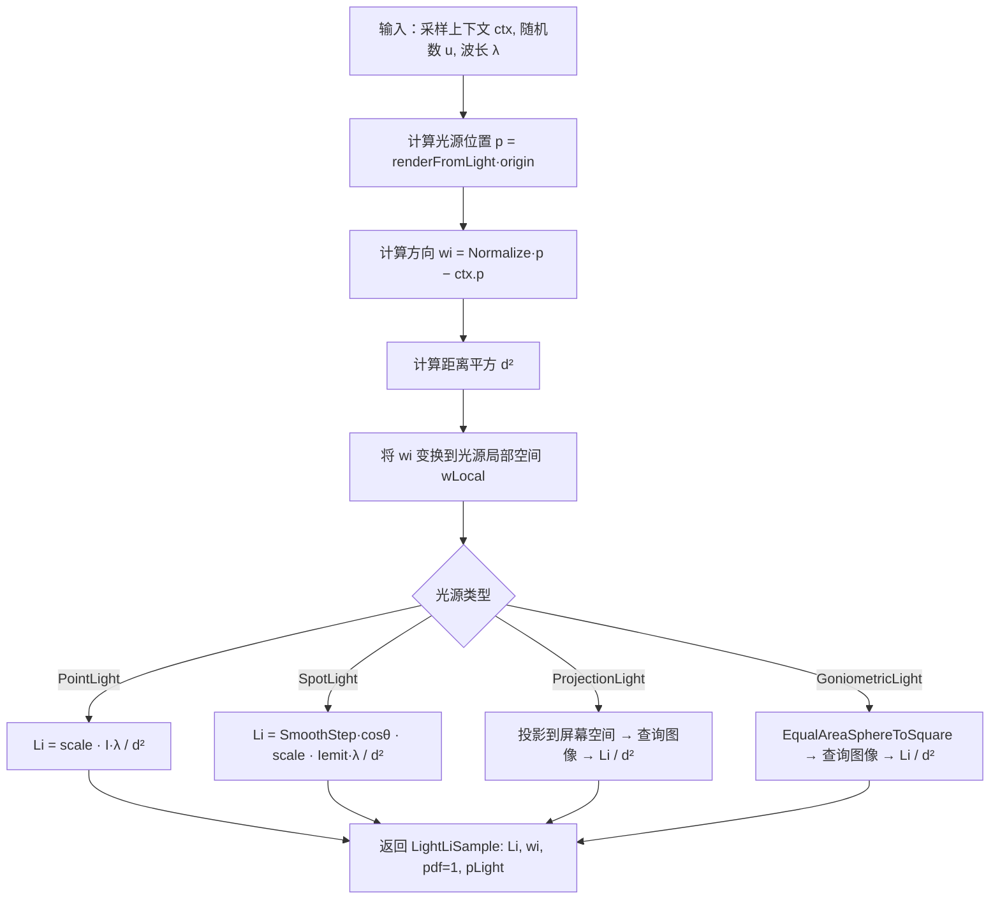
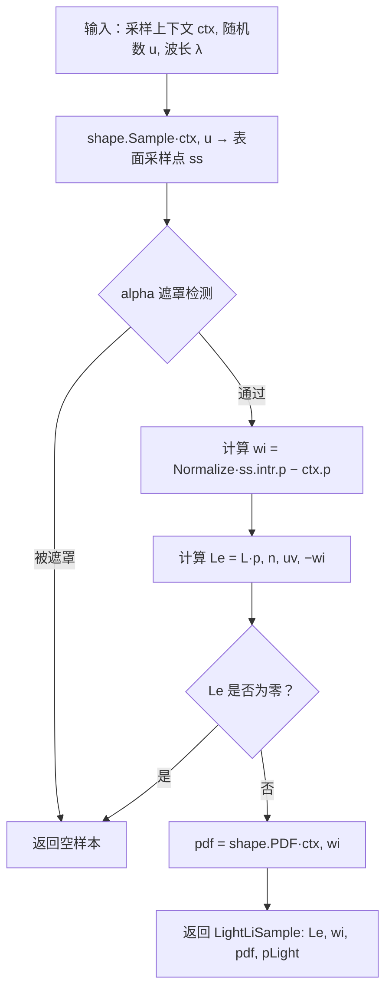
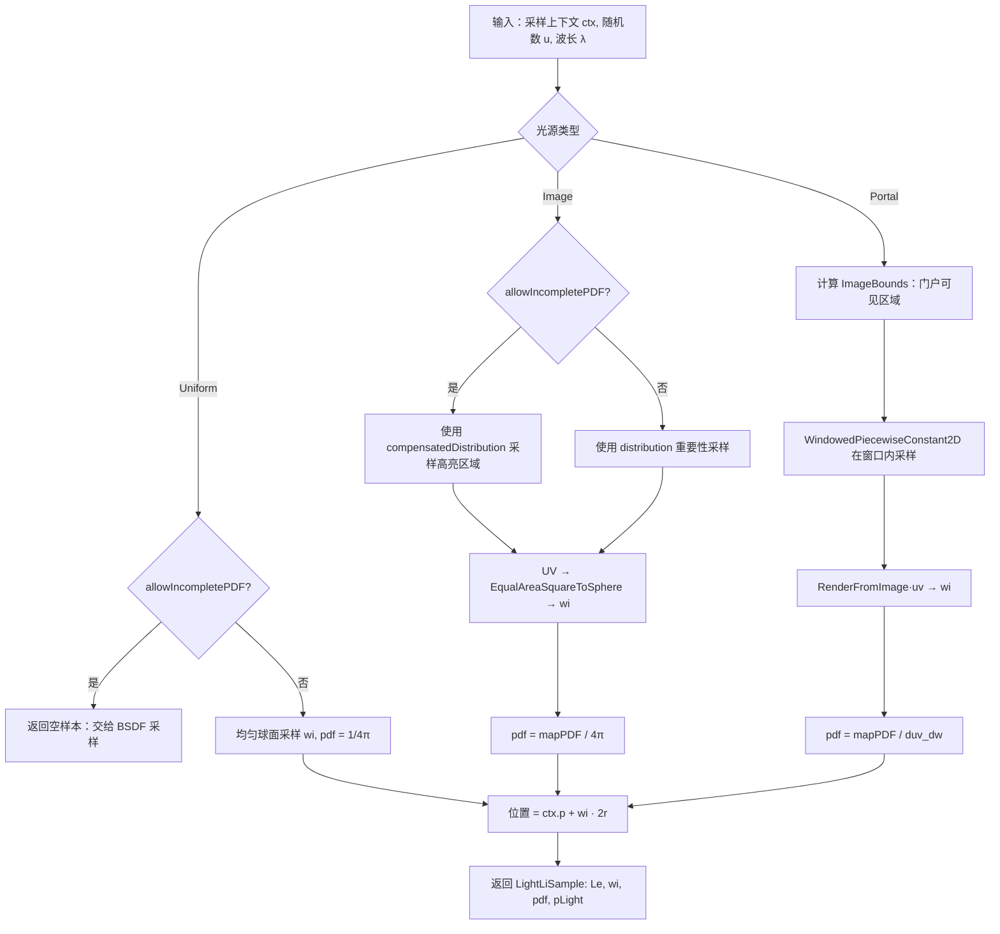
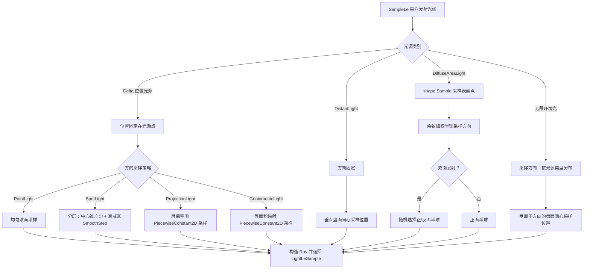
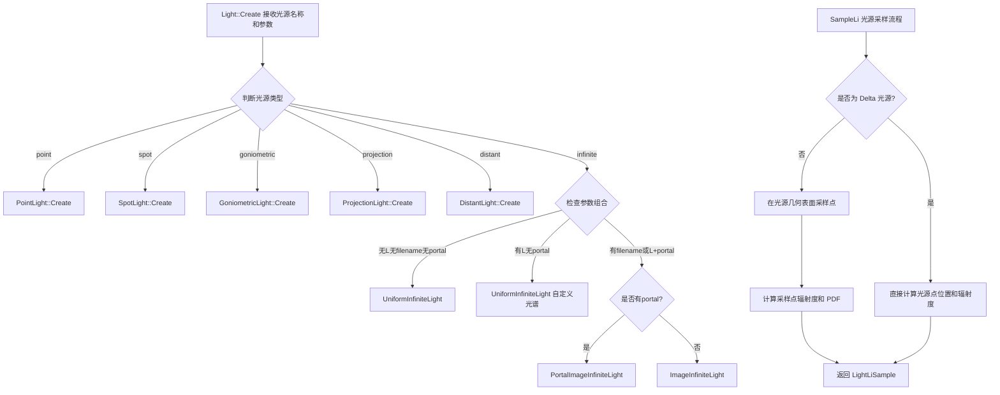

# lights.h / lights.cpp

## 概述
该文件实现了 PBRT-v4 渲染器中所有具体的光源类型，是渲染管线中光照计算的核心模块。文件定义了点光源、远光源、聚光灯、投影光源、光度光源、漫反射面光源以及多种无限环境光源，每种光源均提供采样辐射度（`SampleLi`）、发射光线采样（`SampleLe`）、功率计算（`Phi`）和概率密度函数（`PDF_Li`/`PDF_Le`）等接口。此外还定义了光源采样上下文（`LightSampleContext`）、光源边界（`LightBounds`）等辅助数据结构，用于支持高效的光源选择与重要性采样。

## 主要类与接口
| 类/结构体/函数 | 说明 |
|---|---|
| `LightLiSample` | 光源入射辐射度采样结果，包含辐射度 `L`、入射方向 `wi`、概率密度 `pdf` 和光源交互点 `pLight` |
| `LightLeSample` | 光源发射光线采样结果，包含辐射度 `L`、光线 `ray`、位置和方向的概率密度 |
| `LightSampleContext` | 光源采样的上下文信息，封装了采样点位置 `pi`、几何法线 `n` 和着色法线 `ns` |
| `LightBounds` | 光源的空间和方向边界，用于 BVH 光源采样器中的重要性估算 |
| `LightBase` | 所有光源的基类，提供类型查询、变换矩阵、介质接口和光谱缓存等公共功能 |
| `PointLight` | 点光源（Delta 位置），向所有方向均匀发光 |
| `DistantLight` | 远光源（Delta 方向），模拟无限远处的平行光（如太阳） |
| `SpotLight` | 聚光灯（Delta 位置），带锥形衰减区域的定向点光源 |
| `ProjectionLight` | 投影光源（Delta 位置），通过图像纹理投射图案的光源 |
| `GoniometricLight` | 光度光源（Delta 位置），根据等面积球面映射图像控制各方向发光强度 |
| `DiffuseAreaLight` | 漫反射面光源，附着在几何形状上的面发射光源，支持纹理和 alpha 遮罩 |
| `UniformInfiniteLight` | 均匀无限环境光，向所有方向发射相同辐射度 |
| `ImageInfiniteLight` | 图像无限环境光，使用等面积球面映射的 HDR 图像作为环境照明 |
| `PortalImageInfiniteLight` | 门户图像无限环境光，通过矩形门户区域对环境光进行重要性采样 |
| `IsDeltaLight()` | 内联工具函数，判断光源是否为 Delta 类型（无法被面积采样） |
| `Light::Create()` | 工厂方法，根据名称字符串创建对应的光源实例 |
| `Light::CreateArea()` | 工厂方法，创建面光源实例 |

## 架构图

```mermaid
classDiagram
    class LightBase {
        #LightType type
        #Transform renderFromLight
        #MediumInterface mediumInterface
        +Type() LightType
        +L() SampledSpectrum
        +Le() SampledSpectrum
        #LookupSpectrum(Spectrum) DenselySampledSpectrum*
    }
    class PointLight {
        -DenselySampledSpectrum* I
        -Float scale
        +SampleLi() LightLiSample
        +SampleLe() LightLeSample
        +Phi() SampledSpectrum
        +Bounds() LightBounds
    }
    class DistantLight {
        -DenselySampledSpectrum* Lemit
        -Float scale
        +SampleLi() LightLiSample
        +SampleLe() LightLeSample
        +Preprocess(Bounds3f)
    }
    class SpotLight {
        -DenselySampledSpectrum* Iemit
        -Float cosFalloffStart, cosFalloffEnd
        +I(Vector3f, SampledWavelengths) SampledSpectrum
        +SampleLi() LightLiSample
    }
    class ProjectionLight {
        -Image image
        -PiecewiseConstant2D distrib
        +I(Vector3f, SampledWavelengths) SampledSpectrum
    }
    class GoniometricLight {
        -Image image
        -PiecewiseConstant2D distrib
        +I(Vector3f, SampledWavelengths) SampledSpectrum
    }
    class DiffuseAreaLight {
        -Shape shape
        -FloatTexture alpha
        +L(Point3f, Normal3f, Point2f, Vector3f, SampledWavelengths) SampledSpectrum
        +SampleLi() LightLiSample
    }
    class UniformInfiniteLight {
        -DenselySampledSpectrum* Lemit
        +Le(Ray, SampledWavelengths) SampledSpectrum
    }
    class ImageInfiniteLight {
        -Image image
        -PiecewiseConstant2D distribution
        -PiecewiseConstant2D compensatedDistribution
        +Le(Ray, SampledWavelengths) SampledSpectrum
    }
    class PortalImageInfiniteLight {
        -pstd::array~Point3f,4~ portal
        -Frame portalFrame
        -WindowedPiecewiseConstant2D distribution
        +Le(Ray, SampledWavelengths) SampledSpectrum
    }

    LightBase <|-- PointLight
    LightBase <|-- DistantLight
    LightBase <|-- SpotLight
    LightBase <|-- ProjectionLight
    LightBase <|-- GoniometricLight
    LightBase <|-- DiffuseAreaLight
    LightBase <|-- UniformInfiniteLight
    LightBase <|-- ImageInfiniteLight
    LightBase <|-- PortalImageInfiniteLight
```


## LightBase 基类与公共机制

### LightBase 基类

所有光源继承自 `LightBase`，它维护以下受保护成员：

| 成员 | 类型 | 说明 |
|---|---|---|
| `type` | `LightType` | 光源类型枚举（`DeltaPosition`、`DeltaDirection`、`Area`、`Infinite`） |
| `renderFromLight` | `Transform` | 光源局部坐标系到渲染坐标系的变换矩阵 |
| `mediumInterface` | `MediumInterface` | 光源所处的参与介质接口 |
| `spectrumCache` | `InternCache<DenselySampledSpectrum>*` | 全局静态光谱缓存（线程安全，惰性初始化） |

**默认方法**：`LightBase` 提供 `L()` 和 `Le()` 的默认实现，均返回零光谱。只有 `DiffuseAreaLight` 覆盖 `L()`，三种 Infinite 光源覆盖 `Le()`。

**LookupSpectrum 机制**：静态方法 `LookupSpectrum(Spectrum s)` 将任意 `Spectrum` 转换为 `DenselySampledSpectrum` 并存入全局 `InternCache`。所有光源在构造时通过此机制缓存光谱数据，避免重复采样和内存浪费。GPU 渲染模式下使用 `CUDATrackedMemoryResource` 分配器。

### TaggedPointer 分派机制

`Light` 类继承自 `TaggedPointer<PointLight, DistantLight, ProjectionLight, GoniometricLight, SpotLight, DiffuseAreaLight, UniformInfiniteLight, ImageInfiniteLight, PortalImageInfiniteLight>`，通过类型标签在运行时分派方法调用到具体光源实现：

- **`Dispatch(lambda)`**：GPU/CPU 通用分派，用于高频调用路径（`SampleLi`、`PDF_Li`、`L`、`Le`、`SampleLe`、`PDF_Le`），标记 `PBRT_CPU_GPU`
- **`DispatchCPU(lambda)`**：仅 CPU 分派，用于低频调用路径（`Phi`、`Preprocess`、`Bounds`、`ToString`），无 GPU 标记

内联分派示例（`lights.h` 中）：
```cpp
PBRT_CPU_GPU inline pstd::optional<LightLiSample> Light::SampleLi(...) const {
    auto sample = [&](auto ptr) { return ptr->SampleLi(ctx, u, lambda, allowIncompletePDF); };
    return Dispatch(sample);
}
```

### 物理单位校准

所有光源的 `Create()` 工厂方法统一执行物理单位校准：

1. **归一化到 1 nit**：`scale /= SpectrumToPhotometric(spectrum)`，将光谱的辐射度量归一化，使得 scale=1 时对应 1 cd/m² 的光度亮度
2. **power 参数**：若用户指定 `power`（总光通量，单位 lm），则计算 `scale *= power / k_e`，其中 `k_e` 为该光源类型的几何因子（如点光源 `k_e = 4π`，聚光灯 `k_e = 2π·((1−cosFalloffStart) + (cosFalloffStart−cosFalloffEnd)/2)`）
3. **illuminance 参数**（DistantLight 和 InfiniteLight）：若指定目标照度 `E_v`，则 `scale *= E_v / k_e`

### LightBounds 与 Importance 算法

`LightBounds` 封装光源的空间和方向边界，用于 BVH 光源采样器中估算光源对某点的重要性：

**数据成员**：
| 成员 | 说明 |
|---|---|
| `bounds` | 光源的空间 AABB 包围盒 |
| `w` | 发射方向锥的中心方向（归一化） |
| `phi` | 总功率上界（用于重要性加权） |
| `cosTheta_o` | 发射方向锥的半角余弦，定义光源主要发射范围 |
| `cosTheta_e` | 衰减截止角余弦，超过此角度发射为零 |
| `twoSided` | 是否双面发射 |

**Importance(p, n) 算法**：

1. 计算参考点 p 到光源中心 pc 的距离平方 `d² = max(‖p−pc‖², ‖diagonal‖/2)`（钳位避免除零）
2. 计算参考点方向与光源发射方向的夹角 `θ_w = arccos(Dot(w, Normalize(p−pc)))`；双面时取绝对值
3. 计算光源包围盒对参考点的张角 `θ_b = BoundSubtendedDirections(bounds, p).cosTheta`
4. **角度减法**：通过 `cosSubClamped` 和 `sinSubClamped` lambda 函数实现钳位的角度减法：
   - `θ_x = max(θ_w − θ_o, 0)`：参考点方向超出发射锥的偏差角
   - `θ' = max(θ_x − θ_b, 0)`：再减去包围盒张角后的净偏差
   - `cosSubClamped(sin_a, cos_a, sin_b, cos_b)` = `cos_a > cos_b` ? 1 : `cos_a·cos_b + sin_a·sin_b`（即 `cos(a−b)` 的钳位版本）
5. 若 `cos(θ') ≤ cosTheta_e` 则返回 0（完全在衰减区外）
6. 计算重要性：`importance = phi · cos(θ') / d²`
7. 若参考点有法线 n，再乘以 `cos(θ'_i) = cosSubClamped(θ_i, θ_b)`（入射角余弦的保守估计）

**Union(LightBounds) 操作**：

合并两个 `LightBounds` 用于 BVH 构建：
- 空间：`Union(a.bounds, b.bounds)`
- 方向：`Union(DirectionCone(a.w, a.cosTheta_o), DirectionCone(b.w, b.cosTheta_o))` 得到包围两个方向锥的最小锥
- 衰减角：`cosTheta_e = min(a.cosTheta_e, b.cosTheta_e)`（保守取更宽的衰减范围）
- 功率：`phi = a.phi + b.phi`
- 双面：`twoSided = a.twoSided | b.twoSided`

---

## 各光源详解

### 1. PointLight（点光源）

**物理意义**：理想的各向同性点光源，从空间中单一点向所有方向均匀辐射。辐射强度 $I$ [W/sr] 是各向同性的，总功率 $\Phi = 4\pi I$。物理上对应极小尺寸的灯泡或裸露的发光点。属于 `LightType::DeltaPosition`——位置是 delta 分布（确定性），无法被 BSDF 路径采样直接命中，只能通过显式光源采样获得贡献。

**私有数据**：
| 成员 | 类型 | 说明 |
|---|---|---|
| `I` | `const DenselySampledSpectrum*` | 发射光谱强度 |
| `scale` | `Float` | 缩放因子（经过物理单位校准） |

**接口实现**：

| 方法 | 实现原理 |
|---|---|
| `Type()` | 返回 `LightType::DeltaPosition` |
| `SampleLi(ctx, u, λ)` | 位置固定 `p = renderFromLight(0,0,0)`；方向确定 `wi = Normalize(p − ctx.p())`；辐亮度 `Li = scale · I(λ) / d²`（距离平方反比）；`pdf = 1`（delta 分布） |
| `PDF_Li(ctx, wi)` | 恒返回 `0`。Delta 光源的位置不可能被 BSDF 随机采样命中，因此 MIS 中 BSDF 采样策略对该光源的 PDF 为零 |
| `L(p, n, uv, w, λ)` | 基类默认实现，返回零光谱（点光源不是面光源，不提供表面辐射度查询） |
| `Le(ray, λ)` | 基类默认实现，返回零光谱（点光源不是无限环境光） |
| `Phi(λ)` | `4π · scale · I(λ)` —— 球面积分各向同性强度得到总功率 |
| `Preprocess(sceneBounds)` | 空实现，点光源不依赖场景边界 |
| `Bounds()` | 退化包围盒 `Bounds3f(p, p)`；方向 `w = (0,0,1)`（任意，因为各向同性）；`phi = 4π · scale · I.MaxValue()`；`cosTheta_o = cos(π) = −1`（全球面发射）；`cosTheta_e = cos(π/2) = 0`（半球截止） |
| `SampleLe(u1, u2, λ, t)` | 位置固定 `p = renderFromLight(0,0,0)`；方向通过均匀球面采样 `SampleUniformSphere(u1)` 得到；`L = scale · I(λ)`；`pdfPos = 1`，`pdfDir = UniformSpherePDF() = 1/(4π)` |
| `PDF_Le(Ray)` | `pdfPos = 0`（delta 位置），`pdfDir = UniformSpherePDF() = 1/(4π)` |
| `PDF_Le(Interaction)` | `LOG_FATAL`——此重载仅适用于面光源，对点光源调用是程序逻辑错误 |

---

### 2. DistantLight（远光源）

**物理意义**：模拟无限远处的平行光源（如太阳），所有光线具有相同方向。属于 `LightType::DeltaDirection`——方向是 delta 分布（确定性），辐照度 $E$ [W/m²] 描述平行光在垂直平面上的照射强度。需要在渲染前调用 `Preprocess` 获取场景包围球信息。

**私有数据**：
| 成员 | 类型 | 说明 |
|---|---|---|
| `Lemit` | `const DenselySampledSpectrum*` | 发射辐亮度光谱 |
| `scale` | `Float` | 缩放因子 |
| `sceneCenter` | `Point3f` | 场景包围球中心（Preprocess 后设置） |
| `sceneRadius` | `Float` | 场景包围球半径（Preprocess 后设置） |

**接口实现**：

| 方法 | 实现原理 |
|---|---|
| `Type()` | 返回 `LightType::DeltaDirection` |
| `SampleLi(ctx, u, λ)` | 方向固定 `wi = Normalize(renderFromLight(0,0,1))`；位置设在极远处 `pOutside = ctx.p() + wi · (2·sceneRadius)` 确保光线覆盖整个场景；`Li = scale · Lemit(λ)`（不衰减，平行光辐亮度恒定）；`pdf = 1`（delta 方向） |
| `PDF_Li(ctx, wi)` | 恒返回 `0`。Delta 方向光源不可能被 BSDF 随机采样命中 |
| `L / Le` | 基类默认实现，返回零光谱 |
| `Phi(λ)` | `scale · Lemit(λ) · π · sceneRadius²` —— 平行光投影到场景包围球横截面（圆盘面积 πr²）上的总功率 |
| `Preprocess(sceneBounds)` | 调用 `sceneBounds.BoundingSphere(&sceneCenter, &sceneRadius)` 获取场景包围球参数，后续 SampleLi/SampleLe 依赖这些值 |
| `Bounds()` | 返回空 `{}`（无有限空间边界，远光源不参与 BVH 光源选择） |
| `SampleLe(u1, u2, λ, t)` | 方向固定 `w = Normalize(renderFromLight(0,0,1))`；在垂直于 w 的盘面上用同心盘采样 `SampleUniformDiskConcentric(u1)` 确定发射位置；盘面中心在 `sceneCenter`，半径 `sceneRadius`；光线从 `pDisk + sceneRadius·w` 出发沿 `−w` 方向射入场景；`pdfPos = 1/(π·r²)`，`pdfDir = 1`（方向确定） |
| `PDF_Le(Ray)` | `pdfPos = 1/(π·sceneRadius²)`，`pdfDir = 0`（delta 方向） |
| `PDF_Le(Interaction)` | `LOG_FATAL`——不适用于非面光源 |

---

### 3. SpotLight（聚光灯）

**物理意义**：带锥形衰减的点光源（`LightType::DeltaPosition`）。中心锥 `[0, falloffStart]` 内均匀发射，从 `falloffStart` 到 `totalWidth` 之间通过 `SmoothStep` 平滑衰减到零。对应现实中的聚光灯、手电筒、舞台灯。

**私有数据**：
| 成员 | 类型 | 说明 |
|---|---|---|
| `Iemit` | `const DenselySampledSpectrum*` | 发射光谱强度 |
| `scale` | `Float` | 缩放因子 |
| `cosFalloffStart` | `Float` | 均匀发射锥边界角的余弦 |
| `cosFalloffEnd` | `Float` | 完全衰减角的余弦（对应 totalWidth） |

**辐射强度函数 I(w)**：
```
I(w) = SmoothStep(CosTheta(w), cosFalloffEnd, cosFalloffStart) × scale × Iemit(λ)
```
`SmoothStep` 在 `[cosFalloffEnd, cosFalloffStart]` 之间从 0 平滑过渡到 1。当 `CosTheta(w) ≥ cosFalloffStart` 时 I 达到最大值，当 `CosTheta(w) ≤ cosFalloffEnd` 时 I 为零。

**接口实现**：

| 方法 | 实现原理 |
|---|---|
| `Type()` | 返回 `LightType::DeltaPosition` |
| `SampleLi(ctx, u, λ)` | 位置固定 `p = renderFromLight(0,0,0)`；计算方向 `wi = Normalize(p − ctx.p())`；将 `−wi` 变换到光源局部空间 `wLight`；`Li = I(wLight, λ) / d²`；若 Li 为零（方向在锥外）则返回空样本 `{}`；`pdf = 1` |
| `PDF_Li(ctx, wi)` | 恒返回 `0`（delta 位置光源） |
| `L / Le` | 基类默认实现，返回零光谱 |
| `Phi(λ)` | `scale · Iemit(λ) · 2π · ((1 − cosFalloffStart) + (cosFalloffStart − cosFalloffEnd) / 2)` —— 对球面积分 SmoothStep 衰减函数：中心锥贡献 `2π(1−cosFalloffStart)` + 衰减区平均值约为一半贡献 `2π(cosFalloffStart−cosFalloffEnd)/2` |
| `Preprocess(sceneBounds)` | 空实现 |
| `Bounds()` | 退化包围盒 `Bounds3f(p, p)`；方向 `w = Normalize(renderFromLight(0,0,1))`（聚光灯主轴）；`phi = scale · Iemit.MaxValue() · 4π`（保守上界）；`cosTheta_o = cosFalloffStart`（发射锥半角）；`cosTheta_e = cos(arccos(cosFalloffEnd) − arccos(cosFalloffStart))`（衰减区对应的角度差）；特殊处理：若 `cosTheta_e == 1` 但两角不等则设为 `0.999f` 避免浮点精度问题 |
| `SampleLe(u1, u2, λ, t)` | **两段分层采样策略**：按权重 `p[0] = 1−cosFalloffStart`（中心锥立体角）和 `p[1] = (cosFalloffStart−cosFalloffEnd)/2`（衰减区加权立体角）用 `SampleDiscrete` 选择采样区域。**中心锥**（section=0）：`SampleUniformCone(u1, cosFalloffStart)` 均匀锥面采样，`pdfDir = UniformConePDF(cosFalloffStart) · sectionPDF`。**衰减区**（section=1）：用 `SampleSmoothStep(u1[0], cosFalloffEnd, cosFalloffStart)` 采样 cosθ（匹配 SmoothStep 分布形状），φ 角均匀采样 `u1[1]·2π`，`pdfDir = SmoothStepPDF(cosθ, ...) · sectionPDF / (2π)`。位置固定 `pdfPos = 1` |
| `PDF_Le(Ray)` | `pdfPos = 0`（delta 位置）；计算光线方向在光源空间的 cosθ：若 `cosθ ≥ cosFalloffStart` 则使用均匀锥 PDF，否则使用 SmoothStep PDF，各乘以对应区段的选择概率 |
| `PDF_Le(Interaction)` | `LOG_FATAL`——不适用于非面光源 |

---

### 4. ProjectionLight（投影光源）

**物理意义**：类似幻灯机/投影仪的点光源（`LightType::DeltaPosition`），通过透视投影矩阵将图像纹理投射到场景中。投影范围由视场角 `fov` 和图像宽高比定义的 `screenBounds` 决定。

**私有数据**：
| 成员 | 类型 | 说明 |
|---|---|---|
| `image` | `Image` | RGB 投影图像 |
| `imageColorSpace` | `const RGBColorSpace*` | 图像色彩空间 |
| `scale` | `Float` | 缩放因子 |
| `screenBounds` | `Bounds2f` | 屏幕空间投影范围 |
| `hither` | `Float` | 近裁面距离（1e-3） |
| `screenFromLight` | `Transform` | 光源空间到屏幕空间的透视投影矩阵 |
| `lightFromScreen` | `Transform` | 屏幕空间到光源空间的逆矩阵 |
| `A` | `Float` | 投影图像的立体角面积 `4·tan²(fov/2)·aspect` |
| `distrib` | `PiecewiseConstant2D` | 屏幕空间采样分布，权重为像素亮度乘以 cos³θ |

**辐射强度函数 I(w)**：
1. 检查 `w.z < hither` → 返回 0（方向在投影背面）
2. 透视投影：`ps = screenFromLight(Point3f(w))` → 屏幕坐标
3. 检查 `ps` 是否在 `screenBounds` 内 → 不在则返回 0
4. 计算 UV：`uv = screenBounds.Offset(ps)`
5. 查询图像 RGB → 构造 `RGBIlluminantSpectrum`
6. 返回 `scale · spectrum(λ)`

注意：投影的 cos³θ Jacobian 隐含在投影矩阵的几何关系中——屏幕空间的均匀面积对应光源空间不同立体角。

**接口实现**：

| 方法 | 实现原理 |
|---|---|
| `Type()` | 返回 `LightType::DeltaPosition` |
| `SampleLi(ctx, u, λ)` | 位置固定 `p = renderFromLight(0,0,0)`；方向 `wi = Normalize(p − ctx.p())`；将 `−wi` 变换到光源空间得 `wl`；`Li = I(wl, λ) / d²`；若 Li 为零则返回空样本；`pdf = 1` |
| `PDF_Li(ctx, wi)` | 恒返回 `0`（delta 位置光源） |
| `L / Le` | 基类默认实现，返回零光谱 |
| `Phi(λ)` | 遍历所有像素求和：每个像素计算屏幕坐标 → 反投影到光源空间方向 w → 乘以 `cos³θ(w)` 的 Jacobian 校正 → 乘以 RGB 光谱值。最终 `Phi = scale · A · Σ / (width · height)` |
| `Preprocess(sceneBounds)` | 空实现 |
| `Bounds()` | 退化包围盒 `Bounds3f(p, p)`；方向 `w = Normalize(renderFromLight(0,0,1))`（投影主轴）；`cosTheta_o = cos(0) = 1`（所有发射都在正前方）；`cosTheta_e = CosTheta(wCorner)` 其中 wCorner 是投影范围角落方向（最大偏离角）；phi 为像素最大通道值的归一化和 |
| `SampleLe(u1, u2, λ, t)` | 通过 `distrib.Sample(u1)` 在屏幕空间按亮度加权采样坐标 ps；将 ps 反投影到光源空间方向 `w = lightFromScreen(ps.x, ps.y, 0)`；`pdfDir = pdf · screenBounds.Area() / (A · cos³θ)`（屏幕空间 PDF 到立体角 PDF 的 Jacobian 变换）；查询图像得到辐亮度 L；位置固定 `pdfPos = 1` |
| `PDF_Le(Ray)` | `pdfPos = 0`；将光线方向变换到光源空间；检查 `w.z < hither` 和屏幕边界 → 不在范围内则 `pdfDir = 0`；否则 `pdfDir = distrib.PDF(ps) · screenBounds.Area() / (A · cos³θ(w))` |
| `PDF_Le(Interaction)` | `LOG_FATAL`——不适用于非面光源 |

---

### 5. GoniometricLight（光度光源）

**物理意义**：通过等面积球面映射（`EqualAreaSphereToSquare`）图像描述各方向发光强度的点光源（`LightType::DeltaPosition`）。常用于导入 IES 光度学数据文件，精确描述真实灯具的配光曲线。

**私有数据**：
| 成员 | 类型 | 说明 |
|---|---|---|
| `Iemit` | `const DenselySampledSpectrum*` | 基础发射光谱 |
| `scale` | `Float` | 缩放因子 |
| `image` | `Image` | 单通道等面积球面映射图像（必须为正方形） |
| `distrib` | `PiecewiseConstant2D` | 基于图像亮度的采样分布 |

**辐射强度函数 I(w)**：
```
uv = EqualAreaSphereToSquare(w)
I(w) = scale · Iemit(λ) · image.LookupNearestChannel(uv, 0)
```
等面积投影保证球面上等立体角对应图像上等面积，因此像素值直接对应该方向的相对强度，无需额外 Jacobian 校正。

**注意**：构造时 Y/Z 轴交换（`swapYZ` 变换矩阵），以匹配 IES 文件的坐标约定。图像必须为正方形。构造函数中将 RGB 图像转为单通道 Y（亮度）。

**接口实现**：

| 方法 | 实现原理 |
|---|---|
| `Type()` | 返回 `LightType::DeltaPosition` |
| `SampleLi(ctx, u, λ)` | 位置固定 `p = renderFromLight(0,0,0)`；方向 `wi = Normalize(p − ctx.p())`；将 `−wi` 变换到光源空间；`L = I(wLight, λ) / d²`；`pdf = 1` |
| `PDF_Li(ctx, wi)` | 恒返回 `0`（delta 位置光源） |
| `L / Le` | 基类默认实现，返回零光谱 |
| `Phi(λ)` | `4π · scale · Iemit(λ) · Σ(像素值) / (width · height)` —— 对图像所有像素值求平均再乘以 4π 立体角，等价于对球面积分 I(w) |
| `Preprocess(sceneBounds)` | 空实现 |
| `Bounds()` | 按各向同性处理（保守近似）：退化包围盒 `Bounds3f(p, p)`；`cosTheta_o = cos(π) = −1`（全球面）；`cosTheta_e = cos(π/2) = 0`；`phi = scale · Iemit.MaxValue() · 4π · avg(image)` |
| `SampleLe(u1, u2, λ, t)` | 通过 `distrib.Sample(u1)` 在等面积映射上按像素亮度加权采样 UV 坐标；转换到球面方向 `wLight = EqualAreaSquareToSphere(uv)`；`pdfDir = mapPDF / (4π)`（等面积映射的 PDF 到立体角 PDF 的转换因子为 1/(4π)）；`L = I(wLight, λ)`；位置固定 `pdfPos = 1` |
| `PDF_Le(Ray)` | `pdfPos = 0`；将光线方向变换到光源空间；计算等面积 UV；`pdfDir = distrib.PDF(uv) / (4π)` |
| `PDF_Le(Interaction)` | `LOG_FATAL`——不适用于非面光源 |

---

### 6. DiffuseAreaLight（漫反射面光源）

**物理意义**：附着在几何形状（`Shape`）上的朗伯体发射器，是**唯一的非 Delta 光源**（`LightType::Area`）。表面每个点按余弦分布向半球发射辐射，支持光谱纹理/图像纹理/alpha 遮罩/双面发射。对应现实中的发光面板、LED 屏幕、发光墙面等。

**私有数据**：
| 成员 | 类型 | 说明 |
|---|---|---|
| `shape` | `Shape` | 光源附着的几何形状 |
| `alpha` | `FloatTexture` | alpha 遮罩纹理（可为空） |
| `area` | `Float` | 形状总面积（构造时计算 `shape.Area()`） |
| `twoSided` | `bool` | 是否双面发射 |
| `Lemit` | `const DenselySampledSpectrum*` | 发射光谱（无图像时使用） |
| `scale` | `Float` | 缩放因子 |
| `image` | `Image` | RGB 发射纹理图像（可为空） |
| `imageColorSpace` | `const RGBColorSpace*` | 图像色彩空间 |

**特殊处理——零 alpha 常量纹理**：当 alpha 纹理是 `FloatConstantTexture` 且值为 0 时，构造函数将 LightType 设为 `DeltaPosition`（而非 `Area`），并将 alpha 置为 nullptr。原因：此类光源的关联图元永远不会被光线命中（图元仍持有 alpha 纹理），但光源采样可以正常工作。标记为 DeltaPosition 使 MIS 只使用光源采样策略，避免 BSDF 采样策略产生无效零贡献。

**AlphaMasked(intr) 方法**：
- 若无 alpha 纹理 → 返回 false
- 评估 alpha 值：GPU 用 `BasicTextureEvaluator`，CPU 用 `UniversalTextureEvaluator`
- `alpha ≥ 1` → 不遮罩；`alpha ≤ 0` → 遮罩
- 中间值：`HashFloat(intr.p()) > alpha` 时遮罩——概率性哈希遮罩，确保同一空间点的遮罩结果一致

**接口实现**：

| 方法 | 实现原理 |
|---|---|
| `Type()` | 通常返回 `LightType::Area`；零 alpha 常量纹理时返回 `LightType::DeltaPosition` |
| `SampleLi(ctx, u, λ)` | 构造 `ShapeSampleContext(ctx.pi, ctx.n, ctx.ns, 0)`；调用 `shape.Sample(shapeCtx, u)` 在形状表面采样点 ss；检查 ss 有效性（pdf > 0、距离非零）；alpha 遮罩检测：`AlphaMasked(ss->intr)` → 被遮罩返回空；计算 `wi = Normalize(ss.p() − ctx.p())`；`Le = L(ss.p(), ss.n, ss.uv, −wi, λ)`；Le 为零则返回空；`pdf = ss->pdf`（shape.Sample 返回的立体角 PDF）|
| `PDF_Li(ctx, wi)` | `shape.PDF(shapeCtx, wi)` —— Shape 的 PDF 方法自动将面积 PDF 转换为立体角 PDF（除以 `cos(θ)/d²` 因子） |
| `L(p, n, uv, w, λ)` | 若 `!twoSided && Dot(n, w) < 0` → 返回 0（背面不发光）；alpha 遮罩检测 → 被遮罩返回 0；若有图像纹理：`uv[1] = 1 − uv[1]`（翻转 V 坐标），双线性插值 RGB → `RGBIlluminantSpectrum` → `scale · spec(λ)`；否则 `scale · Lemit(λ)` |
| `Le(ray, λ)` | 基类默认实现，返回零光谱（面光源通过 `L()` 查询，不通过 `Le()`） |
| `Phi(λ)` | 若有图像：遍历像素构造 `RGBIlluminantSpectrum` 求和后除以像素总数得平均 L → `π · (twoSided ? 2 : 1) · area · L_avg`；否则：`π · (twoSided ? 2 : 1) · area · scale · Lemit(λ)` |
| `Preprocess(sceneBounds)` | 空实现 |
| `Bounds()` | `bounds = shape.Bounds()`（形状 AABB）；方向锥 `nb = shape.NormalBounds()` → `cosTheta_o = nb.cosTheta`，`w = nb.w`；`cosTheta_e = cos(π/2) = 0`（朗伯发射在切线方向为零）；phi 为面积×π×平均光谱值 |
| `SampleLe(u1, u2, λ, t)` | **位置**：`shape.Sample(u1)` 无条件面积采样（不依赖参考点）；alpha 遮罩检测。**方向**：以表面法线为 Z 轴构建局部坐标系 `Frame::FromZ(intr.n)`；余弦加权半球采样 `SampleCosineHemisphere(u2)` 得到局部方向 w。**双面处理**：将 `u2[0]` 分半——`< 0.5` 时正面半球（w.z > 0），`≥ 0.5` 时翻转 `w.z *= −1` 到反面半球；`pdfDir = CosineHemispherePDF(|w.z|) / 2`。**单面**：`pdfDir = CosineHemispherePDF(w.z)`。将局部方向变换到世界空间 `w = nFrame.FromLocal(w)`；`Le = L(p, n, uv, w, λ)` |
| `PDF_Le(Interaction, w)` | `pdfPos = shape.PDF(intr)`（面积 PDF）；`pdfDir = twoSided ? CosineHemispherePDF(AbsDot(n, w)) / 2 : CosineHemispherePDF(Dot(n, w))` |
| `PDF_Le(Ray)` | `LOG_FATAL`——面光源应使用 `PDF_Le(Interaction, w)` 重载 |

---

### 7. UniformInfiniteLight（均匀无限环境光）

**物理意义**：从所有方向以恒定辐亮度照射的无限远环境光（`LightType::Infinite`）。物理上对应一个完全均匀发光的无限远球壳。需要 `Preprocess` 获取场景包围球。

**私有数据**：
| 成员 | 类型 | 说明 |
|---|---|---|
| `Lemit` | `const DenselySampledSpectrum*` | 发射辐亮度光谱 |
| `scale` | `Float` | 缩放因子 |
| `sceneCenter` | `Point3f` | 场景包围球中心 |
| `sceneRadius` | `Float` | 场景包围球半径 |

**接口实现**：

| 方法 | 实现原理 |
|---|---|
| `Type()` | 返回 `LightType::Infinite` |
| `SampleLi(ctx, u, λ)` | **allowIncompletePDF=true 时**直接返回空样本 `{}`——均匀环境光下 BSDF 采样比光源采样更高效，让 BSDF 策略完全接管。**否则**：均匀球面采样 `wi = SampleUniformSphere(u)`，`pdf = UniformSpherePDF() = 1/(4π)`；位置 `ctx.p() + wi · (2·sceneRadius)` |
| `PDF_Li(ctx, w)` | `allowIncompletePDF` 时返回 `0`；否则返回 `UniformSpherePDF() = 1/(4π)` |
| `L(p, n, uv, w, λ)` | 基类默认实现，返回零光谱 |
| `Le(ray, λ)` | `scale · Lemit(λ)`（与光线方向无关，各方向辐亮度相同） |
| `Phi(λ)` | `4π² · sceneRadius² · scale · Lemit(λ)` —— 球面积分辐亮度得到照射场景包围球的总入射通量：`∫ L dω = 4πL`（全球面），再乘以包围球横截面积 `πr²` |
| `Preprocess(sceneBounds)` | `sceneBounds.BoundingSphere(&sceneCenter, &sceneRadius)` |
| `Bounds()` | 返回空 `{}`（无限光源不参与 BVH 空间选择） |
| `SampleLe(u1, u2, λ, t)` | 均匀球面采样方向 `w = SampleUniformSphere(u1)`；在垂直于 `−w` 的盘面上同心盘采样位置；光线从 `pDisk + sceneRadius·(−w)` 出发沿 `w` 方向射入场景；`pdfDir = UniformSpherePDF() = 1/(4π)`，`pdfPos = 1/(π·sceneRadius²)` |
| `PDF_Le(Ray)` | `pdfDir = UniformSpherePDF() = 1/(4π)`，`pdfPos = 1/(π·sceneRadius²)` |
| `PDF_Le(Interaction)` | `LOG_FATAL`——不适用于非面光源 |

---

### 8. ImageInfiniteLight（图像无限环境光）

**物理意义**：使用 HDR 等面积球面映射图像作为环境照明（`LightType::Infinite`），是最常用的环境光类型。图像的每个像素描述对应球面方向的辐亮度，通过等面积映射保证球面采样的均匀性。

**私有数据**：
| 成员 | 类型 | 说明 |
|---|---|---|
| `image` | `Image` | RGB 等面积球面映射图像（必须正方形） |
| `imageColorSpace` | `const RGBColorSpace*` | 图像色彩空间 |
| `scale` | `Float` | 缩放因子 |
| `sceneCenter` | `Point3f` | 场景包围球中心 |
| `sceneRadius` | `Float` | 场景包围球半径 |
| `distribution` | `PiecewiseConstant2D` | 标准采样分布（按像素亮度加权） |
| `compensatedDistribution` | `PiecewiseConstant2D` | 补偿采样分布（allowIncompletePDF 时使用） |

**私有方法 ImageLe(uv, λ)**：
```
rgb = image.LookupNearestChannel(uv, c, WrapMode::OctahedralSphere)  // 3通道
spec = RGBIlluminantSpectrum(*imageColorSpace, ClampZero(rgb))
return scale · spec(λ)
```
`WrapMode::OctahedralSphere` 处理等面积映射的边界环绕。

**补偿分布（compensatedDistribution）算法原理**：
1. 计算原始分布的平均值 `average = Σd / size`
2. 构造补偿分布：`v = max(v − average, 0)` —— 只保留高于平均亮度的区域
3. 若所有值为零（完全均匀图像）则填充为 1
4. **物理意义**：与 `allowIncompletePDF=true` 配合实现更好的 MIS 分工——低亮度区域由 BSDF 采样覆盖（BSDF 对这些区域效率更高），光源采样集中在高亮度区域（环境贴图中的热点如太阳、明亮窗户等）

**接口实现**：

| 方法 | 实现原理 |
|---|---|
| `Type()` | 返回 `LightType::Infinite` |
| `SampleLi(ctx, u, λ)` | 根据 `allowIncompletePDF` 选择分布：`true` → `compensatedDistribution.Sample(u)`，`false` → `distribution.Sample(u)`；若 `mapPDF == 0` 返回空；UV → 球面方向 `wLight = EqualAreaSquareToSphere(uv)` → 世界方向 `wi = renderFromLight(wLight)`；`pdf = mapPDF / (4π)`（等面积映射的 Jacobian）；位置 `ctx.p() + wi · (2·sceneRadius)` |
| `PDF_Li(ctx, w)` | 将 w 变换到光源空间 → 计算等面积 UV；`allowIncompletePDF` → 使用 `compensatedDistribution.PDF(uv)`，否则 `distribution.PDF(uv)`；返回 `pdf / (4π)` |
| `L(p, n, uv, w, λ)` | 基类默认实现，返回零光谱 |
| `Le(ray, λ)` | 光线方向变换到光源空间 `wLight = Normalize(renderFromLight⁻¹(ray.d))`；计算等面积 UV → `ImageLe(uv, λ)` |
| `Phi(λ)` | 遍历所有像素：每个像素通过 `WrapMode::OctahedralSphere` 读取 RGB → 构造 `RGBIlluminantSpectrum` → 累加。`Phi = 4π² · sceneRadius² · scale · Σ / (width · height)` |
| `Preprocess(sceneBounds)` | `sceneBounds.BoundingSphere(&sceneCenter, &sceneRadius)` |
| `Bounds()` | 返回空 `{}`（无限光源不参与 BVH 空间选择） |
| `SampleLe(u1, u2, λ, t)` | 从 `distribution` 采样方向 UV；转换为球面方向 `wLight` → 世界方向 `w = −renderFromLight(wLight)`（取负号，因为 Le 采样的是光线射入场景的方向）；在垂直于 `−w` 的盘面上同心盘采样位置；`pdfDir = mapPDF / (4π)`，`pdfPos = 1/(π·sceneRadius²)` |
| `PDF_Le(Ray)` | 将 `−ray.d` 变换到光源空间（注意取负号）→ 等面积 UV → `pdfDir = distribution.PDF(uv) / (4π)`，`pdfPos = 1/(π·sceneRadius²)` |
| `PDF_Le(Interaction)` | `LOG_FATAL`——不适用于非面光源 |

---

### 9. PortalImageInfiniteLight（门户图像无限环境光）

**物理意义**：通过矩形门户（如窗户、门洞）对 HDR 环境贴图进行重要性采样的环境光（`LightType::Infinite`）。解决室内场景中环境光采样效率低的核心问题——大部分环境光被墙壁遮挡，只有通过门户方向才有贡献。

**私有数据**：
| 成员 | 类型 | 说明 |
|---|---|---|
| `portal` | `pstd::array<Point3f, 4>` | 门户四个顶点（世界空间） |
| `portalFrame` | `Frame` | 门户坐标系（FromXY(p03, p01)，Z 轴为门户法线） |
| `image` | `Image` | 重采样后的校正图像（rectified image） |
| `distribution` | `WindowedPiecewiseConstant2D` | 支持窗口化采样的 2D 分段常数分布 |
| `imageColorSpace` | `const RGBColorSpace*` | 图像色彩空间 |
| `scale` | `Float` | 缩放因子 |
| `sceneRadius` | `Float` | 场景包围球半径 |
| `sceneCenter` | `Point3f` | 场景包围球中心 |

**核心坐标变换**：

**ImageFromRender(wRender) → Point2f**：
1. 变换到门户局部空间：`w = portalFrame.ToLocal(wRender)`
2. 门户背面检查：`w.z ≤ 0` → 返回空（不可见）
3. 正切平面映射：`α = atan2(w.x, w.z)`，`β = atan2(w.y, w.z)`
4. 归一化到 [0,1]²：`u = (α + π/2) / π`，`v = (β + π/2) / π`
5. Jacobian：`duv_dw = π² · (1 − w.x²) · (1 − w.y²) / w.z`

**RenderFromImage(uv) → Vector3f**（逆映射）：
1. `α = −π/2 + u·π`，`β = −π/2 + v·π`
2. `x = tan(α)`，`y = tan(β)`
3. `w = Normalize(x, y, 1)`
4. 变换回世界空间：`portalFrame.FromLocal(w)`
5. Jacobian 与正映射相同

**ImageBounds(p) → Bounds2f**：
计算从点 p 看门户四个角落（portal[0] 和 portal[2] 两个对角）在校正图像上的投影范围。若门户背面朝向 p 则返回空。

**图像重采样**：构造函数中将等面积环境贴图重采样到校正图像坐标系——对每个校正图像像素，通过 `RenderFromImage` → `renderFromLight⁻¹` → `EqualAreaSphereToSquare` 找到原始等面积图像中对应位置，双线性插值获取 RGB 值。采样分布的权重为像素值除以 `duv_dw` Jacobian。

**接口实现**：

| 方法 | 实现原理 |
|---|---|
| `Type()` | 返回 `LightType::Infinite` |
| `SampleLi(ctx, u, λ)` | 计算门户可见区域 `b = ImageBounds(ctx.p())` → 若空则返回空样本；在可见窗口内采样 `uv = distribution.Sample(u, *b, &mapPDF)` → 若空则返回空样本；将 UV 转换为世界方向 `wi = RenderFromImage(uv, &duv_dw)`；`pdf = mapPDF / duv_dw`；`L = ImageLookup(uv, λ)`；位置 `ctx.p() + 2·sceneRadius·wi` |
| `PDF_Li(ctx, w)` | 计算 `uv = ImageFromRender(w, &duv_dw)` → 若空或 `duv_dw == 0` 返回 0；计算 `b = ImageBounds(ctx.p())` → 若空返回 0；`pdf = distribution.PDF(uv, b) / duv_dw` |
| `L(p, n, uv, w, λ)` | 基类默认实现，返回零光谱 |
| `Le(ray, λ)` | 计算 `uv = ImageFromRender(Normalize(ray.d))`；计算 `b = ImageBounds(ray.o)`；若 uv 或 b 为空，或 uv 不在 b 内 → 返回零光谱；否则 `ImageLookup(uv, λ)` |
| `Phi(λ)` | 遍历所有像素：每个像素计算 `duv_dw = RenderFromImage(st, &duv_dw)` 的 Jacobian；`sumL += RGBIlluminantSpectrum(rgb)(λ) / duv_dw`（除以 Jacobian 转换为立体角度量）；`Phi = scale · Area() · sumL / (width · height)` |
| `Preprocess(sceneBounds)` | `sceneBounds.BoundingSphere(&sceneCenter, &sceneRadius)` |
| `Bounds()` | 返回空 `{}`（无限光源不参与 BVH 空间选择） |
| `SampleLe(u1, u2, λ, t)` | 在完整图像范围 [0,1]² 内从分布采样 `uv = distribution.Sample(u1, b, &mapPDF)`；转换为世界方向 `w = −RenderFromImage(uv, &duv_dw)`（取负号：光线射入场景）；`pdfDir = mapPDF / duv_dw`；在垂直于 `−w` 的盘面上同心盘采样位置；`pdfPos = 1/(π·sceneRadius²)` |
| `PDF_Le(Ray)` | 将 `−Normalize(ray.d)` 通过 `ImageFromRender` 映射到 UV；在完整范围 [0,1]² 内计算 `distribution.PDF(uv, b)`；`pdfDir = pdf / duv_dw`，`pdfPos = 1/(π·sceneRadius²)` |
| `PDF_Le(Interaction)` | `LOG_FATAL`——不适用于非面光源 |

**关键数据结构**：`WindowedPiecewiseConstant2D` 是支持矩形窗口内分布采样的 2D 分段常数分布——相比标准 `PiecewiseConstant2D`，它允许指定一个子矩形窗口，只在该窗口内进行归一化采样，这对门户环境光至关重要。

---

### 采样流程图

以下流程图展示了不同类别光源的 SampleLi 和 SampleLe 采样策略：

#### Delta 位置光源的 SampleLi 流程（PointLight / SpotLight / ProjectionLight / GoniometricLight）



#### DiffuseAreaLight 的 SampleLi 流程



#### 无限环境光的 SampleLi 流程（UniformInfiniteLight / ImageInfiniteLight / PortalImageInfiniteLight）



#### SampleLe 流程概览



## 色彩空间在光源中的作用

### 色彩空间的双向作用

`RGBColorSpace` 在光源系统中承担双向转换：

- **输入端（RGB→光谱）**：场景中以 RGB 指定的颜色参数（如 `"L" [0.8 0.2 0.1]`）和图像纹理的像素值，都需要转换为物理光谱才能参与光谱渲染
- **输出端（光谱→RGB）**：渲染结果的光谱辐射度需要转换回 RGB 以写入图像文件

`RGBColorSpace`（`colorspace.h`）不仅包含色域三角形对应的 RGB↔XYZ 变换矩阵，还包含两个关键成员：
- `illuminant`：参考光源的光谱功率分布（SPD），例如 sRGB 的参考光源为 D65
- `rgbToSpectrumTable`：RGB→光谱查找表，用于将 RGB 值转换为连续光谱

### RGB→光谱转换发生在参数解析层

一个常见误解是 RGB→光谱转换发生在各光源的 `Create()` 方法中。实际上，当光源的 `Create()` 调用 `parameters.GetOneSpectrum("I", ..., SpectrumType::Illuminant, alloc)` 时，转换已经在参数解析层完成了。

具体转换代码在 `ParameterDictionary::extractSpectrumArray()`（`paramdict.cpp:384-408`）：

```cpp
// paramdict.cpp:384-408
std::vector<Spectrum> ParameterDictionary::extractSpectrumArray(
    const ParsedParameter &param, SpectrumType spectrumType, Allocator alloc) const {
    if (param.type == "rgb" || ...) {
        return returnArray<Spectrum>(param.floats, param, 3,
            [this, spectrumType, &alloc, &param](...) -> Spectrum {
                RGB rgb(v[0], v[1], v[2]);
                const RGBColorSpace &cs =
                    param.colorSpace ? *param.colorSpace : *colorSpace;
                // ...
                CHECK(spectrumType == SpectrumType::Illuminant);
                return alloc.new_object<RGBIlluminantSpectrum>(cs, rgb);
            });
    }
}
```

对于光源的发射光谱，`SpectrumType` 为 `Illuminant`，因此创建的是 `RGBIlluminantSpectrum` 对象。

### RGBIlluminantSpectrum 的求值公式

`RGBIlluminantSpectrum` 的光谱求值定义在 `spectrum.h:595-598`：

```cpp
Float operator()(Float lambda) const {
    if (!illuminant) return 0;
    return scale * rsp(lambda) * (*illuminant)(lambda);
}
```

即：**发射光谱(λ) = scale × rsp(λ) × illuminant(λ)**

其中：
- `rsp(λ)` 来自 `rgbToSpectrumTable` 查表得到的 sigmoid 多项式，编码了 RGB 颜色对应的光谱形状
- `illuminant(λ)` 来自色彩空间的参考光源 SPD（如 sRGB 的 D65）
- `scale` 是内部归一化因子，保证 RGB 值与光谱在亮度上一致

> **注意**：这里的 `scale` 是 `RGBIlluminantSpectrum` 内部的归一化因子，与下一节讨论的光源成员 `scale` 是不同的量。

### 各光源类型的色彩空间使用方式

9 种光源可按色彩空间的使用方式分为两条路径：

| 路径 | 色彩空间来源 | 转换时机 | 适用光源 |
|------|-------------|---------|---------|
| A：纯色参数 | 场景解析时的当前色彩空间（`param.colorSpace` 或 `ParameterDictionary::colorSpace`） | 解析阶段，在 `extractSpectrumArray` 中一次性完成 | PointLight, SpotLight, DistantLight, GoniometricLight, DiffuseAreaLight（纯色模式）, UniformInfiniteLight |
| B：图像纹理 | 从图像元数据提取（`imageAndMetadata.metadata.GetColorSpace()`） | 运行时在 L()/Le()/SampleLi() 等方法中即时构造 `RGBIlluminantSpectrum` | ProjectionLight, GoniometricLight（图像模式）, DiffuseAreaLight（图像模式）, ImageInfiniteLight, PortalImageInfiniteLight |

路径 B 的典型代码模式（以 `DiffuseAreaLight::L()` 为例，`lights.h:449-456`）：

```cpp
if (image) {
    RGB rgb;
    for (int c = 0; c < 3; ++c)
        rgb[c] = image.BilerpChannel(uv, c);
    RGBIlluminantSpectrum spec(*imageColorSpace, ClampZero(rgb));
    return scale * spec.Sample(lambda);
}
```

每次采样都从图像像素读取 RGB，用存储的 `imageColorSpace` 即时构造 `RGBIlluminantSpectrum` 并求值。

### 为什么不同光源可以有不同色彩空间

"所有光源共用一个色彩空间"的假设不成立，原因有二：

1. **图像文件嵌入不同的色彩空间元数据**：一个 sRGB 的环境贴图和一个 ACES 的投影纹理，各自携带的色彩空间不同。`Image::Read()` 会解析文件元数据并返回对应的 `RGBColorSpace`
2. **场景文件可通过 `ColorSpace` 指令切换**：pbrt 场景格式支持在文件中途切换色彩空间，不同光源可能在不同的色彩空间上下文中定义

不同色彩空间的 `illuminant` 不同（sRGB→D65，ACES→D60，DCI-P3→D65），这直接影响 `RGBIlluminantSpectrum` 的光谱重建结果。同一组 RGB 值在不同色彩空间下会产生不同的物理光谱。

## scale 的物理单位校准机制

前文"物理单位校准"小节概述了 scale 的三步计算流程。本节展开分析其完整机制。

### scale 的三步计算

以 `PointLight::Create()`（`lights.cpp:192-212`）为例：

```cpp
// 步骤 ①：用户手动缩放——纯增益
Float sc = parameters.GetOneFloat("scale", 1);

// 步骤 ②：归一化到 1 nit，分离光谱形状与强度
sc /= SpectrumToPhotometric(I);

// 步骤 ③（可选）：按目标光通量缩放
Float phi_v = parameters.GetOneFloat("power", -1);
if (phi_v > 0) {
    Float k_e = 4 * Pi;
    sc *= phi_v / k_e;
}
```

**步骤 ①** — 用户可通过 `"scale"` 参数直接乘以一个增益系数，默认为 1。

**步骤 ②** — `sc /= SpectrumToPhotometric(I)` 将光谱的辐射度量归一化。归一化后 `scale=1` 对应 1 cd/m² 的光度亮度（1 nit），此时 scale 只携带绝对强度信息，而光谱对象只保留光谱形状。

**步骤 ③** — 若用户指定了 `"power"` 参数（目标光通量，单位 lm），则根据光源几何类型计算 `k_e`（将辐射强度转换为总光通量的几何因子），并缩放 scale 使实际发射的光通量等于目标值。

### SpectrumToPhotometric 函数

`SpectrumToPhotometric`（`spectrum.cpp:37-47`）计算光谱与 CIE Y（光度响应）曲线的内积，将辐射量转换为光度量：

```cpp
Float SpectrumToPhotometric(Spectrum s) {
    // 特殊处理：对于 RGBIlluminantSpectrum，只取 illuminant 部分
    if (s.Is<RGBIlluminantSpectrum>())
        s = s.Cast<RGBIlluminantSpectrum>()->Illuminant();
    return InnerProduct(&Spectra::Y(), s);
}
```

对 `RGBIlluminantSpectrum` 的特殊处理很关键：归一化时只考虑参考光源（illuminant）的光度值，忽略 RGB 乘数部分。这是因为 RGB 乘数编码的是用户指定的颜色偏移，归一化的目标是建立"1 nit 白光"的基准。

### 各光源类型的几何因子 k_e

| 光源 | k_e | 用户参数 | 源码位置 |
|------|-----|---------|---------|
| PointLight | 4π | `power`（lm） | `lights.cpp:204` |
| SpotLight | 2π·((1−cosStart)+(cosStart−cosEnd)/2) | `power`（lm） | `lights.cpp:1457-1458` |
| GoniometricLight | 4π × 图像平均亮度 | `power`（lm） | `lights.cpp:671` |
| ProjectionLight | A × 像素亮度×cosθ³加权平均 | `power`（lm） | `lights.cpp:497-510` |
| DiffuseAreaLight | 面积 × π × 像素亮度平均 × (双面?2:1) | `power`（lm） | `lights.cpp:918-932` |
| DistantLight | — （直接用 E_v） | `illuminance`（lux） | `lights.cpp:271-273` |
| UniformInfiniteLight | π | `illuminance`（lux） | `lights.cpp:1543` |
| ImageInfiniteLight / PortalImageInfiniteLight | 实测上半球照度 | `illuminance`（lux） | `lights.cpp:1620-1647` |

说明：
- **点光源 / 聚光灯**：k_e 为等效立体角，将辐射强度（cd）转换为光通量（lm）
- **面光源**：k_e 包含面积×π（朗伯余弦积分）和纹理亮度加权
- **远光源 / 环境光**：使用 `illuminance`（照度，lux）而非 `power`（光通量，lm），因为它们照亮无限大的面积，光通量无意义

### 运行时使用

所有光源的发射方法统一采用以下形式：

```
L(λ) = scale × spectrum.Sample(λ)
```

- `scale` 携带绝对强度（经过归一化和物理单位校准）
- `spectrum` 携带光谱形状（归一化后的相对光谱分布）

这种分离设计使用户可以用物理量（lumen 或 lux）直接指定光源强度，而无需手动计算光谱的绝对辐射功率。例如：

```
LightSource "point" "rgb I" [1 0.9 0.8] "float power" [800]
```

这将创建一个暖白色、总光通量 800 lm 的点光源（相当于一个 60W 白炽灯泡）。渲染器会自动根据 RGB `[1 0.9 0.8]` 在当前色彩空间下重建的光谱形状，校准 scale 使总光通量精确为 800 lm。

## 光源的光谱数据支持

pbrt 提供了灵活的光谱指定方式，既有内置的标准光源光谱可以直接引用，也支持从外部文件加载自定义光谱数据。

### 内置标准光源光谱

pbrt 在 `GetNamedSpectrum()` 函数中内置了 16 种标准光源光谱（`spectrum.cpp:2661-2820`），可在场景文件中直接按名称引用：

| 名称 | 说明 |
|------|------|
| `stdillum-A` | CIE 标准光源 A（2856K 白炽灯） |
| `stdillum-D50` | CIE 标准光源 D50（5000K 日光） |
| `stdillum-D65` | CIE 标准光源 D65（6500K 日光，最常用） |
| `stdillum-F1` ~ `stdillum-F12` | CIE 荧光灯系列 F1-F12（12 种） |
| `illum-acesD60` | ACES D60 光源 |

场景文件中使用方式：

```pbrt
"spectrum I" "stdillum-D65"
```

**调用链**：`GetOneSpectrum()` → `extractSpectrumArray()` → `GetNamedSpectrum(name)` 查表返回（`spectrum.cpp:2825-2830`）。

### 自定义光谱文件支持

支持通过纯文本文件（通常以 `.spd` 为扩展名）加载自定义光谱数据。

**文件格式**：波长-值交替排列，空白分隔，`#` 开头为注释行：

```
# 自定义光源光谱 (nm, 相对强度)
400 0.1
450 0.3
500 0.8
550 1.0
600 0.9
650 0.5
700 0.2
```

**场景文件中使用方式**：

```pbrt
"spectrum I" "my_light.spd"
```

**调用链**：

1. `GetOneSpectrum()` → `extractSpectrumArray()`（`paramdict.cpp:384-455`）
2. → `readSpectrumFromFile()`（`paramdict.cpp:371-382`）
3. → `PiecewiseLinearSpectrum::Read()`（`spectrum.cpp:102-127`）
4. → `ReadFloatFile()`（`file.cpp:224-278`）解析文本文件

**文件级缓存**：`readSpectrumFromFile` 内部通过静态 `cachedSpectra` map 缓存已加载的光谱（`paramdict.cpp:368`），同一文件只会被读取和解析一次。

**路径解析**：相对路径基于场景文件所在目录解析（`ResolveFilename()`，`file.cpp:69-77`）。

### 其他光谱指定方式

除了命名光谱和文件外，pbrt 还支持以下方式指定光源光谱：

- **内联数据**：直接在场景文件中提供波长-值对
  ```pbrt
  "spectrum I" [ 400 1.0  500 1.2  600 0.8 ]
  ```
- **黑体辐射**：指定色温（K），自动生成黑体辐射光谱
  ```pbrt
  "blackbody I" [ 5500 ]
  ```
- **RGB 值**：提供 RGB 三通道值，内部会创建 `RGBIlluminantSpectrum`（乘以色彩空间的标准光源光谱）
  ```pbrt
  "rgb I" [ 1.0 0.9 0.8 ]
  ```

### 各光源的光谱参数一览

| 光源类型 | 参数名 | 说明 |
|----------|--------|------|
| `PointLight` | `"I"` | 发光强度（Intensity） |
| `SpotLight` | `"I"` | 发光强度 |
| `DistantLight` | `"L"` | 辐亮度（Radiance） |
| `ProjectionLight` | `"I"` | 发光强度 |
| `GoniometricLight` | `"I"` | 发光强度 |
| `InfiniteLight` | `"L"` | 辐亮度（通常使用环境贴图） |
| `DiffuseAreaLight` | `"L"` | 辐亮度 |
| `UniformInfiniteLight` | `"L"` | 辐亮度 |

### 与材质光谱支持的关键区别

光源和材质的光谱处理有两个重要差异：

1. **光谱类型不同**：光源使用 `SpectrumType::Illuminant`，当指定 RGB 值时会创建 `RGBIlluminantSpectrum`（将 RGB 值乘以色彩空间的标准光源光谱，如 D65），而非材质使用的 `RGBAlbedoSpectrum` 或 `RGBUnboundedSpectrum`。这保证了光源光谱在物理上的合理性。
2. **全局光谱缓存**：光源有额外的 `LookupSpectrum` 全局缓存机制（`InternCache<DenselySampledSpectrum>`，`lights.cpp:81-98`），将光谱统一转换为密集采样表示并去重，既节省内存又加速渲染时的光谱查询。

## 算法流程图


## 依赖关系
- **依赖**：`pbrt/base/light.h`、`pbrt/base/medium.h`、`pbrt/base/texture.h`、`pbrt/interaction.h`、`pbrt/shapes.h`、`pbrt/textures.h`、`pbrt/util/image.h`、`pbrt/util/sampling.h`、`pbrt/util/spectrum.h`、`pbrt/util/transform.h`、`pbrt/util/vecmath.h`、`pbrt/paramdict.h`、`pbrt/cameras.h`、`pbrt/samplers.h`
- **被依赖**：`lightsamplers.h`、`lightsamplers.cpp`、`interaction.cpp`、`cpu/integrators.h`、`cpu/integrators.cpp`、`cpu/render.cpp`、`cpu/integrators_test.cpp`、`wavefront/aggregate.h`、`wavefront/aggregate.cpp`、`wavefront/integrator.cpp`、`gpu/optix/aggregate.cpp`、`lights_test.cpp`、`lightsamplers_test.cpp`
