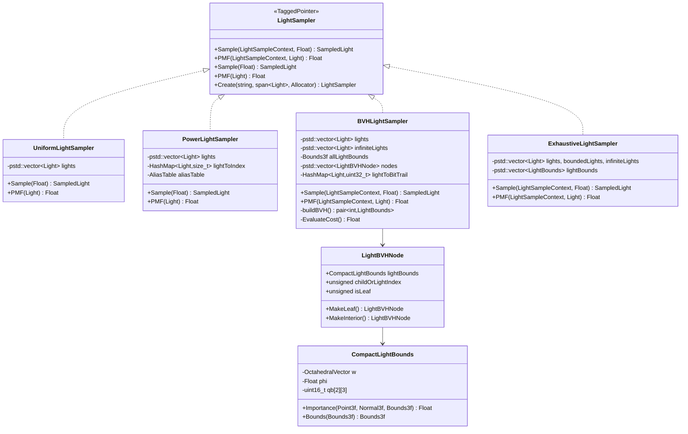
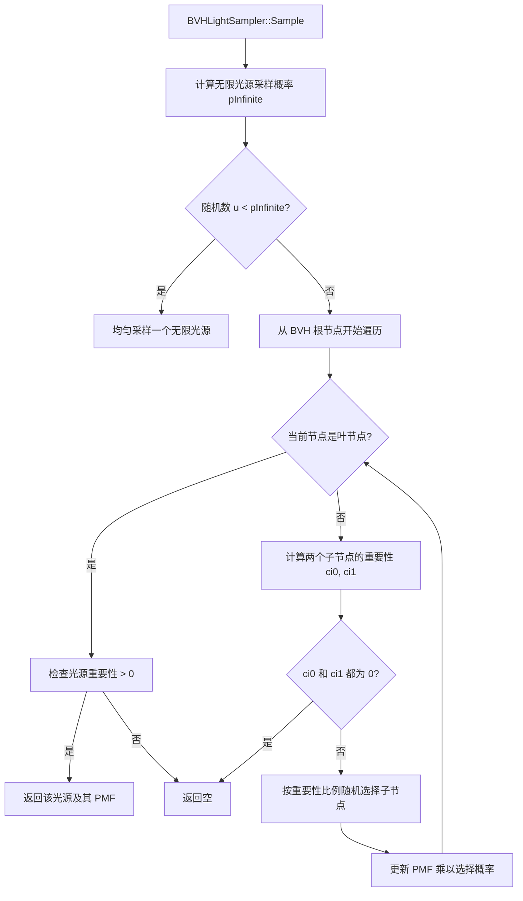

# lightsamplers.h / lightsamplers.cpp

## 概述
该文件实现了 PBRT-v4 中的光源采样器，负责在渲染过程中高效地从场景中多个光源中选择一个进行采样。文件提供了四种光源采样策略：均匀采样、基于功率的采样、基于 BVH 的空间自适应采样和穷举采样。BVH 光源采样器是默认策略，它利用光源的空间边界和方向信息构建层次加速结构，根据着色点的位置和法线对光源进行重要性采样。

## 主要类与接口
| 类/结构体/函数 | 说明 |
|---|---|
| `UniformLightSampler` | 均匀光源采样器，以等概率从所有光源中随机选择一个，最简单但效率最低 |
| `PowerLightSampler` | 功率光源采样器，根据每个光源的总辐射功率按比例采样，使用别名表（AliasTable）实现 O(1) 采样 |
| `BVHLightSampler` | BVH 光源采样器（默认），将有界光源构建为二叉 BVH 树，根据着色点位置和法线估算每个光源的重要性，自顶向下遍历选择光源；无限光源单独处理 |
| `ExhaustiveLightSampler` | 穷举光源采样器，遍历所有光源计算重要性后用加权水库采样选择，结果最准确但计算量大 |
| `CompactLightBounds` | 光源边界的紧凑表示，使用量化存储减少内存占用，包含量化的包围盒、方向和角度信息 |
| `LightBVHNode` | BVH 树节点，可以是叶节点（存储光源索引）或内部节点（存储子节点索引），对齐到 32 字节 |
| `LightSampler::Create()` | 工厂方法，根据名称（"uniform"/"power"/"bvh"/"exhaustive"）创建对应的采样器 |

## 架构图

## 算法流程图

## 依赖关系
- **依赖**：`pbrt/base/light.h`、`pbrt/base/lightsampler.h`、`pbrt/lights.h`（使用 `LightBounds`）、`pbrt/util/containers.h`、`pbrt/util/hash.h`、`pbrt/util/sampling.h`、`pbrt/util/vecmath.h`、`pbrt/interaction.h`
- **被依赖**：`wavefront/workitems.h`、`wavefront/subsurface.cpp`、`wavefront/integrator.cpp`、`cpu/integrators.h`、`lightsamplers_test.cpp`
