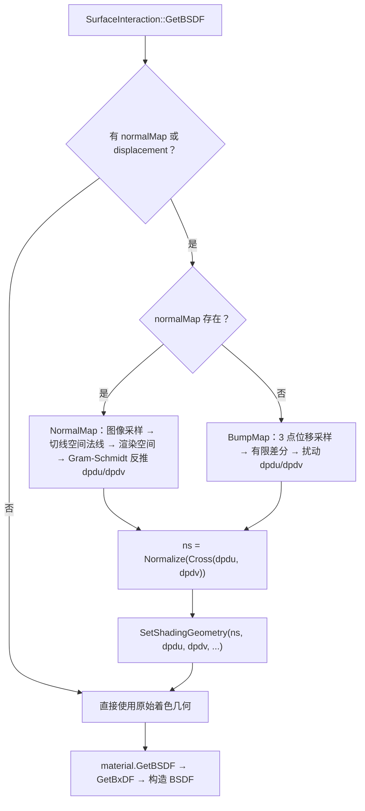
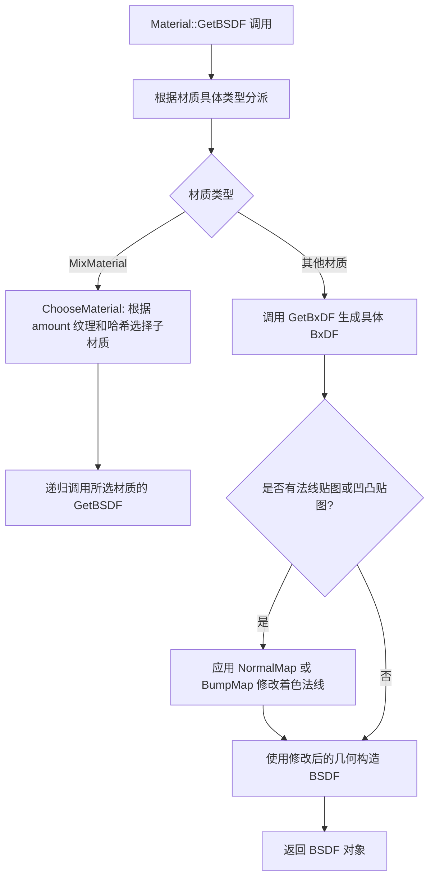

# materials.h / materials.cpp

## 概述
该文件实现了 PBRT-v4 渲染器中所有具体的材质类型，是表面着色系统的核心模块。每种材质类型通过 `GetBxDF()` 方法生成对应的双向散射分布函数（BxDF），用于描述光线在物体表面的反射和透射特性。文件还提供了法线贴图（NormalMap）和凹凸贴图（BumpMap）的实现，以及材质评估上下文（MaterialEvalContext）等辅助结构。所有材质均支持 CPU 和 GPU 双端执行。

## 主要类与接口
| 类/结构体/函数 | 说明 |
|---|---|
| `MaterialEvalContext` | 材质评估上下文，继承自 `TextureEvalContext`，额外包含出射方向 `wo`、着色法线 `ns` 和着色 `dpdu` |
| `NormalBumpEvalContext` | 法线/凹凸贴图评估上下文，包含完整的微分几何信息（位置、UV、法线、偏导数等） |
| `NormalMap()` | 法线贴图函数，从法线贴图图像读取切线空间法线并变换到渲染空间 |
| `BumpMap()` | 凹凸贴图模板函数，通过位移纹理的有限差分计算扰动后的微分几何 |
| `DielectricMaterial` | 电介质材质，支持各向异性粗糙度的 Trowbridge-Reitz 微表面分布，产生 `DielectricBxDF` |
| `ThinDielectricMaterial` | 薄电介质材质，模拟无厚度的玻璃薄片，产生 `ThinDielectricBxDF` |
| `DiffuseMaterial` | 漫反射材质，产生 `DiffuseBxDF`，最基本的 Lambertian 反射 |
| `ConductorMaterial` | 导体材质，使用复折射率 (eta, k) 或反射率参数，支持各向异性粗糙度 |
| `CoatedDiffuseMaterial` | 涂层漫反射材质，模拟电介质涂层下的漫反射基底，使用分层 BxDF 模型 |
| `CoatedConductorMaterial` | 涂层导体材质，模拟电介质涂层下的导体基底，支持独立的界面和导体粗糙度 |
| `SubsurfaceMaterial` | 次表面散射材质，结合电介质 BxDF 和 `TabulatedBSSRDF` 实现皮肤、牛奶等半透明效果 |
| `DiffuseTransmissionMaterial` | 漫反射透射材质，同时支持反射和透射，适用于树叶等薄片物体 |
| `HairMaterial` | 毛发材质，使用 Marschner 毛发模型，支持黑色素浓度、颜色和散射系数等多种参数化方式 |
| `MeasuredMaterial` | 测量材质，使用实测 BRDF 数据文件 |
| `MixMaterial` | 混合材质，根据 `amount` 纹理在两个子材质之间随机选择，使用哈希实现无偏混合 |
| `Material::GetBSDF()` | 分派方法，将具体材质的 BxDF 包装为 BSDF 对象 |
| `Material::GetBSSRDF()` | 分派方法，获取材质的次表面散射函数（如果支持） |
| `Material::Create()` | 工厂方法，根据名称字符串创建对应的材质实例 |

## 架构图

```mermaid
classDiagram
    class Material {
        <<TaggedPointer>>
        +GetBSDF(TextureEvaluator, MaterialEvalContext, SampledWavelengths, ScratchBuffer) BSDF
        +GetBSSRDF() BSSRDF
        +CanEvaluateTextures() bool
        +HasSubsurfaceScattering() bool
        +GetDisplacement() FloatTexture
        +GetNormalMap() Image*
        +Create(string, ...) Material
    }
    class DiffuseMaterial {
        -SpectrumTexture reflectance
        +GetBxDF() DiffuseBxDF
    }
    class DielectricMaterial {
        -Spectrum eta
        -FloatTexture uRoughness, vRoughness
        +GetBxDF() DielectricBxDF
    }
    class ConductorMaterial {
        -SpectrumTexture eta, k, reflectance
        -FloatTexture uRoughness, vRoughness
        +GetBxDF() ConductorBxDF
    }
    class CoatedDiffuseMaterial {
        -SpectrumTexture reflectance, albedo
        -Spectrum eta
        +GetBxDF() CoatedDiffuseBxDF
    }
    class CoatedConductorMaterial {
        -Spectrum interfaceEta
        -SpectrumTexture conductorEta, k
        +GetBxDF() CoatedConductorBxDF
    }
    class SubsurfaceMaterial {
        -BSSRDFTable table
        -Float eta
        +GetBxDF() DielectricBxDF
        +GetBSSRDF() TabulatedBSSRDF
    }
    class MixMaterial {
        -Material materials[2]
        -FloatTexture amount
        +ChooseMaterial() Material
    }
    class HairMaterial {
        -SpectrumTexture sigma_a, color
        +GetBxDF() HairBxDF
    }
    class ThinDielectricMaterial {
        -Spectrum eta
        +GetBxDF() ThinDielectricBxDF
    }
    class DiffuseTransmissionMaterial {
        -SpectrumTexture reflectance, transmittance
        +GetBxDF() DiffuseTransmissionBxDF
    }
    class MeasuredMaterial {
        -MeasuredBxDFData* brdf
        +GetBxDF() MeasuredBxDF
    }

    Material <|.. DiffuseMaterial
    Material <|.. DielectricMaterial
    Material <|.. ConductorMaterial
    Material <|.. CoatedDiffuseMaterial
    Material <|.. CoatedConductorMaterial
    Material <|.. SubsurfaceMaterial
    Material <|.. MixMaterial
    Material <|.. HairMaterial
    Material <|.. ThinDielectricMaterial
    Material <|.. DiffuseTransmissionMaterial
    Material <|.. MeasuredMaterial
```


## dpdu 与 dpdv 的含义与作用

`dpdu` 和 `dpdv` 是表面位置 p(u,v) 对参数 u、v 的偏导数，即 `∂p/∂u` 和 `∂p/∂v`。它们都躺在表面的切平面上，但**不一定正交，也不一定是单位长度**（取决于 UV 映射的拉伸情况）。它们同时编码了**方向**和**尺度**，是连接参数空间 (u,v) 和世界空间的桥梁。

### 1. 定义着色法线

```
ns = Normalize(Cross(dpdu, dpdv))
```

这是最直接的作用。改变 dpdu/dpdv 就改变了着色法线，所以 NormalMap 和 BumpMap 都通过修改它们来实现法线扰动。

### 2. 纹理过滤（MIP 映射选级）

dpdu/dpdv 的长度携带了 UV 空间和世界空间之间的缩放关系。配合光线微分 `(dudx, dudy, dvdx, dvdy)`，渲染器能计算出一个像素在纹理空间中覆盖多大的面积（纹理 footprint）：

```
像素在世界空间的微分 (dpdx, dpdy)
        ↓  通过 dpdu, dpdv 的逆映射
像素在 UV 空间的微分 (dudx, dudy, dvdx, dvdy)
        ↓
纹理查找时选择合适的 MIP 级别，避免走样
```

如果一个像素覆盖了纹理上 8×8 的区域，就应该用更模糊的 MIP 级别；覆盖 1×1 就用最精细的。dpdu/dpdv 的长度直接决定了这个映射比例。

### 3. 各向异性 BxDF 的方向参考

对于各向异性材质（如拉丝金属、光盘），BxDF 需要知道"哪个方向是 u，哪个是 v"来区分不同方向的粗糙度。BSDF 构造时接收 dpdu 作为参考方向，在 BxDF 内部通过这个方向区分 `uRoughness` 和 `vRoughness`：

```
dpdu 方向 → 对应 uRoughness（如拉丝方向）
dpdv 方向 → 对应 vRoughness（垂直于拉丝方向）
```

如果 `uRoughness ≠ vRoughness`，光的反射会沿 dpdu 方向拉伸——这就是各向异性高光的来源。

### dpdu/dpdv 与切线空间的关系

dpdu/dpdv **不等于**切线空间的 X/Y 轴。在 NormalMap 实现中（`materials.h:98`），正交的切线空间基是这样构建的：

```cpp
Frame frame = Frame::FromXZ(Normalize(shading.dpdu), Vector3f(shading.n));
```

| 切线空间轴 | 对应 | 说明 |
|---|---|---|
| X (tangent) | `Normalize(dpdu)` | dpdu 的方向，归一化 |
| Y (bitangent) | `Cross(n, Normalize(dpdu))` | 由叉积推导，**不是** dpdv |
| Z (normal) | `shading.n` | 着色法线 |

dpdu 只提供了 X 轴的**方向**，Y 轴通过叉积保证正交。dpdv 本身不参与切线空间构建，但它的长度被保留用于纹理过滤。

---

## NormalMap 与 BumpMap 详解

NormalMap 和 BumpMap 都用于在不改变几何形状的前提下为表面添加细节，但它们的工作原理完全不同。两者的共同点是：**输出都是修改后的 dpdu 和 dpdv**（着色偏导数），进而改变着色法线 `ns = Normalize(Cross(dpdu, dpdv))`。

### 调用时机

在 `interaction.cpp:175-188` 中，NormalMap 和 BumpMap 在 GetBxDF **之前**执行，修改 `SurfaceInteraction` 的着色几何：

```cpp
FloatTexture displacement = material.GetDisplacement();
const Image *normalMap = material.GetNormalMap();
if (displacement || normalMap) {
    Vector3f dpdu, dpdv;
    if (normalMap)
        NormalMap(*normalMap, *this, &dpdu, &dpdv);    // 优先使用法线贴图
    else
        BumpMap(texEval, displacement, *this, &dpdu, &dpdv);
    Normal3f ns(Normalize(Cross(dpdu, dpdv)));
    SetShadingGeometry(ns, dpdu, dpdv, shading.dndu, shading.dndv, false);
}
```

两者**互斥**——如果材质同时指定了 normalMap 和 displacement，只使用 normalMap。

---

### NormalMap（法线贴图）

**输入**：一张 RGB 图像，每个像素存储切线空间的法线方向

**原理**：直接从图像读取目标法线，不需要任何数值微分。

**实现步骤**（`materials.h:86-105`）：

```
① 采样图像（双线性插值，V 轴翻转，Repeat 环绕）
   uv = (ctx.uv[0], 1 - ctx.uv[1])
   ns_tangent = 2 × RGB - 1       // [0,1] → [-1,1]
   ns_tangent = Normalize(ns_tangent)

② 切线空间 → 渲染空间
   frame = Frame::FromXZ(Normalize(shading.dpdu), shading.n)
   ns_render = frame.FromLocal(ns_tangent)

③ 反推 dpdu / dpdv（Gram-Schmidt 正交化）
   dpdu = Normalize(GramSchmidt(shading.dpdu, ns_render)) × |shading.dpdu|
   dpdv = Normalize(Cross(ns_render, dpdu)) × |shading.dpdv|
```

**关键点**：
- 第 ③ 步的目的是让 `Cross(dpdu, dpdv)` 恰好等于 `ns_render`，同时保留原始 dpdu/dpdv 的长度
- V 轴翻转（`1 - ctx.uv[1]`）是因为图像坐标系 Y 轴向下，而 UV 坐标系 V 轴向上

---

### BumpMap（凹凸贴图）

#### 什么是 displacement（位移纹理）

`displacement` 是一个 `FloatTexture`——对表面上任意一点返回一个标量浮点数，表示该点沿法线方向的高度偏移量。它可以是：
- 一张灰度高度图（黑=凹，白=凸）
- 程序化纹理（如噪声函数生成的起伏）
- 任何返回 float 的纹理对象

每种材质可以可选地持有它：

```cpp
class DielectricMaterial {
    FloatTexture displacement;   // 可选，为 null 时不做 bump mapping
    ...
};
```

**注意**：BumpMap 并不真的移动几何体——它只用位移纹理的变化率修改着色法线，让表面**看起来**有凹凸，但实际的几何轮廓线仍然是光滑的。

#### 数学推导

假设表面每一点沿法线偏移 $d(u,v)$ 的高度，位移后的虚拟表面为：

```
p'(u,v) = p(u,v) + d(u,v) · n(u,v)
```

对 u 求偏导（乘法法则）：

```
∂p'/∂u = ∂p/∂u + ∂d/∂u · n(u,v) + d(u,v) · ∂n/∂u
```

用 pbrt 中的变量名替换：

```
dpdu' = dpdu + (∂d/∂u) · n + d · dndu
         ^^^^   ^^^^^^^^       ^^^^^^^^
         原始    高度沿u的      高度×法线
         切线    变化率×法线    沿u的变化率
```

同理对 v：

```
dpdv' = dpdv + (∂d/∂v) · n + d · dndv
```

其中 `∂d/∂u` 和 `∂d/∂v` 无法解析求得（d 是任意纹理），所以用**有限差分**近似。

#### 实现步骤（`materials.h:109-138`）

**第一步：计算有限差分步长**

```cpp
Float du = .5f * (std::abs(ctx.dudx) + std::abs(ctx.dudy));
if (du == 0) du = .0005f;
Float dv = .5f * (std::abs(ctx.dvdx) + std::abs(ctx.dvdy));
if (dv == 0) dv = .0005f;
```

- `dudx`、`dudy` 是 u 参数相对于屏幕像素 x、y 的微分（由光线微分计算得到）
- 取它们绝对值的均值作为步长，意义是"一个像素在 u 方向大约跨越多少"
- 步长为 0 时（例如没有光线微分），回退到固定值 0.0005

**第二步：在三个点采样位移纹理**

```cpp
// 在 u 方向偏移一个步长的位置采样
shiftedCtx.p  = ctx.p + du * ctx.shading.dpdu;
shiftedCtx.uv = ctx.uv + Vector2f(du, 0.f);
Float uDisplace = texEval(displacement, shiftedCtx);

// 在 v 方向偏移一个步长的位置采样
shiftedCtx.p  = ctx.p + dv * ctx.shading.dpdv;
shiftedCtx.uv = ctx.uv + Vector2f(0.f, dv);
Float vDisplace = texEval(displacement, shiftedCtx);

// 在当前点采样
Float displace = texEval(displacement, ctx);
```

三次采样的几何关系：

```
        vDisplace
           ●  (p + dv·dpdv, uv+(0,dv))
           |
           |dv
           |
displace ●————————● uDisplace
  (p, uv)    du    (p + du·dpdu, uv+(du,0))
```

**第三步：有限差分代入公式**

```cpp
*dpdu = ctx.shading.dpdu
      + (uDisplace - displace) / du * Vector3f(ctx.shading.n)
      + displace * Vector3f(ctx.shading.dndu);

*dpdv = ctx.shading.dpdv
      + (vDisplace - displace) / dv * Vector3f(ctx.shading.n)
      + displace * Vector3f(ctx.shading.dndv);
```

对应数学公式的三项：

| 项 | 代码 | 含义 |
|---|---|---|
| `∂p/∂u` | `ctx.shading.dpdu` | 原始表面的切线方向 |
| `(∂d/∂u)·n` | `(uDisplace - displace) / du * n` | 高度变化率 × 法线：产生"倾斜"效果 |
| `d·(∂n/∂u)` | `displace * dndu` | 高度 × 法线变化率：曲面弯曲处的校正项 |

第二项是主要项——位移纹理变化越剧烈（uDisplace 和 displace 差异越大），法线偏转越大。第三项是二阶校正，在平面上 dndu=0 时不起作用，只在曲面上有贡献。

---

### 对比

| | **NormalMap** | **BumpMap** |
|---|---|---|
| **输入数据** | RGB 图像（切线空间法线） | 标量浮点纹理（位移高度） |
| **工作方式** | 直接读取目标法线 | 数值微分推算法线偏移 |
| **精度** | 精确（法线直接存储） | 近似（有限差分，依赖步长选择） |
| **表达能力** | 只能改变法线方向 | 概念上表示真实的几何位移 |
| **额外计算** | 1 次图像采样 + 坐标变换 | 3 次纹理求值 + 有限差分 |
| **常见来源** | 高模烘焙、建模软件导出 | 程序化纹理、高度图 |
| **优先级** | 高（两者同时存在时优先使用） | 低 |

两者最终都输出修改后的 `(dpdu, dpdv)`，然后由 `SetShadingGeometry` 更新着色法线。后续的 BxDF 评估完全不感知法线是如何被修改的。

### 流程图



## 算法流程图


## 依赖关系
- **依赖**：`pbrt/base/bssrdf.h`、`pbrt/base/material.h`、`pbrt/bsdf.h`、`pbrt/bssrdf.h`、`pbrt/interaction.h`、`pbrt/textures.h`、`pbrt/util/spectrum.h`、`pbrt/util/transform.h`、`pbrt/paramdict.h`、`pbrt/media.h`
- **被依赖**：`scene.cpp`、`interaction.cpp`、`cpu/integrators.cpp`、`cpu/integrators_test.cpp`、`cpu/primitive.cpp`、`cpu/render.cpp`、`wavefront/workitems.h`、`wavefront/surfscatter.cpp`、`wavefront/aggregate.h`、`wavefront/aggregate.cpp`、`gpu/optix/optix.cu`、`gpu/optix/aggregate.cpp`
