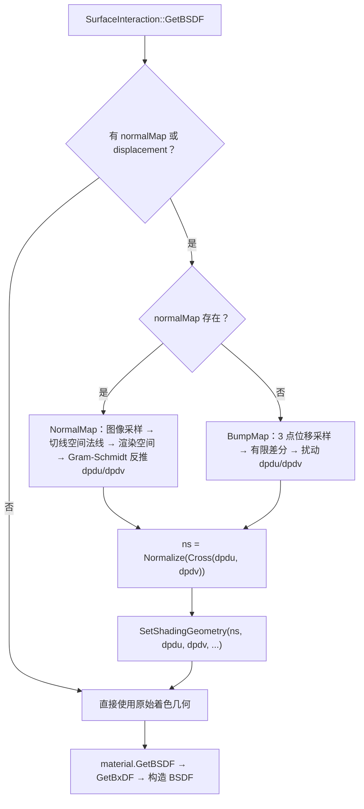
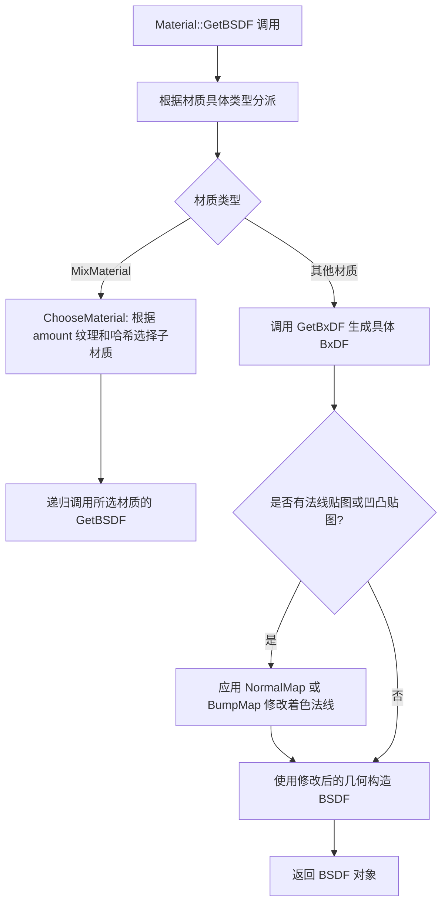
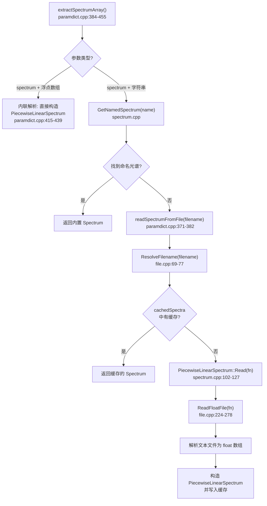

# materials.h / materials.cpp

## 概述
该文件实现了 PBRT-v4 渲染器中所有具体的材质类型，是表面着色系统的核心模块。每种材质类型通过 `GetBxDF()` 方法生成对应的双向散射分布函数（BxDF），用于描述光线在物体表面的反射和透射特性。文件还提供了法线贴图（NormalMap）和凹凸贴图（BumpMap）的实现，以及材质评估上下文（MaterialEvalContext）等辅助结构。所有材质均支持 CPU 和 GPU 双端执行。

## 主要类与接口
| 类/结构体/函数 | 说明 |
|---|---|
| `MaterialEvalContext` | 材质评估上下文，继承自 `TextureEvalContext`，额外包含出射方向 `wo`、着色法线 `ns` 和着色 `dpdu` |
| `NormalBumpEvalContext` | 法线/凹凸贴图评估上下文，包含完整的微分几何信息（位置、UV、法线、偏导数等） |
| `NormalMap()` | 法线贴图函数，从法线贴图图像读取切线空间法线并变换到渲染空间 |
| `BumpMap()` | 凹凸贴图模板函数，通过位移纹理的有限差分计算扰动后的微分几何 |
| `DielectricMaterial` | 电介质材质，支持各向异性粗糙度的 Trowbridge-Reitz 微表面分布，产生 `DielectricBxDF` |
| `ThinDielectricMaterial` | 薄电介质材质，模拟无厚度的玻璃薄片，产生 `ThinDielectricBxDF` |
| `DiffuseMaterial` | 漫反射材质，产生 `DiffuseBxDF`，最基本的 Lambertian 反射 |
| `ConductorMaterial` | 导体材质，使用复折射率 (eta, k) 或反射率参数，支持各向异性粗糙度 |
| `CoatedDiffuseMaterial` | 涂层漫反射材质，模拟电介质涂层下的漫反射基底，使用分层 BxDF 模型 |
| `CoatedConductorMaterial` | 涂层导体材质，模拟电介质涂层下的导体基底，支持独立的界面和导体粗糙度 |
| `SubsurfaceMaterial` | 次表面散射材质，结合电介质 BxDF 和 `TabulatedBSSRDF` 实现皮肤、牛奶等半透明效果 |
| `DiffuseTransmissionMaterial` | 漫反射透射材质，同时支持反射和透射，适用于树叶等薄片物体 |
| `HairMaterial` | 毛发材质，使用 Marschner 毛发模型，支持黑色素浓度、颜色和散射系数等多种参数化方式 |
| `MeasuredMaterial` | 测量材质，使用实测 BRDF 数据文件 |
| `MixMaterial` | 混合材质，根据 `amount` 纹理在两个子材质之间随机选择，使用哈希实现无偏混合 |
| `Material::GetBSDF()` | 分派方法，将具体材质的 BxDF 包装为 BSDF 对象 |
| `Material::GetBSSRDF()` | 分派方法，获取材质的次表面散射函数（如果支持） |
| `Material::Create()` | 工厂方法，根据名称字符串创建对应的材质实例 |

## 架构图


## dpdu 与 dpdv 的含义与作用

`dpdu` 和 `dpdv` 是表面位置 p(u,v) 对参数 u、v 的偏导数，即 `∂p/∂u` 和 `∂p/∂v`。它们都躺在表面的切平面上，但**不一定正交，也不一定是单位长度**（取决于 UV 映射的拉伸情况）。它们同时编码了**方向**和**尺度**，是连接参数空间 (u,v) 和世界空间的桥梁。

### 1. 定义着色法线

```
ns = Normalize(Cross(dpdu, dpdv))
```

这是最直接的作用。改变 dpdu/dpdv 就改变了着色法线，所以 NormalMap 和 BumpMap 都通过修改它们来实现法线扰动。

### 2. 纹理过滤（MIP 映射选级）

dpdu/dpdv 的长度携带了 UV 空间和世界空间之间的缩放关系。配合光线微分 `(dudx, dudy, dvdx, dvdy)`，渲染器能计算出一个像素在纹理空间中覆盖多大的面积（纹理 footprint）：

```
像素在世界空间的微分 (dpdx, dpdy)
        ↓  通过 dpdu, dpdv 的逆映射
像素在 UV 空间的微分 (dudx, dudy, dvdx, dvdy)
        ↓
纹理查找时选择合适的 MIP 级别，避免走样
```

如果一个像素覆盖了纹理上 8×8 的区域，就应该用更模糊的 MIP 级别；覆盖 1×1 就用最精细的。dpdu/dpdv 的长度直接决定了这个映射比例。

### 3. 各向异性 BxDF 的方向参考

对于各向异性材质（如拉丝金属、光盘），BxDF 需要知道"哪个方向是 u，哪个是 v"来区分不同方向的粗糙度。BSDF 构造时接收 dpdu 作为参考方向，在 BxDF 内部通过这个方向区分 `uRoughness` 和 `vRoughness`：

```
dpdu 方向 → 对应 uRoughness（如拉丝方向）
dpdv 方向 → 对应 vRoughness（垂直于拉丝方向）
```

如果 `uRoughness ≠ vRoughness`，光的反射会沿 dpdu 方向拉伸——这就是各向异性高光的来源。

### dpdu/dpdv 与切线空间的关系

dpdu/dpdv **不等于**切线空间的 X/Y 轴。在 NormalMap 实现中（`materials.h:98`），正交的切线空间基是这样构建的：

```cpp
Frame frame = Frame::FromXZ(Normalize(shading.dpdu), Vector3f(shading.n));
```

| 切线空间轴 | 对应 | 说明 |
|---|---|---|
| X (tangent) | `Normalize(dpdu)` | dpdu 的方向，归一化 |
| Y (bitangent) | `Cross(n, Normalize(dpdu))` | 由叉积推导，**不是** dpdv |
| Z (normal) | `shading.n` | 着色法线 |

dpdu 只提供了 X 轴的**方向**，Y 轴通过叉积保证正交。dpdv 本身不参与切线空间构建，但它的长度被保留用于纹理过滤。

---

## NormalMap 与 BumpMap 详解

NormalMap 和 BumpMap 都用于在不改变几何形状的前提下为表面添加细节，但它们的工作原理完全不同。两者的共同点是：**输出都是修改后的 dpdu 和 dpdv**（着色偏导数），进而改变着色法线 `ns = Normalize(Cross(dpdu, dpdv))`。

### 调用时机

在 `interaction.cpp:175-188` 中，NormalMap 和 BumpMap 在 GetBxDF **之前**执行，修改 `SurfaceInteraction` 的着色几何：

```cpp
FloatTexture displacement = material.GetDisplacement();
const Image *normalMap = material.GetNormalMap();
if (displacement || normalMap) {
    Vector3f dpdu, dpdv;
    if (normalMap)
        NormalMap(*normalMap, *this, &dpdu, &dpdv);    // 优先使用法线贴图
    else
        BumpMap(texEval, displacement, *this, &dpdu, &dpdv);
    Normal3f ns(Normalize(Cross(dpdu, dpdv)));
    SetShadingGeometry(ns, dpdu, dpdv, shading.dndu, shading.dndv, false);
}
```

两者**互斥**——如果材质同时指定了 normalMap 和 displacement，只使用 normalMap。

---

### NormalMap（法线贴图）

**输入**：一张 RGB 图像，每个像素存储切线空间的法线方向

**原理**：直接从图像读取目标法线，不需要任何数值微分。

**实现步骤**（`materials.h:86-105`）：

```
① 采样图像（双线性插值，V 轴翻转，Repeat 环绕）
   uv = (ctx.uv[0], 1 - ctx.uv[1])
   ns_tangent = 2 × RGB - 1       // [0,1] → [-1,1]
   ns_tangent = Normalize(ns_tangent)

② 切线空间 → 渲染空间
   frame = Frame::FromXZ(Normalize(shading.dpdu), shading.n)
   ns_render = frame.FromLocal(ns_tangent)

③ 反推 dpdu / dpdv（Gram-Schmidt 正交化）
   dpdu = Normalize(GramSchmidt(shading.dpdu, ns_render)) × |shading.dpdu|
   dpdv = Normalize(Cross(ns_render, dpdu)) × |shading.dpdv|
```

**关键点**：
- 第 ③ 步的目的是让 `Cross(dpdu, dpdv)` 恰好等于 `ns_render`，同时保留原始 dpdu/dpdv 的长度
- V 轴翻转（`1 - ctx.uv[1]`）是因为图像坐标系 Y 轴向下，而 UV 坐标系 V 轴向上

---

### BumpMap（凹凸贴图）

#### 什么是 displacement（位移纹理）

`displacement` 是一个 `FloatTexture`——对表面上任意一点返回一个标量浮点数，表示该点沿法线方向的高度偏移量。它可以是：
- 一张灰度高度图（黑=凹，白=凸）
- 程序化纹理（如噪声函数生成的起伏）
- 任何返回 float 的纹理对象

每种材质可以可选地持有它：

```cpp
class DielectricMaterial {
    FloatTexture displacement;   // 可选，为 null 时不做 bump mapping
    ...
};
```

**注意**：BumpMap 并不真的移动几何体——它只用位移纹理的变化率修改着色法线，让表面**看起来**有凹凸，但实际的几何轮廓线仍然是光滑的。

#### 数学推导

假设表面每一点沿法线偏移 $d(u,v)$ 的高度，位移后的虚拟表面为：

```
p'(u,v) = p(u,v) + d(u,v) · n(u,v)
```

对 u 求偏导（乘法法则）：

```
∂p'/∂u = ∂p/∂u + ∂d/∂u · n(u,v) + d(u,v) · ∂n/∂u
```

用 pbrt 中的变量名替换：

```
dpdu' = dpdu + (∂d/∂u) · n + d · dndu
         ^^^^   ^^^^^^^^       ^^^^^^^^
         原始    高度沿u的      高度×法线
         切线    变化率×法线    沿u的变化率
```

同理对 v：

```
dpdv' = dpdv + (∂d/∂v) · n + d · dndv
```

其中 `∂d/∂u` 和 `∂d/∂v` 无法解析求得（d 是任意纹理），所以用**有限差分**近似。

#### 实现步骤（`materials.h:109-138`）

**第一步：计算有限差分步长**

```cpp
Float du = .5f * (std::abs(ctx.dudx) + std::abs(ctx.dudy));
if (du == 0) du = .0005f;
Float dv = .5f * (std::abs(ctx.dvdx) + std::abs(ctx.dvdy));
if (dv == 0) dv = .0005f;
```

- `dudx`、`dudy` 是 u 参数相对于屏幕像素 x、y 的微分（由光线微分计算得到）
- 取它们绝对值的均值作为步长，意义是"一个像素在 u 方向大约跨越多少"
- 步长为 0 时（例如没有光线微分），回退到固定值 0.0005

**第二步：在三个点采样位移纹理**

```cpp
// 在 u 方向偏移一个步长的位置采样
shiftedCtx.p  = ctx.p + du * ctx.shading.dpdu;
shiftedCtx.uv = ctx.uv + Vector2f(du, 0.f);
Float uDisplace = texEval(displacement, shiftedCtx);

// 在 v 方向偏移一个步长的位置采样
shiftedCtx.p  = ctx.p + dv * ctx.shading.dpdv;
shiftedCtx.uv = ctx.uv + Vector2f(0.f, dv);
Float vDisplace = texEval(displacement, shiftedCtx);

// 在当前点采样
Float displace = texEval(displacement, ctx);
```

三次采样的几何关系：

```
        vDisplace
           ●  (p + dv·dpdv, uv+(0,dv))
           |
           |dv
           |
displace ●————————● uDisplace
  (p, uv)    du    (p + du·dpdu, uv+(du,0))
```

**第三步：有限差分代入公式**

```cpp
*dpdu = ctx.shading.dpdu
      + (uDisplace - displace) / du * Vector3f(ctx.shading.n)
      + displace * Vector3f(ctx.shading.dndu);

*dpdv = ctx.shading.dpdv
      + (vDisplace - displace) / dv * Vector3f(ctx.shading.n)
      + displace * Vector3f(ctx.shading.dndv);
```

对应数学公式的三项：

| 项 | 代码 | 含义 |
|---|---|---|
| `∂p/∂u` | `ctx.shading.dpdu` | 原始表面的切线方向 |
| `(∂d/∂u)·n` | `(uDisplace - displace) / du * n` | 高度变化率 × 法线：产生"倾斜"效果 |
| `d·(∂n/∂u)` | `displace * dndu` | 高度 × 法线变化率：曲面弯曲处的校正项 |

第二项是主要项——位移纹理变化越剧烈（uDisplace 和 displace 差异越大），法线偏转越大。第三项是二阶校正，在平面上 dndu=0 时不起作用，只在曲面上有贡献。

---

### 对比

| | **NormalMap** | **BumpMap** |
|---|---|---|
| **输入数据** | RGB 图像（切线空间法线） | 标量浮点纹理（位移高度） |
| **工作方式** | 直接读取目标法线 | 数值微分推算法线偏移 |
| **精度** | 精确（法线直接存储） | 近似（有限差分，依赖步长选择） |
| **表达能力** | 只能改变法线方向 | 概念上表示真实的几何位移 |
| **额外计算** | 1 次图像采样 + 坐标变换 | 3 次纹理求值 + 有限差分 |
| **常见来源** | 高模烘焙、建模软件导出 | 程序化纹理、高度图 |
| **优先级** | 高（两者同时存在时优先使用） | 低 |

两者最终都输出修改后的 `(dpdu, dpdv)`，然后由 `SetShadingGeometry` 更新着色法线。后续的 BxDF 评估完全不感知法线是如何被修改的。

### 流程图



## 算法流程图


## 真实材质的光谱数据支持

pbrt-v4 是一个光谱渲染器（spectral renderer），完整支持使用真实材质的光谱响应函数进行渲染。金属的复折射率、玻璃的色散曲线、钻石的折射率等均可通过光谱数据精确描述，而非简单的 RGB 近似。

### 1. 材质的光谱参数接口

以下材质类型接受波长相关的光谱参数：

| 材质类型 | 光谱参数 | 类型 | 说明 | 源码位置 |
|---|---|---|---|---|
| `ConductorMaterial` | `eta`、`k` | `SpectrumTexture` | 复折射率实部和消光系数；也可用 `reflectance` 替代 | `materials.h:478-539` |
| `DielectricMaterial` | `eta` | `Spectrum` | 折射率；非 `ConstantSpectrum` 时触发色散（调用 `lambda.TerminateSecondary()`） | `materials.h:182-211` |
| `CoatedConductorMaterial` | `conductorEta`、`k`、`interfaceEta` | `SpectrumTexture` / `Spectrum` | 涂层界面折射率 + 导体基底的复折射率 | `materials.h:619-693` |
| `SubsurfaceMaterial` | `sigma_a`、`sigma_s` | `SpectrumTexture` | 吸收系数和散射系数，均为光谱量 | `materials.h:696-775` |

**色散触发条件**：对于 `DielectricMaterial`，当 `eta` 不是 `ConstantSpectrum`（即折射率随波长变化）时，`GetBxDF()` 会调用 `lambda.TerminateSecondary()` 终止辅助波长的路径追踪，确保每条光线只追踪单一波长，从而正确模拟色散效果（如棱镜分光、钻石火彩）。

### 2. 内置光谱数据库

pbrt-v4 通过 `GetNamedSpectrum()` 函数（`util/spectrum.cpp:2825-2829`）提供命名光谱查询。所有内置光谱数据均为实测光学常数，使用 `PiecewiseLinearSpectrum`（分段线性插值）存储。

**金属光学常数**（复折射率 eta + 消光系数 k）：

| 材料 | eta 名称 | k 名称 | 说明 |
|---|---|---|---|
| 银 (Ag) | `metal-Ag-eta` | `metal-Ag-k` | 高反射率金属 |
| 铝 (Al) | `metal-Al-eta` | `metal-Al-k` | 常见反射涂层 |
| 金 (Au) | `metal-Au-eta` | `metal-Au-k` | 选择性吸收产生金色 |
| 铜 (Cu) | `metal-Cu-eta` | `metal-Cu-k` | **ConductorMaterial 的默认值** |
| 黄铜 (CuZn) | `metal-CuZn-eta` | `metal-CuZn-k` | 铜锌合金 |
| 氧化镁 (MgO) | `metal-MgO-eta` | `metal-MgO-k` | 陶瓷/光学材料 |
| 二氧化钛 (TiO2) | `metal-TiO2-eta` | `metal-TiO2-k` | 白色颜料/光催化剂 |

**光学玻璃**（折射率 eta，用于 DielectricMaterial 的色散渲染）：

| 玻璃类型 | 命名光谱 | 典型用途 |
|---|---|---|
| BK7 | `glass-BK7` | 最常用的冕牌玻璃 |
| BAF10 | `glass-BAF10` | 重钡火石玻璃 |
| FK51A | `glass-FK51A` | 低色散氟冕玻璃 |
| LASF9 | `glass-LASF9` | 高折射率镧系玻璃 |
| F5 | `glass-F5` | 火石玻璃 |
| F10 | `glass-F10` | 火石玻璃 |
| F11 | `glass-F11` | 火石玻璃 |

**标准光源光谱**（用于光源定义）：

| 类别 | 命名光谱 |
|---|---|
| CIE 标准光源 | `stdillum-A`、`stdillum-D50`、`stdillum-D65` |
| CIE 荧光灯 | `stdillum-F1` ~ `stdillum-F12` |
| ACES D60 | `illum-acesD60` |

此外还内置了多款相机传感器的 RGB 光谱响应曲线（Canon EOS 系列、Nikon D810/D850、Sony ILCE 系列、Hasselblad L1D-20c 等）。

### 3. 自定义光谱数据加载

pbrt-v4 支持三种方式指定光谱数据：

**方式一：使用命名光谱**

在场景文件中直接引用内置的命名光谱：

```
"spectrum eta" "metal-Au-eta"
"spectrum k"   "metal-Au-k"
```

**方式二：内联波长-值对**

在场景文件中直接写入波长（nm）和对应值的交替序列：

```
"spectrum eta" [ 400 2.465  500 2.432  600 2.417  700 2.410 ]
```

数据会被解析为 `PiecewiseLinearSpectrum`，在指定波长之间进行线性插值。波长必须严格递增。

**方式三：从外部文件加载**

将光谱数据存储在文本文件中（同样是波长-值交替排列），通过文件名引用：

```
"spectrum eta" "diamond_eta.spd"
```

文件由 `PiecewiseLinearSpectrum::Read()` 解析（`util/spectrum.h:487`）。加载逻辑在 `paramdict.cpp:371-382` 中实现，带有文件级缓存（`cachedSpectra`），相同文件只读取一次。

**查找顺序**：场景解析器先调用 `GetNamedSpectrum()` 查找命名光谱，若未找到则尝试作为文件路径加载（`paramdict.cpp:444-451`）。

#### 3.1 完整调用链

从场景参数到光谱数据的完整解析流程如下：



关键函数职责：

| 函数 | 位置 | 职责 |
|------|------|------|
| `extractSpectrumArray()` | `paramdict.cpp:384-455` | 根据参数类型分派到不同解析路径 |
| `readSpectrumFromFile()` | `paramdict.cpp:371-382` | 路径解析 + 缓存管理 + 调用底层读取 |
| `PiecewiseLinearSpectrum::Read()` | `spectrum.cpp:102-127` | 将 float 数组解释为波长-值对并校验 |
| `ReadFloatFile()` | `file.cpp:224-278` | 底层文本文件 → float 数组的逐字符解析 |
| `ResolveFilename()` | `file.cpp:69-77` | 将相对路径解析为绝对路径 |

#### 3.2 光谱文件格式详解

光谱文件由 `ReadFloatFile()`（`util/file.cpp:224-278`）逐字符解析，格式规则如下：

- **纯文本文件**，包含波长（nm）和对应值的交替序列
- **空白分隔**：空格、换行符、制表符等空白字符均可作为数值之间的分隔符
- **注释支持**：`#` 字符开始行注释，从 `#` 到行尾的内容会被跳过
- **数值格式**：支持整数、浮点数和科学计数法（`e`/`E`、`+`/`-` 符号），例如 `3.14`、`1.5e-3`、`+0.5`
- **波长递增**：波长值必须严格递增，否则 `PiecewiseLinearSpectrum::Read()` 会发出 Warning 并返回空
- **偶数个值**：总数值个数必须为偶数（每对为一个波长-值组合），奇数个值会触发 Warning

示例光谱文件 `diamond_eta.spd`：

```
# Diamond refractive index (n) vs wavelength (nm)
# Source: Phillip & Taft (1964)
400  2.4631
420  2.4553
440  2.4489
460  2.4439
480  2.4389
500  2.4322
550  2.4240
600  2.4172
650  2.4124
700  2.4100
750  2.4070
```

#### 3.3 路径解析规则

`ResolveFilename()`（`util/file.cpp:69-77`）按以下规则解析光谱文件路径：

1. **绝对路径**：如果文件名是绝对路径（如 `/data/spectra/gold.spd`），直接使用，不做任何转换
2. **相对路径**：如果文件名是相对路径，则相对于场景文件所在目录（`searchDirectory`）进行拼接
3. **回退机制**：拼接后的路径如果不存在，则回退返回原始文件名（由后续调用者处理错误）

```cpp
// file.cpp:69-77
std::string ResolveFilename(std::string filename) {
    if (searchDirectory.empty() || filename.empty() || IsAbsolutePath(filename))
        return filename;
    filesystem::path filepath = searchDirectory / filesystem::path(filename);
    if (filepath.exists())
        return filepath.make_absolute().str();
    return filename;
}
```

这意味着在场景文件中使用相对路径引用光谱文件时，文件应放置在场景文件的同一目录或其子目录下。

#### 3.4 文件缓存机制

`readSpectrumFromFile()`（`paramdict.cpp:368-382`）使用静态 `std::map<std::string, Spectrum>` 提供文件级缓存：

```cpp
// paramdict.cpp:368-382
static std::map<std::string, Spectrum> cachedSpectra;

static Spectrum readSpectrumFromFile(const std::string &filename, Allocator alloc) {
    std::string fn = ResolveFilename(filename);
    if (cachedSpectra.find(fn) != cachedSpectra.end())
        return cachedSpectra[fn];
    pstd::optional<Spectrum> pls = PiecewiseLinearSpectrum::Read(fn, alloc);
    if (!pls)
        return nullptr;
    cachedSpectra[fn] = *pls;
    return *pls;
}
```

- 缓存以**解析后的完整路径**为 key，因此同一文件即使在不同位置被引用也只会读取一次
- 缓存在整个渲染进程生命周期内有效（静态变量）
- 多个材质参数引用同一光谱文件时，共享同一个 `Spectrum` 对象

#### 3.5 错误处理

各阶段的错误行为汇总：

| 阶段 | 错误条件 | 处理方式 | 源码位置 |
|------|---------|---------|---------|
| 文件打开 | 文件不存在或不可读 | `Error()` 输出错误信息，返回空数组 | `file.cpp:226-229` |
| 字符解析 | 遇到非法字符（非数字、非空白、非注释） | `Error()` 输出错误信息，返回空数组 | `file.cpp:269-272` |
| 数值解析 | `Atof()` 无法解析浮点数 | `ErrorExit()` 终止程序 | `file.cpp:254-256` |
| 值个数校验 | 总值个数为奇数（不成对） | `Warning()` 警告，返回空 | `spectrum.cpp:109-111` |
| 波长递增校验 | 波长值非严格递增 | `Warning()` 警告，返回空 | `spectrum.cpp:115-120` |
| 读取结果 | `PiecewiseLinearSpectrum::Read()` 返回空 | `ErrorExit()` 终止程序 | `paramdict.cpp:449-450` |

注意：`Error()` 和 `Warning()` 仅输出信息但继续执行（可能返回空值），而 `ErrorExit()` 会直接终止渲染进程。因此光谱文件的格式错误可能导致渲染中止，建议在使用前仔细检查文件格式。

### 4. 场景描述示例

**金属银**——使用内置命名光谱：

```
Material "conductor"
    "spectrum eta" "metal-Ag-eta"
    "spectrum k"   "metal-Ag-k"
    "float roughness" [ 0.01 ]
```

**BK7 玻璃**——使用内置玻璃光谱实现色散渲染：

```
Material "dielectric"
    "spectrum eta" "glass-BK7"
    "float roughness" [ 0.0 ]
```

由于 `glass-BK7` 是 `PiecewiseLinearSpectrum`（非 `ConstantSpectrum`），渲染时会自动触发色散路径。

**钻石**——使用内联波长-折射率数据：

```
Material "dielectric"
    "spectrum eta" [ 400 2.463  450 2.449  500 2.432  550 2.424
                     600 2.417  650 2.412  700 2.410  750 2.407 ]
    "float roughness" [ 0.0 ]
```

也可以将数据保存为 `diamond_eta.spd` 文件，然后引用：

```
Material "dielectric"
    "spectrum eta" "diamond_eta.spd"
```

**涂层金属**（清漆金）——CoatedConductorMaterial 示例：

```
Material "coatedconductor"
    "spectrum conductor.eta" "metal-Au-eta"
    "spectrum conductor.k"   "metal-Au-k"
    "float interface.roughness" [ 0.02 ]
    "float conductor.roughness" [ 0.05 ]
    "float thickness" [ 0.1 ]
```

### 5. Spectrum 类型与色散

| 类型 | 说明 | 色散行为 |
|---|---|---|
| `ConstantSpectrum` | 所有波长返回相同值 | **不触发色散**——折射率与波长无关，所有波长同时追踪 |
| `PiecewiseLinearSpectrum` | 根据波长-值采样点线性插值 | **触发色散**——不同波长有不同折射率，导致光线按波长分离 |

当 `DielectricMaterial` 检测到 `eta` 不是 `ConstantSpectrum` 时（`materials.h:186`），调用 `lambda.TerminateSecondary()` 使当前光线只追踪主波长。这意味着：

- 使用 `"float eta" [ 1.5 ]`（常数）→ 普通折射，无色散
- 使用 `"spectrum eta" "glass-BK7"`（光谱）→ 色散折射，棱镜效果
- 使用 `"spectrum eta" [ 400 1.53  700 1.51 ]`（内联光谱）→ 色散折射

色散渲染需要更多采样才能收敛（因为每条光线只追踪一个波长），但能正确再现彩虹、火彩等光学现象。

### 6. RGB→光谱转换与色彩空间

#### 6.1 三种 SpectrumType 与对应的 RGB 光谱类

| SpectrumType | RGB 光谱类 | 用途 | 值域 | 求值公式 | 源码 |
|---|---|---|---|---|---|
| `Albedo` | `RGBAlbedoSpectrum` | 反射率/透射率 | [0,1] | `rsp(λ)` | `spectrum.h:531-555` |
| `Unbounded` | `RGBUnboundedSpectrum` | IOR、吸收系数等 | 无限制 | `scale × rsp(λ)` | `spectrum.h:557-585` |
| `Illuminant` | `RGBIlluminantSpectrum` | 光源发射 | 无限制 | `scale × rsp(λ) × illuminant(λ)` | `spectrum.h:587-628` |

关键区别：材质用的 `Albedo` 和 `Unbounded` **不乘 illuminant**，因为反射率是物质固有属性，与参考光源无关。只有光源发射的 `Illuminant` 类型才需要乘以色彩空间的参考光源 SPD。

#### 6.2 转换发生在参数解析层

与光源完全相同，入口是 `extractSpectrumArray()`（`paramdict.cpp:384-408`）。材质的 `Create()` 调用 `GetSpectrumTexture(..., SpectrumType::Albedo, ...)` 时，内部已经完成 RGB→光谱对象的转换。

代码片段（`paramdict.cpp:397-406`）：
```cpp
if (spectrumType == SpectrumType::Albedo) {
    // RGB 分量 > 1 报错
    return alloc.new_object<RGBAlbedoSpectrum>(cs, rgb);
} else if (spectrumType == SpectrumType::Unbounded) {
    return alloc.new_object<RGBUnboundedSpectrum>(cs, rgb);
} else {
    CHECK(spectrumType == SpectrumType::Illuminant);
    return alloc.new_object<RGBIlluminantSpectrum>(cs, rgb);
}
```

#### 6.3 色彩空间的作用

色彩空间的获取方式与光源一致：
```cpp
const RGBColorSpace &cs = param.colorSpace ? *param.colorSpace : *colorSpace;
```

色彩空间在构造 `RGBAlbedoSpectrum` / `RGBUnboundedSpectrum` 时被消耗——用于查 `cs.rgbToSpectrumTable`，将 RGB 映射为 `RGBSigmoidPolynomial`。**构造完成后，光谱对象不再持有色彩空间的引用**。这与光源的 `RGBIlluminantSpectrum` 行为一致。

#### 6.4 各材质参数的 SpectrumType 选择

| 材质 | 参数 | SpectrumType | 选择依据 | 源码 |
|------|------|-------------|---------|------|
| DiffuseMaterial | `reflectance` | Albedo | 反射率 ∈ [0,1] | `materials.cpp:197-198` |
| ConductorMaterial | `reflectance` | Albedo | 反射率 ∈ [0,1] | `materials.cpp:224-225` |
| ConductorMaterial | `eta`, `k` | Unbounded | 折射率/消光系数可 >1 | `materials.cpp:220-223` |
| HairMaterial | `reflectance` | Albedo | 反射率 ∈ [0,1] | `materials.cpp:139` |
| HairMaterial | `sigma_a` | Unbounded | 吸收系数可 >1 | `materials.cpp:137` |
| SubsurfaceMaterial | `sigma_a`, `sigma_s` | Unbounded | 散射/吸收系数可 >1 | `materials.cpp:520-523` |

选择依据：物理量是否天然有界。反射率 ∈ [0,1] → `Albedo`；折射率、吸收系数等可大于 1 → `Unbounded`。

#### 6.5 纹理系统的三重变体

pbrt 为每个命名纹理创建三个版本（`scene.cpp:1226-1248`）：
- `albedoSpectrumTextures` / `unboundedSpectrumTextures` / `illuminantSpectrumTextures`

使用时根据参数的 SpectrumType 自动选择对应版本（参见 `textures.cn.md` 中 SpectrumImageTexture 小节的描述）。

## 依赖关系
- **依赖**：`pbrt/base/bssrdf.h`、`pbrt/base/material.h`、`pbrt/bsdf.h`、`pbrt/bssrdf.h`、`pbrt/interaction.h`、`pbrt/textures.h`、`pbrt/util/spectrum.h`、`pbrt/util/transform.h`、`pbrt/paramdict.h`、`pbrt/media.h`
- **被依赖**：`scene.cpp`、`interaction.cpp`、`cpu/integrators.cpp`、`cpu/integrators_test.cpp`、`cpu/primitive.cpp`、`cpu/render.cpp`、`wavefront/workitems.h`、`wavefront/surfscatter.cpp`、`wavefront/aggregate.h`、`wavefront/aggregate.cpp`、`gpu/optix/optix.cu`、`gpu/optix/aggregate.cpp`
