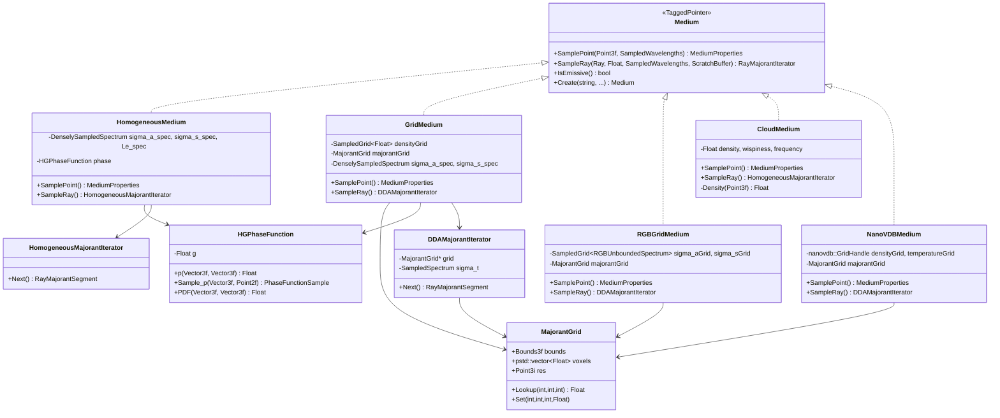
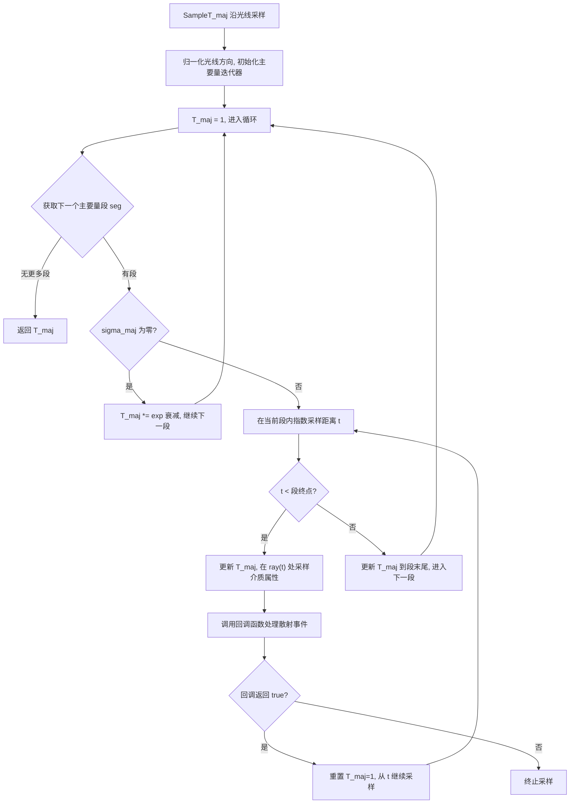

# media.h / media.cpp

## 概述
该文件实现了 PBRT-v4 中参与介质（participating media）的各种类型，负责模拟光线在烟雾、云层、水等体积散射介质中的传播。文件定义了相函数、多种介质类型（均匀介质、网格介质、RGB 网格介质、云介质和 NanoVDB 介质）以及用于光线主要量（majorant）采样的迭代器。这些组件共同实现了基于 Delta 跟踪和比率跟踪的高效体渲染算法。

## 主要类与接口
| 类/结构体/函数 | 说明 |
|---|---|
| `HGPhaseFunction` | Henyey-Greenstein 相函数，通过不对称参数 `g` 控制散射的前向/后向偏好 |
| `MediumProperties` | 介质属性结构体，包含吸收系数 `sigma_a`、散射系数 `sigma_s`、相函数和自发光 `Le` |
| `HomogeneousMajorantIterator` | 均匀主要量迭代器，对均匀介质返回单个常值主要量段 |
| `DDAMajorantIterator` | DDA 主要量迭代器，使用 3D 数字差分分析器遍历主要量网格体素，为非均匀介质提供逐体素主要量 |
| `MajorantGrid` | 主要量网格，存储介质密度上界的三维网格，用于加速 Delta 跟踪 |
| `HomogeneousMedium` | 均匀介质，整个体积内散射属性恒定 |
| `GridMedium` | 网格介质，使用三维浮点网格存储密度分布，支持温度驱动的自发光（黑体辐射） |
| `RGBGridMedium` | RGB 网格介质，使用 RGB 光谱网格分别存储吸收和散射系数，支持 RGB 自发光 |
| `CloudMedium` | 云介质，使用分形噪声程序化生成云密度，支持 "wispiness"（卷曲度）和频率参数 |
| `NanoVDBMedium` | NanoVDB 介质，从 OpenVDB/NanoVDB 格式文件加载体数据，支持密度和温度网格 |
| `NanoVDBBuffer` | NanoVDB 自定义缓冲区，适配 PBRT 的内存分配器系统 |
| `GetMediumScatteringProperties()` | 工具函数，通过材质名称（如 "Skin1"、"Wholemilk"）查找预设的次表面散射参数 |
| `SampleT_maj()` | 模板函数，实现沿光线的主要量传播采样（Delta 跟踪核心算法） |
| `Medium::Create()` | 工厂方法，根据名称创建对应的介质实例 |

## 架构图

## 算法流程图

## 依赖关系
- **依赖**：`pbrt/base/medium.h`、`pbrt/interaction.h`、`pbrt/paramdict.h`、`pbrt/textures.h`、`pbrt/util/colorspace.h`、`pbrt/util/spectrum.h`、`pbrt/util/transform.h`、`pbrt/util/scattering.h`、`pbrt/util/parallel.h`、`pbrt/samplers.h`、`nanovdb/NanoVDB.h`
- **被依赖**：`materials.cpp`、`bxdfs.h`、`bxdfs.cpp`、`bssrdf.cpp`、`cpu/integrators.cpp`、`cpu/render.cpp`、`wavefront/media.cpp`、`gpu/optix/optix.cu`、`media_test.cpp`、`cmd/nanovdb2pbrt.cpp`
