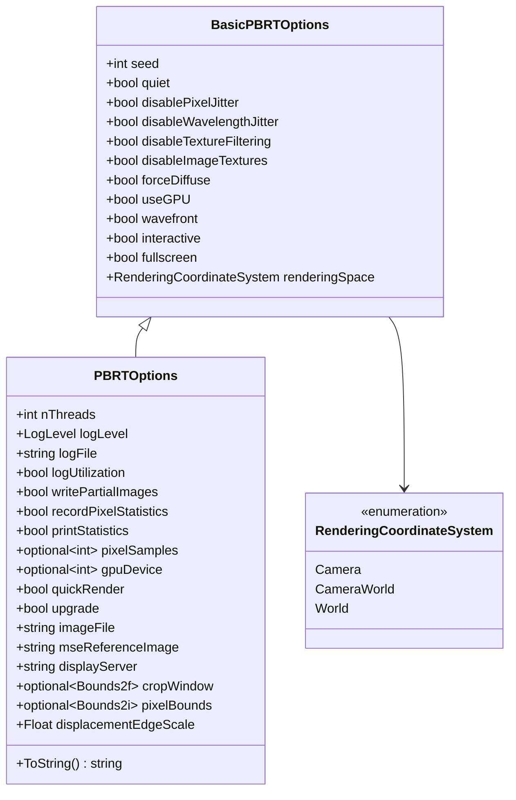

# options.h / options.cpp

## 概述
该文件定义了 PBRT-v4 渲染器的全局配置选项系统，是整个渲染管线的参数控制中心。它通过两个层次的选项结构体（`BasicPBRTOptions` 和 `PBRTOptions`）管理渲染行为，包括线程数、GPU 使用、采样设置、日志级别、图像输出等。全局选项通过指针 `Options` 访问，在 GPU 模式下还会同步到 GPU 常量内存。

## 主要类与接口
| 类/结构体/函数 | 说明 |
|---|---|
| `RenderingCoordinateSystem` | 渲染坐标系枚举，支持 `Camera`（相机空间）、`CameraWorld`（相机世界空间，默认）和 `World`（世界空间）三种模式 |
| `BasicPBRTOptions` | 基础选项结构体，包含 CPU/GPU 共享的轻量级选项：随机种子、抖动开关、纹理过滤开关、GPU 模式、wavefront 模式、交互模式、渲染空间等 |
| `PBRTOptions` | 完整选项结构体，继承自 `BasicPBRTOptions`，额外包含线程数、日志级别/文件、统计开关、采样数覆盖、GPU 设备选择、快速渲染模式、图像文件路径、MSE 参考图像、裁剪窗口、像素边界等 |
| `Options` | 全局指针变量（`PBRTOptions*`），在主函数中初始化，整个渲染期间可访问 |
| `OptionsGPU` | GPU 常量内存中的 `BasicPBRTOptions` 副本（仅在 GPU 构建时存在） |
| `CopyOptionsToGPU()` | 将选项复制到 GPU 常量内存的函数 |
| `GetOptions()` | 内联函数，根据代码运行在 CPU 还是 GPU 返回对应的选项引用 |

## 架构图

## 依赖关系
- **依赖**：`pbrt/pbrt.h`、`pbrt/util/log.h`、`pbrt/util/pstd.h`、`pbrt/util/vecmath.h`、`pbrt/util/print.h`（cpp 中）、`pbrt/gpu/util.h`（GPU 构建时）
- **被依赖**：被大量模块引用（31 个文件），包括但不限于：`paramdict.cpp`、`parser.cpp`、`scene.cpp`、`pbrt.cpp`、`samplers.h`、`shapes.cpp`、`film.cpp`、`cameras.cpp`、`bxdfs.h`、`cpu/integrators.cpp`、`wavefront/integrator.h`、`util/spectrum.cpp`、`util/log.cpp`、`util/gui.cpp` 等核心模块
