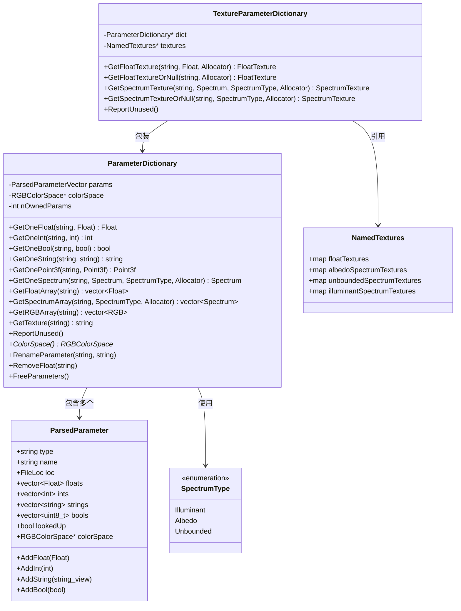
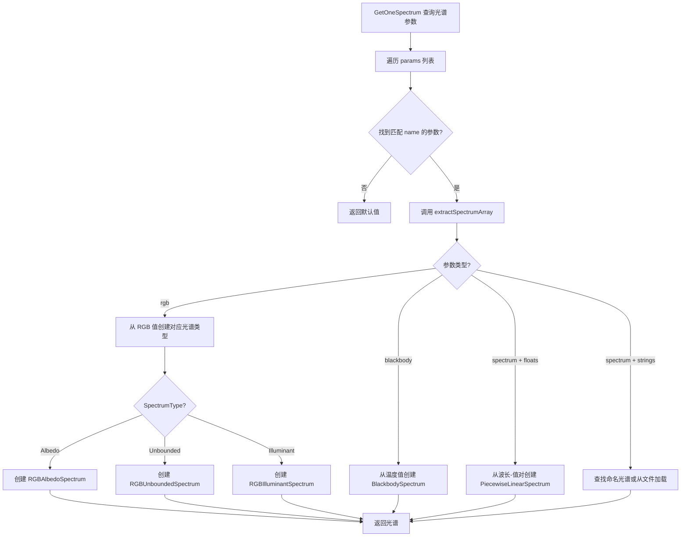

# paramdict.h / paramdict.cpp

## 概述
该文件实现了 PBRT-v4 的参数字典系统，是场景描述文件解析与对象创建之间的桥梁。它负责存储、查询和类型转换从场景文件解析出的参数，支持布尔、整数、浮点数、向量、点、法线、光谱、字符串和纹理等多种参数类型。该系统还支持 RGB 颜色空间的自动转换、命名纹理引用解析以及未使用参数的警告报告。

## 主要类与接口
| 类/结构体/函数 | 说明 |
|---|---|
| `ParsedParameter` | 解析后的原始参数，存储类型名、参数名、源码位置以及各类型的值数组（floats/ints/strings/bools），支持颜色空间标注 |
| `ParsedParameterVector` | 解析参数指针的内联向量（`InlinedVector<ParsedParameter*, 8>`），用于高效传递参数列表 |
| `ParameterType` | 参数类型枚举，包括 Boolean、Float、Integer、Point2f/3f、Vector2f/3f、Normal3f、Spectrum、String、Texture |
| `SpectrumType` | 光谱类型枚举：`Illuminant`（光源光谱）、`Albedo`（反射率，值域 [0,1]）、`Unbounded`（无界光谱） |
| `NamedTextures` | 命名纹理集合，分别维护 float 纹理和三种光谱类型纹理的映射表 |
| `ParameterDictionary` | 核心参数字典类，提供按名称和类型查询单值（`GetOneFloat` 等）、数组（`GetFloatArray` 等）和光谱值的方法；支持参数重命名、删除和未使用参数报告 |
| `TextureParameterDictionary` | 纹理感知的参数字典包装器，在 `ParameterDictionary` 基础上增加了纹理引用解析功能，可以从参数中获取 `FloatTexture` 和 `SpectrumTexture` |
| `ParameterTypeTraits` | 参数类型特征模板，为每种参数类型定义类型名、每项元素数、返回类型和转换函数 |

## 架构图

## 算法流程图

## 依赖关系
- **依赖**：`pbrt/base/texture.h`、`pbrt/util/containers.h`、`pbrt/util/error.h`、`pbrt/util/memory.h`、`pbrt/util/spectrum.h`、`pbrt/util/vecmath.h`、`pbrt/options.h`、`pbrt/textures.h`、`pbrt/util/color.h`、`pbrt/util/colorspace.h`、`pbrt/util/file.h`
- **被依赖**：`lights.cpp`、`materials.cpp`、`media.h`、`media.cpp`、`shapes.cpp`、`textures.h`、`textures.cpp`、`samplers.cpp`、`scene.h`、`scene.cpp`、`parser.h`、`film.cpp`、`filters.cpp`、`cameras.cpp`、`cpu/aggregates.cpp`、`cpu/integrators.cpp`、`interaction.cpp`、`bsdfs_test.cpp`、`cmd/pspec.cpp`
