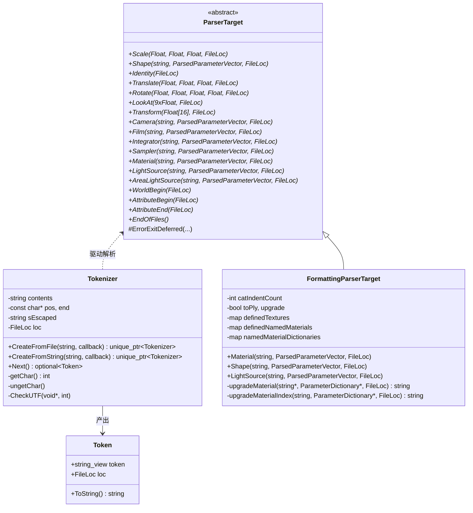
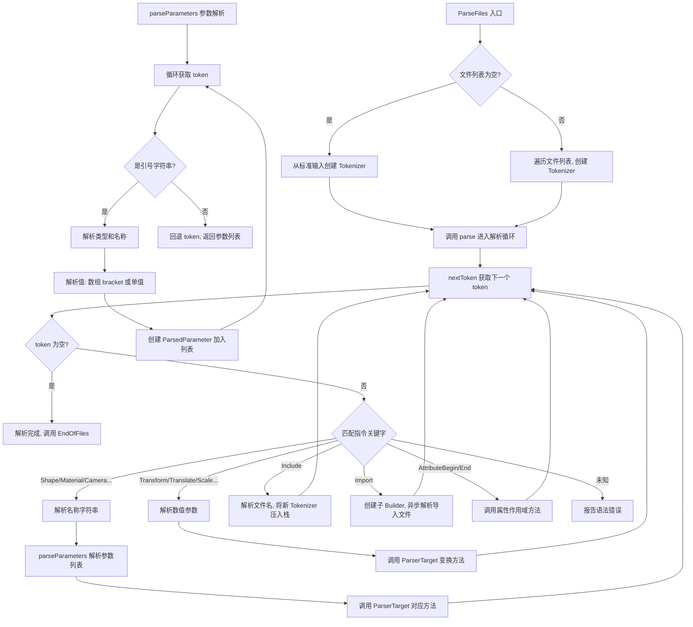

# parser.h / parser.cpp

## 概述
该文件实现了 PBRT-v4 场景描述文件的词法分析器（Tokenizer）和语法解析器（Parser），是渲染管线的入口模块。它将 `.pbrt` 格式的文本场景描述解析为结构化的 API 调用，驱动场景构建过程。解析器支持文件包含（Include）、异步导入（Import）、内存映射文件读取，以及场景格式从 pbrt-v3 到 v4 的自动升级转换。

## 主要类与接口
| 类/结构体/函数 | 说明 |
|---|---|
| `ParserTarget` | 解析目标的抽象基类，定义了所有 PBRT 场景描述指令的虚函数接口（如 `Shape`、`Material`、`LightSource`、`Camera`、`Film` 等），解析器将解析结果回调到此接口 |
| `Token` | 词法单元结构体，包含 token 字符串视图和源码位置（`FileLoc`） |
| `Tokenizer` | 词法分析器，支持从文件（含 mmap 和 gzip）、字符串和标准输入读取，逐个产出 Token。处理引号字符串、注释、转义字符和 UTF 编码检测 |
| `FormattingParserTarget` | 格式化解析目标，继承自 `ParserTarget`，用于 `--format` 和 `--toply` 模式，将场景描述重新格式化输出。在 `--upgrade` 模式下自动将 pbrt-v3 材质/光源/采样器等转换为 v4 等价物 |
| `ParseFiles()` | 顶层解析函数，接受文件名列表，依次创建 Tokenizer 并调用内部 `parse()` 驱动解析 |
| `ParseString()` | 从字符串解析场景描述的便捷函数 |
| `parse()` | 核心解析循环（内部函数），使用递归下降方式解析 token 流，识别指令关键字并调用 `ParserTarget` 对应方法 |

## 架构图

## 算法流程图

## 依赖关系
- **依赖**：`pbrt/paramdict.h`、`pbrt/options.h`、`pbrt/scene.h`（cpp 中）、`pbrt/shapes.h`（cpp 中）、`pbrt/util/check.h`、`pbrt/util/containers.h`、`pbrt/util/error.h`、`pbrt/util/file.h`、`pbrt/util/memory.h`、`pbrt/util/mesh.h`、`pbrt/util/print.h`、`pbrt/util/string.h`、`pbrt/util/stats.h`、`pbrt/util/args.h`、`pbrt/util/progressreporter.h`
- **被依赖**：`scene.h`、`cmd/pbrt.cpp`、`cmd/pspec.cpp`、`parser_test.cpp`
