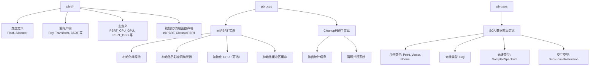
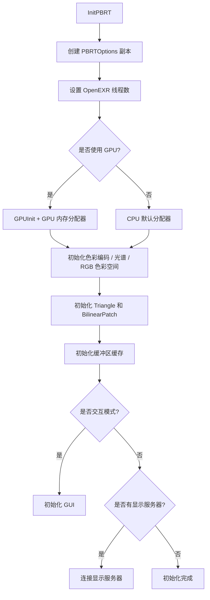

# pbrt.h / pbrt.cpp / pbrt.soa

## 概述
这组文件构成了 PBRT-v4 渲染器的核心基础设施。`pbrt.h` 是全局头文件，定义了渲染系统中最基本的类型别名、前向声明和宏定义，几乎所有其他模块都会包含此文件。`pbrt.cpp` 提供了渲染系统的初始化（`InitPBRT`）和清理（`CleanupPBRT`）函数实现。`pbrt.soa` 定义了用于 GPU 渲染的 Structure-of-Arrays（SOA）数据布局。

## 主要类与接口
| 类/结构体/函数 | 说明 |
|---|---|
| `Float` | 浮点类型别名，可通过 `PBRT_FLOAT_AS_DOUBLE` 宏切换为 `double` |
| `FloatBits` | 与 `Float` 大小相同的无符号整数类型，用于位操作 |
| `Allocator` | 多态内存分配器类型别名（`pstd::pmr::polymorphic_allocator<std::byte>`） |
| `InitPBRT(const PBRTOptions&)` | 初始化整个渲染系统：线程池、色彩空间、光谱数据、GPU 等 |
| `CleanupPBRT()` | 清理渲染系统：输出统计信息、关闭并行系统、断开显示服务器 |
| `PBRT_CPU_GPU` | 用于标记同时在 CPU 和 GPU 上运行的函数宏 |
| `PBRT_GPU` | 用于标记仅在 GPU 上运行的函数宏 |
| `PBRT_L1_CACHE_LINE_SIZE` | L1 缓存行大小常量（GPU 构建为 128，CPU 构建为 64） |
| `SOA<T>` | SOA 数据布局模板（在 `.soa` 文件中定义具体类型） |

### pbrt.soa 中定义的 SOA 类型
| 类型 | 说明 |
|---|---|
| `Ray` | 光线的 SOA 布局（原点、方向、时间、介质） |
| `Point2f / Point2i / Point3f` | 二维/三维点的 SOA 布局 |
| `Vector3f / Normal3f` | 三维向量和法线的 SOA 布局 |
| `Point3fi` | 带区间误差的三维点 SOA 布局 |
| `SampledSpectrum / SampledWavelengths` | 采样光谱和采样波长的 SOA 布局 |
| `Frame` | 局部坐标系的 SOA 布局 |
| `VisibleSurface` | 可见表面信息的 SOA 布局 |
| `MediumInterface` | 介质接口的 SOA 布局 |
| `SubsurfaceInteraction` | 次表面散射交互的 SOA 布局 |
| `LightSampleContext` | 光源采样上下文的 SOA 布局 |

## 架构图

## 算法流程图

## 依赖关系
- **依赖**：`<stdint.h>`, `<cstddef>`, `pstd::pmr`（自定义多态分配器）
- **pbrt.cpp 额外依赖**：`pbrt/options.h`, `pbrt/shapes.h`, `pbrt/util/check.h`, `pbrt/util/color.h`, `pbrt/util/colorspace.h`, `pbrt/util/display.h`, `pbrt/util/error.h`, `pbrt/util/gui.h`, `pbrt/util/memory.h`, `pbrt/util/parallel.h`, `pbrt/util/print.h`, `pbrt/util/spectrum.h`, `pbrt/util/stats.h`, `pbrt/gpu/memory.h`（GPU 构建）
- **被依赖**：几乎所有 PBRT 模块都包含 `pbrt.h`，它是整个渲染系统的基础头文件
