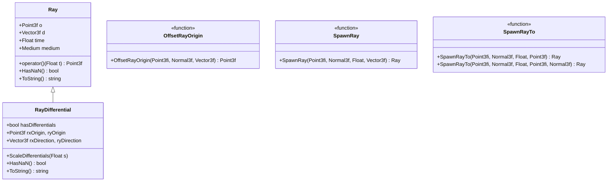
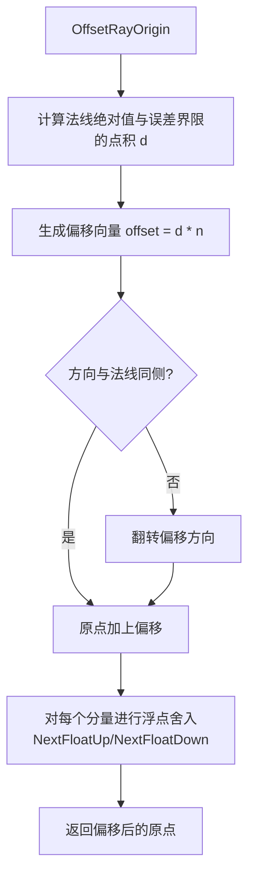

# ray.h / ray.cpp

## 概述
该文件定义了光线追踪渲染器中最核心的数据结构——光线（`Ray`）和光线微分（`RayDifferential`），以及相关的辅助函数。光线是渲染管线中连接相机、场景几何体和光源的基本载体，所有的相交测试和光照计算都基于光线进行。

## 主要类与接口
| 类/结构体/函数 | 说明 |
|---|---|
| `Ray` | 基本光线类，包含原点 `o`、方向 `d`、时间 `time` 和传播介质 `medium` |
| `RayDifferential` | 继承自 `Ray`，携带相邻像素光线的微分信息，用于纹理反走样 |
| `OffsetRayOrigin()` | 沿法线方向偏移光线原点，避免自相交问题 |
| `SpawnRay()` | 从交点生成新光线，自动处理原点偏移 |
| `SpawnRayTo()` | 从一个交点向目标点生成光线，处理双端偏移 |
| `Ray::operator()` | 参数化光线求值：`o + d * t`，返回光线上参数 `t` 对应的点 |
| `Ray::HasNaN()` | 检查光线数据是否包含 NaN 值 |
| `RayDifferential::ScaleDifferentials()` | 缩放光线微分，用于光线跟踪中的纹理过滤 |

## 架构图

## 算法流程图

## 依赖关系
- **依赖**：`pbrt/pbrt.h`, `pbrt/base/medium.h`, `pbrt/util/vecmath.h`
- **被依赖**：`pbrt/shapes.h`, `pbrt/interaction.h`, `pbrt/cameras.h`, `pbrt/integrators/`（各种积分器）, `pbrt/lights.h` 等几乎所有涉及光线追踪的模块
