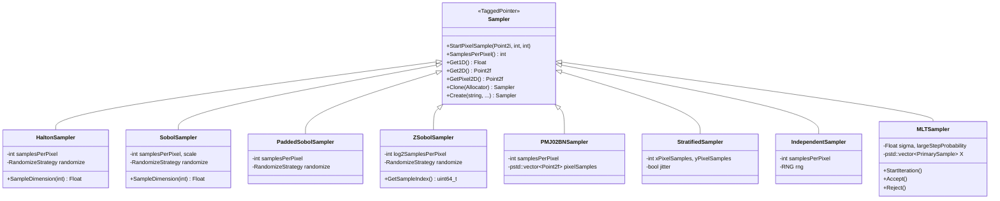
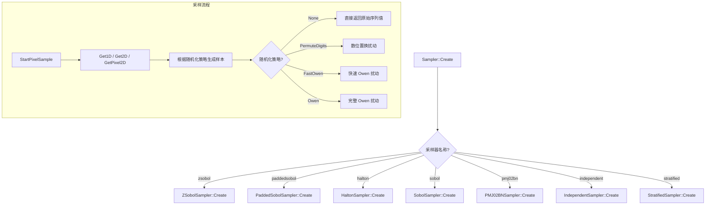

# samplers.h / samplers.cpp

## 概述
该文件实现了 PBRT-v4 中的所有采样器（Sampler），负责为渲染过程中的蒙特卡洛积分生成高质量的伪随机或准随机样本序列。采样器的质量直接影响渲染图像的收敛速度和噪声特性，是渲染管线中至关重要的组件。

## 主要类与接口
| 类/结构体/函数 | 说明 |
|---|---|
| `HaltonSampler` | 基于 Halton 序列的低差异采样器，使用基数 2 和 3 的逆根序列 |
| `SobolSampler` | 基于全局 Sobol 序列的采样器，支持多种随机化策略 |
| `PaddedSobolSampler` | 填充式 Sobol 采样器，通过独立随机化每个像素的样本实现像素间去相关 |
| `ZSobolSampler` | 基于 Z 曲线（Morton 码）的 Sobol 采样器，利用空间局部性优化缓存性能 |
| `PMJ02BNSampler` | 渐进多抖动 (0,2) 蓝噪声采样器，具有优秀的分层和蓝噪声特性 |
| `StratifiedSampler` | 分层采样器，将像素域划分为网格并在每个格子中随机抖动采样 |
| `IndependentSampler` | 独立均匀随机采样器，最简单的采样策略 |
| `MLTSampler` | 梅特罗波利斯光传输 (MLT) 采样器，用于 MCMC 采样 |
| `DebugMLTSampler` | MLT 调试采样器，可从外部指定样本值 |
| `GetCameraSample()` | 辅助函数，结合像素滤波器生成相机样本 |
| `Sampler::Create()` | 工厂方法，根据名称字符串创建对应的采样器 |

## 架构图

## 算法流程图

## 依赖关系
- **依赖**：`pbrt/pbrt.h`, `pbrt/base/sampler.h`, `pbrt/filters.h`, `pbrt/options.h`, `pbrt/util/bluenoise.h`, `pbrt/util/hash.h`, `pbrt/util/lowdiscrepancy.h`, `pbrt/util/math.h`, `pbrt/util/pmj02tables.h`, `pbrt/util/primes.h`, `pbrt/util/rng.h`, `pbrt/util/vecmath.h`, `pbrt/cameras.h`, `pbrt/paramdict.h`
- **被依赖**：`pbrt/scene.h`, 各积分器模块（`pbrt/cpu/integrators.h` 等）、GPU 渲染管线
