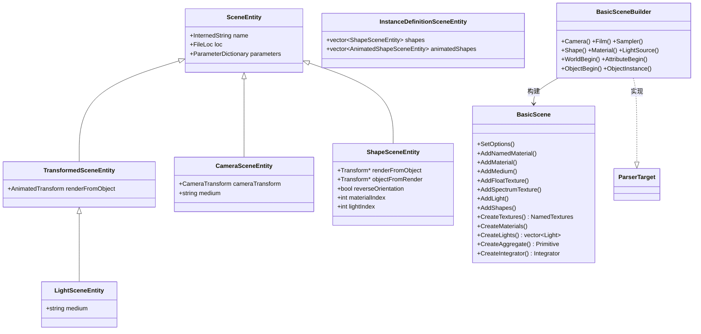
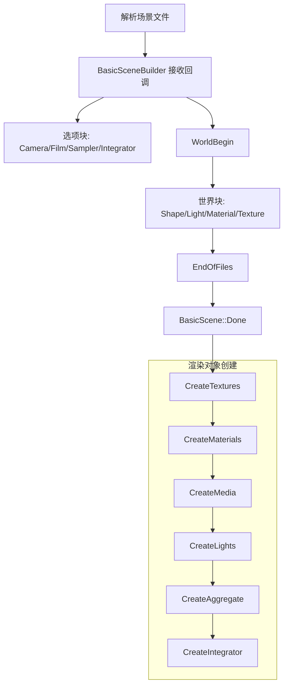

# scene.h / scene.cpp

## 概述
该文件实现了 PBRT-v4 的场景描述与构建系统。`BasicScene` 类负责存储和管理所有从场景文件解析出的实体（形状、光源、材质、纹理、介质等），并提供异步创建渲染对象的能力。`BasicSceneBuilder` 类实现了 `ParserTarget` 接口，将解析器的回调转换为场景实体的构建操作。这两个类共同构成了从场景文件到可渲染场景的桥梁。

## 主要类与接口
| 类/结构体/函数 | 说明 |
|---|---|
| `SceneEntity` | 场景实体基类，存储名称、参数字典和文件位置 |
| `TransformedSceneEntity` | 带动画变换的场景实体 |
| `CameraSceneEntity` | 相机场景实体，包含相机变换和介质信息 |
| `ShapeSceneEntity` | 形状场景实体，包含变换、材质索引、面光源索引、介质信息 |
| `AnimatedShapeSceneEntity` | 带动画变换的形状场景实体 |
| `InstanceDefinitionSceneEntity` | 实例定义实体，包含一组形状和动画形状 |
| `InstanceSceneEntity` | 实例引用实体，引用已定义的实例 |
| `LightSceneEntity` | 光源场景实体 |
| `TransformSet` | 变换集合，支持动画变换（起始和结束时刻各一个变换） |
| `BasicScene` | 核心场景类，管理所有渲染对象的异步创建和存储 |
| `BasicSceneBuilder` | 场景构建器，实现 `ParserTarget` 接口，处理场景文件解析回调 |
| `BasicScene::CreateTextures()` | 创建所有纹理对象 |
| `BasicScene::CreateMaterials()` | 创建所有材质对象 |
| `BasicScene::CreateLights()` | 创建所有光源对象（包括面光源） |
| `BasicScene::CreateAggregate()` | 创建加速结构聚合体（BVH） |
| `BasicScene::CreateIntegrator()` | 创建积分器 |

## 架构图

## 算法流程图

## 依赖关系
- **依赖**：`pbrt/pbrt.h`, `pbrt/cameras.h`, `pbrt/cpu/primitive.h`, `pbrt/paramdict.h`, `pbrt/parser.h`, `pbrt/util/containers.h`, `pbrt/util/transform.h`, `pbrt/cpu/aggregates.h`, `pbrt/cpu/integrators.h`, `pbrt/materials.h`, `pbrt/shapes.h` 等
- **被依赖**：`pbrt/cmd/pbrt.cpp`（主程序入口）、GPU 渲染管线
