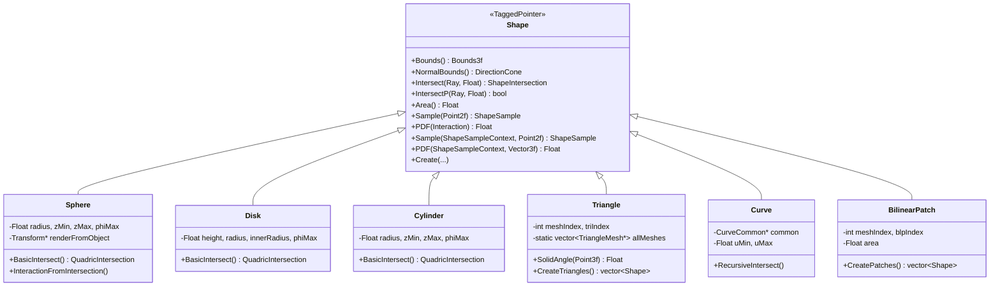

# shapes.h / shapes.cpp

## 概述
该文件实现了 PBRT-v4 中所有几何形状（Shape）的定义，是渲染管线中光线-几何体相交测试的核心模块。支持的形状包括球体、圆盘、圆柱、三角形、曲线和双线性面片。每种形状都实现了统一的 10 个接口方法：Bounds / NormalBounds / Intersect / IntersectP / Area / Sample(u) / PDF(intr) / Sample(ctx,u) / PDF(ctx,wi) / Create。

## 主要类与接口
| 类/结构体/函数 | 说明 |
|---|---|
| `ShapeSample` | 形状采样结果，包含交互信息和概率密度 |
| `ShapeSampleContext` | 形状采样的上下文（参考点位置和法线） |
| `ShapeIntersection` | 形状相交结果，包含表面交互和参数 t |
| `QuadricIntersection` | 二次曲面（球、柱、盘）的相交中间结果 |
| `Sphere` | 球体形状，支持部分球体（z 裁剪和 phi 裁剪） |
| `Disk` | 圆盘形状，支持内半径和 phi 裁剪 |
| `Cylinder` | 圆柱形状，支持 z 范围和 phi 裁剪 |
| `Triangle` | 三角形形状，基于三角形网格（`TriangleMesh`）索引 |
| `TriangleIntersection` | 三角形相交结果（重心坐标和参数 t） |
| `IntersectTriangle()` | 三角形光线相交的独立函数 |
| `Curve` | 曲线形状，支持平面、圆柱和带状三种类型 |
| `CurveCommon` | 曲线共享数据（控制点、宽度、类型） |
| `BilinearPatch` | 双线性面片，基于四边形网格 |
| `BilinearIntersection` | 双线性面片相交结果 |
| `IntersectBilinearPatch()` | 双线性面片光线相交的独立函数 |

## 架构图


## SurfaceInteraction 字段详解

`SurfaceInteraction`（定义于 `interaction.h:157-264`）是光线与形状求交后产生的核心数据结构，存储了交点处所有的几何和着色信息。它继承自 `Interaction` 基类。

### 字段总览表

| 字段 | 类型 | 来源 | 物理含义 |
|---|---|---|---|
| `pi` | `Point3fi` | Interaction 基类 | 交点位置，附带浮点误差区间（用于鲁棒光线生成） |
| `time` | `Float` | Interaction 基类 | 光线时间（运动模糊） |
| `wo` | `Vector3f` | Interaction 基类 | 出射方向 = `Normalize(-ray.d)` |
| `n` | `Normal3f` | Interaction 基类 | 几何法线 = `Normalize(Cross(dpdu, dpdv))` |
| `uv` | `Point2f` | Interaction 基类 | 曲面参数坐标 (u, v) |
| `dpdu` | `Vector3f` | SurfaceInteraction | 曲面沿 u 方向的偏导数 ∂p/∂u |
| `dpdv` | `Vector3f` | SurfaceInteraction | 曲面沿 v 方向的偏导数 ∂p/∂v |
| `dndu` | `Normal3f` | SurfaceInteraction | 法线沿 u 方向的变化率 ∂n/∂u |
| `dndv` | `Normal3f` | SurfaceInteraction | 法线沿 v 方向的变化率 ∂n/∂v |
| `shading.n` | `Normal3f` | SurfaceInteraction | 着色法线（可与几何法线不同） |
| `shading.dpdu` | `Vector3f` | SurfaceInteraction | 着色切线 ∂p/∂u |
| `shading.dpdv` | `Vector3f` | SurfaceInteraction | 着色副切线 ∂p/∂v |
| `shading.dndu` | `Normal3f` | SurfaceInteraction | 着色法线沿 u 的变化率 |
| `shading.dndv` | `Normal3f` | SurfaceInteraction | 着色法线沿 v 的变化率 |
| `faceIndex` | `int` | SurfaceInteraction | 面索引（用于逐面材质/alpha） |
| `material` | `Material` | SurfaceInteraction | 材质（求交后由 `SetIntersectionProperties` 设置） |
| `areaLight` | `Light` | SurfaceInteraction | 面光源（求交后由 `SetIntersectionProperties` 设置） |
| `dpdx` | `Vector3f` | SurfaceInteraction | 交点沿屏幕 x 方向的位置变化（光线微分） |
| `dpdy` | `Vector3f` | SurfaceInteraction | 交点沿屏幕 y 方向的位置变化（光线微分） |
| `dudx, dvdx` | `Float` | SurfaceInteraction | uv 沿屏幕 x 方向的变化率 |
| `dudy, dvdy` | `Float` | SurfaceInteraction | uv 沿屏幕 y 方向的变化率 |

### 基类 Interaction 字段

- **pi（Point3fi）**：使用区间算术类型存储交点位置及其浮点误差界。误差界用于 `OffsetRayOrigin` 函数生成鲁棒的二次光线（shadow ray / reflection ray），确保光线起点位于正确的曲面侧而不会自交。
- **wo**：出射方向，在 `Interaction` 构造函数中由 `Normalize(wo)` 归一化。对于形状求交，传入的是 `-ray.d`。
- **n**：几何法线，在 `SurfaceInteraction` 构造函数中由 `Normalize(Cross(dpdu, dpdv))` 计算。如果 `flipNormal`（由 `reverseOrientation ^ transformSwapsHandedness` 决定）为真，法线取反。

### 微分几何字段

- **dpdu / dpdv**：曲面切平面的基向量。它们的叉积给出未归一化的几何法线方向。这两个向量不一定正交也不一定单位化——它们忠实反映参数化的几何意义。
- **dndu / dndv**：法线沿参数方向的变化率，编码了曲面曲率信息。用于凹凸映射（bump mapping）中计算扰动后的着色法线。对于平面（Disk、Triangle 几何面），dndu = dndv = 0。

### 着色几何 shading 结构体

着色几何（`shading.n`, `shading.dpdu`, `shading.dpdv`, `shading.dndu`, `shading.dndv`）初始化时等于几何字段。当存在逐顶点法线（Triangle、BilinearPatch 的 `mesh->n`）或凹凸映射时，通过 `SetShadingGeometry` 方法设置不同的着色几何：

```cpp
void SetShadingGeometry(Normal3f ns, Vector3f dpdus, Vector3f dpdvs,
                        Normal3f dndus, Normal3f dndvs,
                        bool orientationIsAuthoritative);
```

该方法确保着色法线与几何法线在同一侧：
- `orientationIsAuthoritative == true`（形状调用）：将几何法线 `n` 翻转到与着色法线 `ns` 同侧
- `orientationIsAuthoritative == false`（凹凸映射调用）：将着色法线翻转到与几何法线同侧

### 光线微分字段

`dpdx`、`dpdy`、`dudx`、`dvdx`、`dudy`、`dvdy` 由 `ComputeDifferentials` 方法计算。它们描述了屏幕空间相邻像素对应的交点位置和纹理坐标变化量，用于纹理滤波（MIP-map 层级选择）。这些字段**不由形状求交计算**，而是在获得交点后由积分器调用。

### 后设置字段

`material` 和 `areaLight` 由 `SetIntersectionProperties` 在求交完成后设置，来自图元（Primitive）而非形状（Shape）。形状求交的职责到构造 `SurfaceInteraction` 为止。

## 通用模式：Weingarten 方程

Sphere、Cylinder 和 BilinearPatch 在计算法线导数 dndu/dndv 时共用同一套基于**微分几何基本形式**的 Weingarten 方程。

### 数学推导

给定参数化曲面 p(u,v)，其法线为 n = Normalize(∂p/∂u × ∂p/∂v)。法线的参数导数 ∂n/∂u 和 ∂n/∂v 可通过 Weingarten 映射求解：

**第一基本形式系数**（度量曲面上的距离）：
```
E = ∂p/∂u · ∂p/∂u
F = ∂p/∂u · ∂p/∂v
G = ∂p/∂v · ∂p/∂v
```

**第二基本形式系数**（度量曲面的弯曲程度）：
```
e = n · ∂²p/∂u²
f = n · ∂²p/∂u∂v
g = n · ∂²p/∂v²
```

**Weingarten 映射公式**：
```
∂n/∂u = ((fF - eG) / (EG - F²)) · ∂p/∂u + ((eF - fE) / (EG - F²)) · ∂p/∂v
∂n/∂v = ((gF - fG) / (EG - F²)) · ∂p/∂u + ((fF - gE) / (EG - F²)) · ∂p/∂v
```

### 代码模式

三种形状中对应的代码完全一致（以 Sphere 为例，`shapes.h:259-270`）：

```cpp
// 第一基本形式
Float E = Dot(dpdu, dpdu), F = Dot(dpdu, dpdv), G = Dot(dpdv, dpdv);
Vector3f n = Normalize(Cross(dpdu, dpdv));
// 第二基本形式
Float e = Dot(n, d2Pduu), f = Dot(n, d2Pduv), g = Dot(n, d2Pdvv);

// Weingarten 映射
Float EGF2 = DifferenceOfProducts(E, G, F, F);  // EG - F², 避免灾难性抵消
Float invEGF2 = (EGF2 == 0) ? Float(0) : 1 / EGF2;
Normal3f dndu = Normal3f((f*F - e*G) * invEGF2 * dpdu + (e*F - f*E) * invEGF2 * dpdv);
Normal3f dndv = Normal3f((g*F - f*G) * invEGF2 * dpdu + (f*F - g*E) * invEGF2 * dpdv);
```

注意 `DifferenceOfProducts(E, G, F, F)` 计算 `E*G - F*F` 时使用了数值稳定的 FMA 实现，避免了两个接近的大数相减导致的精度损失。

### 各形状的二阶导数

| 形状 | ∂²p/∂u² | ∂²p/∂u∂v | ∂²p/∂v² |
|---|---|---|---|
| **Sphere** | `-φ_max² · (x, y, 0)` | `(θ_max-θ_min) · z · φ_max · (-sinφ, cosφ, 0)` | `-(θ_max-θ_min)² · (x, y, z)` |
| **Cylinder** | `-φ_max² · (x, y, 0)` | `(0, 0, 0)` | `(0, 0, 0)` |
| **BilinearPatch** | `(0, 0, 0)` | `(p00-p01) + (p11-p10)` 扭转向量 | `(0, 0, 0)` |
| **Disk** | 不使用（平面，法线恒定，dndu = dndv = 0） | — | — |
| **Triangle** | 不使用（平面几何面传零，法线变化只在着色几何中通过顶点法线插值） | — | — |
| **Curve** | 不使用（传零法线） | — | — |

## 各形状完整接口详解

### Sphere（球体）

> 源码：`shapes.h:107-401`，`shapes.cpp:32-81`

#### 1. Bounds（shapes.cpp:33-36）

在物体空间构造包围盒后变换到渲染空间：

```cpp
Bounds3f Sphere::Bounds() const {
    return (*renderFromObject)(
        Bounds3f(Point3f(-radius, -radius, zMin), Point3f(radius, radius, zMax)));
}
```

物体空间包围盒使用 `zMin`/`zMax` 而非 `±radius` 作为 z 范围，利用 z 裁剪参数收紧包围盒。xy 方向则始终用 `±radius`（因为 φ 裁剪不方便收紧 xy 包围盒）。

#### 2. NormalBounds（shapes.h:134）

```cpp
DirectionCone NormalBounds() const { return DirectionCone::EntireSphere(); }
```

球体法线可以指向任意方向（尤其是完整球），保守地返回整个球面方向锥。

#### 3. Intersect（shapes.h:137-144）

```cpp
pstd::optional<ShapeIntersection> Intersect(const Ray &ray, Float tMax) const {
    pstd::optional<QuadricIntersection> isect = BasicIntersect(ray, tMax);
    if (!isect) return {};
    SurfaceInteraction intr = InteractionFromIntersection(*isect, -ray.d, ray.time);
    return ShapeIntersection{intr, isect->tHit};
}
```

二次曲面的标准两阶段模式：`BasicIntersect` 求 t 和物体空间交点，`InteractionFromIntersection` 构造完整的 `SurfaceInteraction`。

##### BasicIntersect（shapes.h:147-229）

**步骤 1：变换光线到物体空间**

使用区间算术类型 `Point3fi` / `Vector3fi` 追踪浮点误差：

```cpp
Point3fi oi = (*objectFromRender)(Point3fi(r.o));
Vector3fi di = (*objectFromRender)(Vector3fi(r.d));
```

**步骤 2：建立二次方程**

光线 `p(t) = o + t·d` 与球 `|p|² = r²` 联立，展开得 `a·t² + b·t + c = 0`：

```
a = dx² + dy² + dz² = |d|²
b = 2(dx·ox + dy·oy + dz·oz) = 2(d·o)
c = ox² + oy² + oz² - r² = |o|² - r²
```

**步骤 3：数值稳定的判别式计算**

标准公式 `Δ = b² - 4ac` 存在灾难性抵消风险。PBRT 使用等价变换：

```cpp
Vector3fi v(oi - b / (2 * a) * di);       // v = o - (b/2a)·d
Interval length = Length(v);
Interval discrim = 4 * a * (Interval(radius) + length) * (Interval(radius) - length);
```

数学上 `4a(r+|v|)(r-|v|) = 4a(r²-|v|²)` 等价于原判别式，但将差分解为和与差的乘积，避免了两个接近的大数相减。

**步骤 4：求解 t 值**

使用 Interval 算术的稳定求根公式（避免小数除大数）：

```cpp
if ((Float)b < 0) q = -.5f * (b - rootDiscrim);
else               q = -.5f * (b + rootDiscrim);
t0 = q / a;  t1 = c / q;
```

选择最近的有效 t（`t0.LowerBound() > 0` 且 `t0.UpperBound() <= tMax`）。

**步骤 5：精化交点**

原始 `p = o + t·d` 可能因浮点误差略偏离球面，将交点重投影回球面：

```cpp
pHit *= radius / Distance(pHit, Point3f(0, 0, 0));
```

**步骤 6：φ 和裁剪检查**

```cpp
phi = atan2(pHit.y, pHit.x);  // φ ∈ [0, 2π)
if (phi < 0) phi += 2 * Pi;
// 检查 z 裁剪和 φ 裁剪
if ((zMin > -radius && pHit.z < zMin) || (zMax < radius && pHit.z > zMax) || phi > phiMax)
```

裁剪失败则尝试远交点 t1，再次失败返回空。

##### InteractionFromIntersection（shapes.h:237-281）

**步骤 1：参数坐标 (u, v)**

```
u = φ / φ_max
θ = acos(z / r)
v = (θ - θ_zMin) / (θ_zMax - θ_zMin)
```

**步骤 2：切向量 dpdu / dpdv**

球面参数化 `p(u,v) = (r·sinθ·cosφ, r·sinθ·sinφ, r·cosθ)`，其中 `φ = u·φ_max`，`θ = θ_zMin + v·(θ_zMax - θ_zMin)`。偏导数：

```
∂p/∂u = (-φ_max·y, φ_max·x, 0)
∂p/∂v = (θ_max-θ_min)·(z·cosφ, z·sinφ, -r·sinθ)
```

**步骤 3：Weingarten 方程计算 dndu / dndv**

计算三个二阶偏导数，然后套用通用 Weingarten 公式（见上一章节）：

```
∂²p/∂u² = -φ_max² · (x, y, 0)
∂²p/∂u∂v = (θ_max-θ_min) · z · φ_max · (-sinφ, cosφ, 0)
∂²p/∂v² = -(θ_max-θ_min)² · (x, y, z)
```

**步骤 4：误差界和 SurfaceInteraction 构造**

```cpp
Vector3f pError = gamma(5) * Abs((Vector3f)pHit);
```

在物体空间构造 `SurfaceInteraction`，再通过 `renderFromObject` 变换到渲染空间：

```cpp
bool flipNormal = reverseOrientation ^ transformSwapsHandedness;
Vector3f woObject = (*objectFromRender)(wo);
return (*renderFromObject)(SurfaceInteraction(
    Point3fi(pHit, pError), Point2f(u, v), woObject,
    dpdu, dpdv, dndu, dndv, time, flipNormal));
```

#### 4. IntersectP（shapes.h:232-234）

```cpp
bool IntersectP(const Ray &r, Float tMax) const {
    return BasicIntersect(r, tMax).has_value();
}
```

仅测试是否有交点，不构造 `SurfaceInteraction`，用于阴影光线等只需布尔结果的场景。复用 `BasicIntersect` 实现。

#### 5. Area（shapes.h:284）

```cpp
Float Area() const { return phiMax * radius * (zMax - zMin); }
```

球带面积公式。完整球（`phiMax = 2π`, `zMin = -r`, `zMax = r`）时等于 `4πr²`。推导：球面微元 `dA = r·dφ·dz`（Archimedes 定理），积分 `∫₀^φ_max dφ ∫_{zMin}^{zMax} r·dz = φ_max · r · (zMax - zMin)`。

#### 6. Sample(u)（shapes.cpp:38-58）

在球面上按面积均匀采样一个点：

```cpp
pstd::optional<ShapeSample> Sphere::Sample(Point2f u) const {
    Point3f pObj = Point3f(0,0,0) + radius * SampleUniformSphere(u);
    pObj *= radius / Distance(pObj, Point3f(0,0,0));  // 重投影精化
    Vector3f pObjError = gamma(5) * Abs((Vector3f)pObj);

    Normal3f nObj(pObj.x, pObj.y, pObj.z);
    Normal3f n = Normalize((*renderFromObject)(nObj));
    if (reverseOrientation) n *= -1;

    // 计算采样点的 (u,v) 参数坐标
    Float theta = SafeACos(pObj.z / radius);
    Float phi = std::atan2(pObj.y, pObj.x);
    if (phi < 0) phi += 2 * Pi;
    Point2f uv(phi / phiMax, (theta - thetaZMin) / (thetaZMax - thetaZMin));

    Point3fi pi = (*renderFromObject)(Point3fi(pObj, pObjError));
    return ShapeSample{Interaction(pi, n, uv), 1 / Area()};
}
```

使用 `SampleUniformSphere` 生成均匀分布的球面点，PDF = `1 / Area()`。注意此实现不处理 z/φ 裁剪——对于部分球体，采样到裁剪区域外的点不会被拒绝（但 `Sample(ctx, u)` 通过立体角采样绕过了此问题）。

#### 7. PDF(intr)（shapes.h:290）

```cpp
Float PDF(const Interaction &) const { return 1 / Area(); }
```

面积均匀采样对应的 PDF，与采样点位置无关。

#### 8. Sample(ctx, u)（shapes.h:293-361）

给定参考点上下文 `ctx` 的方向采样，分两种情况：

**情况 1：参考点在球内**（`shapes.h:297-313`）

退化为面积采样 + 面积→立体角 PDF 转换：

```cpp
if (DistanceSquared(pOrigin, pCenter) <= Sqr(radius)) {
    pstd::optional<ShapeSample> ss = Sample(u);  // 面积采样
    ss->pdf /= AbsDot(ss->intr.n, -wi) / DistanceSquared(ctx.p(), ss->intr.p());
    return ss;
}
```

面积 PDF → 立体角 PDF 的转换公式：`pdf_ω = pdf_A · r² / |cosθ'|`，其中 `r` 是参考点到采样点的距离，`θ'` 是采样点法线与入射方向的夹角。

**情况 2：参考点在球外**（shapes.h:315-361）

在球体对参考点张成的立体角锥内均匀采样，这比面积采样效率高得多：

```cpp
// 计算锥体半角
Float sinThetaMax = radius / Distance(ctx.p(), pCenter);
Float cosThetaMax = SafeSqrt(1 - sin2ThetaMax);

// 锥内均匀采样
Float cosTheta = (cosThetaMax - 1) * u[0] + 1;
Float phi = u[1] * 2 * Pi;
```

对于非常小的立体角（`sin²θ_max < 0.00068523`，即 < 1.5°），使用 Taylor 展开避免精度损失：
```cpp
sin2Theta = sin2ThetaMax * u[0];
cosTheta = std::sqrt(1 - sin2Theta);
oneMinusCosThetaMax = sin2ThetaMax / 2;
```

然后计算球面上的实际交点（通过 α 角从球心到球面的几何关系），返回立体角均匀 PDF：
```cpp
return ShapeSample{..., 1 / (2 * Pi * oneMinusCosThetaMax)};
```

#### 9. PDF(ctx, wi)（shapes.h:364-392）

与 `Sample(ctx, u)` 对应的 PDF 计算，同样分两种情况：

**参考点在球内**：发射光线求交，用面积→立体角 PDF 转换。

**参考点在球外**：直接返回立体角锥的均匀 PDF：

```cpp
Float sin2ThetaMax = radius * radius / DistanceSquared(ctx.p(), pCenter);
Float cosThetaMax = SafeSqrt(1 - sin2ThetaMax);
Float oneMinusCosThetaMax = 1 - cosThetaMax;
if (sin2ThetaMax < 0.00068523f)
    oneMinusCosThetaMax = sin2ThetaMax / 2;  // Taylor 展开
return 1 / (2 * Pi * oneMinusCosThetaMax);
```

#### 10. Create（shapes.cpp:71-81）

从场景描述参数创建球体实例：

```cpp
Sphere *Sphere::Create(const Transform *renderFromObject,
                       const Transform *objectFromRender, bool reverseOrientation,
                       const ParameterDictionary &parameters, const FileLoc *loc,
                       Allocator alloc) {
    Float radius = parameters.GetOneFloat("radius", 1.f);
    Float zmin = parameters.GetOneFloat("zmin", -radius);
    Float zmax = parameters.GetOneFloat("zmax", radius);
    Float phimax = parameters.GetOneFloat("phimax", 360.f);
    return alloc.new_object<Sphere>(renderFromObject, objectFromRender,
                                    reverseOrientation, radius, zmin, zmax, phimax);
}
```

| 参数 | 默认值 | 说明 |
|---|---|---|
| `radius` | 1.0 | 球体半径 |
| `zmin` | `-radius` | z 裁剪下界 |
| `zmax` | `radius` | z 裁剪上界 |
| `phimax` | 360° | φ 裁剪上界（度数） |

构造函数中将 `zmin`/`zmax` Clamp 到 `[-radius, radius]`，将 `phimax` Clamp 到 `[0°, 360°]` 并转为弧度。

---

### Disk（圆盘）

> 源码：`shapes.h:404-571`，`shapes.cpp:84-115`

#### 1. Bounds（shapes.cpp:84-87）

```cpp
Bounds3f Disk::Bounds() const {
    return (*renderFromObject)(
        Bounds3f(Point3f(-radius, -radius, height), Point3f(radius, radius, height)));
}
```

圆盘是 z = height 平面上的薄片，包围盒 z 方向退化为零厚度。xy 方向使用 `±radius`（不因 innerRadius 或 φ 裁剪收紧）。

#### 2. NormalBounds（shapes.cpp:89-94）

```cpp
DirectionCone Disk::NormalBounds() const {
    Normal3f n = (*renderFromObject)(Normal3f(0, 0, 1));
    if (reverseOrientation) n = -n;
    return DirectionCone(Vector3f(n));
}
```

圆盘是平面，法线恒定为 `(0,0,1)` 变换到渲染空间后的方向。返回单一方向的方向锥（张角为零）。与 Sphere/Cylinder 返回 `EntireSphere()` 不同，Disk 的法线界是精确的。

#### 3. Intersect（shapes.h:436-443）

与 Sphere 相同的两阶段模式：`BasicIntersect` → `InteractionFromIntersection`。

##### BasicIntersect（shapes.h:446-474）

圆盘是 z = height 平面上的环形区域，求交非常简单。

**步骤 1：平行检查**

```cpp
if (Float(di.z) == 0) return {};  // 光线平行于圆盘平面
```

**步骤 2：平面求交**

```cpp
Float tShapeHit = (height - Float(oi.z)) / Float(di.z);
if (tShapeHit <= 0 || tShapeHit >= tMax) return {};
```

**步骤 3：径向和 φ 裁剪**

```cpp
Point3f pHit = Point3f(oi) + tShapeHit * Vector3f(di);
Float dist2 = Sqr(pHit.x) + Sqr(pHit.y);
if (dist2 > Sqr(radius) || dist2 < Sqr(innerRadius)) return {};
Float phi = atan2(pHit.y, pHit.x);
if (phi > phiMax) return {};
```

##### InteractionFromIntersection（shapes.h:477-501）

**参数坐标**：

```
u = φ / φ_max
rHit = sqrt(x² + y²)
v = (radius - rHit) / (radius - innerRadius)
```

注意 v = 0 对应外半径，v = 1 对应内半径。

**切向量**：

```
∂p/∂u = (-φ_max·y, φ_max·x, 0)        // 圆周切线方向
∂p/∂v = (x, y, 0) · (innerRadius - radius) / rHit   // 径向方向（指向圆心）
```

**法线导数**：

```cpp
Normal3f dndu(0, 0, 0), dndv(0, 0, 0);  // 平面，法线恒定
```

**误差界**：

```cpp
Vector3f pError(0, 0, 0);  // z 分量精确（= height），xy 分量精确
```

#### 4. IntersectP（shapes.h:503-506）

```cpp
bool IntersectP(const Ray &r, Float tMax) const {
    return BasicIntersect(r, tMax).has_value();
}
```

#### 5. Area（shapes.h:427）

```cpp
Float Area() const { return phiMax * 0.5f * (Sqr(radius) - Sqr(innerRadius)); }
```

扇环面积公式：`A = φ_max/2 · (R² - r²)`。完整圆盘（`phiMax = 2π`, `innerRadius = 0`）时等于 `πR²`。

#### 6. Sample(u)（shapes.h:509-525）

在圆盘上按面积均匀采样：

```cpp
pstd::optional<ShapeSample> Disk::Sample(Point2f u) const {
    Point2f pd = SampleUniformDiskConcentric(u);
    Point3f pObj(pd.x * radius, pd.y * radius, height);
    Point3fi pi = (*renderFromObject)(Point3fi(pObj));
    Normal3f n = Normalize((*renderFromObject)(Normal3f(0, 0, 1)));
    if (reverseOrientation) n *= -1;

    // 计算 (u,v)
    Float phi = std::atan2(pd.y, pd.x);
    if (phi < 0) phi += 2 * Pi;
    Float radiusSample = std::sqrt(Sqr(pObj.x) + Sqr(pObj.y));
    Point2f uv(phi / phiMax, (radius - radiusSample) / (radius - innerRadius));

    return ShapeSample{Interaction(pi, n, uv), 1 / Area()};
}
```

使用 `SampleUniformDiskConcentric`（同心映射法）将 `[0,1)²` 均匀映射到单位圆盘，避免了极坐标映射在圆心处的畸变。然后缩放到实际半径。

注意：此实现不处理 innerRadius 和 φ 裁剪——采样范围是完整圆盘而非环形扇区。

#### 7. PDF(intr)（shapes.h:528）

```cpp
Float PDF(const Interaction &) const { return 1 / Area(); }
```

#### 8. Sample(ctx, u)（shapes.h:531-547）

Disk 没有像 Sphere 那样的特殊立体角采样优化。始终使用面积采样 + PDF 转换：

```cpp
pstd::optional<ShapeSample> Disk::Sample(const ShapeSampleContext &ctx, Point2f u) const {
    pstd::optional<ShapeSample> ss = Sample(u);
    ss->intr.time = ctx.time;
    Vector3f wi = ss->intr.p() - ctx.p();
    if (LengthSquared(wi) == 0) return {};
    wi = Normalize(wi);

    // 面积 PDF → 立体角 PDF
    ss->pdf /= AbsDot(ss->intr.n, -wi) / DistanceSquared(ctx.p(), ss->intr.p());
    if (IsInf(ss->pdf)) return {};
    return ss;
}
```

这是所有"简单"形状（Disk、Cylinder）共用的通用模式：先按面积采样，再通过雅可比行列式将面积 PDF 转换为立体角 PDF。

#### 9. PDF(ctx, wi)（shapes.h:550-564）

发射光线求交，然后用面积→立体角 PDF 转换：

```cpp
Float Disk::PDF(const ShapeSampleContext &ctx, Vector3f wi) const {
    Ray ray = ctx.SpawnRay(wi);
    pstd::optional<ShapeIntersection> isect = Intersect(ray);
    if (!isect) return 0;

    Float pdf = (1 / Area()) / (AbsDot(isect->intr.n, -wi) /
                                DistanceSquared(ctx.p(), isect->intr.p()));
    if (IsInf(pdf)) pdf = 0;
    return pdf;
}
```

这也是 Disk/Cylinder 共用的通用模式。光线未命中时返回 0；命中时将面积 PDF 转为立体角 PDF。

#### 10. Create（shapes.cpp:106-115）

```cpp
Disk *Disk::Create(const Transform *renderFromObject, const Transform *objectFromRender,
                   bool reverseOrientation, const ParameterDictionary &parameters,
                   const FileLoc *loc, Allocator alloc) {
    Float height = parameters.GetOneFloat("height", 0.);
    Float radius = parameters.GetOneFloat("radius", 1);
    Float innerRadius = parameters.GetOneFloat("innerradius", 0);
    Float phimax = parameters.GetOneFloat("phimax", 360);
    return alloc.new_object<Disk>(renderFromObject, objectFromRender, reverseOrientation,
                                  height, radius, innerRadius, phimax);
}
```

| 参数 | 默认值 | 说明 |
|---|---|---|
| `height` | 0.0 | 圆盘所在平面的 z 坐标 |
| `radius` | 1.0 | 外半径 |
| `innerradius` | 0.0 | 内半径（> 0 时形成环形） |
| `phimax` | 360° | φ 裁剪上界（度数） |

---

### Cylinder（圆柱）

> 源码：`shapes.h:574-812`，`shapes.cpp:118-142`

#### 1. Bounds（shapes.cpp:118-121）

```cpp
Bounds3f Cylinder::Bounds() const {
    return (*renderFromObject)(
        Bounds3f({-radius, -radius, zMin}, {radius, radius, zMax}));
}
```

与 Sphere 类似，在物体空间构造包围盒后变换到渲染空间。xy 方向 `±radius`，z 方向使用裁剪参数 `zMin`/`zMax`。

#### 2. NormalBounds（shapes.h:594）

```cpp
DirectionCone NormalBounds() const { return DirectionCone::EntireSphere(); }
```

圆柱法线可以指向 xy 平面上任意方向，保守返回整个球面。

#### 3. Intersect（shapes.h:597-604）

与 Sphere、Disk 相同的两阶段模式。

##### BasicIntersect（shapes.h:607-688）

**步骤 1：2D 二次方程（仅 x, y 分量）**

圆柱面方程 `x² + y² = r²`，代入光线得：

```
a = dx² + dy²
b = 2(dx·ox + dy·oy)
c = ox² + oy² - r²
```

**步骤 2：数值稳定判别式（2D 版本）**

```cpp
Interval f = b / (2 * a);
Interval vx = oi.x - f * di.x, vy = oi.y - f * di.y;
Interval length = Sqrt(Sqr(vx) + Sqr(vy));
Interval discrim = 4 * a * (Interval(radius) + length) * (Interval(radius) - length);
```

与球体相同的数值稳定技巧，但投影到 2D（忽略 z 分量）。

**步骤 3：精化交点、裁剪**

```cpp
// 重投影到柱面
Float hitRad = sqrt(Sqr(pHit.x) + Sqr(pHit.y));
pHit.x *= radius / hitRad;
pHit.y *= radius / hitRad;
// z 和 φ 裁剪
if (pHit.z < zMin || pHit.z > zMax || phi > phiMax) ...
```

##### InteractionFromIntersection（shapes.h:696-732）

**参数坐标**：

```
u = φ / φ_max
v = (z - zMin) / (zMax - zMin)
```

**切向量**：

```
∂p/∂u = (-φ_max·y, φ_max·x, 0)    // 圆周切线方向
∂p/∂v = (0, 0, zMax - zMin)         // 沿柱轴方向
```

**Weingarten 方程（大幅简化）**：

因为 `d²p/dudv = 0` 且 `d²p/dv² = 0`（f = g = 0），同时 F = dpdu·dpdv = 0（两切向量正交）：

```
∂²p/∂u² = -φ_max² · (x, y, 0)
∂²p/∂u∂v = (0, 0, 0)
∂²p/∂v² = (0, 0, 0)
```

Weingarten 公式简化为 `dndu = -(e/E) · dpdu`，`dndv = 0`。

**误差界**：

```cpp
Vector3f pError = gamma(3) * Abs(Vector3f(pHit.x, pHit.y, 0));
```

z 分量误差为零因为柱面的 z 坐标直接来自光线参数而非重投影。

#### 4. IntersectP（shapes.h:691-693）

```cpp
bool IntersectP(const Ray &r, Float tMax) const {
    return BasicIntersect(r, tMax).has_value();
}
```

#### 5. Area（shapes.h:591）

```cpp
Float Area() const { return (zMax - zMin) * radius * phiMax; }
```

圆柱侧面面积公式。完整圆柱（`phiMax = 2π`）时等于 `2πr·h`。推导：柱面微元 `dA = r·dφ·dz`，积分 `∫₀^φ_max r·dφ ∫_{zMin}^{zMax} dz = phiMax · radius · (zMax - zMin)`。

#### 6. Sample(u)（shapes.h:735-753）

在圆柱侧面按面积均匀采样：

```cpp
pstd::optional<ShapeSample> Cylinder::Sample(Point2f u) const {
    Float z = Lerp(u[0], zMin, zMax);
    Float phi = u[1] * phiMax;
    // 计算采样点位置和法线
    Point3f pObj = Point3f(radius * std::cos(phi), radius * std::sin(phi), z);
    // 重投影到柱面精化
    Float hitRad = std::sqrt(Sqr(pObj.x) + Sqr(pObj.y));
    pObj.x *= radius / hitRad;
    pObj.y *= radius / hitRad;
    Vector3f pObjError = gamma(3) * Abs(Vector3f(pObj.x, pObj.y, 0));

    Point3fi pi = (*renderFromObject)(Point3fi(pObj, pObjError));
    Normal3f n = Normalize((*renderFromObject)(Normal3f(pObj.x, pObj.y, 0)));
    if (reverseOrientation) n *= -1;

    Point2f uv(phi / phiMax, (pObj.z - zMin) / (zMax - zMin));
    return ShapeSample{Interaction(pi, n, uv), 1 / Area()};
}
```

`u[0]` 线性映射到 z 范围，`u[1]` 线性映射到 φ 范围。法线方向为 `(x, y, 0)` 即径向外指方向。

#### 7. PDF(intr)（shapes.h:756）

```cpp
Float PDF(const Interaction &) const { return 1 / Area(); }
```

#### 8. Sample(ctx, u)（shapes.h:759-775）

与 Disk 相同的通用模式：面积采样 + PDF 转换。

```cpp
pstd::optional<ShapeSample> Cylinder::Sample(const ShapeSampleContext &ctx, Point2f u) const {
    pstd::optional<ShapeSample> ss = Sample(u);
    ss->intr.time = ctx.time;
    Vector3f wi = ss->intr.p() - ctx.p();
    if (LengthSquared(wi) == 0) return {};
    wi = Normalize(wi);
    ss->pdf /= AbsDot(ss->intr.n, -wi) / DistanceSquared(ctx.p(), ss->intr.p());
    if (IsInf(ss->pdf)) return {};
    return ss;
}
```

Cylinder 没有像 Sphere 那样的立体角锥优化。对于面光源采样，这意味着当圆柱在参考点看来张角较小时，面积采样的效率较低（大部分采样点可能背向参考点）。

#### 9. PDF(ctx, wi)（shapes.h:778-792）

与 Disk 完全相同的通用模式：

```cpp
Float Cylinder::PDF(const ShapeSampleContext &ctx, Vector3f wi) const {
    Ray ray = ctx.SpawnRay(wi);
    pstd::optional<ShapeIntersection> isect = Intersect(ray);
    if (!isect) return 0;
    Float pdf = (1 / Area()) / (AbsDot(isect->intr.n, -wi) /
                                DistanceSquared(ctx.p(), isect->intr.p()));
    if (IsInf(pdf)) pdf = 0;
    return pdf;
}
```

#### 10. Create（shapes.cpp:132-142）

```cpp
Cylinder *Cylinder::Create(const Transform *renderFromObject,
                           const Transform *objectFromRender, bool reverseOrientation,
                           const ParameterDictionary &parameters, const FileLoc *loc,
                           Allocator alloc) {
    Float radius = parameters.GetOneFloat("radius", 1);
    Float zmin = parameters.GetOneFloat("zmin", -1);
    Float zmax = parameters.GetOneFloat("zmax", 1);
    Float phimax = parameters.GetOneFloat("phimax", 360);
    return alloc.new_object<Cylinder>(renderFromObject, objectFromRender,
                                      reverseOrientation, radius, zmin, zmax, phimax);
}
```

| 参数 | 默认值 | 说明 |
|---|---|---|
| `radius` | 1.0 | 圆柱半径 |
| `zmin` | -1.0 | z 裁剪下界 |
| `zmax` | 1.0 | z 裁剪上界 |
| `phimax` | 360° | φ 裁剪上界（度数） |

构造函数中将 `zMin`/`zMax` 排序（`std::min`/`std::max`），将 `phimax` Clamp 到 `[0°, 360°]` 并转为弧度。

---

### Triangle（三角形）

> 源码：`shapes.h:833-1192`，`shapes.cpp:168-438`

#### 1. Bounds（shapes.cpp:290-297）

```cpp
Bounds3f Triangle::Bounds() const {
    const TriangleMesh *mesh = GetMesh();
    const int *v = &mesh->vertexIndices[3 * triIndex];
    Point3f p0 = mesh->p[v[0]], p1 = mesh->p[v[1]], p2 = mesh->p[v[2]];
    return Union(Bounds3f(p0, p1), p2);
}
```

三角形顶点已在渲染空间（`TriangleMesh` 构造时已变换），直接取三个顶点的并集包围盒。无需额外变换。

#### 2. NormalBounds（shapes.cpp:299-314）

```cpp
DirectionCone Triangle::NormalBounds() const {
    const TriangleMesh *mesh = GetMesh();
    const int *v = &mesh->vertexIndices[3 * triIndex];
    Point3f p0 = mesh->p[v[0]], p1 = mesh->p[v[1]], p2 = mesh->p[v[2]];

    Normal3f n = Normalize(Normal3f(Cross(p1 - p0, p2 - p0)));
    if (mesh->n) {
        Normal3f ns(mesh->n[v[0]] + mesh->n[v[1]] + mesh->n[v[2]]);
        n = FaceForward(n, ns);
    } else if (mesh->reverseOrientation ^ mesh->transformSwapsHandedness)
        n *= -1;
    return DirectionCone(Vector3f(n));
}
```

三角形是平面，几何法线唯一。当存在顶点法线时，用三个顶点法线之和确定正确朝向（`FaceForward`）。返回单一方向的方向锥。

#### 3. Intersect（shapes.cpp:316-335）

```cpp
pstd::optional<ShapeIntersection> Triangle::Intersect(const Ray &ray, Float tMax) const {
    const TriangleMesh *mesh = GetMesh();
    const int *v = &mesh->vertexIndices[3 * triIndex];
    Point3f p0 = mesh->p[v[0]], p1 = mesh->p[v[1]], p2 = mesh->p[v[2]];

    pstd::optional<TriangleIntersection> triIsect = IntersectTriangle(ray, tMax, p0, p1, p2);
    if (!triIsect) return {};
    SurfaceInteraction intr =
        InteractionFromIntersection(mesh, triIndex, *triIsect, ray.time, -ray.d);
    return ShapeIntersection{intr, triIsect->t};
}
```

调用独立函数 `IntersectTriangle` 进行求交，然后用静态方法 `InteractionFromIntersection` 构造 `SurfaceInteraction`。

##### IntersectTriangle — 边缘函数法（shapes.cpp:168-269）

**步骤 1：退化检查**

```cpp
if (LengthSquared(Cross(p2 - p0, p1 - p0)) == 0) return {};
```

**步骤 2：平移顶点（以光线原点为原点）**

```cpp
Point3f p0t = p0 - Vector3f(ray.o);
Point3f p1t = p1 - Vector3f(ray.o);
Point3f p2t = p2 - Vector3f(ray.o);
```

**步骤 3：轴置换（选 |d| 最大分量为 z 轴）**

```cpp
int kz = MaxComponentIndex(Abs(ray.d));
int kx = (kz + 1) % 3;
int ky = (kx + 1) % 3;
// 对光线方向和顶点进行分量重排
```

选择光线方向绝对值最大的分量作为 z 轴，避免除以接近零的值。

**步骤 4：剪切变换（将 3D 问题降为 2D）**

```cpp
Float Sx = -d.x / d.z, Sy = -d.y / d.z, Sz = 1 / d.z;
p0t.x += Sx * p0t.z;  p0t.y += Sy * p0t.z;
p1t.x += Sx * p1t.z;  p1t.y += Sy * p1t.z;
p2t.x += Sx * p2t.z;  p2t.y += Sy * p2t.z;
```

变换后光线方向变为 `(0, 0, 1/d.z)`，光线原点变为 `(0, 0, 0)`，求交问题简化为：原点 (0,0) 是否在三个顶点的 2D 投影三角形内。

**步骤 5：边缘函数**

```cpp
Float e0 = DifferenceOfProducts(p1t.x, p2t.y, p1t.y, p2t.x);  // p1 × p2
Float e1 = DifferenceOfProducts(p2t.x, p0t.y, p2t.y, p0t.x);  // p2 × p0
Float e2 = DifferenceOfProducts(p0t.x, p1t.y, p0t.y, p1t.x);  // p0 × p1
```

`DifferenceOfProducts` 使用 FMA 指令保持精度。当某个边缘函数恰好为零时（光线经过三角形边），回退到双精度计算。

**步骤 6：方向测试**

```cpp
if ((e0 < 0 || e1 < 0 || e2 < 0) && (e0 > 0 || e1 > 0 || e2 > 0))
    return {};  // 不全同号，原点不在三角形内
Float det = e0 + e1 + e2;
if (det == 0) return {};
```

三个边缘函数同号表示点在三角形内部。

**步骤 7：缩放 t 值（延迟的 z 剪切）**

```cpp
p0t.z *= Sz;  p1t.z *= Sz;  p2t.z *= Sz;
Float tScaled = e0 * p0t.z + e1 * p1t.z + e2 * p2t.z;
// 通过与 det 符号比较检查 t 范围，避免除法
```

**步骤 8：重心坐标和 t**

```cpp
Float invDet = 1 / det;
Float b0 = e0 * invDet, b1 = e1 * invDet, b2 = e2 * invDet;
Float t = tScaled * invDet;
```

**步骤 9：浮点误差界分析**

精确的误差界分析确保不会报告虚假交点：

```
δz = γ(3) · max(|p0t.z|, |p1t.z|, |p2t.z|)
δx = γ(5) · (maxXt + maxZt)
δy = γ(5) · (maxYt + maxZt)
δe = 2 · (γ(2) · maxXt · maxYt + δy · maxXt + δx · maxYt)
δt = 3 · (γ(3) · maxE · maxZt + δe · maxZt + δz · maxE) · |invDet|
```

如果 `t ≤ δt`，交点不可靠，拒绝。

##### InteractionFromIntersection（shapes.h:884-1010）

**步骤 1：dpdu / dpdv 计算**

建立 2×2 线性系统，将三角形 UV 差异映射到位置差异：

```
[Δu02  Δv02] [dpdu]   [Δp02]
[Δu12  Δv12] [dpdv] = [Δp12]
```

其中 `Δuv02 = uv[0]-uv[2]`, `Δp02 = p0-p2` 等。用 Cramer 法则求解：

```cpp
Float determinant = DifferenceOfProducts(duv02[0], duv12[1], duv02[1], duv12[0]);
dpdu = DifferenceOfProducts(duv12[1], dp02, duv02[1], dp12) * invdet;
dpdv = DifferenceOfProducts(duv02[0], dp12, duv12[0], dp02) * invdet;
```

退化时（UV 参数化不满秩），用 `CoordinateSystem(Normalize(ng))` 生成正交基。

**步骤 2：交点和 UV 插值**

```cpp
Point3f pHit = b0 * p0 + b1 * p1 + b2 * p2;
Point2f uvHit = b0 * uv[0] + b1 * uv[1] + b2 * uv[2];
```

**步骤 3：几何法线**

```cpp
isect.n = isect.shading.n = Normal3f(Normalize(Cross(dp02, dp12)));
if (reverseOrientation ^ transformSwapsHandedness)
    isect.n = isect.shading.n = -isect.n;
```

注意这里直接覆盖了构造函数中由 `Cross(dpdu, dpdv)` 计算的法线，使用 `Cross(dp02, dp12)` 更稳定。

**步骤 4：着色几何（当 mesh->n 或 mesh->s 存在时）**

- **着色法线 ns**：重心插值顶点法线，归一化
  ```cpp
  ns = b0 * n[v[0]] + b1 * n[v[1]] + b2 * n[v[2]];
  ns = Normalize(ns);
  ```
- **着色切线 ss**：优先插值 `mesh->s`，回退到 `dpdu`；再与 `ns` 正交化
  ```cpp
  Vector3f ts = Cross(ns, ss);
  if (LengthSquared(ts) > 0) ss = Cross(ts, ns);
  else CoordinateSystem(ns, &ss, &ts);
  ```
- **着色 dndu / dndv**：用相同的 2×2 系统但以法线差替代位置差
  ```cpp
  Normal3f dn1 = n[v[0]] - n[v[2]];
  Normal3f dn2 = n[v[1]] - n[v[2]];
  dndu = DifferenceOfProducts(duv12[1], dn1, duv02[1], dn2) * invDet;
  dndv = DifferenceOfProducts(duv02[0], dn2, duv12[0], dn1) * invDet;
  ```
- 调用 `SetShadingGeometry(ns, ss, ts, dndu, dndv, true)`

**步骤 5：误差界**

```cpp
Point3f pAbsSum = Abs(b0 * p0) + Abs(b1 * p1) + Abs(b2 * p2);
Vector3f pError = gamma(7) * Vector3f(pAbsSum);
```

注意：构造 `SurfaceInteraction` 时几何面的 dndu/dndv 传零（三角形几何面是平面），法线变化信息只在着色几何中体现。

#### 4. IntersectP（shapes.cpp:337-354）

```cpp
bool Triangle::IntersectP(const Ray &ray, Float tMax) const {
    const TriangleMesh *mesh = GetMesh();
    const int *v = &mesh->vertexIndices[3 * triIndex];
    Point3f p0 = mesh->p[v[0]], p1 = mesh->p[v[1]], p2 = mesh->p[v[2]];
    return IntersectTriangle(ray, tMax, p0, p1, p2).has_value();
}
```

复用 `IntersectTriangle`，仅测试有无交点。

#### 5. Area（shapes.h:853-860）

```cpp
Float Area() const {
    const TriangleMesh *mesh = GetMesh();
    const int *v = &mesh->vertexIndices[3 * triIndex];
    Point3f p0 = mesh->p[v[0]], p1 = mesh->p[v[1]], p2 = mesh->p[v[2]];
    return 0.5f * Length(Cross(p1 - p0, p2 - p0));
}
```

三角形面积 = 两边叉积长度的一半。

#### 6. Sample(u)（shapes.h:1013-1047）

在三角形上按面积均匀采样：

```cpp
pstd::optional<ShapeSample> Triangle::Sample(Point2f u) const {
    // 获取顶点
    const TriangleMesh *mesh = GetMesh();
    const int *v = &mesh->vertexIndices[3 * triIndex];
    Point3f p0 = mesh->p[v[0]], p1 = mesh->p[v[1]], p2 = mesh->p[v[2]];

    // 均匀采样重心坐标
    pstd::array<Float, 3> b = SampleUniformTriangle(u);
    Point3f p = b[0] * p0 + b[1] * p1 + b[2] * p2;

    // 法线：几何法线，但朝向顶点法线（如有）
    Normal3f n = Normalize(Normal3f(Cross(p1 - p0, p2 - p0)));
    if (mesh->n) {
        Normal3f ns(b[0] * mesh->n[v[0]] + b[1] * mesh->n[v[1]]
                    + (1 - b[0] - b[1]) * mesh->n[v[2]]);
        n = FaceForward(n, ns);
    } else if (mesh->reverseOrientation ^ mesh->transformSwapsHandedness)
        n *= -1;

    // 计算纹理坐标和误差界
    Point2f uvSample = b[0] * uv[0] + b[1] * uv[1] + b[2] * uv[2];
    Point3f pAbsSum = Abs(b[0] * p0) + Abs(b[1] * p1) + Abs((1 - b[0] - b[1]) * p2);
    Vector3f pError = Vector3f(gamma(6) * pAbsSum);

    return ShapeSample{Interaction(Point3fi(p, pError), n, uvSample), 1 / Area()};
}
```

`SampleUniformTriangle` 使用面积保持的映射将 `[0,1)²` 映射到三角形重心坐标，确保均匀分布。PDF = `1 / Area()`。

#### 7. PDF(intr)（shapes.h:1050）

```cpp
Float PDF(const Interaction &) const { return 1 / Area(); }
```

#### 8. Sample(ctx, u)（shapes.h:1053-1130）

Triangle 的方向采样是所有形状中最复杂的，分两种策略：

**策略 1：面积采样回退**（`shapes.h:1061-1077`）

当立体角太小（`< 3e-4`）或太大（`> 6.22`，接近 `2π`）时，球面三角形采样数值不稳定，退化为面积采样 + PDF 转换：

```cpp
Float solidAngle = SolidAngle(ctx.p());
if (solidAngle < MinSphericalSampleArea || solidAngle > MaxSphericalSampleArea) {
    pstd::optional<ShapeSample> ss = Sample(u);
    ss->pdf /= AbsDot(ss->intr.n, -wi) / DistanceSquared(ctx.p(), ss->intr.p());
    return ss;
}
```

**策略 2：球面三角形采样**（`shapes.h:1079-1130`）

在参考点看来，三角形在单位球上形成一个球面三角形。均匀采样该球面三角形得到最优的方向采样：

```cpp
pstd::array<Float, 3> b =
    SampleSphericalTriangle({p0, p1, p2}, ctx.p(), u, &triPDF);
```

**Warp Product 采样优化**：当参考点有着色法线（`ctx.ns != 0`）时，叠加 cosθ 权重以重要性采样 BSDF 的余弦项：

```cpp
if (ctx.ns != Normal3f(0, 0, 0)) {
    // 四个角的 cosθ 权重
    pstd::array<Float, 4> w = {
        max(0.01, AbsDot(ctx.ns, wi[1])),  // 双线性插值的四个角
        max(0.01, AbsDot(ctx.ns, wi[1])),
        max(0.01, AbsDot(ctx.ns, wi[0])),
        max(0.01, AbsDot(ctx.ns, wi[2]))
    };
    u = SampleBilinear(u, w);   // 先变形 u
    pdf = BilinearPDF(u, w);    // 额外的 PDF 因子
}
pdf *= triPDF;  // 总 PDF = warp 权重 × 球面三角形 PDF
```

最终的 PDF 是球面三角形均匀 PDF 与 cosθ warp 的乘积。

#### 9. PDF(ctx, wi)（shapes.h:1133-1174）

与 `Sample(ctx, u)` 对应：

**面积采样路径**（立体角太小/太大）：发射光线求交，面积→立体角 PDF 转换。

**球面三角形路径**：

```cpp
Float pdf = 1 / solidAngle;
if (ctx.ns != Normal3f(0, 0, 0)) {
    // 反转采样：从 wi 方向找回 u 参数
    Point2f u = InvertSphericalTriangleSample({p0, p1, p2}, ctx.p(), wi);
    // 乘以 warp product 的 BilinearPDF
    pdf *= BilinearPDF(u, w);
}
return pdf;
```

`InvertSphericalTriangleSample` 将给定方向 `wi` 逆映射回 `[0,1)²` 参数空间，然后用同样的双线性权重计算 PDF 修正因子。

#### 10. Create（shapes.cpp:368-438 + 272-288）

Triangle 的创建分为两步：

**步骤 1：CreateMesh**（`shapes.cpp:368-438`）— 解析参数创建 `TriangleMesh`

```cpp
TriangleMesh *Triangle::CreateMesh(const Transform *renderFromObject,
                                   bool reverseOrientation,
                                   const ParameterDictionary &parameters,
                                   const FileLoc *loc, Allocator alloc) {
    std::vector<int> vi = parameters.GetIntArray("indices");
    std::vector<Point3f> P = parameters.GetPoint3fArray("P");
    std::vector<Point2f> uvs = parameters.GetPoint2fArray("uv");
    std::vector<Vector3f> S = parameters.GetVector3fArray("S");
    std::vector<Normal3f> N = parameters.GetNormal3fArray("N");
    std::vector<int> faceIndices = parameters.GetIntArray("faceIndices");
    // ... 参数验证 ...
    return alloc.new_object<TriangleMesh>(
        *renderFromObject, reverseOrientation, std::move(vi), std::move(P),
        std::move(S), std::move(N), std::move(uvs), std::move(faceIndices), alloc);
}
```

| 参数 | 必需 | 说明 |
|---|---|---|
| `P` | 是 | 顶点位置数组 |
| `indices` | 否（3 个顶点时可省略） | 三角形顶点索引，大小必须为 3 的倍数 |
| `uv` | 否 | 每顶点纹理坐标，大小须与 P 一致 |
| `N` | 否 | 每顶点法线（用于着色几何），大小须与 P 一致 |
| `S` | 否 | 每顶点切线，大小须与 P 一致 |
| `faceIndices` | 否 | 每三角形的面索引（用于逐面材质） |

**步骤 2：CreateTriangles**（`shapes.cpp:272-288`）— 从 mesh 批量创建 Triangle 对象

```cpp
pstd::vector<Shape> Triangle::CreateTriangles(const TriangleMesh *mesh, Allocator alloc) {
    static std::mutex allMeshesLock;
    allMeshesLock.lock();
    int meshIndex = int(allMeshes->size());
    allMeshes->push_back(mesh);
    allMeshesLock.unlock();

    pstd::vector<Shape> tris(mesh->nTriangles, alloc);
    Triangle *t = alloc.allocate_object<Triangle>(mesh->nTriangles);
    for (int i = 0; i < mesh->nTriangles; ++i) {
        alloc.construct(&t[i], meshIndex, i);
        tris[i] = &t[i];
    }
    return tris;
}
```

每个 `Triangle` 仅存储 `meshIndex` + `triIndex`（8 字节），所有数据通过全局 `allMeshes` 间接引用 `TriangleMesh`。这使得三角形内存开销极小。

---

### Curve（曲线）

> 源码：`shapes.h:1218-1264`，`shapes.cpp:440-900`

Curve 用于渲染毛发、草、细线等细长几何体。每条 Curve 是一段三次 Bézier 曲线的子区间 `[uMin, uMax]`，所有曲线段共享同一个 `CurveCommon` 数据结构。

#### CurveType 枚举（shapes.h:1195）

```cpp
enum class CurveType { Flat, Cylinder, Ribbon };
```

| 类型 | 说明 |
|---|---|
| **Flat** | 始终面向摄像机的扁平条带。dpdv 在光线垂直平面内旋转，使曲线正面朝向观察者。适合远处或细小的毛发 |
| **Cylinder** | 具有圆柱截面外观的曲线。dpdv 根据 v 坐标绕 dpdu 旋转 [-90°, 90°]，模拟圆形横截面 |
| **Ribbon** | 带有指定法线方向的扁平条带。沿曲线在两个端点法线 n[0]、n[1] 之间球面插值，适合表现叶片等有固定朝向的薄片 |

#### CurveCommon 数据结构（shapes.h:1200-1216）

```cpp
struct CurveCommon {
    CurveType type;
    Point3f cpObj[4];                     // 物体空间三次 Bézier 控制点
    Float width[2];                       // 曲线端点宽度 [起点, 终点]
    Normal3f n[2];                        // Ribbon 端点法线
    Float normalAngle, invSinNormalAngle; // 法线夹角及其 sin 的倒数（用于球面插值）
    const Transform *renderFromObject, *objectFromRender;
    bool reverseOrientation, transformSwapsHandedness;
};
```

`CurveCommon` 由 `CreateCurve` 函数分配，多个 Curve 段共享同一个 `CurveCommon` 实例。每个 `Curve` 对象仅存储 `common` 指针和 `uMin`/`uMax` 两个参数，内存开销极小。

#### 1. Bounds（shapes.cpp:519-528）

```cpp
Bounds3f Curve::Bounds() const {
    pstd::span<const Point3f> cpSpan(common->cpObj);
    Bounds3f objBounds = BoundCubicBezier(cpSpan, uMin, uMax);
    Float width[2] = {Lerp(uMin, common->width[0], common->width[1]),
                      Lerp(uMax, common->width[0], common->width[1])};
    objBounds = Expand(objBounds, std::max(width[0], width[1]) * 0.5f);
    return (*common->renderFromObject)(objBounds);
}
```

1. `BoundCubicBezier` 提取 `[uMin, uMax]` 区间内的控制点并计算包围盒
2. 按该区间内的最大宽度的一半膨胀包围盒（考虑曲线有物理宽度）
3. 变换到渲染空间

#### 2. NormalBounds（shapes.h:1250-1251）

```cpp
DirectionCone NormalBounds() const { return DirectionCone::EntireSphere(); }
```

曲线法线取决于观察方向（Flat/Cylinder 类型）或沿曲线插值（Ribbon），无法预先给出紧凑的法线范围，保守返回整个球面。

#### 3. Intersect（shapes.cpp:542-546）

```cpp
pstd::optional<ShapeIntersection> Curve::Intersect(const Ray &ray, Float tMax) const {
    pstd::optional<ShapeIntersection> si;
    IntersectRay(ray, tMax, &si);
    return si;
}
```

调用私有方法 `IntersectRay`，传入 `&si` 指针以接收完整交点信息。

##### IntersectRay（shapes.cpp:552-602）

**步骤 1：变换光线到物体空间**

```cpp
Ray ray = (*common->objectFromRender)(r);
```

**步骤 2：提取当前段的控制点**

```cpp
pstd::array<Point3f, 4> cpObj =
    CubicBezierControlPoints(pstd::span<const Point3f>(common->cpObj), uMin, uMax);
```

`CubicBezierControlPoints` 从完整曲线的 4 个控制点中提取 `[uMin, uMax]` 子区间对应的 4 个 Bézier 控制点。

**步骤 3：投影到光线垂直平面**

```cpp
Vector3f dx = Cross(ray.d, cpObj[3] - cpObj[0]);
if (LengthSquared(dx) == 0) {
    Vector3f dy;
    CoordinateSystem(ray.d, &dx, &dy);
}
Transform rayFromObject = LookAt(ray.o, ray.o + ray.d, dx);
pstd::array<Point3f, 4> cp = {rayFromObject(cpObj[0]), rayFromObject(cpObj[1]),
                              rayFromObject(cpObj[2]), rayFromObject(cpObj[3])};
```

使用 `LookAt` 变换将控制点投影到以光线为 z 轴的坐标系。在该坐标系中，光线沿 z 轴前进，求交问题简化为检测投影后的 2D 曲线是否经过原点附近。

**步骤 4：包围盒快速剔除**

```cpp
Bounds3f curveBounds = Union(Bounds3f(cp[0], cp[1]), Bounds3f(cp[2], cp[3]));
curveBounds = Expand(curveBounds, 0.5f * maxWidth);
Bounds3f rayBounds(Point3f(0, 0, 0), Point3f(0, 0, Length(ray.d) * tMax));
if (!Overlaps(rayBounds, curveBounds))
    return false;
```

在光线坐标系中，光线从原点沿 z 轴延伸到 `tMax * |d|`。如果曲线的投影包围盒与光线包围盒不重叠，直接返回 false。

**步骤 5：计算细分深度 maxDepth**

```cpp
Float L0 = 0;
for (int i = 0; i < 2; ++i)
    L0 = std::max(
        L0, std::max(std::max(std::abs(cp[i].x - 2 * cp[i + 1].x + cp[i + 2].x),
                              std::abs(cp[i].y - 2 * cp[i + 1].y + cp[i + 2].y)),
                     std::abs(cp[i].z - 2 * cp[i + 1].z + cp[i + 2].z)));
```

`L0` 度量曲线的弯曲程度（控制点的二阶差分最大值）。当 `L0 > 0` 时，计算使得细分后线段足够接近曲线（误差不超过宽度的 1/20）所需的深度，Clamp 到 `[0, 10]`。对于近似直线的曲线 `L0 ≈ 0`，`maxDepth = 0` 无需细分。

**步骤 6：递归求交**

```cpp
return RecursiveIntersect(ray, tMax, cpSpan, Inverse(rayFromObject), uMin, uMax,
                          maxDepth, si);
```

##### RecursiveIntersect（shapes.cpp:604-734）

递归细分 Bézier 曲线进行求交。

**递归情况（depth > 0）**：

```cpp
pstd::array<Point3f, 7> cpSplit = SubdivideCubicBezier(cp);
Float u[3] = {u0, (u0 + u1) / 2, u1};
for (int seg = 0; seg < 2; ++seg) {
    // 对每个子段：检查包围盒、递归求交
    pstd::span<const Point3f> cps = pstd::MakeConstSpan(&cpSplit[3 * seg], 4);
    // ... 包围盒剔除 ...
    bool hit = RecursiveIntersect(ray, tMax, cps, objectFromRay,
                                  u[seg], u[seg + 1], depth - 1, si);
    if (hit && !si) return true;  // IntersectP 模式：找到即返回
}
```

`SubdivideCubicBezier` 将一条三次 Bézier 曲线一分为二，产生 7 个控制点（两段共享中间点）。对每个子段做包围盒检查后递归。

**基例（depth == 0）**：

在最细粒度上执行实际求交：

1. **端点切线测试**：检查光线投影原点是否位于曲线段的两个端点切线垂直线之间。如果原点在切线的"外侧"，说明最近点不在当前段上，返回 false

2. **最近点投影**：将原点投影到首尾控制点连线上，得到参数 `w`，并由此计算曲线参数 `u`

3. **宽度计算**：对 Ribbon 类型，通过球面插值（`sin((1-u) * normalAngle) * invSinNormalAngle`）得到法线 `nHit`，并将宽度乘以 `AbsDot(nHit, ray.d) / rayLength`，模拟法线与光线夹角导致的可见宽度变化

4. **距离测试**：在投影平面上，`EvaluateCubicBezier` 计算曲线上对应点 `pc`，检查 `pc.x² + pc.y² ≤ (hitWidth/2)²`

5. **t 值和深度检查**：`pc.z / rayLength` 得到 `tHit`，验证 `tHit > 0` 且 `tHit ≤ tMax`

6. **构造 SurfaceInteraction**（仅 `si != nullptr` 时）：
   - `v` 坐标：`0.5 ± ptCurveDist / hitWidth`（距曲线中心的归一化距离，通过边缘函数 `edgeFunc` 确定正负侧）
   - `dpdu`：在物体空间原始控制点上 `EvaluateCubicBezier` 的切线
   - `dpdv`：对 Ribbon 为 `Normalize(Cross(nHit, dpdu)) * hitWidth`；对 Flat/Cylinder 在光线垂直平面内构造，Cylinder 额外绕 dpdu 旋转 `Lerp(v, -90°, 90°)` 模拟圆柱截面
   - 误差界 `pError` 设为 `(hitWidth, hitWidth, hitWidth)`
   - 最终将 `SurfaceInteraction` 变换回渲染空间

#### 4. IntersectP（shapes.cpp:548-550）

```cpp
bool Curve::IntersectP(const Ray &ray, Float tMax) const {
    return IntersectRay(ray, tMax, nullptr);
}
```

传入 `nullptr` 跳过 `SurfaceInteraction` 构造，仅判断是否相交。`RecursiveIntersect` 中检测到 `!si` 时找到第一个交点立即返回 true。

#### 5. Area（shapes.cpp:530-540）

```cpp
Float Curve::Area() const {
    pstd::array<Point3f, 4> cpObj =
        CubicBezierControlPoints(pstd::MakeConstSpan(common->cpObj), uMin, uMax);
    Float width0 = Lerp(uMin, common->width[0], common->width[1]);
    Float width1 = Lerp(uMax, common->width[0], common->width[1]);
    Float avgWidth = (width0 + width1) * 0.5f;
    Float approxLength = 0.f;
    for (int i = 0; i < 3; ++i)
        approxLength += Distance(cpObj[i], cpObj[i + 1]);
    return approxLength * avgWidth;
}
```

用控制点折线长度近似曲线弧长（始终 ≥ 真实弧长），乘以两端宽度的平均值。这是一个快速上界近似——对于弯曲较大的曲线会略微偏大。

#### 6. Sample(u)（shapes.cpp:736-739）

```cpp
pstd::optional<ShapeSample> Curve::Sample(Point2f u) const {
    LOG_FATAL("Curve::Sample not implemented.");
    return {};
}
```

**未实现**。曲线主要用于毛发等不发光几何体，不需要面积采样。调用时触发 `LOG_FATAL`。

#### 7. PDF(intr)（shapes.cpp:741-744）

```cpp
Float Curve::PDF(const Interaction &) const {
    LOG_FATAL("Curve::PDF not implemented.");
    return {};
}
```

**未实现**，同上。

#### 8. Sample(ctx, u)（shapes.cpp:746-750）

```cpp
pstd::optional<ShapeSample> Curve::Sample(const ShapeSampleContext &ctx, Point2f u) const {
    LOG_FATAL("Curve::Sample not implemented.");
    return {};
}
```

**未实现**，同上。

#### 9. PDF(ctx, wi)（shapes.cpp:752-755）

```cpp
Float Curve::PDF(const ShapeSampleContext &ctx, Vector3f wi) const {
    LOG_FATAL("Curve::PDF not implemented.");
    return {};
}
```

**未实现**，同上。

#### 10. Create（shapes.cpp:761-900）

Create 是 Curve 最复杂的方法，负责解析场景参数并生成 Curve 对象。

**步骤 1：解析基本参数**

```cpp
Float width = parameters.GetOneFloat("width", 1.f);
Float width0 = parameters.GetOneFloat("width0", width);
Float width1 = parameters.GetOneFloat("width1", width);
int degree = parameters.GetOneInt("degree", 3);
std::string basis = parameters.GetOneString("basis", "bezier");
```

**步骤 2：验证控制点数量**

对于 Bézier 基：控制点数须满足 `(cp.size() - 1 - degree) % degree == 0`，即 `degree+1 + n*degree` 个点（`n ≥ 0`）。对于 B-spline 基：控制点数须 `≥ degree + 1`。段数分别为 `(cp.size() - 1) / degree` 和 `cp.size() - degree`。

**步骤 3：解析曲线类型和法线**

```cpp
std::string curveType = parameters.GetOneString("type", "flat");
// "flat" → CurveType::Flat, "ribbon" → CurveType::Ribbon, "cylinder" → CurveType::Cylinder
```

Ribbon 类型必须提供法线数组 `N`，大小为 `nSegments + 1`（每段两端各一个法线）。

**步骤 4：逐段生成 Curve 对象**

对每个段：
- **Bézier 基 + 二次**：`ElevateQuadraticBezierToCubic` 提升为三次
- **Bézier 基 + 三次**：直接使用 4 个控制点
- **B-spline 基 + 二次**：`QuadraticBSplineToBezier` → `ElevateQuadraticBezierToCubic`
- **B-spline 基 + 三次**：`CubicBSplineToBezier` 转换

每段通过 `CreateCurve` 进一步按 `splitDepth`（默认 3，GPU 模式下为 0）细分为 `2^splitDepth` 个子段。每个子段是一个独立的 `Curve` 对象，共享同一个 `CurveCommon`。

| 参数 | 默认值 | 说明 |
|---|---|---|
| `P` | — | 控制点位置数组（必需） |
| `width` | 1.0 | 统一宽度 |
| `width0` | `width` | 起点宽度 |
| `width1` | `width` | 终点宽度 |
| `degree` | 3 | 曲线次数（2 或 3） |
| `basis` | "bezier" | 基类型（"bezier" 或 "bspline"） |
| `type` | "flat" | 曲线类型（"flat"、"cylinder"、"ribbon"） |
| `N` | — | 端点法线数组（Ribbon 类型必需，大小 = nSegments+1） |
| `splitdepth` | 3（GPU: 0） | 预细分深度 |

---

### BilinearPatch（双线性面片）

> 源码：`shapes.h:1350-1539`，`shapes.cpp:902-1374`

BilinearPatch 是由四个顶点 `p00, p10, p01, p11` 定义的参数化曲面：

```
p(u,v) = (1-u)(1-v)·p00 + u(1-v)·p10 + (1-u)v·p01 + uv·p11
```

当四个顶点不共面时，BilinearPatch 是一个双曲抛物面（马鞍面）。当两个顶点重合时退化为三角形。与 Triangle 类似，BilinearPatch 采用网格共享架构：多个面片通过全局 `allMeshes` 间接引用同一个 `BilinearPatchMesh`。

#### BilinearIntersection 结构体（shapes.h:1272-1276）

```cpp
struct BilinearIntersection {
    Point2f uv;
    Float t;
};
```

存储求交结果的参数坐标 `(u,v)` 和光线参数 `t`。

#### BilinearPatchMesh 网格结构（util/mesh.h:50-72）

```cpp
class BilinearPatchMesh {
    bool reverseOrientation, transformSwapsHandedness;
    int nPatches, nVertices;
    const int *vertexIndices = nullptr;      // 每 4 个索引一个面片
    const Point3f *p = nullptr;              // 顶点位置（渲染空间）
    const Normal3f *n = nullptr;             // 每顶点法线（可选）
    const Point2f *uv = nullptr;             // 每顶点纹理坐标（可选）
    const int *faceIndices = nullptr;        // 每面片的面索引（可选）
    PiecewiseConstant2D *imageDistribution;  // 发射纹理的采样分布（可选）
};
```

与 `TriangleMesh` 类似的共享网格结构。顶点在构造时已变换到渲染空间。`imageDistribution` 是为带有发射纹理（`emissionfilename`）的面片预计算的 2D 采样分布。

#### IsRectangle 辅助方法（shapes.h:1511-1532）

```cpp
bool IsRectangle(const BilinearPatchMesh *mesh) const {
    // 1. 排除退化情况（任意两个相邻顶点重合）
    if (p00 == p01 || p01 == p11 || p11 == p10 || p10 == p00) return false;
    // 2. 检查共面：p11-p00 与面法线的点积是否接近零
    Normal3f n(Normalize(Cross(p10 - p00, p01 - p00)));
    if (AbsDot(Normalize(p11 - p00), n) > 1e-5f) return false;
    // 3. 检查矩形：四个顶点到中心距离是否相等
    Point3f pCenter = (p00 + p01 + p10 + p11) / 4;
    // 比较各顶点到中心的距离平方，误差容限 1e-4
    ...
    return true;
}
```

当面片是矩形时，可以使用精确的面积公式和更高效的球面矩形采样（`SampleSphericalRectangle`），因此多处需要检测这一特殊情况。

#### 1. Bounds（shapes.cpp:1070-1078）

```cpp
Bounds3f BilinearPatch::Bounds() const {
    const BilinearPatchMesh *mesh = GetMesh();
    const int *v = &mesh->vertexIndices[4 * blpIndex];
    Point3f p00 = mesh->p[v[0]], p10 = mesh->p[v[1]];
    Point3f p01 = mesh->p[v[2]], p11 = mesh->p[v[3]];
    return Union(Bounds3f(p00, p01), Bounds3f(p10, p11));
}
```

四个顶点的并集包围盒。由于双线性插值的凸包性质，面片上所有点都位于四个顶点的凸包内，因此该包围盒是精确的。顶点已在渲染空间，无需额外变换。

#### 2. NormalBounds（shapes.cpp:1080-1126）

**退化三角形情况**（某两个相邻顶点重合）：

```cpp
if (p00 == p10 || p10 == p11 || p11 == p01 || p01 == p00) {
    // 取中心点处的 dpdu、dpdv，计算单一法线
    Vector3f dpdu = Lerp(0.5f, p10, p11) - Lerp(0.5f, p00, p01);
    Vector3f dpdv = Lerp(0.5f, p01, p11) - Lerp(0.5f, p00, p10);
    Vector3f n = Normalize(Cross(dpdu, dpdv));
    // ... FaceForward / reverseOrientation 处理 ...
    return DirectionCone(n);
}
```

退化为三角形时法线唯一，返回单一方向的方向锥。

**一般四边形情况**：

```cpp
// 计算四角法线
Vector3f n00 = Normalize(Cross(p10 - p00, p01 - p00));
Vector3f n10 = Normalize(Cross(p11 - p10, p00 - p10));
Vector3f n01 = Normalize(Cross(p00 - p01, p11 - p01));
Vector3f n11 = Normalize(Cross(p01 - p11, p10 - p11));
// 平均法线为锥轴，最小点积为锥角余弦
Vector3f n = Normalize(n00 + n10 + n01 + n11);
Float cosTheta = std::min({Dot(n, n00), Dot(n, n01), Dot(n, n10), Dot(n, n11)});
return DirectionCone(n, Clamp(cosTheta, -1, 1));
```

在四个角点处分别计算法线（由相邻两条边的叉积），以它们的平均方向为锥轴，以最小点积对应的角度为锥的半角。这给出了一个包含面片所有法线方向的保守方向锥。

#### 3. Intersect（shapes.cpp:1128-1143）

```cpp
pstd::optional<ShapeIntersection> BilinearPatch::Intersect(const Ray &ray, Float tMax) const {
    // ... 获取四个顶点 ...
    pstd::optional<BilinearIntersection> blpIsect =
        IntersectBilinearPatch(ray, tMax, p00, p10, p01, p11);
    if (!blpIsect) return {};
    SurfaceInteraction intr =
        InteractionFromIntersection(mesh, blpIndex, blpIsect->uv, ray.time, -ray.d);
    return ShapeIntersection{intr, blpIsect->t};
}
```

调用独立内联函数 `IntersectBilinearPatch` 获取 `(u, v, t)`，然后用 `InteractionFromIntersection` 构造完整的 `SurfaceInteraction`。

##### IntersectBilinearPatch（shapes.h:1279-1347）

**步骤 1：建立关于 u 的二次方程**

```cpp
Float a = Dot(Cross(p10 - p00, p01 - p11), ray.d);
Float c = Dot(Cross(p00 - ray.o, ray.d), p01 - p00);
Float b = Dot(Cross(p10 - ray.o, ray.d), p11 - p10) - (a + c);
```

双线性面片与光线的交点满足一个关于 u 的二次方程 `a·u² + b·u + c = 0`。系数通过混合积（标量三重积）计算，利用了双线性参数化的代数结构。

**步骤 2：求解 u 并计算误差容限**

```cpp
Float u1, u2;
if (!Quadratic(a, b, c, &u1, &u2)) return {};

Float eps = gamma(30) * (MaxComponentValue(Abs(ray.o)) + MaxComponentValue(Abs(ray.d)) +
                         MaxComponentValue(Abs(p00)) + MaxComponentValue(Abs(p10)) +
                         MaxComponentValue(Abs(p01)) + MaxComponentValue(Abs(p11)));
```

`gamma(30)` 是浮点运算链中 30 次运算累积的最大相对误差界，用于确保 t > eps 以避免自交。

**步骤 3：对每个有效 u 用 3×3 行列式求 v 和 t**

```cpp
Point3f uo = Lerp(u1, p00, p10);         // u 等值线起点
Vector3f ud = Lerp(u1, p01, p11) - uo;   // u 等值线方向
Vector3f deltao = uo - ray.o;
Vector3f perp = Cross(ray.d, ud);
Float p2 = LengthSquared(perp);

Float v1 = Determinant(SquareMatrix<3>(...));  // Cramer 法则求 v
Float t1 = Determinant(SquareMatrix<3>(...));  // Cramer 法则求 t
```

给定 u，面片上的点为 `p(v) = uo + v·ud`，与光线 `o + t·d` 联立得到超定方程组，用 Cramer 法则（3×3 行列式）求解 v 和 t。对两个 u 解都计算，取 t 更小的有效交点。

有效性条件：`t > eps`、`0 ≤ v ≤ 1`、`0 ≤ u ≤ 1`。

#### 4. IntersectP（shapes.cpp:1145-1153）

```cpp
bool BilinearPatch::IntersectP(const Ray &ray, Float tMax) const {
    // ... 获取四个顶点 ...
    return IntersectBilinearPatch(ray, tMax, p00, p10, p01, p11).has_value();
}
```

仅检查 `IntersectBilinearPatch` 是否返回有效值，不构造 `SurfaceInteraction`。

#### 5. Area（shapes.h:1392-1393）

```cpp
Float Area() const { return area; }
```

`area` 在构造函数中预计算（`shapes.cpp:1037-1068`）：

- **矩形面片**（`IsRectangle` 为 true）：精确公式 `Distance(p00, p01) * Distance(p00, p10)`
- **一般面片**：将面片均匀划分为 3×3 网格（`na = 3`），每个子格用对角线叉积计算面积，求和得到近似面积

#### 6. Sample(u)（shapes.cpp:1155-1214）

三种采样策略，优先级从高到低：

1. **发射纹理分布**（`mesh->imageDistribution` 存在时）：按预计算的 2D 分布采样 `(u,v)`，用于带发射纹理的面光源
2. **微分面积加权**（非矩形面片）：计算四角处的微分面积 `w[i] = |Cross(边1, 边2)|`，用 `SampleBilinear` 按双线性权重采样，近似均匀面积采样
3. **均匀采样**（矩形面片）：直接 `uv = u`，因为矩形的面积密度处处相同

```cpp
if (mesh->imageDistribution)
    uv = mesh->imageDistribution->Sample(u, &pdf);
else if (!IsRectangle(mesh)) {
    pstd::array<Float, 4> w = { /* 四角微分面积 */ };
    uv = SampleBilinear(u, w);
    pdf = BilinearPDF(uv, w);
} else
    uv = u;
```

采样后，计算 `(u,v)` 处的几何量（`dpdu`、`dpdv`、法线、纹理坐标、误差界），返回的 PDF 为 `pdf / |Cross(dpdu, dpdv)|`（参数空间 PDF 除以 Jacobian 得到面积 PDF）。

#### 7. PDF(intr)（shapes.cpp:1216-1252）

对应 `Sample(u)` 的概率密度函数：

```cpp
// 1. 如果有纹理坐标映射，用 InvertBilinear 将 (s,t) 反算为 (u,v)
Point2f uv = intr.uv;
if (mesh->uv) {
    uv = InvertBilinear(uv, {uv00, uv10, uv01, uv11});
}
// 2. 按对应策略计算参数空间 PDF
Float pdf;
if (mesh->imageDistribution)
    pdf = mesh->imageDistribution->PDF(uv);
else if (!IsRectangle(mesh))
    pdf = BilinearPDF(uv, w);
else
    pdf = 1;
// 3. 除以 Jacobian 得到面积 PDF
return pdf / Length(Cross(dpdu, dpdv));
```

#### 8. Sample(ctx, u)（shapes.cpp:1254-1327）

立体角采样——从参考点 `ctx` 看向面片的方向采样：

**回退条件**（使用面积采样）：非矩形面片、有发射纹理、或面片所张立体角 ≤ `MinSphericalSampleArea`（1e-4）

```cpp
if (!IsRectangle(mesh) || mesh->imageDistribution ||
    SphericalQuadArea(v00, v10, v11, v01) <= MinSphericalSampleArea) {
    // 回退到面积采样 + 转换为立体角 PDF
    pstd::optional<ShapeSample> ss = Sample(u);
    ss->pdf /= AbsDot(ss->intr.n, -wi) / DistanceSquared(ctx.p(), ss->intr.p());
    return ss;
}
```

**矩形高效路径**：

1. **Warp Product 采样**：计算四角处 `cos θ` 权重（参考法线与方向的点积），用 `SampleBilinear` 预扭曲随机数 `u`，优先采样 cos θ 较大的方向

```cpp
pstd::array<Float, 4> w = {
    std::max<Float>(0.01, AbsDot(v00, ctx.ns)),
    std::max<Float>(0.01, AbsDot(v10, ctx.ns)),
    std::max<Float>(0.01, AbsDot(v01, ctx.ns)),
    std::max<Float>(0.01, AbsDot(v11, ctx.ns))};
u = SampleBilinear(u, w);
pdf *= BilinearPDF(u, w);
```

2. **球面矩形采样**：`SampleSphericalRectangle` 将预扭曲后的 `u` 映射为面片上的点 `p`，产生关于立体角均匀的采样

```cpp
Vector3f eu = p10 - p00, ev = p01 - p00;
Point3f p = SampleSphericalRectangle(ctx.p(), p00, eu, ev, u, &quadPDF);
pdf *= quadPDF;
```

最终 PDF 是 Warp Product PDF 与球面矩形 PDF 的乘积。

#### 9. PDF(ctx, wi)（shapes.cpp:1329-1369）

对应 `Sample(ctx, u)` 的概率密度函数。

**回退路径**（与 Sample 中相同条件）：

```cpp
Float pdf = PDF(isect->intr) * (DistanceSquared(ctx.p(), isect->intr.p()) /
                                AbsDot(isect->intr.n, -wi));
```

面积 PDF 转换为立体角 PDF：乘以 `r² / cos θ`。

**矩形路径**：

```cpp
Float pdf = 1 / SphericalQuadArea(v00, v10, v11, v01);
if (ctx.ns != Normal3f(0, 0, 0)) {
    Point2f u = InvertSphericalRectangleSample(ctx.p(), p00, p10 - p00, p01 - p00,
                                               isect->intr.p());
    return BilinearPDF(u, w) * pdf;
}
return pdf;
```

用 `InvertSphericalRectangleSample` 将交点反算为球面矩形上的参数 `u`，再乘以 Warp Product 的 `BilinearPDF`。当参考点没有法线（`ctx.ns == 0`）时省略 cos θ 加权。

#### 10. Create（shapes.cpp:910-999 + 1001-1018）

**步骤 1：CreateMesh**（`shapes.cpp:910-999`）

解析参数并构造 `BilinearPatchMesh`：

```cpp
BilinearPatchMesh *BilinearPatch::CreateMesh(const Transform *renderFromObject,
                                             bool reverseOrientation,
                                             const ParameterDictionary &parameters,
                                             const FileLoc *loc, Allocator alloc) {
    std::vector<int> vertexIndices = parameters.GetIntArray("indices");
    std::vector<Point3f> P = parameters.GetPoint3fArray("P");
    std::vector<Point2f> uv = parameters.GetPoint2fArray("uv");
    // ... 验证 ...
    return alloc.new_object<BilinearPatchMesh>(...);
}
```

当只有 4 个顶点且未提供 indices 时，自动使用 `{0, 1, 2, 3}`。indices 大小必须为 4 的倍数。

如果指定了 `emissionfilename`，读取图像并构建 `PiecewiseConstant2D` 采样分布，用于 `Sample(u)` 按发射亮度采样面片。

**步骤 2：CreatePatches**（`shapes.cpp:1001-1018`）

```cpp
pstd::vector<Shape> BilinearPatch::CreatePatches(const BilinearPatchMesh *mesh,
                                                 Allocator alloc) {
    // ... 注册 mesh 到全局 allMeshes ...
    pstd::vector<Shape> blps(mesh->nPatches, alloc);
    BilinearPatch *patches = alloc.allocate_object<BilinearPatch>(mesh->nPatches);
    for (int i = 0; i < mesh->nPatches; ++i) {
        alloc.construct(&patches[i], mesh, meshIndex, i);
        blps[i] = &patches[i];
    }
    return blps;
}
```

与 Triangle 相同的批量创建模式。每个 `BilinearPatch` 仅存储 `meshIndex`、`blpIndex` 和预计算的 `area`。

| 参数 | 默认值 | 说明 |
|---|---|---|
| `P` | — | 顶点位置数组（必需） |
| `indices` | 单面片时 `{0,1,2,3}` | 顶点索引，大小须为 4 的倍数 |
| `uv` | — | 每顶点纹理坐标，大小须与 P 一致 |
| `N` | — | 每顶点法线，大小须与 P 一致 |
| `faceIndices` | — | 每面片的面索引（用于逐面材质） |
| `emissionfilename` | — | 发射纹理文件名（用于非均匀面光源采样） |

#### InteractionFromIntersection（shapes.h:1396-1497）

静态方法，从 `(u,v)` 构造完整的 `SurfaceInteraction`。

**步骤 1：计算几何量**

```cpp
Point3f p = Lerp(uv[0], Lerp(uv[1], p00, p01), Lerp(uv[1], p10, p11));
Vector3f dpdu = Lerp(uv[1], p10, p11) - Lerp(uv[1], p00, p01);
Vector3f dpdv = Lerp(uv[0], p01, p11) - Lerp(uv[0], p00, p10);
```

双线性插值计算交点位置和偏导数。

**步骤 2：纹理坐标变换**

当存在自定义 `uv` 坐标时，计算 `(s,t)` 纹理坐标，并将 `dpdu`/`dpdv` 从 `(u,v)` 参数化转换为 `(s,t)` 参数化：

```cpp
Vector2f dstdu = Lerp(uv[1], uv10, uv11) - Lerp(uv[1], uv00, uv01);
Vector2f dstdv = Lerp(uv[0], uv01, uv11) - Lerp(uv[0], uv00, uv10);
// ∂u/∂s, ∂v/∂s, ∂u/∂t, ∂v/∂t
duds = 1 / dstdu[0];  dvds = 1 / dstdv[0];  // ...
Vector3f dpds = dpdu * duds + dpdv * dvds;
Vector3f dpdt = dpdu * dudt + dpdv * dvdt;
```

**步骤 3：Weingarten 方程计算法线导数**

```cpp
Vector3f d2Pduu(0, 0, 0), d2Pdvv(0, 0, 0);
Vector3f d2Pduv = (p00 - p01) + (p11 - p10);  // 双线性面片的扭转向量
// 标准 Weingarten 映射求 dndu, dndv（见通用模式章节）
```

双线性面片的二阶导数中，`∂²p/∂u²` 和 `∂²p/∂v²` 为零（沿 u 或 v 方向都是线性的），只有混合偏导 `∂²p/∂u∂v = (p00-p01)+(p11-p10)` 非零——这就是面片的"扭转"。`dndu`/`dndv` 随后也被转换到 `(s,t)` 参数化。

**步骤 4：着色法线**

```cpp
if (mesh->n) {
    Normal3f ns = Lerp(uv[0], Lerp(uv[1], n00, n01), Lerp(uv[1], n10, n11));
    if (LengthSquared(ns) > 0) {
        ns = Normalize(ns);
        Transform r = RotateFromTo(Vector3f(Normalize(isect.n)), Vector3f(ns));
        isect.SetShadingGeometry(ns, r(dpdu), r(dpdv), dndu, dndv, true);
    }
}
```

当存在逐顶点法线时，双线性插值得到着色法线 `ns`，通过 `RotateFromTo` 将几何切线旋转到着色法线对应的切平面，然后调用 `SetShadingGeometry` 设置着色几何。

---
